# Implement BROWSE Action with Enhanced Narration

## Summary

Create a new `ActionType.BROWSE` that surveys the current scene without changing state. It triggers:

- **Automatically** on first visit to a location
- **Manually** via "look", "look around", "l" commands

The narrator receives:

- Full inventory of visible entities (items, NPCs, exits, details)
- **Recent narration history** (last 3 full + 2 summaries) for style variation
- **Anti-cliche guidance** to avoid AI-isms ("humming", "find yourself", etc.)
- **Adaptive tone instructions** to handle repeated browse with increasing wit
- **Author guidance** from `first_visit_flavor` / `revisit_flavor` (as prompts, not literal text)

---

## Key Files to Modify

| File | Change ||------|--------|| [`backend/app/models/intent.py`](backend/app/models/intent.py) | Add `ActionType.BROWSE` || [`backend/app/models/event.py`](backend/app/models/event.py) | Add `EventType.SCENE_BROWSED` || [`backend/app/models/two_phase_state.py`](backend/app/models/two_phase_state.py) | Add `narration_history` field || [`backend/app/engine/parser.py`](backend/app/engine/parser.py) | Recognize "look", "l", "look around" || [`backend/app/engine/two_phase.py`](backend/app/engine/two_phase.py) | Add `_process_browse()`, store narrations in history || [`backend/app/llm/narrator.py`](backend/app/llm/narrator.py) | Accept history, add `_describe_scene_browsed()` || [`backend/app/llm/prompts/narrator/system_prompt.txt`](backend/app/llm/prompts/narrator/system_prompt.txt) | Add history section, anti-cliche guidance || [`backend/app/llm/prompts/interactor/system_prompt.txt`](backend/app/llm/prompts/interactor/system_prompt.txt) | Add BROWSE to action types || [`planning/two-phase-game-loop-spec.md`](planning/two-phase-game-loop-spec.md) | Add BROWSE ActionType, SCENE_BROWSED EventType || [`docs/ARCHITECTURE.md`](docs/ARCHITECTURE.md) | Add narration_history to state schema || [`docs/LLM_INTEGRATION.md`](docs/LLM_INTEGRATION.md) | Document narrator history context |---

## Part 1: BROWSE Mechanic

### 1.1 Add BROWSE to ActionType enum

```python
# In intent.py, under Movement
BROWSE = "browse"  # Survey surroundings (no target)
```

Update the docstring to remove the old note about "look around" being handled as re-narration.

### 1.2 Add SCENE_BROWSED to EventType enum

```python
# In event.py, under Movement
SCENE_BROWSED = "scene_browsed"  # Player surveyed the location
```


### 1.3 Update RuleBasedParser

Add patterns for browse commands:

```python
BROWSE_PATTERNS = [
    r"^look(\s+around)?$",
    r"^l$",
    r"^survey$",
    r"^scan$",
]
```

Return `ActionIntent(action_type=ActionType.BROWSE, target_id="", verb="look")`.

### 1.4 Update TwoPhaseProcessor

- Add routing in `process()` for `ActionType.BROWSE`
- Create `_process_browse()` method:
                                - No validation needed (always valid)
                                - No state changes
                                - Create `Event(type=EventType.SCENE_BROWSED)` with context containing visible entities
- Modify `get_initial_narrative()`:
                                - Use `SCENE_BROWSED` event for opening (comprehensive scene description)
- Modify `_process_movement()`:
                                - On `first_visit=True`: emit `SCENE_BROWSED` for comprehensive description
                                - On revisit: emit only `LOCATION_CHANGED` for brief acknowledgment

### 1.5 Update Interactor Prompt

Add BROWSE to the action types list so the Interactor can recognize "look around" variants.---

## Part 2: Narrator Enhancement (History and Variation)

### 2.1 Add Narration History to State

```python
# In two_phase_state.py
class NarrationEntry(BaseModel):
    """A single narration with context."""
    text: str
    location_id: str
    turn: int
    event_type: str  # "scene_browsed", "location_changed", etc.

class TwoPhaseGameState(BaseModel):
    # ... existing fields ...
    narration_history: list[NarrationEntry] = Field(default_factory=list)
```

Cap at 5 entries (rolling window).

### 2.2 Update NarratorAI to Accept History

```python
async def narrate(
    self,
    events: list[Event],
    snapshot: PerceptionSnapshot,
    history: list[NarrationEntry] | None = None,  # NEW
) -> tuple[str, LLMDebugInfo | None]:
```

Format history for prompt:

- Last 3 entries: full text with location context
- Entries 4-5: one-line summaries (first sentence only)

### 2.3 Enhanced Narrator System Prompt

Add new sections:

```javascript
## Recent Narration History

Use this to AVOID repetition in phrasing, imagery, and structure.

### Recent (full text):
[Turn 5, main_hallway] The linoleum floor stretches...
[Turn 4, cafeteria] The smell of mystery meat...
[Turn 3, main_hallway] You return to the familiar corridor...

### Older (summaries):
[Turn 2] Player examined the trophy case.
[Turn 1] Opening scene at main hallway.

## Author Guidance (use as inspiration, NOT literal text)

first_visit_flavor: {first_visit_flavor}
revisit_flavor: {revisit_flavor}

Use these as creative direction. Generate fresh prose inspired by them.

## Style Guidelines

1. NEVER repeat phrasing from the history above
2. Vary sentence openers - avoid starting consecutive sentences with "You"
3. AVOID these AI cliches:
            - Metaphorical "humming" (tension, silence, atmosphere) - real machines CAN hum
            - "find yourself"
            - "seems to" / "appears to"
            - "a sense of"
            - "the air is thick with"
            - "echoes of" (unless actual sound)
            - "weight of" (silence, history, etc.)
4. If history shows repeated SCENE_BROWSED at same location, respond with:
            - Increasing brevity
            - Subtle irony ("The lockers remain stubbornly locker-like.")
            - Gentle nudges to explore elsewhere
```


### 2.4 Add _describe_scene_browsed() to NarratorAI

Instructs the LLM to describe:

- All visible items (with `found_description` if available)
- All visible NPCs (brief presence)
- All exits (where they lead)
- Location details/scenery

Weave naturally into prose, not as a list. Use author's `first_visit_flavor` / `revisit_flavor` as creative guidance, not literal text.---

## Part 3: Documentation Updates

### 3.1 Update `planning/two-phase-game-loop-spec.md`

**Changes required:**

1. **Remove** the note on lines 176-179 stating "look around" is not an ActionType
2. **Add** `BROWSE = "browse"` to ActionType enum (after MOVE)
3. **Add** `SCENE_BROWSED = "scene_browsed"` to EventType enum (after LOCATION_CHANGED)
4. **Add** new section documenting BROWSE handling:

                                                - Auto-browse on first visit
                                                - Manual browse via "look", "l", "look around"
                                                - Narrator receives history for variation

### 3.2 Update `docs/ARCHITECTURE.md`

**Changes required:**

1. **Add** `narration_history` to State Schema section:
```python
class TwoPhaseGameState:
    # ... existing fields ...
    narration_history: list[NarrationEntry]  # Last 5 narrations for style variation
```


2. **Clarify** relationship with existing Narrative Memory System:

                                                - Narrative Memory = tracks *what happened* (content continuity)
                                                - Narration History = tracks *what was said* (style variation)

3. **Update** Two-Phase Engine Components to mention BROWSE action

### 3.3 Update `docs/LLM_INTEGRATION.md`

**Changes required:**

1. **Add** to narrator prompt section: history context format
2. **Document** anti-cliche guidance approach
3. **Explain** `first_visit_flavor` / `revisit_flavor` as prompt guidance (not literal text)

---

## Event Flow Diagram

```mermaid
flowchart TD
    subgraph FirstVisit [First Visit to Location]
        A[Player moves north] --> B[MovementValidator]
        B --> C{Valid?}
        C -->|Yes| D[SCENE_BROWSED event]
        D --> E[Narrator receives event + history + author_flavor]
        E --> F[Rich scene description]
        F --> G[Narration stored in history]
    end

    subgraph ManualBrowse [Manual Browse]
        H[Player types 'look around'] --> I[RuleBasedParser]
        I --> J[ActionType.BROWSE]
        J --> K[SCENE_BROWSED event]
        K --> L[Narrator checks history]
        L --> M{Repeated at same location?}
        M -->|No| N[Full description]
        M -->|Yes| O[Compact + ironic response]
    end

    subgraph Revisit [Revisiting Location]
        P[Player returns to location] --> Q[LOCATION_CHANGED event]
        Q --> R[first_visit=False]
        R --> S[Brief acknowledgment only]
        S --> T[Player can manually browse for full description]
    end
```



---

## Test Plan

### BROWSE Mechanic Tests

- Unit test: `RuleBasedParser` recognizes "look", "l", "look around"
- Unit test: `TwoPhaseProcessor._process_browse()` creates correct event
- Integration test: First visit triggers comprehensive scene description
- Integration test: Manual browse returns full description
- Integration test: Revisit produces brief acknowledgment (no auto-browse)

### Narrator History Tests

- Unit test: `NarrationEntry` model serializes correctly
- Unit test: History capped at 5 entries (oldest dropped)
- Integration test: Narrator receives formatted history in prompt
- Integration test: Repeated browse at same location produces varied responses

### Documentation Tests

- Verify `two-phase-game-loop-spec.md` includes BROWSE in ActionType
- Verify `ARCHITECTURE.md` documents narration_history
