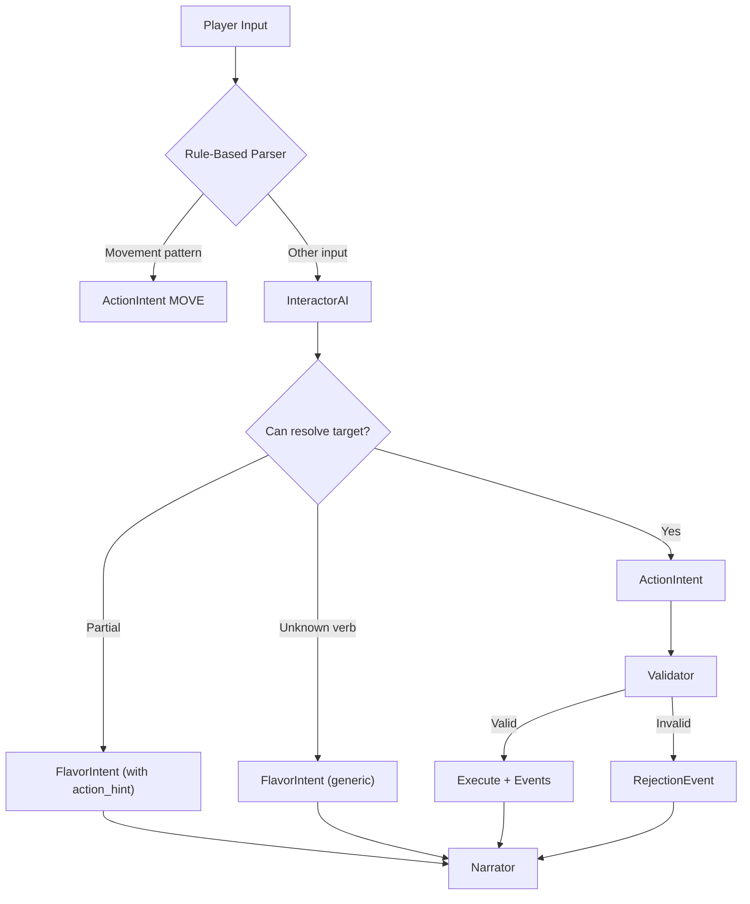

# Phase 2: Examination & Taking with Interactor AI

## Summary

Extend the two-phase engine to support EXAMINE and TAKE actions by introducing the InteractorAI for intelligent entity matching. The Interactor receives the PerceptionSnapshot and resolves player descriptions to entity IDs, producing ActionIntent when successful or FlavorIntent with partial context when not.

## Architecture



## Key Files to Create/Modify

| File | Action | Purpose |

|------|--------|---------|

| [`backend/app/models/intent.py`](backend/app/models/intent.py) | Modify | Add `action_hint` to FlavorIntent |

| [`backend/app/llm/interactor.py`](backend/app/llm/interactor.py) | Create | InteractorAI with LLM-based parsing |

| [`backend/app/engine/validators/examine.py`](backend/app/engine/validators/examine.py) | Create | ExamineValidator |

| [`backend/app/engine/validators/take.py`](backend/app/engine/validators/take.py) | Create | TakeValidator |

| [`backend/app/engine/two_phase.py`](backend/app/engine/two_phase.py) | Modify | Wire Interactor and new validators |

| [`backend/app/engine/parser.py`](backend/app/engine/parser.py) | Modify | Add simple examine/take detection (delegates to Interactor) |

| [`backend/app/llm/narrator.py`](backend/app/llm/narrator.py) | Modify | Add event handlers for EXAMINE, TAKE, FLAVOR_ACTION |

## Implementation Details

### 1. FlavorIntent Enhancement

Add `action_hint` field to carry the recognized action type when verb is known but target isn't resolved:

```python
class FlavorIntent(BaseModel):
    # ... existing fields ...
    action_hint: ActionType | None = None  # EXAMINE, TALK, TAKE, etc.
    target_id: str | None = None           # Resolved entity (for partial matches)
```

### 2. InteractorAI Design

The Interactor receives:

- Raw player input
- PerceptionSnapshot (visible items, details, NPCs, exits)
- Current location context

Output decision tree:

- **Known action + resolved target** → `ActionIntent`
- **Known action + unresolved target** → `FlavorIntent(action_hint=X, target="description")`
- **Unknown action** → `FlavorIntent(verb="whatever")`

Prompt will include the PerceptionSnapshot entities as a lookup table for entity resolution.

### 3. Validators

**ExamineValidator** checks:

- Target exists in world (item, detail, or inventory item)
- Target is visible (using `is_item_visible` for items)
- Returns context with entity description for Narrator

**TakeValidator** checks:

- Item is visible (`ITEM_NOT_VISIBLE`)
- Item is at current location (`ITEM_NOT_HERE`)
- Item is portable (`ITEM_NOT_PORTABLE`)
- Item not already in inventory (`ALREADY_HAVE`)

### 4. Events Generated

- `DETAIL_EXAMINED` - When examining a location detail
- `ITEM_EXAMINED` - When examining an item (at location or in inventory) - **NEW EventType**
- `ITEM_TAKEN` - When successfully taking an item
- `FLAVOR_ACTION` - For FlavorIntent responses

### 5. Narrator Event Handlers

The Narrator currently only handles `LOCATION_CHANGED` and `ACTION_REJECTED`. Add handlers for:

**`_describe_detail_examined()`**

- Include detail name and description from `location.details`
- Provide atmospheric context

**`_describe_item_examined()`**

- Include item name and `item.examine` description
- Note if examining from inventory vs environment
- Keep tone consistent with location atmosphere

**`_describe_item_taken()`**

- Include item name
- Use `item.take_description` if available, else generic
- Note if item was taken from a container (future)

**`_describe_flavor_action()`**

Handle based on `action_hint`:

| action_hint | Narrator Behavior |

|-------------|-------------------|

| `None` | Generic atmospheric response ("You dance around...") |

| `EXAMINE` | Improvise description of unresolved target within location atmosphere |

| `TAKE` | Explain why target can't be taken (if FlavorIntent, it wasn't found) |

Example prompt guidance for EXAMINE flavor:

```
### FLAVOR_ACTION: Player examined something not explicitly defined
- Target: "the ceiling"
- Action hint: EXAMINE
- Improvise a brief, atmospheric description fitting this location
- Keep it to 1-2 sentences
- Do NOT invent important items or clues
```

### 6. Parser Updates

Since we're using Interactor-only for EXAMINE/TAKE, the parser simply delegates:

- Movement patterns → ActionIntent (fast-path, no LLM)
- Everything else → Interactor AI

## Testing Strategy

- Unit tests for ExamineValidator and TakeValidator
- Unit tests for InteractorAI with mocked LLM responses
- Integration test: examine visible item, hidden item, inventory item, unknown target
- Integration test: take portable item, non-portable item, hidden item

## Out of Scope (Deferred)

- Location interactions (examine_portraits → sets_flag) - Phase 3
- INVENTORY action type
- Container mechanics (open drawer to reveal items)
