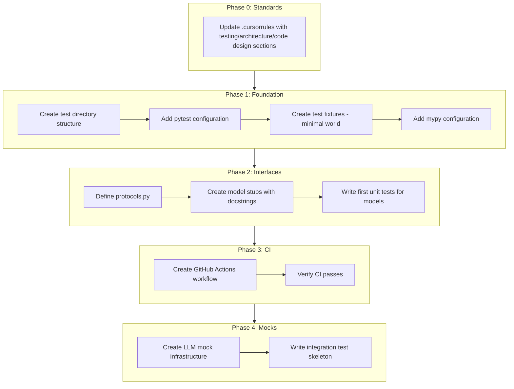

# Quality Infrastructure for Two-Phase Engine

This plan establishes the quality foundation before implementing the two-phase game loop from [planning/two-phase-game-loop-spec.md](planning/two-phase-game-loop-spec.md).

---

## 1. Testing Infrastructure

### Directory Structure

```
backend/
├── tests/
│   ├── conftest.py           # Shared fixtures
│   ├── fixtures/             # Test world data
│   │   └── test_world/       # Minimal valid world for testing
│   ├── unit/
│   │   ├── test_models/      # Pydantic model tests
│   │   ├── test_parser/      # Rule-based parser tests
│   │   ├── test_validator/   # Action validator tests
│   │   └── test_visibility/  # Visibility resolver tests
│   ├── integration/
│   │   └── test_two_phase_flow.py  # Component interaction tests
│   └── e2e/
│       └── test_real_llm.py  # Real LLM calls (marked slow)
```

### Key Fixtures in `conftest.py`

- `sample_world_data`: Minimal WorldData for fast unit tests
- `sample_game_state`: GameState with predictable values
- `mock_llm_response`: Fixture factory for mocked LLM responses
- Markers: `@pytest.mark.slow` for LLM tests, `@pytest.mark.integration`

### Test World

Create `backend/tests/fixtures/test_world/` with minimal YAML files:

- A 3-room layout (start, locked_room, secret_room)
- One container item with hidden contents
- One NPC with defined topics
- One puzzle with clear solution

This provides a deterministic environment for testing visibility, validation, and state changes.

---

## 2. Protocol Definitions

Define abstract interfaces before implementation. This enables:

- Dependency injection for testing
- Clear component boundaries
- Future agent extensibility

### New File: `backend/app/engine/protocols.py`

```python
from typing import Protocol
from app.models.intent import ActionIntent, FlavorIntent
from app.models.event import Event
from app.models.perception import PerceptionSnapshot

class ActionParser(Protocol):
    """Parses player input into structured intents"""
    def parse(self, raw_input: str, state: GameState) -> ActionIntent | None: ...

class IntentValidator(Protocol):
    """Validates intents against world rules"""
    def validate(self, intent: ActionIntent, state: GameState) -> ValidationResult: ...

class EventExecutor(Protocol):
    """Executes validated intents and produces events"""
    def execute(self, intent: ActionIntent, state: GameState) -> list[Event]: ...

class NarratorAI(Protocol):
    """Generates narrative from events"""
    async def narrate(self, events: list[Event], snapshot: PerceptionSnapshot) -> str: ...
```

This matches the component boundaries in the spec (Section: Implementation Phases).

---

## 3. Type Safety with mypy

### Add to `backend/pyproject.toml`

```toml
[tool.mypy]
python_version = "3.11"
strict = true
plugins = ["pydantic.mypy"]

[[tool.mypy.overrides]]
module = "litellm.*"
ignore_missing_imports = true
```

### Add mypy to dev dependencies

```toml
[project.optional-dependencies]
dev = [
    # ... existing ...
    "mypy>=1.8.0",
]
```

---

## 4. CI/CD with GitHub Actions

### New File: `.github/workflows/ci.yml`

```yaml
name: CI
on: [push, pull_request]

jobs:
  test:
    runs-on: ubuntu-latest
    steps:
      - uses: actions/checkout@v4
      - uses: actions/setup-python@v5
        with:
          python-version: '3.11'
      - name: Install dependencies
        run: |
          cd backend
          pip install -e ".[dev]"
      - name: Lint (ruff)
        run: ruff check backend/
      - name: Format (black)
        run: black --check backend/
      - name: Type check (mypy)
        run: mypy backend/app/
      - name: Test (pytest)
        run: pytest backend/tests/ -v --ignore=backend/tests/e2e/
```

E2E tests with real LLM calls run separately (require API keys).

---

## 5. Core Model Stubs

Create the new model files from the spec with comprehensive docstrings and validation:

### New Files

| File | Models | Purpose |

|------|--------|---------|

| `models/intent.py` | `ActionType`, `ActionIntent`, `FlavorIntent` | Player intent representation |

| `models/event.py` | `EventType`, `Event`, `RejectionEvent` | Game event representation |

| `models/perception.py` | `VisibleEntity`, `PerceptionSnapshot` | Narrator context |

| `models/validation.py` | `ValidationResult`, `RejectionCode` | Validation outcomes |

Each model should have:

- Clear docstrings explaining purpose
- Field descriptions
- Example values in docstring
- Validators where appropriate

---

## 6. LLM Mocking Infrastructure

### New File: `backend/tests/mocks/llm.py`

```python
class MockLLMClient:
    """Mock LLM client for deterministic testing"""
    
    def __init__(self, responses: dict[str, str]):
        self.responses = responses
        self.call_history: list[dict] = []
    
    async def complete(self, prompt: str) -> str:
        self.call_history.append({"prompt": prompt})
        # Match prompt patterns to canned responses
        for pattern, response in self.responses.items():
            if pattern in prompt:
                return response
        return self.responses.get("default", "{}")
```

This enables testing the full two-phase flow without LLM calls.

---

## Implementation Order



---

## Success Criteria

Before starting implementation:

1. `.cursorrules` updated with testing, architecture, and code design sections
2. `pytest backend/tests/` runs and passes (even if just placeholder tests)
3. `mypy backend/app/` passes with strict mode
4. `ruff check` and `black --check` pass
5. GitHub Actions CI runs on push
6. All new models from the spec exist with docstrings
7. At least one unit test per new model (validation behavior)
8. Test world fixtures load correctly

---

## Files to Create/Modify

| Action | File | Purpose |

|--------|------|---------|

| Create | `backend/tests/conftest.py` | Shared fixtures |

| Create | `backend/tests/fixtures/test_world/*.yaml` | Test world data |

| Create | `backend/tests/unit/__init__.py` | Package marker |

| Create | `backend/tests/unit/test_models_intent.py` | Intent model tests |

| Create | `backend/tests/mocks/llm.py` | LLM mock client |

| Create | `backend/app/engine/protocols.py` | Component interfaces |

| Create | `backend/app/models/intent.py` | ActionIntent, FlavorIntent |

| Create | `backend/app/models/event.py` | Event, RejectionEvent |

| Create | `backend/app/models/perception.py` | PerceptionSnapshot |

| Create | `backend/app/models/validation.py` | ValidationResult |

| Modify | `backend/pyproject.toml` | Add mypy, update deps |

| Create | `.github/workflows/ci.yml` | CI workflow |

| Modify | `.cursorrules` | Add testing, architecture, and code design sections |

---

## 7. Update .cursorrules

Add three new sections to `.cursorrules` to guide future development:

### 7.1 Testing Requirements Section

```markdown
## Testing Requirements

### Test Infrastructure
- All new engine code MUST have corresponding tests in `backend/tests/`
- Use the test world fixtures in `backend/tests/fixtures/test_world/` for deterministic testing
- Mock LLM calls for unit tests using `backend/tests/mocks/llm.py`

### Test Structure
```

backend/tests/

├── unit/          # Test components in isolation

├── integration/   # Test component interactions

├── e2e/           # Real LLM tests (marked @pytest.mark.slow)

└── fixtures/      # Shared test data

```

### Test Conventions
- Test files: `test_<module>.py`
- Use `@pytest.mark.slow` for tests requiring real LLM calls
- Use `@pytest.mark.integration` for multi-component tests
- Run `pytest backend/tests/ -v --ignore=backend/tests/e2e/` for fast feedback
```

### 7.2 Two-Phase Engine Architecture Section

```markdown
## Two-Phase Engine Architecture

The game engine uses a two-phase action processing loop. See `planning/two-phase-game-loop-spec.md` for the full specification.

### Core Design Principles
1. **Separation of Concerns**: Parsing (Interactor) → Validation → Narration (Narrator)
2. **Deterministic Mechanics**: State changes are validated BEFORE narration
3. **Derived Visibility**: Item visibility is computed from state, not stored
4. **Protocol-Based Components**: Use `engine/protocols.py` interfaces for testability

### Naming Conventions
- Fields ending in `_id` contain **resolved entity IDs** from the world model
- Fields without `_id` may contain raw player descriptions
- Example: `target_id="brass_key"` (resolved) vs `target="the shiny key"` (raw)

### Component Boundaries
| Component | Responsibility | Creates |
|-----------|---------------|---------|
| RuleBasedParser | Fast-path parsing (directions, simple verbs) | ActionIntent |
| InteractorAI | Complex input interpretation | ActionIntent or FlavorIntent |
| ActionValidator | Validate against world rules | ValidationResult |
| VisibilityResolver | Compute what player can see | Used by validators |
| NarratorAI | Generate prose from events | Narrative text |

### Key Models (in `backend/app/models/`)
- `intent.py`: ActionIntent, FlavorIntent, ActionType
- `event.py`: Event, RejectionEvent, EventType  
- `perception.py`: PerceptionSnapshot, VisibleEntity
- `validation.py`: ValidationResult, RejectionCode
```

### 7.3 Python Code Design Principles Section

````markdown
## Python Code Design Principles

### Function Design
- **Single Responsibility**: Each function does ONE thing well
- **Length Guideline**: Functions should be <25 lines; if longer, consider splitting
- **Cognitive Complexity**: Avoid deep nesting (max 3 levels); extract helper functions
- **Pure Functions**: Prefer functions without side effects where possible

### Naming Conventions
- **Functions**: `verb_noun` pattern → `validate_intent()`, `build_snapshot()`
- **Private Methods**: Single underscore prefix → `_check_visibility()`
- **Boolean Functions**: `is_`, `has_`, `can_` prefix → `is_item_visible()`, `can_access_location()`
- **Factory Functions**: `create_` or `build_` prefix → `create_processor()`

### Class Design
- **Composition over Inheritance**: Prefer injecting dependencies over deep hierarchies
- **Dependency Injection**: Pass dependencies via `__init__`, not global imports
- **Protocol Compliance**: Implement protocols from `engine/protocols.py` for swappable components

```python
# GOOD: Dependency injection
class TwoPhaseProcessor:
    def __init__(self, parser: ActionParser, validator: IntentValidator):
        self.parser = parser
        self.validator = validator

# BAD: Hard-coded dependencies
class TwoPhaseProcessor:
    def __init__(self):
        self.parser = RuleBasedParser()  # Not testable
````

### Error Handling

- **Explicit over Silent**: Raise exceptions for unexpected states; don't silently fail
- **Custom Exceptions**: Define domain exceptions in `engine/exceptions.py`
- **Result Types**: For expected failures, return `ValidationResult` or `tuple[bool, str]`
```python
# For unexpected errors (bugs)
raise ValueError(f"Unknown action type: {action_type}")

# For expected failures (player did something invalid)
return ValidationResult(valid=False, code="NO_EXIT", reason="...")
```


### Docstrings

- **Required For**: All public functions, classes, and modules
- **Format**: Google style with Args, Returns, Raises sections
- **Examples**: Include usage examples for complex functions

### Module Organization

- **One Concept Per File**: Don't mix unrelated classes
- **Imports at Top**: Standard lib → Third party → Local, separated by blank lines
- **Circular Import Prevention**: Use `TYPE_CHECKING` for type hints only

### Async Patterns

- **Async All the Way**: Don't mix sync and async in call chains
- **LLM Calls**: Always async; never block the event loop
- **Concurrency**: Use `asyncio.gather()` for parallel LLM calls when possible

### Testing Considerations

- **Testable by Design**: If a function is hard to test, it needs refactoring
- **No Hidden State**: Avoid module-level mutable state
- **Deterministic**: Functions with same input should produce same output (except LLM)

```