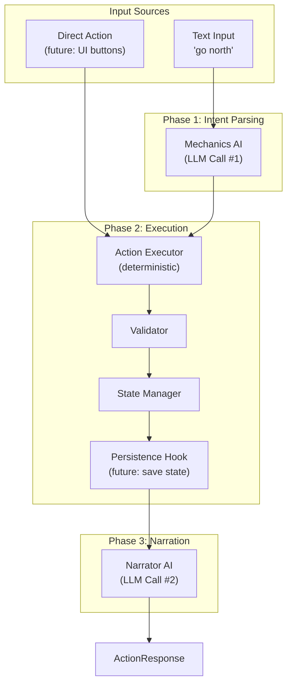

# Two-Phase Action Architecture

## Problem Summary

The current single-LLM approach in [`backend/app/llm/game_master.py`](backend/app/llm/game_master.py) generates narrative before state validation, causing:

- Narratives describing movements that get rejected
- No destination location details in movement narratives
- Hallucinated locations/actions that don't exist in world data

## Proposed Architecture



## Key Design Decisions

1. **Unified Action Executor**: Both parsed text and direct actions flow through the same execution path
2. **Narrator Always Runs**: Even direct actions get narrated (enables future UI buttons)
3. **Mechanics AI is Optional**: Direct actions bypass parsing entirely
4. **Latency Optimization**: Mechanics AI can use a smaller/faster model since it only outputs structured JSON
5. **Persistence-Ready State**: State model designed for save/load from the start

---

## State Model for Persistence

Following the design in [`ideas/game-mechanics-design.md`](ideas/game-mechanics-design.md), we use a **sparse delta model**: only changes from world definition are persisted, not the entire world state.

### Persistence-Ready GameState

The existing `GameState` in [`backend/app/models/game.py`](backend/app/models/game.py) will be enhanced:

```python
class GameState(BaseModel):
    """Current game session state - designed for persistence"""
    # === Metadata (for save/load) ===
    session_id: str
    world_id: str  # ADD: Reference to world definition
    world_version: str = "1.0.0"  # ADD: For compatibility checks
    created_at: datetime | None = None  # ADD
    last_played_at: datetime | None = None  # ADD
    play_time_seconds: int = 0  # ADD

    # === Core State (already exists, ensure serializable) ===
    current_location: str
    inventory: list[str] = []
    discovered_locations: list[str] = []
    flags: dict[str, bool] = {}
    turn_count: int = 0
    npc_trust: dict[str, int] = {}
    npc_locations: dict[str, str] = {}  # Delta from world definition
    status: str = "playing"
    narrative_memory: NarrativeMemory = NarrativeMemory()

    # === World Delta (ADD: track changes from world definition) ===
    # FUTURE_PERSISTENCE: These fields enable reconstructing state from save
    items_moved: dict[str, str | None] = {}  # item_id -> new_location (None = inventory)
    items_state: dict[str, str] = {}  # item_id -> state (e.g., "lit", "broken")
    locations_state: dict[str, str] = {}  # location_id -> state (e.g., "on_fire")
    exits_unlocked: list[str] = []  # List of exit IDs that were unlocked
```

### Persistence Hook Points

Mark clear extension points in the code:

```python
# In ActionExecutor.execute():
def execute(self, intent: ActionIntent) -> ActionOutcome:
    outcome = self._process_action(intent)
    if outcome.success:
        self._apply_state_changes(outcome)
        # FUTURE_PERSISTENCE: Hook to save state after successful action
        # await self.persistence.save_checkpoint(self.state_manager.get_state())
    return outcome
```

### Save/Load API Stubs (Documentation Only)

```python
# FUTURE: backend/app/api/saves.py
#
# POST /api/game/{session_id}/save
#   - Serializes current GameState to storage
#   - Returns save_id, timestamp
#
# GET /api/game/saves?world_id={world_id}
#   - Lists available saves for a world
#
# POST /api/game/load/{save_id}
#   - Creates new session from saved state
#   - Validates world_version compatibility
#   - Returns new session_id
```

---

## Implementation Plan

### 1. New Data Models

Add to [`backend/app/models/game.py`](backend/app/models/game.py):

```python
class ActionIntent(BaseModel):
    """Parsed intent from Mechanics AI or direct action"""
    action_type: str  # "move", "examine", "take", "talk", "use", "look", "other"
    target: str | None = None  # location_id, item_id, npc_id, or detail name
    direction: str | None = None  # for movement
    parameters: dict = {}  # additional context
    raw_input: str | None = None  # original player text (if from text input)

class ActionOutcome(BaseModel):
    """Result of action execution - provides context for narrator"""
    success: bool
    action_type: str
    description: str  # Brief factual description of what happened
    rejection_reason: str | None = None

    # Context for narrator (what changed):
    location_changed: bool = False
    new_location: dict | None = None  # Full location details if moved
    items_changed: list[str] = []  # item_ids added/removed/used
    npcs_involved: list[str] = []  # npc_ids interacted with
    flags_changed: dict[str, bool] = {}  # flags that changed

    # FUTURE_PERSISTENCE: State snapshots for debugging/replay
    # state_before_hash: str | None = None
    # state_after_hash: str | None = None
```

### 2. Enhance GameState for Persistence

Update [`backend/app/models/game.py`](backend/app/models/game.py) `GameState`:

- Add `world_id`, `world_version`, timestamps
- Add world delta fields (`items_moved`, `items_state`, etc.)
- Ensure all fields are JSON-serializable
- Add `# FUTURE_PERSISTENCE` comments at extension points

### 3. Mechanics AI (Intent Parser)

Create [`backend/app/llm/mechanics.py`](backend/app/llm/mechanics.py):

- New class `MechanicsInterpreter`
- Simple prompt that outputs `ActionIntent` JSON
- MVP: Focus on movement parsing, basic pass-through for other actions

Create prompt [`backend/app/llm/prompts/mechanics/intent_prompt.txt`](backend/app/llm/prompts/mechanics/intent_prompt.txt)

### 4. Action Executor

Create [`backend/app/engine/executor.py`](backend/app/engine/executor.py):

- New class `ActionExecutor`
- Takes `ActionIntent`, validates, applies state changes
- Returns `ActionOutcome` with full context for narrator
- Include `# FUTURE_PERSISTENCE` hook after state changes

### 5. Narrator AI

Create [`backend/app/llm/narrator.py`](backend/app/llm/narrator.py):

- New class `Narrator`
- Takes `ActionOutcome` (not raw player input)
- Has full context of new state including destination details

Create prompt [`backend/app/llm/prompts/narrator/narrate_prompt.txt`](backend/app/llm/prompts/narrator/narrate_prompt.txt)

### 6. Refactor ActionProcessor

Update [`backend/app/engine/actions.py`](backend/app/engine/actions.py):

```python
async def process(self, action: str) -> ActionResponse:
    # Phase 1: Parse intent (for text input)
    intent = await self.mechanics.parse_intent(action)

    # Phase 2: Execute (validates + applies state)
    outcome = self.executor.execute(intent)
    # FUTURE_PERSISTENCE: State is auto-saved here

    # Phase 3: Narrate
    narrative = await self.narrator.narrate(outcome)

    return ActionResponse(...)

# FUTURE: Direct action endpoint
async def process_direct_action(self, intent: ActionIntent) -> ActionResponse:
    """For future: direct actions bypass mechanics AI"""
    ...
```

---

## File Changes Summary

| File | Change |

|------|--------|

| `backend/app/models/game.py` | Add `ActionIntent`, `ActionOutcome`; enhance `GameState` for persistence |

| `backend/app/llm/mechanics.py` | New - `MechanicsInterpreter` class |

| `backend/app/llm/narrator.py` | New - `Narrator` class |

| `backend/app/llm/game_master.py` | Deprecate (keep for reference during migration) |

| `backend/app/engine/executor.py` | New - `ActionExecutor` class with persistence hooks |

| `backend/app/engine/actions.py` | Refactor to use new two-phase flow |

| `backend/app/llm/prompts/mechanics/` | New folder with intent parsing prompt |

| `backend/app/llm/prompts/narrator/` | New folder with narration prompts |

---

## Future Extension Points

### For Save/Load Feature

Look for `# FUTURE_PERSISTENCE` comments in:

- `backend/app/models/game.py` - State model fields
- `backend/app/engine/executor.py` - Save hook after action
- `backend/app/engine/state.py` - Serialization methods

Reference design: [`ideas/game-mechanics-design.md`](ideas/game-mechanics-design.md) "State Management & Persistence" section

### For Direct Action API (UI Buttons)

Look for `# FUTURE_DIRECT_ACTION` comments in:

- `backend/app/engine/actions.py` - `process_direct_action()` method
- `backend/app/api/game.py` - API endpoint stub

---

## MVP Scope

1. Full two-phase architecture implemented for all actions
2. Mechanics AI MVP: Movement parsing polished, other actions basic pass-through
3. Narrator generates all narratives from confirmed outcomes
4. GameState enhanced with persistence-ready fields
5. `# FUTURE_*` markers placed for save/load and direct actions
