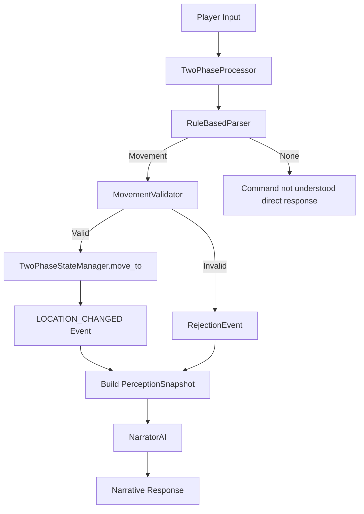

# Phase 1: Two-Phase Movement Engine (Complete Separation)

Implement the movement-only two-phase loop with **complete engine separation** from the classic engine. No code sharing except WorldData loading (same worlds, same YAML schema).

## Architectural Decisions

| Decision | Choice |

|----------|--------|

| GameState | New `TwoPhaseGameState` model (no sharing with classic `GameState`) |

| StateManager | New `TwoPhaseStateManager` class (no sharing with classic `GameStateManager`) |

| WorldData | **Shared** - both engines load same YAML worlds |

| Unsupported Actions | Return simple "command not understood" (no LLM call) |

| Opening Narrative | Use NarratorAI with `LOCATION_CHANGED` event for starting location |

## Architecture Overview



## Files to Create

### 1. Two-Phase State Model: [`backend/app/models/two_phase_state.py`](backend/app/models/two_phase_state.py)

New `TwoPhaseGameState` model completely separate from classic `GameState`:

```python
class TwoPhaseGameState(BaseModel):
    """Game state for the two-phase engine."""
    session_id: str
    current_location: str
    inventory: list[str] = Field(default_factory=list)
    flags: dict[str, bool] = Field(default_factory=dict)
    visited_locations: set[str] = Field(default_factory=set)  # For first-visit detection
    container_states: dict[str, bool] = Field(default_factory=dict)  # container_id -> is_open
    turn_count: int = 0
    status: str = "playing"  # "playing", "won", "lost"
```

### 2. Two-Phase State Manager: [`backend/app/engine/two_phase_state.py`](backend/app/engine/two_phase_state.py)

New state manager class for the two-phase engine:

```python
class TwoPhaseStateManager:
    """Manages game state for two-phase engine sessions."""

    def __init__(self, world_id: str):
        self.session_id = str(uuid.uuid4())
        self.world_id = world_id
        self.world_data: WorldData = WorldLoader().load_world(world_id)  # Shared loading
        self._state = TwoPhaseGameState(...)

    def get_state(self) -> TwoPhaseGameState: ...
    def get_current_location(self) -> Location: ...
    def move_to(self, location_id: str) -> bool: ...
    def is_first_visit(self, location_id: str) -> bool: ...
    def set_flag(self, flag: str, value: bool): ...
```

### 3. Parser: [`backend/app/engine/parser.py`](backend/app/engine/parser.py)

- `RuleBasedParser` class implementing `ActionParser` protocol
- Direction patterns: `north`, `n`, `go north`, `back`, `leave`, `exit`
- Returns `ActionIntent(action_type=MOVE, target_id=direction, verb="go")`
- Returns `None` for non-movement patterns

### 4. Movement Validator: [`backend/app/engine/validators/movement.py`](backend/app/engine/validators/movement.py)

- `MovementValidator` implementing `IntentValidator` protocol
- Check exit exists in current location
- Check location requirements (flag/item)
- Return `ValidationResult` with rejection codes: `NO_EXIT`, `EXIT_LOCKED`, `PRECONDITION_FAILED`

### 5. Visibility Resolver: [`backend/app/engine/visibility.py`](backend/app/engine/visibility.py)

- `DefaultVisibilityResolver` implementing `VisibilityResolver` protocol
- `build_snapshot()` to create `PerceptionSnapshot` for narrator
- Get visible exits with names and descriptions
- Basic item visibility (for Phase 1: visible items at location)

### 6. Narrator AI: [`backend/app/llm/narrator.py`](backend/app/llm/narrator.py)

- `NarratorAI` implementing `NarratorProtocol`
- Prompt template at [`backend/app/llm/prompts/narrator/system_prompt.txt`](backend/app/llm/prompts/narrator/system_prompt.txt)
- Generate prose from events + PerceptionSnapshot
- Handle `LOCATION_CHANGED` and `ACTION_REJECTED` events
- Used for both opening narrative and action responses

### 7. Two-Phase Processor: [`backend/app/engine/two_phase.py`](backend/app/engine/two_phase.py)

Main orchestrator:

```python
class TwoPhaseProcessor:
    """Two-phase game loop processor."""

    def __init__(self, state_manager: TwoPhaseStateManager, debug: bool = False):
        self.state_manager = state_manager
        self.parser = RuleBasedParser()
        self.movement_validator = MovementValidator()
        self.visibility_resolver = DefaultVisibilityResolver()
        self.narrator = NarratorAI(state_manager.world_data, debug=debug)

    async def get_initial_narrative(self) -> tuple[str, LLMDebugInfo | None]:
        """Generate opening using NarratorAI with LOCATION_CHANGED event."""
        ...

    async def process(self, action: str) -> TwoPhaseActionResponse:
        """Process action through two-phase pipeline."""
        ...
```

### 8. API Update: [`backend/app/api/game.py`](backend/app/api/game.py)

- Create `TwoPhaseGameSession` for two-phase engine sessions
- Wire `TwoPhaseProcessor` when `engine=TWO_PHASE`
- Update endpoints to handle both engine types

## Response Models

### TwoPhaseActionResponse

```python
class TwoPhaseActionResponse(BaseModel):
    """Response from two-phase action processing."""
    narrative: str
    state: TwoPhaseGameState
    events: list[dict] = Field(default_factory=list)  # Serialized events
    game_complete: bool = False
    ending_narrative: str | None = None
    llm_debug: LLMDebugInfo | None = None
```

## Key Implementation Details

**Unsupported Actions (No LLM):**

When `RuleBasedParser.parse()` returns `None`:

```python
return TwoPhaseActionResponse(
    narrative="I don't understand that command. Try movement commands like 'north', 'go east', or 'back'.",
    state=self.state_manager.get_state(),
    events=[],
)
```

**Opening Narrative Flow:**

```python
async def get_initial_narrative(self):
    # Create LOCATION_CHANGED event for starting location
    event = Event(
        type=EventType.LOCATION_CHANGED,
        subject=state.current_location,
        context={"first_visit": True, "is_opening": True}
    )
    snapshot = self.visibility_resolver.build_snapshot(state, world)
    narrative = await self.narrator.narrate([event], snapshot)
    return narrative, debug_info
```

**Movement Flow:**

```python
# Parse
intent = self.parser.parse(action, state, world)
if intent is None:
    return "command not understood" response

# Validate
result = self.movement_validator.validate(intent, state, world)
if not result.valid:
    event = result.to_rejection_event()
else:
    # Execute
    self.state_manager.move_to(result.context["destination"])
    event = Event(type=LOCATION_CHANGED, ...)

# Narrate
snapshot = self.visibility_resolver.build_snapshot(state, world)
narrative = await self.narrator.narrate([event], snapshot)
```

## Tests to Create

### 1. State Tests: [`backend/tests/unit/test_models/test_two_phase_state.py`](backend/tests/unit/test_models/test_two_phase_state.py)

- Test TwoPhaseGameState creation and defaults
- Test visited_locations set behavior

### 2. State Manager Tests: [`backend/tests/unit/test_engine/test_two_phase_state_manager.py`](backend/tests/unit/test_engine/test_two_phase_state_manager.py)

- Test initialization from world
- Test move_to() updates state correctly
- Test is_first_visit() detection

### 3. Parser Tests: [`backend/tests/unit/test_engine/test_parser.py`](backend/tests/unit/test_engine/test_parser.py)

- Test direction patterns (`north`, `n`, `go north`, etc.)
- Test non-movement returns `None`
- Test confidence score is 1.0 for rule-based

### 4. Movement Validator Tests: [`backend/tests/unit/test_engine/test_movement_validator.py`](backend/tests/unit/test_engine/test_movement_validator.py)

- Test valid movement (exit exists, no requirements)
- Test NO_EXIT rejection (direction not available)
- Test PRECONDITION_FAILED rejection (flag required)
- Test first_visit in context

### 5. Visibility Tests: [`backend/tests/unit/test_engine/test_visibility.py`](backend/tests/unit/test_engine/test_visibility.py)

- Test `build_snapshot()` returns correct location info
- Test visible exits populated correctly

### 6. Integration Tests: [`backend/tests/integration/test_two_phase_processor.py`](backend/tests/integration/test_two_phase_processor.py)

- Test successful movement flow (mocked LLM)
- Test rejected movement (locked door)
- Test unsupported action response
- Test opening narrative generation

## Documentation Updates

### 1. Update [`planning/two-phase-game-loop-spec.md`](planning/two-phase-game-loop-spec.md)

- Mark Phase 1 items as complete
- Note the complete engine separation decision

### 2. Update [`docs/ARCHITECTURE.md`](docs/ARCHITECTURE.md)

- Add section on two-phase engine architecture
- Document engine separation (no code sharing except WorldData)

### 3. Update [`docs/API.md`](docs/API.md)

- Document engine selection in `/api/game/new`
- Note that TWO_PHASE currently only supports movement
- Document TwoPhaseActionResponse model
