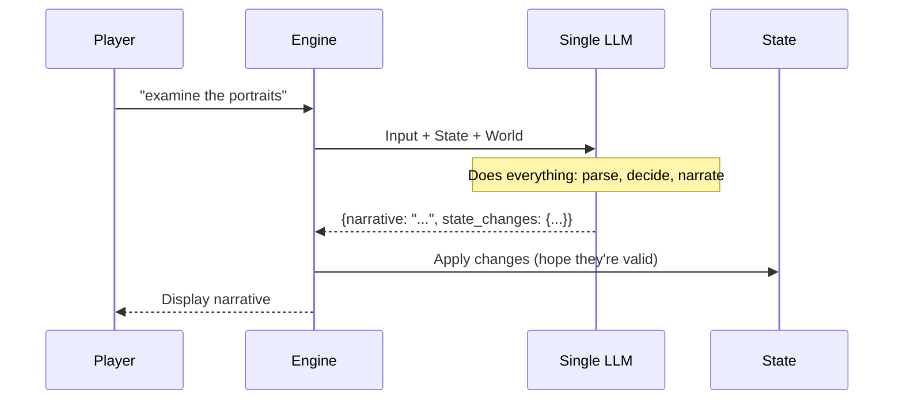
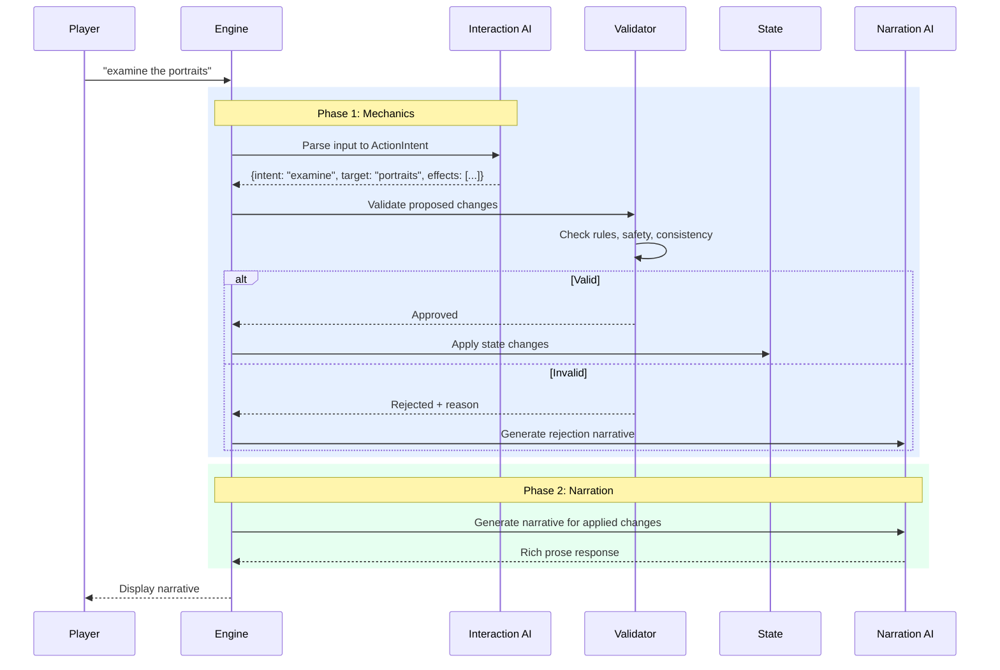

> **⚠️ SUPERSEDED**: This document has been merged into the authoritative specification at [`planning/two-phase-game-loop-spec.md`](../../planning/two-phase-game-loop-spec.md). Kept for historical reference.

---

# Two-Phase Game Loop Architecture

## Overview

This document outlines the architecture for evolving GAIME from a single LLM call to a sophisticated two-phase game loop with separate parsing and narration stages. The new architecture addresses the limitations of the current monolithic LLM approach while maintaining the core vision of immersive, story-driven gameplay.

> **Status**: Design Specification - December 2025  
> **Related**: [Vision Document](../../docs/VISION.md) | [Game Mechanics Design](../game-mechanics-design.md) | [Architecture](../../docs/ARCHITECTURE.md)

---

## Table of Contents

1. [Introduction](#introduction)
2. [Current Architecture Problems](#current-architecture-problems)
3. [Two-Phase Architecture](#two-phase-architecture)
4. [Action Intent System](#action-intent-system)
5. [Event System](#event-system)
6. [Validation and Safety](#validation-and-safety)
7. [Rich Verb Handling](#rich-verb-handling)
8. [Visibility and Discovery Model](#visibility-and-discovery-model)
9. [Prompt Architecture](#prompt-architecture)
10. [Implementation Strategy](#implementation-strategy)
11. [Hybrid Architecture](#hybrid-architecture)
12. [Migration Path](#migration-path)

---

## Introduction

### The Problem

The current GAIME architecture uses a single LLM call that:
1. Interprets player input
2. Determines state changes
3. Generates narrative response

This monolithic approach creates several issues:
- **State inconsistency**: LLM may hallucinate invalid state changes
- **Validation gaps**: No mechanism to prevent game-breaking actions
- **Limited verb support**: Rich natural language gets flattened to basic actions
- **Debugging difficulty**: Single point of failure makes issues hard to isolate

### The Solution

A two-phase architecture separates concerns:
1. **Interaction Phase**: Parse input → determine mechanical intent → validate → apply state
2. **Narration Phase**: Generate prose based on confirmed state changes

This enables:
- **Reliable mechanics**: Deterministic state changes with validation
- **Rich language support**: Natural input parsing without compromising game rules
- **Better debugging**: Clear separation of concerns
- **Safety guarantees**: Prevention of unwinnable states

### Alignment with Vision

This architecture supports the [Vision](../../docs/VISION.md) principles:
- **"Short story you played through"**: Maintains narrative focus while adding mechanical reliability
- **"No unwinnable states"**: Validation layer prevents game-breaking actions
- **"Guided freedom"**: Allows natural input while enforcing world rules
- **"Curated worlds"**: Enables more sophisticated puzzle mechanics

---

## Current Architecture Problems



**Issues:**
1. **Hallucination risk**: LLM might invent items, locations, or effects
2. **Inconsistent state**: Narrative may not match actual state changes
3. **Limited verbs**: Complex actions get simplified to basic commands
4. **No validation**: Game-breaking actions can occur
5. **Debugging nightmare**: Can't isolate whether issue is parsing, mechanics, or narration

---

## Two-Phase Architecture



### Phase 1: Interaction AI (Mechanics)

**Purpose**: Interpret player intent and determine mechanical consequences.

**Input**: Player action + current state + world rules

**Output**: Structured ActionIntent with proposed state changes

### Phase 2: Narration AI (Creative)

**Purpose**: Generate engaging prose based on confirmed state changes.

**Input**: Applied state changes + context + narrative prompts

**Output**: Rich, varied narrative text

---

## Action Intent System

ActionIntents represent the player's interpreted intention. They are structured, typed objects that the engine can process deterministically.

### Core ActionIntent Types

```python
class ActionIntent:
    """Base class for all player action interpretations"""
    type: str  # movement, interaction, examination, etc.
    confidence: float  # 0.0-1.0, how confident the AI is
    raw_input: str  # Original player text
    parameters: dict  # Type-specific parameters

class MovementIntent(ActionIntent):
    """Player wants to change location"""
    type = "movement"
    direction: str  # north, south, east, west, up, down
    method: str  # walk, run, crawl, swim, etc.

class InteractionIntent(ActionIntent):
    """Player wants to interact with something"""
    type = "interaction"
    target_type: str  # item, npc, detail, exit
    target_id: str
    action: str  # examine, take, use, talk, open, close, etc.
    parameters: dict  # action-specific params

class ExaminationIntent(ActionIntent):
    """Player wants detailed information"""
    type = "examination"
    target_type: str
    target_id: str
    focus: str  # specific aspect to examine

class SystemIntent(ActionIntent):
    """Meta-actions like inventory, help, save"""
    type = "system"
    command: str  # inventory, help, save, load, quit
```

### ActionIntent Examples

```yaml
# Simple movement
{
  "type": "movement",
  "direction": "north",
  "method": "walk",
  "confidence": 0.95,
  "raw_input": "go north"
}

# Rich interaction
{
  "type": "interaction",
  "target_type": "item",
  "target_id": "iron_key",
  "action": "use",
  "parameters": {"target": "basement_door"},
  "confidence": 0.88,
  "raw_input": "use the iron key to unlock the basement door"
}

# Complex examination
{
  "type": "examination",
  "target_type": "detail",
  "target_id": "family_portraits",
  "focus": "emotional_expression",
  "confidence": 0.92,
  "raw_input": "study the expressions on the portraits carefully"
}
```

### Intent Resolution Rules

1. **Exact matches first**: Direct commands like "north" → MovementIntent
2. **Context-aware parsing**: "open drawer" → InteractionIntent with target discovery
3. **Ambiguity handling**: Multiple interpretations with confidence scores
4. **Fallback to examination**: Unknown input → ExaminationIntent with low confidence

---

## Event System

Events represent state changes that occur as a result of player actions or world triggers. They are the "what happened" that drives narration.

### Core Event Types

```python
class GameEvent:
    """Base class for all game state changes"""
    id: str  # Unique event identifier
    timestamp: datetime
    type: str
    description: str  # Human-readable summary

class LocationChanged(GameEvent):
    """Player moved to a new location"""
    type = "location_changed"
    from_location: str
    to_location: str
    method: str  # How they moved (walked, climbed, etc.)

class ItemStateChanged(GameEvent):
    """An item's state changed"""
    type = "item_state_changed"
    item_id: str
    old_state: dict
    new_state: dict
    trigger: str  # What caused the change

class DiscoveryMade(GameEvent):
    """Something new was discovered"""
    type = "discovery_made"
    discovery_type: str  # item, exit, detail, npc
    entity_id: str
    context: str  # Why it was discovered

class FlagSet(GameEvent):
    """A game flag was changed"""
    type = "flag_set"
    flag_name: str
    old_value: any
    new_value: any

class InteractionCompleted(GameEvent):
    """A defined interaction was triggered"""
    type = "interaction_completed"
    interaction_id: str
    success: bool
    effects_applied: list[dict]
```

### Event Flow Example

```yaml
# Player: "open the drawer"
# 1. ActionIntent created
intent:
  type: "interaction"
  target_type: "detail"
  target_id: "desk_drawer"
  action: "open"

# 2. Validation passes, state changes applied
events_applied:
  - id: "drawer_opened_001"
    type: "detail_state_changed"
    detail_id: "desk_drawer"
    old_state: {open: false}
    new_state: {open: true}
  - id: "key_discovered_001"
    type: "discovery_made"
    discovery_type: "item"
    entity_id: "iron_key"
    context: "opening drawer revealed hidden key"
  - id: "examined_drawer_flag"
    type: "flag_set"
    flag_name: "examined_desk_drawer"
    old_value: false
    new_value: true

# 3. Narration AI receives events for storytelling
```

---

## Validation and Safety

The validation layer ensures actions are safe and consistent with world rules.

### Validation Types

```python
class ValidationResult:
    valid: bool
    errors: list[str]
    warnings: list[str]
    approved_events: list[GameEvent]
    rejection_reason: str | None

class GameValidator:
    def validate_action(self, intent: ActionIntent, state: GameState) -> ValidationResult:
        """Validate an ActionIntent before applying it"""

        errors = []
        warnings = []
        approved_events = []

        # Location validation
        if isinstance(intent, MovementIntent):
            if not self.can_move_to(intent.direction, state):
                errors.append(f"Cannot move {intent.direction} from current location")

        # Item validation
        elif isinstance(intent, InteractionIntent):
            if intent.action == "take" and not self.item_available(intent.target_id, state):
                errors.append(f"Item {intent.target_id} is not available to take")

            if intent.action == "use" and self.is_critical_item(intent.target_id):
                # Allow use but prevent destruction
                warnings.append(f"Item {intent.target_id} is critical - use carefully")

        # Safety validation
        if self.would_create_unwinnable_state(intent, state):
            errors.append("This action would make the game unwinnable")

        # Critical item protection
        if self.involves_critical_item_destruction(intent):
            errors.append("Cannot destroy or permanently lose critical items")

        return ValidationResult(
            valid=len(errors) == 0,
            errors=errors,
            warnings=warnings,
            approved_events=approved_events,
            rejection_reason=errors[0] if errors else None
        )
```

### Rejection Handling

When validation fails, the system generates appropriate rejection narrative:

```yaml
# Failed action: "take the portrait" (critical item)
rejection_response:
  narrative: "As you reach for the portrait, you hesitate. Something about it feels too important to remove - like it holds secrets that must remain in this house."
  tone: gentle_prevention
  preserves_immersion: true

# Failed action: "go north" (blocked exit)
rejection_response:
  narrative: "The northern passage is completely blocked by fallen debris. There's no way through."
  tone: matter_of_fact
  hint_available: "Perhaps there's another way around"
```

---

## Rich Verb Handling

The new architecture supports natural language input while maintaining game rule enforcement.

### Verb Categories

```yaml
# Movement verbs
movement_verbs:
  direct: ["go", "walk", "run", "move", "head", "travel"]
  directional: ["north", "south", "east", "west", "up", "down", "forward", "back"]
  descriptive: ["leave", "exit", "enter", "approach", "retreat", "descend", "ascend"]

# Interaction verbs
interaction_verbs:
  examination: ["examine", "look", "inspect", "study", "read", "check", "observe"]
  manipulation: ["take", "get", "grab", "pick", "drop", "put", "place", "open", "close"]
  use: ["use", "apply", "combine", "light", "unlock", "play", "eat", "drink"]
  social: ["talk", "speak", "ask", "tell", "give", "show", "threaten", "persuade"]

# Complex action patterns
complex_patterns:
  - pattern: "use {item} on {target}"
    intent_type: "interaction"
    action: "use_on"
  - pattern: "light {item} with {tool}"
    intent_type: "interaction"
    action: "light_with"
  - pattern: "play {instrument}"
    intent_type: "interaction"
    action: "play"
  - pattern: "eat {food}"
    intent_type: "interaction"
    action: "consume"
```

### Intent Parsing Examples

```yaml
# Natural inputs mapped to structured intents

# Simple: "north" → MovementIntent
input: "north"
intent:
  type: "movement"
  direction: "north"
  method: "walk"

# Rich: "I carefully approach the ancient chest and try to open it"
input: "I carefully approach the ancient chest and try to open it"
intent:
  type: "interaction"
  target_type: "item"
  target_id: "ancient_chest"
  action: "open"
  parameters: {carefully: true}

# Complex: "play the piano with feeling"
input: "play the piano with feeling"
intent:
  type: "interaction"
  target_type: "detail"
  target_id: "piano"
  action: "play"
  parameters: {emotion: "feeling"}

# Creative: "light the candle with the matches I found"
input: "light the candle with the matches I found"
intent:
  type: "interaction"
  target_type: "item"
  target_id: "candle"
  action: "light"
  parameters: {tool: "matches", method: "strike_and_light"}
```

### Context-Aware Resolution

The Interaction AI uses world context to resolve ambiguous inputs:

```python
def resolve_target(self, target_name: str, context: GameContext) -> dict:
    """Resolve ambiguous target names using context"""

    # Check current location items
    location_items = context.location_items
    if target_name in location_items:
        return {"type": "item", "id": target_name}

    # Check visible details
    visible_details = context.visible_details
    if target_name in visible_details:
        return {"type": "detail", "id": target_name}

    # Check present NPCs
    present_npcs = context.present_npcs
    if target_name in present_npcs:
        return {"type": "npc", "id": target_name}

    # Fuzzy matching for partial names
    all_entities = {**location_items, **visible_details, **present_npcs}
    matches = fuzzy_match(target_name, list(all_entities.keys()))

    if len(matches) == 1:
        return {"type": matches[0]["type"], "id": matches[0]["id"]}
    elif len(matches) > 1:
        # Multiple matches - ask for clarification or pick most likely
        return self.disambiguate(matches, context)

    return None  # No match found
```

---

## Visibility and Discovery Model

The visibility system controls what the player can perceive and interact with, enabling progressive revelation of the world.

### Visibility States

```python
class VisibilityState:
    """Controls what the player can see and interact with"""
    HIDDEN = "hidden"      # Not visible, not known
    OBSCURED = "obscured"  # Known but not visible (in drawer, behind door)
    VISIBLE = "visible"    # Can be seen and examined
    ACCESSIBLE = "accessible"  # Can be interacted with

class VisibilityRule:
    """Rules for when something becomes visible"""
    entity_type: str  # item, exit, detail, npc
    entity_id: str
    current_state: VisibilityState

    reveal_conditions: list[Condition]  # When it becomes visible
    hide_conditions: list[Condition]    # When it becomes hidden

    description_when_hidden: str | None  # How it appears when obscured
    description_when_visible: str        # How it appears when revealed
```

### Visibility Example: Hidden Key in Drawer

```yaml
# World definition
items:
  iron_key:
    name: "Iron Key"
    initial_visibility: hidden
    visibility_rules:
      - reveal_when:
          all:
            - flag: examined_desk_drawer
        description_when_revealed: "A heavy iron key lies at the bottom of the drawer"
      - reveal_when:
          all:
            - flag: searched_desk_thoroughly
        description_when_revealed: "Behind some loose papers, you find an iron key"

details:
  desk_drawer:
    name: "Desk Drawer"
    initial_state: closed
    interactions:
      open_drawer:
        triggers: ["open drawer", "pull open drawer"]
        effects:
          - set_detail_state: {drawer: open}
          - reveal_entities: [iron_key]  # Makes key visible
        narrative_prompt: |
          You pull open the desk drawer. Inside you find...

# Game state tracks visibility
world_state:
  visibility:
    iron_key: hidden  # Initially hidden
    desk_drawer: visible  # Drawer itself is visible

# After player opens drawer
world_state:
  visibility:
    iron_key: visible  # Now visible
    desk_drawer: visible
  flags:
    examined_desk_drawer: true
```

### Visibility in Prompts

The Narration AI receives visibility-filtered context:

```yaml
# Before opening drawer - Narration AI prompt
narration_context:
  location_description: |
    You stand in the study. A large oak desk dominates the room.
    The desk has a single drawer that appears closed.
  visible_entities:
    items: []  # Key not visible yet
    details: [desk_drawer]
    exits: [north_door, south_door]

# After opening drawer - Narration AI prompt
narration_context:
  location_description: |
    You stand in the study. A large oak desk dominates the room.
    The desk drawer stands open.
  visible_entities:
    items: [iron_key]  # Key now visible
    details: [desk_drawer]
    exits: [north_door, south_door]
  recent_events:
    - drawer_opened
    - key_discovered
```

---

## Prompt Architecture

### Interaction AI Prompts

The Interaction AI uses structured prompts focused on mechanical interpretation:

```yaml
interaction_ai_system_prompt: |
  You are the Interaction AI for GAIME, a text adventure game engine.

  Your role is to interpret player input and determine mechanical consequences.
  You do NOT generate narrative - that happens in the Narration phase.

  For each player input, output a structured ActionIntent in JSON format.

  Focus on:
  1. What the player is trying to do (intent)
  2. What entities are involved (targets)
  3. What mechanical effects should occur
  4. How confident you are in your interpretation

  Be conservative: when in doubt, prefer examination over complex actions.

interaction_ai_example: |
  Player input: "open the drawer carefully"

  Output:
  {
    "type": "interaction",
    "target_type": "detail",
    "target_id": "desk_drawer",
    "action": "open",
    "parameters": {"carefully": true},
    "confidence": 0.95,
    "raw_input": "open the drawer carefully"
  }
```

### Narration AI Prompts

The Narration AI receives confirmed state changes and generates prose:

```yaml
narration_ai_system_prompt: |
  You are the Narration AI for GAIME, a text adventure game engine.

  Your role is to generate engaging, immersive prose based on confirmed game state changes.
  You receive the mechanical results of player actions and craft narrative around them.

  Key principles:
  1. Match the world's tone and atmosphere
  2. Make discoveries feel natural and surprising
  3. Preserve immersion - no meta commentary
  4. Vary your language to keep descriptions fresh
  5. Focus on sensory details and emotional impact

narration_ai_context_prompt: |
  World: {world_name}
  Style: {narrative_style}
  Current location: {location_name}

  Recent events:
  {applied_events_list}

  Visible entities:
  {visible_items_and_details}

  Generate narrative that describes what just happened.
  Make it feel like a natural continuation of the story.
```

### Prompt Templates by Action Type

```yaml
# Movement narration template
movement_narration_template: |
  The player moved from {from_location} to {to_location} via {method}.

  Generate a transition description that:
  - Describes the journey briefly
  - Sets up the new location's atmosphere
  - Feels natural and immersive

# Discovery narration template
discovery_narration_template: |
  The player discovered: {discovered_entities}

  Generate a revelation description that:
  - Builds anticipation
  - Makes the discovery feel earned
  - Provides initial details without spoilers

# Interaction narration template
interaction_narration_template: |
  The player performed {action} on {target}.

  Results: {applied_effects}

  Generate a description that:
  - Describes the physical action
  - Conveys the outcome
  - Maintains narrative flow
```

---

## Implementation Strategy

### Phase 1: Simple Movement (Start Here)

Begin with the simplest possible implementation to validate the architecture.

```python
# Simple movement mapping (no LLM needed initially)
SIMPLE_MOVEMENT_MAP = {
    "north": "north", "n": "north", "go north": "north",
    "south": "south", "s": "south", "go south": "south",
    "east": "east", "e": "east", "go east": "east",
    "west": "west", "w": "west", "go west": "west",
    "up": "up", "u": "up", "go up": "up",
    "down": "down", "d": "down", "go down": "down",
}

def handle_simple_movement(player_input: str, state: GameState) -> GameResponse:
    """Phase 1 implementation: Direct movement mapping"""

    direction = SIMPLE_MOVEMENT_MAP.get(player_input.lower().strip())

    if not direction:
        return rejection_response("I don't understand that direction.")

    # Create ActionIntent
    intent = MovementIntent(
        type="movement",
        direction=direction,
        method="walk",
        confidence=1.0,
        raw_input=player_input
    )

    # Validate
    validation = validator.validate_movement(intent, state)
    if not validation.valid:
        return rejection_response(validation.rejection_reason)

    # Apply state change
    new_location = get_destination(state.current_location, direction)
    state.current_location = new_location

    # Create event
    event = LocationChanged(
        from_location=state.previous_location,
        to_location=new_location,
        method="walk"
    )

    # Generate simple narration
    narration = generate_movement_narration(event, state)

    return GameResponse(
        narrative=narration,
        events=[event],
        new_state=state
    )
```

### Phase 2: Rich Movement

Expand to handle natural language movement:

```yaml
# Movement patterns for Interaction AI
movement_patterns:
  - pattern: "go {direction}"
    confidence: 0.9
  - pattern: "walk {direction}"
    confidence: 0.9
  - pattern: "head {direction}"
    confidence: 0.8
  - pattern: "move {direction}"
    confidence: 0.8
  - pattern: "leave to the {direction}"
    confidence: 0.7
  - pattern: "go back"  # Context-dependent
    confidence: 0.6
```

### Phase 3: Basic Interactions

Add examination and simple interactions:

```python
def handle_interaction(player_input: str, state: GameState) -> GameResponse:
    """Handle examination and simple interactions"""

    # Use Interaction AI to parse
    intent = interaction_ai.parse_input(player_input, state)

    # Validate
    validation = validator.validate_intent(intent, state)

    if not validation.valid:
        rejection_narration = narration_ai.generate_rejection(
            intent, validation.rejection_reason, state
        )
        return GameResponse(narrative=rejection_narration, success=False)

    # Apply changes
    events = state.apply_intent(intent)

    # Generate narration
    narration = narration_ai.generate_narration(events, state)

    return GameResponse(narrative=narration, events=events, success=True)
```

### Phase 4: Complex Actions

Add support for multi-step actions and combinations.

---

## Hybrid Architecture

The new system co-exists with the old one, allowing comparison and gradual migration.

### Engine Selection

```python
class GameEngine:
    def __init__(self, engine_type: str = "legacy"):
        self.engine_type = engine_type  # "legacy" or "two_phase"

    def process_action(self, player_input: str, state: GameState) -> GameResponse:
        if self.engine_type == "legacy":
            return self.legacy_llm_call(player_input, state)
        elif self.engine_type == "two_phase":
            return self.two_phase_pipeline(player_input, state)
        else:
            raise ValueError(f"Unknown engine type: {self.engine_type}")
```

### World-Level Configuration

```yaml
# world.yaml
engine:
  default: legacy  # For existing worlds
  supported: [legacy, two_phase]  # Available engines
  migration_status: experimental  # legacy, beta, stable

# Game session selection
session:
  engine_selected: two_phase  # Player choice
  allow_engine_switching: true  # During development
```

### Feature Flags

```python
FEATURE_FLAGS = {
    "two_phase_movement": True,
    "two_phase_examination": True,
    "two_phase_interactions": False,  # Not ready yet
    "rich_verbs": False,  # Future feature
    "validation_layer": True,
}
```

### A/B Testing Support

```python
class EngineComparison:
    def compare_responses(self, input: str, state: GameState) -> dict:
        """Run same input through both engines for comparison"""

        legacy_response = legacy_engine.process_action(input, state.copy())
        two_phase_response = two_phase_engine.process_action(input, state.copy())

        return {
            "input": input,
            "legacy": {
                "narrative": legacy_response.narrative,
                "state_changes": legacy_response.state_changes,
                "processing_time": legacy_response.processing_time
            },
            "two_phase": {
                "narrative": two_phase_response.narrative,
                "events": two_phase_response.events,
                "validation_passed": two_phase_response.validation_passed,
                "processing_time": two_phase_response.processing_time
            },
            "differences": self.analyze_differences(legacy_response, two_phase_response)
        }
```

---

## Migration Path

### Phase 1: Infrastructure (Week 1-2)
1. Create ActionIntent and Event classes
2. Implement basic validation layer
3. Add engine selection to game session
4. Create simple movement mapping (no LLM)

### Phase 2: Movement Migration (Week 3-4)
1. Implement Interaction AI for movement parsing
2. Add LocationChanged events
3. Create basic Narration AI for movement
4. Test movement parity with legacy system

### Phase 3: Examination & Simple Interactions (Week 5-6)
1. Add examination intents and events
2. Implement interaction validation
3. Create narration prompts for discoveries
4. Test examination parity

### Phase 4: Complex Interactions (Week 7-8)
1. Add multi-target interactions
2. Implement combination logic
3. Add rich verb support
4. Full validation testing

### Phase 5: Optimization & Polish (Week 9-10)
1. Performance optimization
2. Error handling improvements
3. UI integration
4. Documentation updates

### Success Metrics
- **Functional parity**: New engine handles all legacy inputs
- **Performance**: Response time within 10% of legacy
- **Safety**: Zero validation bypasses in testing
- **Quality**: Narrative quality maintained or improved

---

## Git Branch Strategy

Create a new branch for this implementation:

```bash
git checkout -b cursor/grok-code-fast-1/two-phase-game-loop-architecture
```

This branch will contain:
- New ActionIntent and Event classes
- Validation engine implementation
- Two-phase pipeline architecture
- Hybrid engine support
- Updated documentation

---

## Conclusion

The two-phase architecture provides a solid foundation for GAIME's evolution while maintaining the core vision of immersive, story-driven gameplay. By separating mechanics from narration, we gain:

- **Reliability**: Deterministic state changes with validation
- **Flexibility**: Support for rich natural language input
- **Safety**: Prevention of unwinnable states
- **Maintainability**: Clear separation of concerns
- **Extensibility**: Foundation for complex puzzle mechanics

The hybrid approach ensures a smooth transition, allowing us to compare and refine the new system while maintaining the existing gameplay experience.

---

*Created: December 2025*  
*Status: Ready for implementation*  
*Branch: cursor/grok-code-fast-1/two-phase-game-loop-architecture*

