# GAIME Game Mechanics Design Document

A comprehensive design document for GAIME's entity system, game mechanics, and gameplay architecture. This document guides the evolution from prototype to production-ready game engine.

> **Status**: Design Document - December 2025
> **Related**: [Vision Document](../docs/VISION.md) | [World Authoring Guide](../docs/WORLD_AUTHORING.md) | [Architecture](../docs/ARCHITECTURE.md)

---

## Table of Contents

1. [Introduction](#introduction)
2. [Design Principles](#design-principles)
3. [Entity Taxonomy](#entity-taxonomy)
4. [Core Entity Types](#core-entity-types)
   - [Locations](#locations)
   - [Items](#items)
   - [NPCs](#npcs)
   - [Exits & Connections](#exits-connections)
   - [Interactions](#interactions)
5. [Advanced Entity Types](#advanced-entity-types)
   - [Puzzles](#puzzles)
   - [Story Structures](#story-structures)
   - [Events](#events)
6. [Entity Relationships](#entity-relationships)
7. [State Management & Persistence](#state-management-persistence)
8. [Narrative Architecture](#narrative-architecture)
9. [Game Loop Architecture](#game-loop-architecture)
10. [Implementation Phases](#implementation-phases)
11. [Schema Specifications](#schema-specifications)

---

## Introduction

### Purpose

This document establishes a formal game mechanics framework for GAIME, defining:

- **Entity Types**: The fundamental building blocks of a GAIME world
- **Entity Properties**: What attributes each entity type possesses
- **Entity Relationships**: How entities reference and interact with each other
- **Gameplay Mechanics**: How entities participate in gameplay during runtime
- **Implementation Priority**: Which features are essential vs. future enhancements

### Current State vs. Target State

**Current State (Prototype)**:
- Four YAML files define worlds: `world.yaml`, `locations.yaml`, `npcs.yaml`, `items.yaml`
- Entity relationships are implicit (string references between files)
- Mechanics like "unlocks" and "requires" exist but aren't consistently modeled
- No explicit puzzle definitions - puzzles emerge from interactions
- LLM has significant freedom in interpreting player actions

**Target State (Production)**:
- Explicit entity schema with clear relationships
- First-class puzzle system with validation
- Story structure modeling for guided narrative
- Consistent mechanics that the LLM and engine understand uniformly
- Extensible system that supports future entity types

### Alignment with Vision

Per the [Vision document](../docs/VISION.md), this design prioritizes:

| Vision Principle | Design Implication |
|-----------------|-------------------|
| "Short story you played through" | Focused entity model - no bloat |
| "No unwinnable states" | Entity validation, critical item protection |
| "Fair puzzles" | Explicit puzzle modeling with hints |
| "Guided freedom" | Story structure constraints |
| "No RPG complexity" | No stats, XP, leveling in entity model |
| "Curated worlds" | Strong authoring tools, not procedural generation |

---

## Design Principles

### 1. Explicit Over Implicit

Relationships between entities should be explicitly declared, not inferred. This enables:
- Validation at world load time
- Clear understanding by both humans and LLMs
- Tooling support (dependency graphs, error detection)

### 2. Narrative First, Mechanics Second

Entities exist to serve the story experience. Mechanical properties should always have narrative justification:
- ❌ `locked: true` (mechanical only)
- ✅ `locked: true` + `locked_description: "A heavy padlock secures the door"` (narrative + mechanical)

### 3. Graceful Degradation

Advanced features should be optional. A minimal world with just locations and basic items should work without puzzles, story structure, or events.

### 4. LLM as Partner, Not Oracle

The entity system should:
- Provide clear facts the LLM can rely on
- Constrain what the LLM can invent (within world boundaries)
- Enable the LLM to add narrative richness without breaking mechanics

### 5. Authoring Ergonomics

World authors should:
- See clear cause-and-effect in their definitions
- Get helpful validation errors
- Have templates and examples for common patterns

---

## Entity Taxonomy

The following diagram shows the complete entity hierarchy for GAIME:

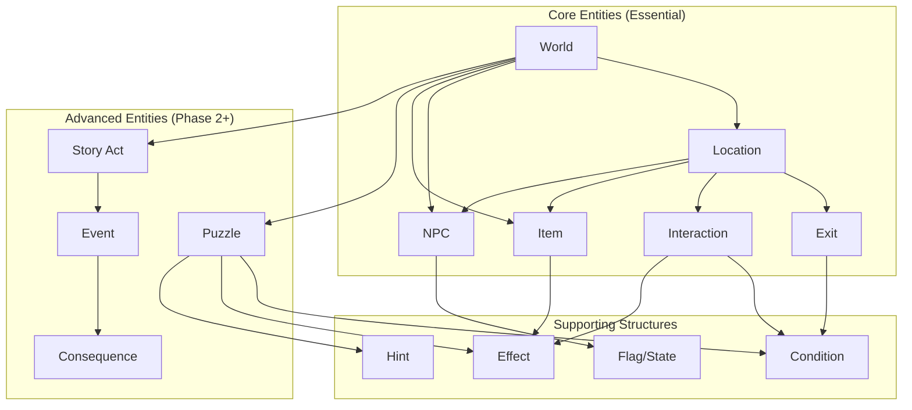

### Entity Categories

| Category | Entities | Purpose |
|----------|----------|---------|
| **World Container** | World | Top-level container for all entities |
| **Spatial** | Location, Exit | Define the navigable space |
| **Objects** | Item, NPC | Things the player can interact with |
| **Behavioral** | Interaction, Puzzle, Event | Define what happens when conditions are met |
| **Narrative** | StoryAct, Consequence | Define story progression and outcomes |
| **Mechanical** | Flag, Condition, Effect, Hint | Supporting structures for game logic |

---

## Core Entity Types

### Locations

Locations are the spatial containers where gameplay occurs. They are the "rooms" of a classic adventure game.

#### Current Schema (Prototype)

```yaml
entrance_hall:
  name: "Entrance Hall"
  atmosphere: "Grand but decayed..."
  exits: {north: library, east: dining_room}
  items: [old_letter, candlestick]
  npcs: [butler_jenkins]
  details: {portraits: "Five family portraits...", chandelier: "..."}
  interactions: {...}
  requires: {flag: some_flag, item: some_item}
  item_placements: {old_letter: "lies on the table"}
  npc_placements: {butler_jenkins: "stands by the clock"}
```

#### Proposed Schema (Enhanced)

```yaml
entrance_hall:
  # Identity
  id: entrance_hall  # Explicit ID (auto-generated from key if omitted)
  name: "Entrance Hall"

  # Narrative Content
  atmosphere: |
    Grand but decayed. The chandelier hangs dark and dusty.
  first_visit_flavor: |
    You've never seen such faded elegance. Once, this must have been magnificent.
  revisit_flavor: |
    The hall feels no less oppressive on your return.

  # Spatial Properties
  region: ground_floor  # Optional grouping
  is_interior: true
  is_safe: true  # No danger here

  # Contents (references to other entities)
  exits:
    north:
      destination: library
      description: "An archway leads north into darkness"
      visible: true
      passable: true
    east:
      destination: dining_room
      description: "Double doors stand ajar to the east"
      visible: true
      passable: true

  items: [old_letter, candlestick]
  item_placements:
    old_letter: "lies crumpled on the dusty side table"
    candlestick: "sits on the console table beneath the portraits"

  npcs: [butler_jenkins]
  npc_placements:
    butler_jenkins: "stands rigidly by the grandfather clock"

  # Interactions (inline or reference)
  interactions:
    examine_portraits:
      triggers: ["examine portraits", "look at portraits"]
      narrative: "You notice one portrait has been slashed across the face"
      effects:
        - set_flag: examined_portraits
        - discover: feature:slashed_portrait

  # Details (examinable but not full interactions)
  details:
    portraits: "Five family portraits - a stern father, beautiful mother, three children"
    chandelier: "Once magnificent, now dark and cobwebbed"
    floor: "Black and white marble tiles, cracked and worn"

  # Access Requirements
  requires:
    all:  # All conditions must be met
      - flag: has_key
      - item: lantern
    any:  # OR: any of these conditions
      - flag: knows_secret
      - item: map

  # Location State (can change during gameplay)
  states:
    default:
      atmosphere_modifier: ""
    after_fire:
      atmosphere_modifier: "Smoke hangs in the air. Soot covers everything."
      exits:
        north: {passable: false, blocked_reason: "Flames block the way"}
```

#### Location Properties Summary

| Property | Type | Required | Purpose |
|----------|------|----------|---------|
| `id` | string | Auto | Unique identifier |
| `name` | string | Yes | Display name |
| `atmosphere` | string | Yes | Base description for AI |
| `first_visit_flavor` | string | No | Extra text on first visit |
| `revisit_flavor` | string | No | Extra text on return visits |
| `region` | string | No | Logical grouping (floor, area) |
| `is_interior` | bool | No | Indoor vs outdoor |
| `is_safe` | bool | No | Can danger occur here |
| `exits` | map | Yes | Connections to other locations |
| `items` | list | No | Items present |
| `item_placements` | map | No | Where items appear visually |
| `npcs` | list | No | NPCs present |
| `npc_placements` | map | No | Where NPCs appear visually |
| `interactions` | map | No | Special interactions available |
| `details` | map | No | Examinable features |
| `requires` | object | No | Access requirements |
| `states` | map | No | Alternative configurations |

---

### Items

Items are objects the player can examine, take, use, and combine. They range from simple props to puzzle-critical artifacts.

#### Current Schema (Prototype)

```yaml
iron_key:
  name: "Heavy Iron Key"
  portable: true
  examine: "A large iron key with an ouroboros head..."
  found_description: "Hidden in the wardrobe, you find a heavy iron key"
  take_description: "You take the iron key. It seems to pulse with cold"
  unlocks: basement
  location: master_bedroom
  hidden: true
  find_condition: {requires_flag: searched_wardrobe}
  properties: {artifact: true}
  use_actions:
    wear: {description: "...", sets_flag: wearing_amulet}
  clues: [{hint_for: ritual, reveals: "One of three artifacts"}]
```

#### Proposed Schema (Enhanced)

```yaml
iron_key:
  # Identity
  id: iron_key
  name: "Heavy Iron Key"
  short_name: "iron key"  # For command parsing
  aliases: ["key", "serpent key", "ouroboros key"]

  # Physical Properties
  portable: true
  weight: heavy  # light, medium, heavy, immovable
  size: small    # tiny, small, medium, large, huge

  # Narrative Content
  examine: |
    A large iron key, cold and heavy in your hand. The head is shaped
    like a serpent eating its own tail - an ouroboros. Ancient symbols
    are etched along the shaft.
  examine_detailed: |  # Only shown with careful examination
    Upon closer inspection, you notice faint Latin inscriptions...
  found_description: "A glint of iron catches your eye from within the wardrobe"
  take_description: "You take the iron key. It pulses with unnatural cold"

  # Placement
  initial_location: master_bedroom
  initial_container: wardrobe  # Inside another object
  hidden: true

  # Discovery Requirements
  discovery:
    requires:
      - flag: opened_wardrobe
    reveals_on_discovery:
      - set_flag: found_iron_key

  # Item Categories & Flags
  categories:
    - key
    - artifact
    - quest_item
  critical: true  # Cannot be destroyed or lost

  # Mechanical Properties
  unlocks:
    - target: basement_door
      type: exit
      consumed: false  # Key isn't used up
      narrative: "The lock clicks open with a satisfying sound"
    - target: chest_in_basement
      type: container
      consumed: false

  # Use Actions
  use_actions:
    examine_symbols:
      triggers: ["examine symbols", "read inscriptions", "study key"]
      requires: {item: reading_glasses}
      narrative: "Through the spectacles, the symbols resolve into words..."
      effects:
        - set_flag: translated_key_symbols
        - discover: feature:key_prophecy

    show_to_jenkins:
      triggers: ["show key to jenkins", "ask jenkins about key"]
      requires: {npc_present: butler_jenkins}
      narrative: "Jenkins's face goes pale. 'Where did you find that?'"
      effects:
        - npc_trust: {butler_jenkins: +1}
        - unlock_dialogue: jenkins_key_dialogue

  # Combination with other items
  combinations:
    - with_item: ritual_cloth
      produces: wrapped_key
      narrative: "You carefully wrap the key in the blessed cloth"
      consumes: [ritual_cloth]

  # Puzzle & Story Connections
  clues:
    - hint_for: basement_puzzle
      reveals: "This key was made for an important lock"
    - hint_for: ritual_mystery
      reveals: "The ouroboros symbol connects to the family curse"

  # State Changes
  states:
    default: {}
    blessed:
      examine: "The key now glows with a faint golden light..."
      unlocks:
        - target: cursed_door
          type: exit
```

#### Item Categories

Items can belong to multiple categories that affect gameplay:

| Category | Behavior | Examples |
|----------|----------|----------|
| `key` | Can unlock things | iron_key, silver_key |
| `light_source` | Illuminates dark areas | lantern, candle, torch |
| `weapon` | Can be used in confrontations | knife, candlestick |
| `container` | Can hold other items | bag, box, pocket |
| `readable` | Has text content | letter, book, note |
| `wearable` | Can be worn | amulet, ring, cloak |
| `consumable` | Used up when used | potion, food, match |
| `artifact` | Special story significance | quest items |
| `quest_item` | Required for completion | critical path items |
| `evidence` | Proves something | clue items |
| `currency` | Can be traded | coins, gems |
| `tool` | Enables specific actions | lockpick, rope |

---

### NPCs

Non-Player Characters are entities that can interact with the player through dialogue and behavior.

> **Important**: The schema below shows the *structural* properties of NPCs. For the *narrative* approach
> (using prompts instead of literal text, and detailed backstory for richer AI-generated dialogue),
> see the [Narrative Architecture](#narrative-architecture) section.

#### Current Schema (Prototype)

```yaml
butler_jenkins:
  name: "Jenkins"
  role: "The elderly butler"
  location: dining_room
  locations: [dining_room, kitchen]  # For roaming NPCs
  appearance: "Gaunt and pale, impeccably dressed..."
  personality:
    traits: [formal, secretive, guilt-ridden]
    speech_style: "Victorian formal English..."
    quirks: ["Glances nervously at shadows"]
  knowledge: ["Knows about the curse", "Knows artifact locations"]
  dialogue_rules: ["Never directly answers about the curse"]
  trust: {initial: 0, threshold: 3, build_actions: [...]}
  appears_when: [{condition: has_flag, value: met_ghost}]
  location_changes:
    - when_flag: alarm_triggered
      move_to: entrance_hall
  behavior: "Offers tea, deflects questions..."
```

#### Proposed Schema (Enhanced)

```yaml
butler_jenkins:
  # Identity
  id: butler_jenkins
  name: "Jenkins"
  full_name: "Albert Jenkins"
  aliases: ["the butler", "old man", "servant"]
  role: "The elderly butler, last remaining servant"

  # Physical Description
  appearance:
    summary: "A gaunt, elderly man in formal butler's attire"
    details: |
      Perhaps seventy years old, impeccably dressed in formal wear
      that has seen better days. His face is gaunt and pale, with
      dark circles under watchful, haunted eyes. His hands tremble
      slightly when he thinks no one is looking.
    distinguishing_features:
      - "Silver pocket watch on a chain"
      - "Faded family crest on his lapel"

  # Personality
  personality:
    archetype: loyal_servant  # Optional shorthand
    traits:
      - formal
      - secretive
      - guilt-ridden
      - protective
      - loyal_to_a_fault

    speech_style:
      formality: very_formal
      vocabulary: victorian_english
      patterns:
        - "Uses indirect language and deflection"
        - "Offers tea to change subjects"
        - "Refers to 'the master' and 'the mistress'"
      examples:
        - "If sir would permit me to observe..."
        - "Perhaps sir would care for some tea?"
        - "I'm afraid I couldn't possibly say, sir"

    quirks:
      - trigger: idle
        behavior: "Straightens things that don't need straightening"
      - trigger: nervous
        behavior: "Glances toward the basement door"
      - trigger: children_mentioned
        behavior: "Becomes distant, changes subject"

    emotional_baseline:
      anxiety: high
      guilt: high
      hope: low

  # Location & Movement
  location:
    default: dining_room
    schedule:  # Time-based movement (future feature)
      morning: kitchen
      afternoon: dining_room
      evening: entrance_hall
    roaming:
      locations: [dining_room, kitchen, entrance_hall]
      frequency: rare  # How often they move

    changes:  # Flag-triggered movement
      - when: {flag: alarm_triggered}
        move_to: entrance_hall
        behavior_change: "Rushes about in a panic"
      - when: {flag: curse_broken}
        move_to: null  # Leaves the game (peacefully)
        departure_narrative: "Jenkins weeps with relief and thanks you"

  # Knowledge System
  knowledge:
    # Facts the NPC knows (available to LLM)
    facts:
      - id: curse_origin
        content: "The curse began when Edmund performed the ritual"
        reveals_when: {trust: 3}
      - id: artifact_locations
        content: "The amulet is in the nursery, dagger in basement, grimoire in ritual chamber"
        reveals_when: {trust: 4}
      - id: children_fate
        content: "The three children died in the ritual as sacrifices"
        reveals_when: {trust: 5}

    # What NPC will NOT reveal (constraints for LLM)
    secrets:
      - "Will not reveal artifact locations until trust is maxed"
      - "Will never admit his role in the tragedy directly"

    # What NPC believes (may be false)
    beliefs:
      - "Believes he could have stopped the ritual"
      - "Believes the spirits will never forgive him"

  # Relationship System
  relationship:
    trust:
      initial: 0
      current: 0  # Runtime value
      max: 5
      thresholds:
        1: "Willing to speak"
        3: "Shares some history"
        5: "Reveals everything"

    disposition:
      initial: wary
      toward_player: neutral  # Runtime value

    build_actions:
      - action: "Show kindness or sympathy"
        trust_change: +1
        disposition_change: warmer
      - action: "Mention helping the spirits"
        trust_change: +1
      - action: "Accuse or threaten"
        trust_change: -2
        disposition_change: hostile

  # Appearance Conditions
  appears_when:
    conditions:
      - {type: always}  # No conditions, always available
    # OR with conditions:
    # - {type: flag, value: met_in_entrance}
    # - {type: time, value: after_midnight}

  # Dialogue System
  dialogue:
    greeting:
      first_meeting: "Good evening, sir. I am Jenkins, the butler. May I be of service?"
      subsequent: "Ah, sir has returned. Is there something sir requires?"
      hostile: "Sir. What do you want now?"

    topics:
      family:
        available_when: {trust: 1}
        opener: "The Thornwoods were a fine family, sir. Fine family."
        branches:
          - about_children: "The children? I... I couldn't say, sir."
          - about_master: "The master was... ambitious. Perhaps too ambitious."

      curse:
        available_when: {trust: 3}
        opener: "Sir wishes to know about... that. Very well."
        sets_flag: jenkins_spoke_of_curse

    reactions:
      to_item:
        iron_key: "Sir! Where did you find that? Put it away, quickly!"
        amulet: "The young mistress's amulet... she would want you to have it."
      to_event:
        ghost_seen: "You've seen her, haven't you? The little one?"

  # Inventory (items NPC has)
  inventory:
    - silver_pocket_watch
  gives:
    - item: old_photograph
      when: {trust: 2}
      narrative: "Perhaps sir should see this. It was taken before..."

  # Behavior Patterns
  behavior:
    idle: "Stands quietly, occasionally adjusting his cuffs"
    nervous: "Paces, glances at doors, wrings his hands"
    helpful: "Attentively follows the player, offering assistance"

    reactions:
      player_injured: "Sir! Are you quite all right? Let me help you."
      item_taken: "If sir needs that, sir should take it."

  # NPC States
  states:
    default: {}
    after_curse_discussion:
      emotional_baseline: {hope: medium}
      behavior:
        idle: "Seems lighter, more at ease"
```

#### NPC Relationship Model

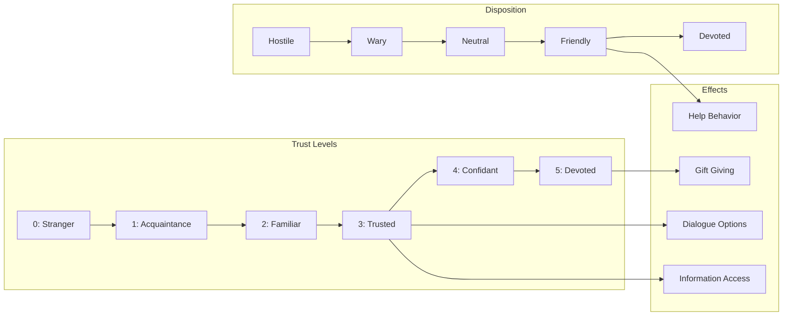

---

### Exits & Connections

Exits connect locations and can have their own properties, requirements, and states.

#### Current Schema (Prototype)

```yaml
# In locations.yaml
exits:
  north: library
  east: dining_room

requires:
  flag: found_secret_passage  # For entire location
```

#### Proposed Schema (Enhanced)

Exits become first-class entities with rich properties:

```yaml
# In locations.yaml (inline definition)
entrance_hall:
  exits:
    north:
      destination: library
      type: archway
      description: "An ornate archway leads north into shadows"
      description_from_other_side: "The entrance hall lies to the south"

      # Visibility
      visible: true
      visibility_condition: null  # Always visible
      hidden_description: null

      # Accessibility
      passable: true
      passable_condition: null  # Always passable
      blocked_reason: null

      # Lock mechanics
      locked: false
      lock:
        type: key
        requires: iron_key
        consumed: false
        unlock_narrative: "The lock clicks open"
        locked_narrative: "The door is firmly locked"

      # State changes
      states:
        default: {}
        after_explosion:
          passable: false
          blocked_reason: "Rubble blocks the passage"
          description: "The archway is collapsed, filled with debris"

# OR in separate exits.yaml for complex worlds
# exits.yaml
entrance_to_library:
  id: entrance_to_library
  from: entrance_hall
  to: library
  direction: north
  reverse_direction: south  # Auto-creates return path
  bidirectional: true
  # ... all properties above
```

#### Exit Types

| Type | Description | Example |
|------|-------------|---------|
| `open` | Always passable | Archway, corridor |
| `door` | Can be opened/closed | Regular door |
| `locked_door` | Requires key/action | Locked room |
| `hidden` | Not visible until discovered | Secret passage |
| `conditional` | Requires condition | Magical barrier |
| `one_way` | Can't return | Trap door, slide |
| `blocked` | Temporarily impassable | Cave-in, fire |

---

### Interactions

Interactions define what happens when the player performs specific actions in a location or with an item.

#### Current Schema (Prototype)

```yaml
# In locations.yaml
interactions:
  examine_portraits:
    triggers: ["examine portraits", "look at portraits"]
    narrative_hint: "One portrait has been slashed"
    sets_flag: examined_portraits
    reveals_exit: secret_passage
    gives_item: old_note
```

#### Proposed Schema (Enhanced)

```yaml
# Can be inline or in separate interactions.yaml
examine_portraits:
  # Identity
  id: examine_portraits
  name: "Examine the Family Portraits"

  # Trigger Patterns
  triggers:
    primary: ["examine portraits", "look at portraits", "study paintings"]
    secondary: ["who are these people", "look at pictures"]  # Fuzzy matches

  # Context Requirements
  context:
    location: entrance_hall  # Only works here
    # OR: locations: [entrance_hall, library]  # Multiple locations
    requires:
      any:
        - item: candle_lit  # Need light
        - flag: has_light
    not:  # Cannot trigger if...
      - flag: portraits_destroyed

  # Narrative Output
  narrative:
    default: |
      Upon closer inspection, you notice one portrait—the youngest child—
      has been violently slashed across the face. The cuts look old,
      made in fury long ago.
    with_reading_glasses: |
      Through the spectacles, you notice something else: faint writing
      on the frame of the slashed portrait. "Forgive me, Emily."
    already_examined: |
      You've already studied the portraits. The slashed face of the
      child still disturbs you.

  # Effects
  effects:
    - type: set_flag
      flag: examined_portraits
      value: true
    - type: discover
      entity: feature:slashed_portrait
    - type: reveal_exit
      exit: secret_passage  # Makes hidden exit visible
      condition: {flag: found_switch}  # Only if this flag is set
    - type: give_item
      item: portrait_fragment
      narrative: "A piece of the slashed canvas falls loose"
    - type: npc_reaction
      npc: butler_jenkins
      reaction: |
        Jenkins flinches visibly. "Sir shouldn't... shouldn't look
        too closely at those."

  # Repeatability
  repeatable: false  # Only triggers once with full narrative
  repeat_narrative: "You've already examined the portraits closely"

  # Puzzle Connection
  puzzle_connection:
    puzzle_id: family_mystery
    progress: minor  # How much this advances the puzzle

  # Audio/Visual Triggers (future)
  media:
    sound: eerie_whisper
    image_change: portraits_closeup
```

#### Interaction Effect Types

| Effect Type | Parameters | Description |
|-------------|------------|-------------|
| `set_flag` | flag, value | Set a game flag |
| `clear_flag` | flag | Remove a flag |
| `discover` | entity | Mark entity as discovered |
| `give_item` | item, narrative | Add item to inventory |
| `remove_item` | item | Remove from inventory |
| `reveal_exit` | exit | Make hidden exit visible |
| `unlock_exit` | exit | Unlock a locked exit |
| `block_exit` | exit, reason | Block an exit |
| `move_npc` | npc, location | Move NPC somewhere |
| `npc_reaction` | npc, reaction | Trigger NPC response |
| `change_location_state` | location, state | Switch location state |
| `trigger_event` | event | Trigger a story event |
| `advance_puzzle` | puzzle, progress | Progress a puzzle |
| `play_sound` | sound_id | Play audio |
| `show_image` | image_id | Display image |

---

## Advanced Entity Types

### Puzzles

Puzzles are first-class entities that model challenges the player must solve. They have explicit solutions, conditions, and hint systems.

#### Proposed Schema

```yaml
# puzzles.yaml
basement_access:
  # Identity
  id: basement_access
  name: "Access the Basement"
  type: key_lock  # key_lock, sequence, combination, riddle, social, environmental

  # Description
  description: |
    The basement door is secured with a heavy iron lock.
    You'll need to find a way to open it.

  # Solution Definition
  solution:
    type: item_use
    requirements:
      - item: iron_key
        action: use_on
        target: basement_door

    # Alternative solutions (if any)
    alternatives:
      - type: interaction
        interaction: pick_basement_lock
        requires: {item: lockpicks, flag: knows_lockpicking}

  # Prerequisites
  prerequisites:
    - puzzle: find_iron_key  # Must solve this first
    - flag: knows_basement_exists

  # State
  states:
    undiscovered: "Player hasn't found the basement"
    discovered: "Player knows about the basement"
    in_progress: "Player is trying to access"
    solved: "Basement is accessible"

  initial_state: undiscovered

  # Hints (escalating)
  hints:
    subtle:
      - "Jenkins seems to avoid the kitchen area"
      - "There's a draft coming from somewhere below"
    moderate:
      - "A heavy door in the kitchen leads downward"
      - "The lock looks old but sturdy. A matching key must exist"
    direct:
      - "Search the master bedroom thoroughly"
      - "Check inside the wardrobe"

  # Narrative
  narrative:
    on_discover: "You notice a heavy door with an iron lock"
    on_attempt_without_key: "The lock holds fast. You need the right key"
    on_solve: "The ancient lock yields with a satisfying click"

  # Effects on Solve
  on_solve:
    - set_flag: basement_unlocked
    - unlock_exit: {from: kitchen, direction: down}
    - discover: location:basement
    - trigger_event: basement_revealed

  # Validation
  validation:
    is_solvable: true  # Validator confirms solution is achievable
    required_for_victory: true

  # Puzzle Dependencies
  unlocks:
    - puzzle: find_ritual_dagger
  depends_on:
    - puzzle: find_iron_key

# Combination Puzzle Example
ritual_chamber_lock:
  id: ritual_chamber_lock
  name: "The Three Artifact Ritual"
  type: collection

  description: |
    Three pedestals wait in the ritual chamber.
    Place all three artifacts to break the curse.

  solution:
    type: collection
    required_items:
      - thornwood_amulet
      - ancient_dagger
      - grimoire
    location: ritual_chamber
    action: "place on pedestals"

  # Partial progress tracking
  progress:
    trackable: true
    stages:
      - items: 1
        narrative: "One pedestal glows faintly"
      - items: 2
        narrative: "Two pedestals now glow. The air hums with energy"
      - items: 3
        narrative: "The ritual circle blazes with light!"

  on_solve:
    - set_flag: has_all_artifacts
    - trigger_event: curse_broken
    - trigger_victory: true

# Social Puzzle Example
gain_jenkins_trust:
  id: gain_jenkins_trust
  name: "Earn Jenkins's Trust"
  type: social

  description: |
    The old butler knows more than he's saying.
    Perhaps if he trusted you more, he'd reveal the truth.

  solution:
    type: relationship_threshold
    npc: butler_jenkins
    trust_required: 3

  hints:
    subtle:
      - "Jenkins seems burdened by guilt"
      - "He responds well to kindness"
    moderate:
      - "Speak of wanting to help the spirits"
      - "Show him you understand the tragedy"

  # Ways to build trust (reference to NPC's build_actions)
  progress_actions:
    - action: "express_sympathy"
      trust_gain: 1
    - action: "mention_helping_spirits"
      trust_gain: 1
    - action: "find_evidence"
      trust_gain: 1
```

#### Puzzle Type Definitions

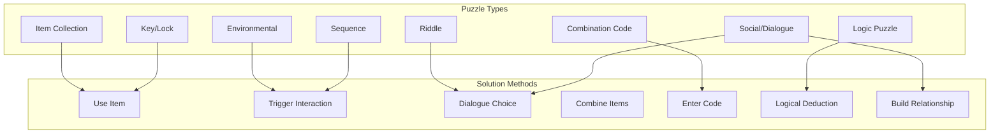

---

### Story Structures

Story structures model the narrative progression of a world, ensuring guided freedom while maintaining story integrity.

#### Proposed Schema

```yaml
# story.yaml
story:
  # Story Metadata
  title: "The Thornwood Curse"
  structure: three_act  # three_act, five_act, linear, hub_spoke

  # Story Acts/Chapters
  acts:
    act_1:
      name: "The Arrival"
      description: "Player arrives and discovers something is wrong"

      # Entry condition
      begins_when: game_start

      # Goals for this act
      goals:
        - Explore the entrance hall
        - Meet Jenkins
        - Learn about the family

      # Required beats (player must experience these)
      required_beats:
        - beat_id: meet_jenkins
          description: "Encounter Jenkins for the first time"
          triggers: {npc_interaction: butler_jenkins}
        - beat_id: discover_portraits
          description: "Notice the slashed portrait"
          triggers: {flag: examined_portraits}

      # Optional beats (enhance experience)
      optional_beats:
        - beat_id: play_piano
          description: "Discover the haunted piano"
          triggers: {flag: played_piano}

      # End condition
      ends_when:
        all:
          - flag: met_jenkins
          - flag: examined_portraits
          - locations_discovered: 3

    act_2:
      name: "The Investigation"
      description: "Player investigates the mystery and gathers artifacts"

      begins_when: act_1_complete

      goals:
        - Find all three artifacts
        - Learn the truth about the ritual
        - Build trust with Jenkins
        - Encounter the ghosts

      required_beats:
        - beat_id: find_amulet
          triggers: {item_acquired: thornwood_amulet}
        - beat_id: find_dagger
          triggers: {item_acquired: ancient_dagger}
        - beat_id: find_grimoire
          triggers: {item_acquired: grimoire}
        - beat_id: learn_truth
          triggers: {flag: knows_curse_truth}

      ends_when:
        all:
          - item: thornwood_amulet
          - item: ancient_dagger
          - item: grimoire

    act_3:
      name: "The Resolution"
      description: "Player breaks the curse and resolves the story"

      begins_when: act_2_complete

      goals:
        - Enter the ritual chamber
        - Place the artifacts
        - Break the curse

      required_beats:
        - beat_id: enter_chamber
          triggers: {location: ritual_chamber}
        - beat_id: break_curse
          triggers: {flag: has_all_artifacts}

      ends_when:
        any:
          - flag: curse_broken  # Good ending
          - flag: ritual_corrupted  # Bad ending (future feature)

  # Victory Conditions (can have multiple endings)
  endings:
    good_ending:
      name: "Freed"
      condition:
        all:
          - flag: curse_broken
          - flag: jenkins_forgiven  # Optional for best ending
      narrative: |
        The curse is broken. The spirits are free. Dawn breaks over the manor.

    neutral_ending:
      name: "Escaped"
      condition:
        all:
          - flag: curse_broken
        not:
          - flag: jenkins_forgiven
      narrative: |
        The curse is broken, but you leave with questions unanswered.

  # Story Constraints (for LLM)
  constraints:
    - "Do not reveal the curse solution before Act 2"
    - "Jenkins only fully reveals truth at Trust level 5"
    - "Ghosts become more visible as artifacts are collected"
```

#### Story Beat Flow

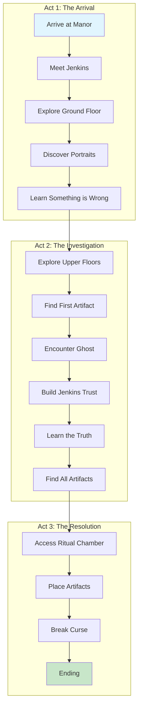

---

### Events

Events are triggered occurrences that affect the world state, narrative, or player experience.

#### Proposed Schema

```yaml
# events.yaml
ghost_first_appearance:
  id: ghost_first_appearance
  name: "First Ghost Sighting"
  type: narrative  # narrative, world_change, npc_action, ambient

  # Trigger Conditions
  triggers:
    when:
      all:
        - flag: examined_nursery
        - location: upper_landing
        - not_flag: seen_ghost

    # Probability (for ambient events)
    chance: 1.0  # Always triggers when conditions met

    # Timing
    delay: 0  # Turns after condition met

  # Event Content
  narrative: |
    A flicker of movement catches your eye. At the end of the hallway,
    a translucent figure of a young girl stands watching you. Her form
    wavers like candlelight. She raises one hand, pointing toward the
    nursery, then fades into nothing.

  # Effects
  effects:
    - set_flag: seen_ghost
    - set_flag: met_ghost_child
    - discover: npc:ghost_child
    - npc_appears: ghost_child

  # Interrupt behavior
  interrupt: true  # Pauses normal action processing

  # Repeatability
  once_only: true

# World Change Event
fire_breaks_out:
  id: fire_breaks_out
  type: world_change

  triggers:
    when:
      flag: knocked_over_candle

  narrative: |
    The fallen candle catches the dusty curtains. Within moments,
    flames lick up the wall. You must act quickly!

  effects:
    - location_state_change:
        location: sitting_room
        new_state: on_fire
    - exit_blocked:
        from: sitting_room
        direction: east
        reason: "Flames block the way"
    - time_limit_start:
        turns: 5
        on_expire: fire_spreads

  # Urgency
  urgent: true
  urgent_hint: "The fire is spreading! You should leave or find a way to extinguish it."

# Ambient Event (random atmosphere)
distant_piano:
  id: distant_piano
  type: ambient

  triggers:
    when:
      location_region: ground_floor
      not_location: sitting_room
      not_flag: piano_played
    chance: 0.15  # 15% chance each turn

  narrative: |
    A faint melody drifts through the manor—someone playing piano.
    The tune is sad, childlike. It seems to come from the west.

  effects:
    - discover: feature:phantom_piano

  once_only: false  # Can repeat
  cooldown: 5  # Turns between occurrences
```

---

## Entity Relationships

### Relationship Diagram

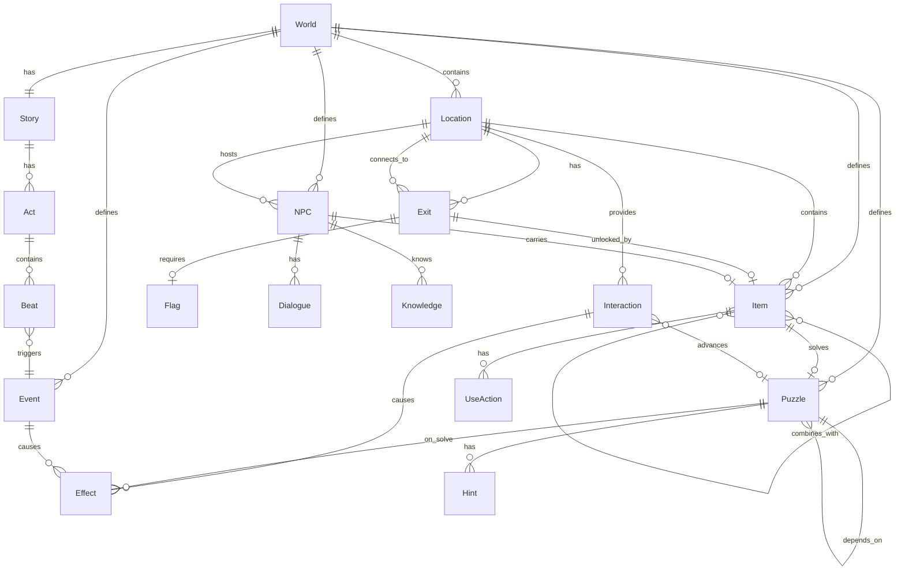

### Reference Types

| Reference Type | From | To | Example |
|---------------|------|-----|---------|
| **Spatial** | Exit | Location | `destination: library` |
| **Contains** | Location | Item | `items: [key, book]` |
| **Unlocks** | Item | Exit | `unlocks: basement_door` |
| **Requires** | Exit | Flag | `requires: {flag: has_key}` |
| **Requires** | Exit | Item | `requires: {item: lantern}` |
| **Hosts** | Location | NPC | `npcs: [jenkins]` |
| **Knows** | NPC | Fact | `knowledge: [...]` |
| **Triggers** | Interaction | Effect | `effects: [set_flag: ...]` |
| **Solves** | Item/Action | Puzzle | `puzzle_connection: {puzzle: ...}` |
| **Depends** | Puzzle | Puzzle | `depends_on: [other_puzzle]` |
| **Advances** | Beat | Story | `ends_when: {flag: ...}` |

---

## State Management & Persistence

This section addresses a critical architectural concern: **how to track world changes over time and enable save/load functionality**.

### The State Challenge

GAIME worlds are *living* - they change as the player acts:

| Change Type | Examples |
|-------------|----------|
| **Item Movement** | Key picked up, letter read and dropped |
| **Discovery** | Secret door found, hidden item revealed |
| **Transformation** | Computer repaired, painting slashed, fire started |
| **NPC State** | Trust level changed, NPC moved, dialogue unlocked |
| **Progression** | Puzzle solved, story beat completed |

The challenge: **World definitions are static (YAML), but the game world is dynamic**.

### Two-Layer State Model

We separate **World Definition** (immutable, authored) from **World State** (mutable, runtime):

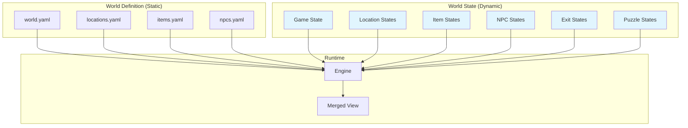

### Comprehensive State Schema

```yaml
# save_game.yaml - Complete saveable state
save_game:
  # === Metadata ===
  meta:
    save_id: "uuid"
    world_id: "cursed-manor"
    world_version: "1.0.0"  # For compatibility checks
    created_at: "2025-12-11T10:30:00Z"
    last_played: "2025-12-11T14:22:00Z"
    play_time_seconds: 3720

  # === Session State ===
  session:
    player_name: "Traveler"
    turn_count: 42
    status: playing  # playing, won, lost
    current_act: act_2

  # === Spatial State ===
  player:
    current_location: library
    discovered_locations: [entrance_hall, library, dining_room, kitchen]
    visited_locations:
      entrance_hall: {visits: 5, first_visit: 1, last_visit: 38}
      library: {visits: 3, first_visit: 8, last_visit: 42}

  # === Inventory State ===
  inventory:
    items: [pocket_watch, iron_key, old_letter]
    # Items with modified state
    item_states:
      candlestick: lit        # Was default, now lit
      pocket_watch: examined  # Has been examined in detail

  # === World Delta State ===
  # Only stores CHANGES from world definition - sparse representation
  world_delta:
    # Items that have moved or changed
    items:
      iron_key:
        original_location: master_bedroom
        current_location: null  # null = in inventory
        picked_up_turn: 22
      old_letter:
        current_location: null  # In inventory
        picked_up_turn: 3
      thornwood_amulet:
        hidden: false  # Was hidden, now revealed
        current_location: null  # In inventory
      candlestick:
        state: lit

    # Locations that have changed
    locations:
      entrance_hall:
        state: visited  # Tracks that player has been here
        items_removed: [old_letter, candlestick]  # Items taken
      sitting_room:
        state: on_fire  # Changed from default
        atmosphere_override: "Flames crackle and smoke fills the room"
      ritual_chamber:
        state: pedestals_glowing
        items_placed: [thornwood_amulet, ancient_dagger]

    # Exits that have changed
    exits:
      library_to_secret_passage:
        visible: true   # Was hidden
        discovered_turn: 15
      kitchen_to_basement:
        locked: false   # Was locked
        unlocked_turn: 25
        unlocked_with: iron_key

    # NPCs that have changed
    npcs:
      butler_jenkins:
        trust: 3
        disposition: friendly
        current_location: entrance_hall  # Moved from dining_room
        dialogue_unlocked: [family_history, curse_hints]
        given_items: [old_photograph]
      ghost_child:
        first_appeared_turn: 18

  # === Flags State ===
  # All triggered flags
  flags:
    # Discovery flags
    examined_portraits: {set_turn: 5}
    found_secret_passage: {set_turn: 15}
    examined_nursery: {set_turn: 30}
    # Progress flags
    met_jenkins: {set_turn: 2}
    jenkins_trust_3: {set_turn: 35}
    # Puzzle flags
    basement_unlocked: {set_turn: 25}

  # === Puzzle State ===
  puzzles:
    basement_access:
      state: solved
      solved_turn: 25
      solution_used: iron_key
    ritual_chamber_lock:
      state: in_progress
      progress:
        items_placed: 2
        items_remaining: [grimoire]
    gain_jenkins_trust:
      state: solved
      trust_reached: 3

  # === Story State ===
  story:
    current_act: act_2
    completed_acts: [act_1]
    completed_beats:
      - {beat: meet_jenkins, turn: 2}
      - {beat: discover_portraits, turn: 5}
      - {beat: find_amulet, turn: 32}
    active_quests: [find_artifacts, learn_truth]

  # === Narrative Memory ===
  # Stored for LLM context continuity
  narrative_memory:
    recent_exchanges:
      - turn: 40
        action: "ask jenkins about the children"
        summary: "Jenkins became emotional, revealing glimpses of the tragedy..."
      - turn: 41
        action: "examine the grimoire"
        summary: "The ancient book contains disturbing rituals..."
    npc_memory:
      butler_jenkins:
        encounter_count: 8
        first_met_location: entrance_hall
        topics_discussed: [weather, manor_history, family, children]
        notable_moments: ["He wept when speaking of the children"]
        player_disposition: sympathetic
        npc_disposition: trusting
    discoveries:
      - "item:iron_key"
      - "npc:ghost_child"
      - "feature:slashed_portrait"
      - "secret:children_sacrificed"
```

### State Resolution at Runtime

When the engine needs to know about an entity, it **merges** definition with state:

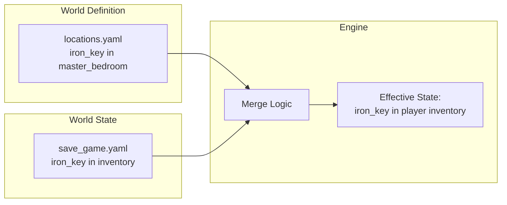

```python
# Pseudocode: Resolving item location
def get_item_location(item_id: str) -> str | None:
    # Check state delta first (takes precedence)
    if item_id in state.world_delta.items:
        delta = state.world_delta.items[item_id]
        if delta.current_location is not None:
            return delta.current_location
        elif delta.current_location is None:
            return "inventory"  # Explicitly in inventory

    # Fall back to world definition
    item_def = world.items.get(item_id)
    if item_def:
        return item_def.initial_location

    return None
```

### What Gets Persisted vs. Computed

| Data Type | Persisted? | Notes |
|-----------|------------|-------|
| Player location | ✅ Yes | Core state |
| Inventory | ✅ Yes | Core state |
| Flags | ✅ Yes | Core state |
| NPC trust levels | ✅ Yes | Derived would lose granularity |
| Item locations | ✅ Yes (delta) | Only if changed from definition |
| Exit visibility | ✅ Yes (delta) | Only if changed |
| Location states | ✅ Yes (delta) | Only if changed |
| NPC dialogue state | ✅ Yes | Which topics unlocked |
| Puzzle progress | ✅ Yes | Multi-step puzzles need this |
| Narrative memory | ✅ Yes | For LLM continuity |
| Available exits | ❌ Computed | Derived from location + state |
| Visible items | ❌ Computed | Derived from location + state + flags |
| Present NPCs | ❌ Computed | Derived from NPC rules + flags |

### Save/Load API

```python
# Saving
def save_game(session_id: str, slot: int | str = "auto") -> SaveResult:
    """
    Serialize current game state to persistent storage.

    - slot: "auto" for autosave, 1-10 for manual slots, or custom name
    - Returns: SaveResult with save_id, timestamp, thumbnail_path
    """

# Loading
def load_game(save_id: str) -> LoadResult:
    """
    Restore game state from save.

    - Validates world_version compatibility
    - Rebuilds computed state from delta
    - Returns: LoadResult with session_id, warnings (if any)
    """

# Listing saves
def list_saves(world_id: str = None) -> list[SaveInfo]:
    """
    List available save games.

    - Filter by world_id if provided
    - Returns: List of SaveInfo (id, name, timestamp, play_time, location)
    """
```

### Version Compatibility

World definitions may change between versions. The save system handles this:

```yaml
# Compatibility rules
compatibility:
  # Save includes world version
  save_world_version: "1.0.0"
  current_world_version: "1.1.0"

  # Compatibility matrix
  rules:
    - change: "new_location_added"
      compatible: true
      action: "Player can discover new location"

    - change: "location_removed"
      compatible: conditional
      action: "If player is in removed location, move to nearest valid"

    - change: "item_removed"
      compatible: conditional
      action: "If item in inventory, warn player it was removed"

    - change: "puzzle_changed"
      compatible: conditional
      action: "Reset puzzle progress, notify player"
```

---

## Narrative Architecture

This section addresses the concern about **repetitive narration** when world definitions contain too much literal text. The solution: **narrative prompts instead of literal strings**.

### The Problem with Literal Text

Current approach (too rigid):
```yaml
# BAD: Literal text gets repetitive
butler_jenkins:
  dialogue:
    greeting: "Good evening, sir. I am Jenkins, the butler. May I be of service?"
```

Every time the player talks to Jenkins, they get the *exact same greeting*. This breaks immersion.

### Solution: Narrative Prompts

Instead of literal text, provide **prompts** that guide the Narration AI:

```yaml
# GOOD: Prompts guide but don't dictate
butler_jenkins:
  dialogue:
    greeting:
      prompt: |
        Jenkins greets the player formally. He is a Victorian butler,
        proper and reserved. He should:
        - Use formal address (sir/madam)
        - Offer service
        - Hint at underlying nervousness (subtle)
      tone: formal_victorian
      length: short  # 1-2 sentences

      # Optional: Key phrases that SHOULD appear (for plot reasons)
      must_include:
        - "butler" or "Jenkins" (establishes identity)

      # Optional: Things to AVOID
      must_avoid:
        - Direct mention of the curse
        - Spoilers about the children
```

### Three-Tier Narrative Content

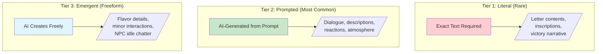

| Tier | When to Use | Example |
|------|-------------|---------|
| **Literal** | Plot-critical exact text | Letter that reveals a clue: must be exact |
| **Prompted** | Character-consistent content | NPC dialogue: guided but varied |
| **Emergent** | Atmospheric filler | What does the dust look like today? |

### Enhanced NPC Definition with Prompts

```yaml
butler_jenkins:
  # === Identity ===
  id: butler_jenkins
  name: "Jenkins"

  # === Character Foundation (for AI understanding) ===
  character:
    # Core identity
    archetype: loyal_servant
    age: 70
    background_summary: |
      Has served the Thornwood family for 50 years. Was present the
      night of the ritual. Blames himself for not stopping it. Has
      stayed in the manor ever since, unable to leave the children's
      spirits. Formal on the surface, broken underneath.

    # Psychological profile
    psychology:
      core_motivation: redemption
      greatest_fear: "That the children will never forgive him"
      secret_shame: "He helped prepare the ritual chamber"
      coping_mechanism: "Rigid formality, routine, denial"

    # Voice and manner
    voice:
      formality: very_formal
      era: victorian
      vocabulary_notes: |
        Uses "sir" or "madam" constantly. Never contractions.
        Speaks in complete sentences. Deflects with offers of tea.
      verbal_tics:
        - "If I may be so bold..."
        - "The master always said..."
        - "Perhaps sir would care for..."

    # Physical mannerisms
    mannerisms:
      nervous: ["wringing hands", "glancing at shadows", "adjusting cuffs"]
      sad: ["distant stare", "trailing off mid-sentence", "touching the family crest"]
      hopeful: ["straightening posture", "hint of a smile", "more direct eye contact"]

  # === Detailed Backstory (for AI deep understanding) ===
  backstory:
    # Timeline of key events (AI can reference these)
    history:
      - year: 1875
        event: "Joined Thornwood household as junior footman, age 20"
        emotional_note: "Idealistic, grateful for the position"

      - year: 1882
        event: "Promoted to butler after old Butler Morrison passed"
        emotional_note: "Proud, determined to serve well"

      - year: 1885
        event: "Witnessed Master Edmund's growing obsession with immortality"
        emotional_note: "Concerned but loyal, didn't question"

      - year: 1887
        event: "THE NIGHT: Helped prepare ritual chamber without knowing purpose"
        emotional_note: "Horror, guilt, paralysis - heard children scream"

      - year: 1887-present
        event: "Remained in manor, tending to empty rooms"
        emotional_note: "Penance, waiting, hoping for redemption"

    # Relationships
    relationships:
      edmund_thornwood: |
        The master. Jenkins was loyal to a fault. Now feels betrayed
        and complicit. Cannot speak ill of him directly but reveals
        through pauses and careful word choice.
      margaret_thornwood: |
        The mistress. Jenkins genuinely cared for her. Her ghost
        appearing distresses him deeply. Feels he failed her.
      the_children: |
        Emily, Thomas, and little Catherine. Jenkins loved them.
        Their deaths broke him. He cannot say their names without
        visible emotion. Would do anything to free their spirits.

    # Secrets (AI knows but Jenkins won't reveal easily)
    secrets:
      level_1_surface: "Something terrible happened long ago"
      level_2_trust_2: "The children died in this house"
      level_3_trust_4: "There was a ritual. The master performed it."
      level_4_trust_5: "I prepared the chamber. I heard them scream. I did nothing."

  # === Narrative Prompts (NOT literal text) ===
  narrative_prompts:
    # First meeting
    first_encounter:
      prompt: |
        Jenkins encounters a stranger in the manor for the first time in decades.
        Generate his greeting. He should:
        - Be formally welcoming (butler's duty)
        - Show surprise barely contained
        - Hint at relief (finally, someone who might help)
        - NOT reveal anything about the curse yet
      tone: formal_with_underlying_tension
      length: medium

    # Subsequent greetings (varies by disposition)
    greeting_neutral:
      prompt: |
        Jenkins greets the player again. Professional, guarded.
        Variations based on time of day and location are good.
      tone: formal
      length: short

    greeting_trusting:
      prompt: |
        Jenkins has grown to trust the player. His greeting should
        show warmth beneath the formality. Perhaps he allows himself
        a small smile or drops the "sir" occasionally.
      tone: formal_but_warm
      length: short

    # When asked about the family
    topic_family:
      prompt: |
        Player asks about the Thornwood family. Jenkins should:
        - Speak with careful nostalgia about the "old days"
        - Avoid specifics about the tragedy
        - Show visible discomfort if pressed
        - Deflect with offers of tea or changing subject
      must_include:
        - Some positive memory of the family (before)
      must_avoid:
        - Details about how they died
        - Names of the children (unless trust >= 3)
      tone: nostalgic_guarded

    # When children are mentioned
    reaction_children_mentioned:
      prompt: |
        Player mentions the children. This deeply affects Jenkins.
        - At low trust: He shuts down, changes subject abruptly
        - At medium trust: He pauses, shows emotion, speaks vaguely
        - At high trust: He may finally speak about them with tears
      emotional_beat: grief_and_guilt
      tone: varies_by_trust

    # When shown the iron key
    reaction_iron_key:
      prompt: |
        Player shows Jenkins the iron key (to the basement).
        Jenkins recognizes it immediately. His reaction should show:
        - Fear (the basement holds dark memories)
        - Hope (maybe the player can end this)
        - Inner conflict about what to say
      emotional_beat: shock_then_resignation
      must_include:
        - Physical reaction (going pale, stepping back)
      tone: intense

  # === Knowledge System ===
  knowledge:
    # Facts organized by topic
    topics:
      manor_history:
        knows: true
        reveals_at_trust: 0
        facts:
          - "The manor was built in 1820"
          - "The Thornwoods were wealthy from the foundry business"

      family_tragedy:
        knows: true
        reveals_at_trust: 3
        facts:
          - "Something happened in 1887"
          - "The family is gone"
        partial_reveals:
          trust_1: "There was... an incident. Long ago."
          trust_2: "The children... they never grew up."
          trust_3: "It was the master's doing. His obsession."

      artifact_locations:
        knows: true
        reveals_at_trust: 4
        facts:
          - "The amulet is in the nursery, in Emily's hiding spot"
          - "The dagger is in the basement - the mistress hid it"
          - "The grimoire never left the ritual chamber"

      curse_solution:
        knows: true
        reveals_at_trust: 5
        facts:
          - "The artifacts must be reunited in the ritual chamber"
          - "Only then can the children's spirits be freed"
```

### Atmosphere Prompts for Locations

Same principle applies to locations:

```yaml
library:
  name: "The Library"

  # Instead of fixed atmosphere text, use prompts
  atmosphere_prompt:
    base: |
      A Victorian library. Floor-to-ceiling bookshelves. Dust and
      aged paper smell. Moonlight through grimy windows. Cold draft.
    elements:
      - "ancient books, many on occult topics"
      - "a massive oak desk covered in papers"
      - "dust motes drifting in pale light"
      - "a cold draft from somewhere"
    mood: mysterious_scholarly
    sensory_focus: smell_and_touch  # Emphasize these

  # Time/state variations
  atmosphere_variants:
    first_visit:
      additional: "Everything feels untouched, waiting"
      mood: anticipation
    after_secret_found:
      additional: "The revealed passage changes everything"
      mood: revelation
    with_ghost_present:
      additional: "The temperature drops. The books seem to whisper"
      mood: supernatural

  # Details as prompts too
  detail_prompts:
    books:
      prompt: "Describe the library's book collection"
      include: ["occult volumes", "family histories", "normal books"]
      tone: unsettling_discovery
    desk:
      prompt: "Describe the cluttered desk"
      include: ["handwritten notes", "strange symbols", "personal items"]
      tone: scholarly_obsession
```

### Benefits of Prompt-Based Narration

| Benefit | Explanation |
|---------|-------------|
| **Variety** | Same prompt produces different text each playthrough |
| **Consistency** | Character voice and plot constraints maintained |
| **Efficiency** | Authors write intent, not every possible sentence |
| **Localization** | Prompts easier to translate than prose |
| **Debugging** | Clear what the AI *should* produce |

---

## Game Loop Architecture

This section addresses the question of **splitting the LLM call** into two phases: one for mechanics, one for narration.

### Current Architecture (Single LLM)

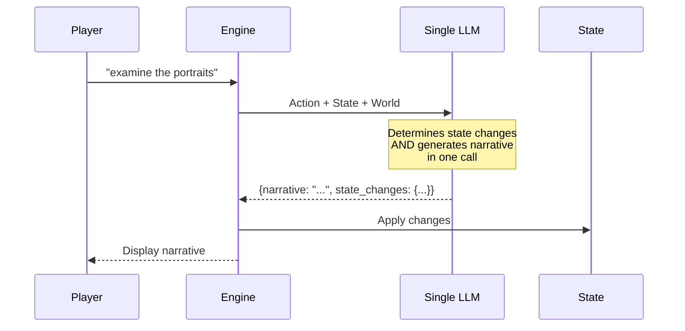

**Problems:**
- LLM might hallucinate state changes
- Narrative may not match actual state
- Hard to validate before committing
- Single point of failure

### Proposed Architecture (Two-Phase LLM)

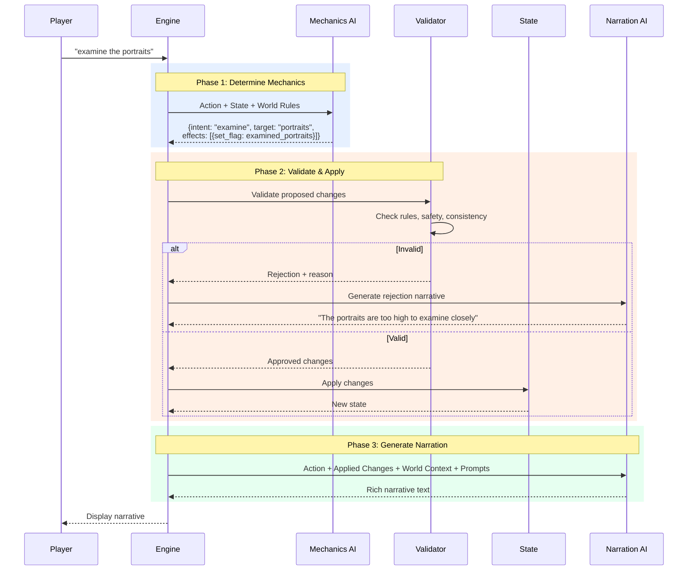

### Detailed Phase Breakdown

#### Phase 1: Mechanics AI (Rules-Focused)

**Purpose:** Interpret player intent and determine mechanical consequences.

**Input:**
```yaml
mechanics_request:
  player_action: "examine the portraits"
  current_state:
    location: entrance_hall
    inventory: [pocket_watch, journal]
    flags: {met_jenkins: true}
  world_context:
    location_details: {portraits: "Five family portraits..."}
    available_interactions:
      - id: examine_portraits
        triggers: ["examine portraits", "look at portraits"]
        effects: [{set_flag: examined_portraits}]
    relevant_constraints:
      - "Portraits can only be examined up close with light"
```

**Output:**
```yaml
mechanics_response:
  # What the player is trying to do
  interpreted_intent:
    action_type: examine
    target: portraits
    target_type: detail

  # Matched world-defined interaction (if any)
  matched_interaction: examine_portraits

  # Proposed state changes
  proposed_effects:
    - type: set_flag
      flag: examined_portraits
      value: true
    - type: discover
      discovery: "feature:slashed_portrait"

  # Additional context for narration
  mechanical_context:
    is_first_examination: true
    relevant_discovery: "One portrait is slashed"

  # Confidence and alternatives
  confidence: 0.95
  alternative_interpretations:
    - intent: "look at room in general"
      confidence: 0.05
```

**Mechanics AI Characteristics:**
- Smaller, faster model possible (structured output focused)
- Strict JSON schema for output
- No creative writing - just intent parsing and rule matching
- Can be fine-tuned on action patterns

#### Phase 2: Validation Engine (Deterministic)

**Purpose:** Ensure proposed changes are valid and safe.

```python
class MechanicsValidator:
    def validate(self, proposed: MechanicsResponse, state: GameState) -> ValidationResult:
        errors = []
        warnings = []

        for effect in proposed.proposed_effects:
            # Check effect is allowed
            if effect.type == "set_flag":
                if effect.flag in PROTECTED_FLAGS:
                    errors.append(f"Cannot modify protected flag: {effect.flag}")

            elif effect.type == "move_to":
                # Check exit exists and is accessible
                if not self.can_access(effect.location, state):
                    errors.append(f"Cannot access: {effect.location}")

            elif effect.type == "take_item":
                # Check item is present and takeable
                if not self.item_available(effect.item, state):
                    errors.append(f"Item not available: {effect.item}")
                if self.is_item_critical(effect.item) and effect.destroy:
                    errors.append(f"Cannot destroy critical item: {effect.item}")

        # Safety checks
        if self.would_create_unwinnable_state(proposed, state):
            errors.append("Action would make game unwinnable")

        return ValidationResult(
            valid=len(errors) == 0,
            errors=errors,
            warnings=warnings,
            approved_effects=proposed.proposed_effects if not errors else []
        )
```

#### Phase 3: Narration AI (Creative)

**Purpose:** Generate engaging, varied narrative based on confirmed state changes.

**Input:**
```yaml
narration_request:
  # What happened mechanically
  action_taken:
    type: examine
    target: portraits
  effects_applied:
    - {type: set_flag, flag: examined_portraits}
    - {type: discover, discovery: "feature:slashed_portrait"}

  # Context for narration
  context:
    location: entrance_hall
    location_atmosphere_prompt: "Grand but decayed Victorian entrance..."
    time_of_day: night
    mood: mysterious

  # What to narrate about
  narration_focus:
    primary: "Discovery of the slashed portrait"
    secondary: "General portrait descriptions"

  # Narrative prompts from world definition
  narrative_guidance:
    interaction_prompt: |
      Player examines the family portraits. They discover that one
      portrait (the youngest child) has been violently slashed.
      This should feel like a disturbing discovery.
    tone: gothic_horror
    length: medium
    must_include:
      - "The slashing was done in anger/violence"
      - "It's the portrait of a child"
    must_avoid:
      - "Revealing who slashed it"
      - "Naming the child yet"

  # Memory context for continuity
  narrative_memory:
    recent_exchanges: [...]
    relevant_discoveries: []  # First time seeing this

  # Player preferences (future)
  player_preferences:
    verbosity: medium
    gore_level: mild
```

**Output:**
```yaml
narration_response:
  narrative: |
    You step closer to the portraits, your boots leaving prints in the
    thick dust. Five faces stare back at you from ornate frames—a
    stern patriarch, a beautiful woman with sad eyes, and three
    children posed before them.

    Then you see it. Your breath catches.

    The smallest portrait—a young girl with ribbons in her hair—has
    been savaged. Deep slashes cut across her painted face, the
    canvas torn with what must have been furious violence. The cuts
    are old, the edges yellowed, but the rage behind them still feels
    present in the room.

    Someone wanted to destroy this child's image. But why?

  # Metadata for UI
  metadata:
    word_count: 112
    emotional_beat: disturbing_discovery
    suggested_pause: true  # UI might pause for effect
```

**Narration AI Characteristics:**
- Larger, more creative model
- Follows prompts but generates varied prose
- Maintains voice consistency via character prompts
- Can reference narrative memory for continuity

### Architecture Comparison

| Aspect | Single LLM | Two-Phase LLM |
|--------|------------|---------------|
| **Latency** | 1 LLM call | 2 LLM calls (can parallelize partially) |
| **Reliability** | State changes may be wrong | State changes validated before narration |
| **Consistency** | Narrative may not match state | Narrative always matches approved state |
| **Cost** | 1 call (larger model) | 2 calls (can use smaller for mechanics) |
| **Debugging** | Hard to separate issues | Clear separation of concerns |
| **Flexibility** | Tightly coupled | Can swap models independently |

### Hybrid Approach (Recommended)

For efficiency, use a **hybrid approach**:

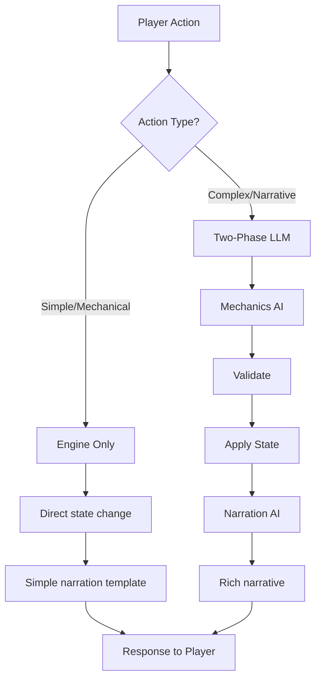

**Simple actions** (handled by engine + templates):
- `go north` → Engine moves player, template: "You walk north into the {location_name}."
- `inventory` → Engine returns list, template: "You are carrying: {items}"
- `take {known_item}` → Engine handles, template: "{take_description}"

**Complex actions** (need full LLM pipeline):
- `examine {something}` → May trigger discoveries, need rich description
- `talk to {npc}` → Dialogue generation
- `use {item} on {target}` → Context-dependent outcomes
- Ambiguous input → Need interpretation

### Implementation Phases

1. **Phase 1:** Extract mechanics determination into separate prompt (same LLM, different calls)
2. **Phase 2:** Add validation layer between mechanics and narration
3. **Phase 3:** Experiment with smaller model for mechanics
4. **Phase 4:** Full separation with model-specific optimization

---

## Safety Mechanics

Per Vision: "No unwinnable states, no player death"

```yaml
# Safety Rules (enforced by engine)
safety:
  critical_items:
    - Cannot be dropped
    - Cannot be destroyed
    - Cannot be given away
    - Narrative deflection for attempts

  death_prevention:
    - Lethal actions deflected narratively
    - Dangerous situations have escape routes
    - "Near misses" instead of death

  unwinnable_prevention:
    - Victory path always reachable
    - Key items can't be lost
    - NPCs can't become permanently hostile
    - Puzzles can't become unsolvable

  narrative_deflection_examples:
    destroy_quest_item: "Something stays your hand. This feels too important to destroy."
    enter_deadly_area: "Your instincts scream danger. Perhaps there's another way."
    kill_key_npc: "Despite your anger, you realize you need them alive."
```

---

## Implementation Phases

### Phase 1: Essential (Current → Near Term)

**Entities to Enhance:**
- ✅ Locations (mostly complete)
- ✅ Items (mostly complete)
- ✅ NPCs (mostly complete)
- 🔄 Exits (make first-class)
- 🔄 Interactions (standardize schema)

**Mechanics to Add:**
- Exit entity with full properties
- Consistent interaction schema
- Validation for all references
- Critical item protection

### Phase 2: Puzzles (Next Priority)

**New Entities:**
- Puzzle definitions
- Hint system
- Puzzle dependencies

**Enhanced Mechanics:**
- Puzzle state tracking
- Puzzle validation
- LLM puzzle constraints

### Phase 3: Story Structure

**New Entities:**
- Story/Act definitions
- Story beats
- Endings

**Enhanced Mechanics:**
- Act progression tracking
- Beat completion
- Multiple endings

### Phase 4: Events & Dynamics

**New Entities:**
- Event definitions
- Consequences
- Ambient events

**Enhanced Mechanics:**
- Event triggering
- World state changes
- Time/scheduling (optional)

### Implementation Priority Matrix

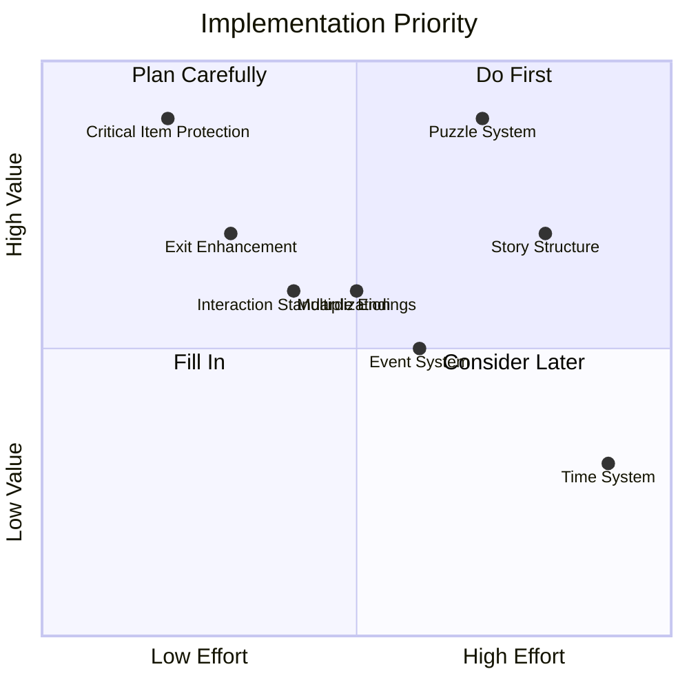

---

## Schema Specifications

### Complete Entity Schema Summary

#### Locations Schema (v2)

```yaml
# locations.yaml
location_id:
  # Required
  name: string
  atmosphere: string
  exits: map<direction, ExitDefinition>

  # Optional - Content
  items: list<item_id>
  item_placements: map<item_id, string>
  npcs: list<npc_id>
  npc_placements: map<npc_id, string>
  details: map<detail_name, string>
  interactions: map<interaction_id, InteractionDefinition>

  # Optional - Narrative
  first_visit_flavor: string
  revisit_flavor: string

  # Optional - Properties
  region: string
  is_interior: boolean
  is_safe: boolean

  # Optional - Requirements
  requires:
    all: list<Condition>
    any: list<Condition>

  # Optional - States
  states: map<state_name, StateOverride>
```

#### Items Schema (v2)

```yaml
# items.yaml
item_id:
  # Required
  name: string
  examine: string

  # Optional - Identity
  short_name: string
  aliases: list<string>

  # Optional - Physical
  portable: boolean (default: true)
  weight: enum[light, medium, heavy, immovable]
  size: enum[tiny, small, medium, large, huge]

  # Optional - Narrative
  examine_detailed: string
  found_description: string
  take_description: string

  # Optional - Placement
  initial_location: location_id
  initial_container: item_id
  hidden: boolean

  # Optional - Discovery
  discovery:
    requires: list<Condition>
    reveals_on_discovery: list<Effect>

  # Optional - Categories
  categories: list<string>
  critical: boolean

  # Optional - Mechanics
  unlocks: list<UnlockDefinition>
  use_actions: map<action_name, UseActionDefinition>
  combinations: list<CombinationDefinition>

  # Optional - Clues
  clues: list<ClueDefinition>

  # Optional - States
  states: map<state_name, StateOverride>
```

#### NPCs Schema (v2)

```yaml
# npcs.yaml
npc_id:
  # Required
  name: string
  role: string

  # Optional - Identity
  full_name: string
  aliases: list<string>

  # Optional - Appearance
  appearance:
    summary: string
    details: string
    distinguishing_features: list<string>

  # Optional - Personality
  personality:
    archetype: string
    traits: list<string>
    speech_style:
      formality: enum[informal, formal, very_formal]
      vocabulary: string
      patterns: list<string>
      examples: list<string>
    quirks: list<QuirkDefinition>
    emotional_baseline: map<emotion, level>

  # Optional - Location
  location:
    default: location_id
    schedule: map<time, location_id>
    roaming:
      locations: list<location_id>
      frequency: enum[never, rare, sometimes, often, always]
    changes: list<LocationChangeDefinition>

  # Optional - Knowledge
  knowledge:
    facts: list<FactDefinition>
    secrets: list<string>
    beliefs: list<string>

  # Optional - Relationship
  relationship:
    trust:
      initial: integer
      max: integer
      thresholds: map<level, description>
    disposition:
      initial: string
    build_actions: list<BuildActionDefinition>

  # Optional - Dialogue
  dialogue:
    greeting: map<situation, string>
    topics: map<topic_id, TopicDefinition>
    reactions:
      to_item: map<item_id, string>
      to_event: map<event_id, string>

  # Optional - Inventory
  inventory: list<item_id>
  gives: list<GiveDefinition>

  # Optional - Behavior
  behavior:
    idle: string
    patterns: map<mood, string>
    reactions: map<trigger, string>

  # Optional - Appearance Conditions
  appears_when:
    conditions: list<Condition>

  # Optional - States
  states: map<state_name, StateOverride>
```

#### Puzzles Schema

```yaml
# puzzles.yaml
puzzle_id:
  # Required
  name: string
  type: enum[key_lock, sequence, combination, collection, environmental, social, riddle, logic]
  description: string
  solution: SolutionDefinition

  # Optional
  prerequisites: list<Condition>
  hints:
    subtle: list<string>
    moderate: list<string>
    direct: list<string>
  narrative:
    on_discover: string
    on_attempt: string
    on_solve: string
  on_solve: list<Effect>
  unlocks: list<puzzle_id>
  depends_on: list<puzzle_id>
  validation:
    is_solvable: boolean
    required_for_victory: boolean
```

#### Story Schema

```yaml
# story.yaml
story:
  # Required
  title: string
  structure: enum[three_act, five_act, linear, hub_spoke]
  acts: map<act_id, ActDefinition>
  endings: map<ending_id, EndingDefinition>

  # Optional
  constraints: list<string>
```

#### Events Schema

```yaml
# events.yaml
event_id:
  # Required
  name: string
  type: enum[narrative, world_change, npc_action, ambient]
  triggers: TriggerDefinition
  narrative: string
  effects: list<Effect>

  # Optional
  interrupt: boolean
  once_only: boolean
  cooldown: integer
  urgent: boolean
  urgent_hint: string
```

---

## Appendix: Migration Path

### From Current Schema to Enhanced Schema

The enhanced schema is designed to be backward-compatible. Existing worlds will continue to work, while new features can be gradually adopted.

**Phase 1 Migrations (Non-Breaking):**
```yaml
# Old format still works
exits:
  north: library

# New format also works
exits:
  north:
    destination: library
    description: "An archway leads north"
```

**Phase 2 Migrations (Additive):**
```yaml
# New puzzles.yaml file is optional
# Interactions can reference puzzles if defined
interactions:
  open_chest:
    puzzle_connection:
      puzzle_id: chest_puzzle
```

**Tooling Support:**
- Validator warns about deprecated patterns
- Migration script available for format upgrades
- World Builder generates new format by default

---

## Conclusion

This design document establishes a comprehensive entity framework for GAIME that:

1. **Respects the Vision**: Maintains focus on narrative experience without RPG complexity
2. **Enables Growth**: Supports phased implementation from essential to advanced features
3. **Empowers Authors**: Provides clear, documented schemas for world creation
4. **Guides the LLM**: Gives explicit facts and constraints for consistent gameplay
5. **Ensures Quality**: Enables validation and prevents unwinnable states
6. **Enables Persistence**: Clear state model supports save/load functionality
7. **Promotes Variety**: Prompt-based narration prevents repetitive text
8. **Separates Concerns**: Two-phase LLM architecture improves reliability

### Key Architectural Decisions

| Decision | Rationale |
|----------|-----------|
| **Two-layer state model** | Static world definition + dynamic world state enables save/load |
| **Sparse state delta** | Only persist changes, not entire world state |
| **Prompt-based narration** | AI generates varied text from intent, not literal strings |
| **Rich NPC backstory** | Deep character understanding enables consistent, nuanced dialogue |
| **Two-phase LLM** | Mechanics AI + Narration AI improves validation and reliability |
| **Hybrid action handling** | Simple actions don't need LLM, complex ones get full pipeline |

### Implementation Priority

1. **State persistence foundation** - Enable save/load with current schema
2. **Exit enhancement** - Make exits first-class entities
3. **Validation layer** - Add mechanics validation before state changes
4. **Narrative prompts** - Migrate from literal text to prompts
5. **NPC backstory** - Enhance character depth for dialogue
6. **Two-phase LLM** - Split mechanics and narration calls
7. **Puzzle system** - Add first-class puzzle entities
8. **Story structure** - Add act/beat modeling

---

*Document Version: 1.1*
*Created: December 2025*
*Updated: December 2025 - Added state persistence, narrative architecture, two-phase LLM*
*Authors: GAIME Development Team*
