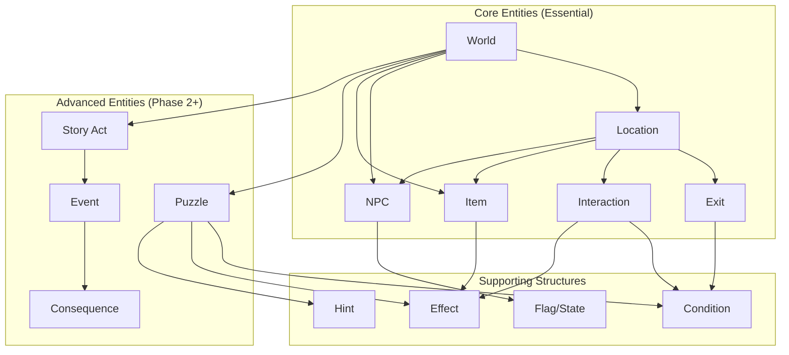
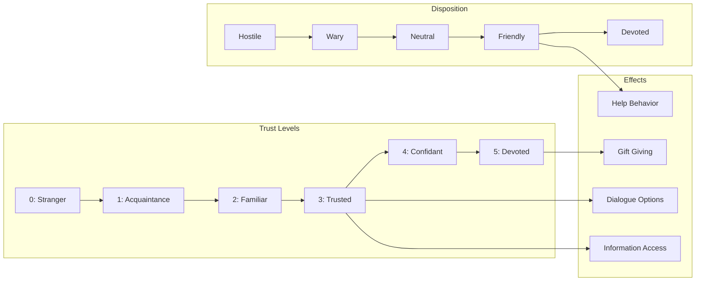
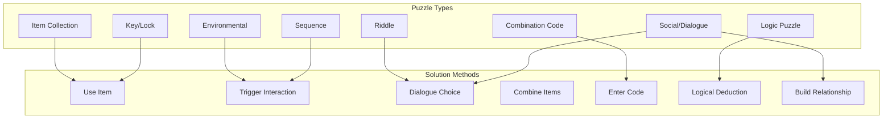
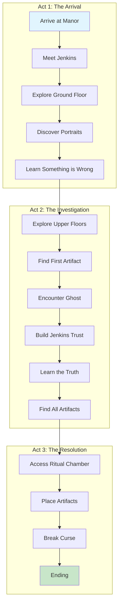
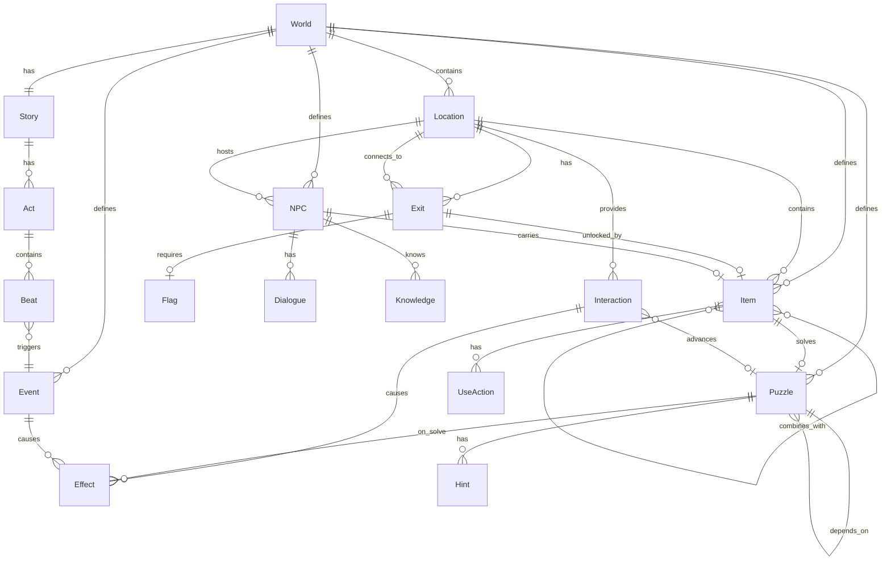
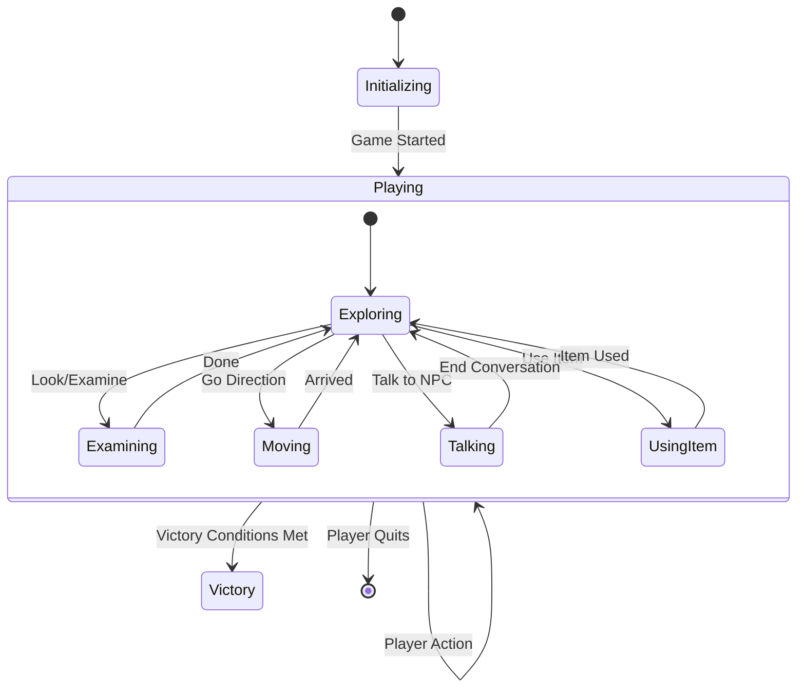
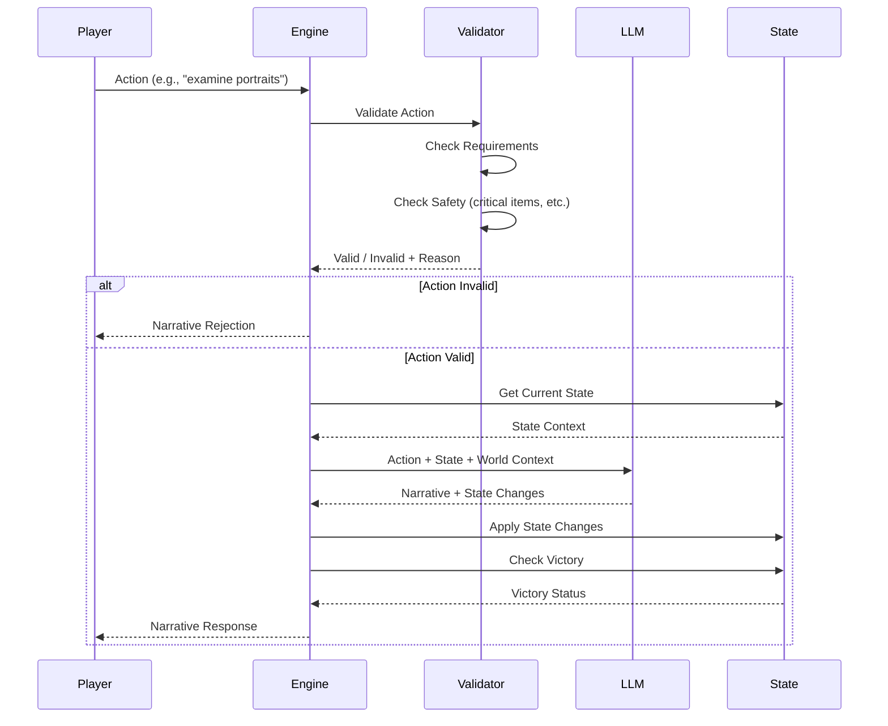
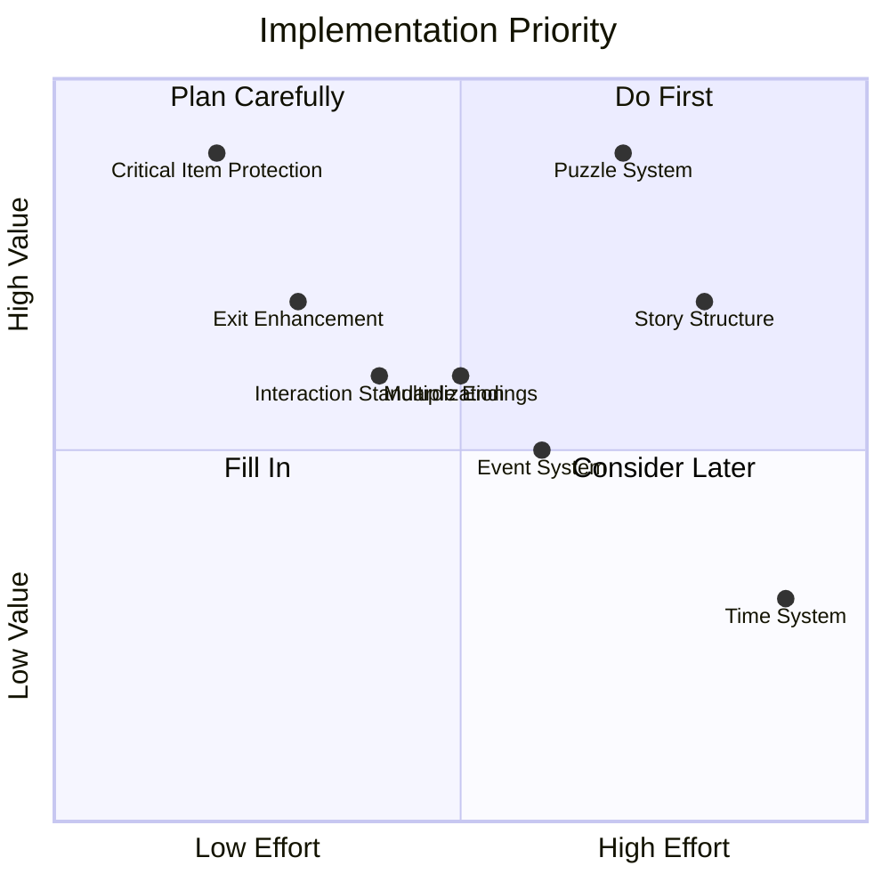

# GAIME Game Mechanics Design Document

A comprehensive design document for GAIME's entity system, game mechanics, and gameplay architecture. This document guides the evolution from prototype to production-ready game engine.

> **Status**: Design Document - December 2025  
> **Related**: [Vision Document](../docs/VISION.md) | [World Authoring Guide](../docs/WORLD_AUTHORING.md) | [Architecture](../docs/ARCHITECTURE.md)

---

## Table of Contents

1. [Introduction](#introduction)
2. [Design Principles](#design-principles)
3. [Entity Taxonomy](#entity-taxonomy)
4. [Core Entity Types](#core-entity-types)
   - [Locations](#locations)
   - [Items](#items)
   - [NPCs](#npcs)
   - [Exits & Connections](#exits--connections)
   - [Interactions](#interactions)
5. [Advanced Entity Types](#advanced-entity-types)
   - [Puzzles](#puzzles)
   - [Story Structures](#story-structures)
   - [Events](#events)
6. [Entity Relationships](#entity-relationships)
7. [State Management](#state-management)
8. [Gameplay Mechanics](#gameplay-mechanics)
9. [Implementation Phases](#implementation-phases)
10. [Schema Specifications](#schema-specifications)

---

## Introduction

### Purpose

This document establishes a formal game mechanics framework for GAIME, defining:

- **Entity Types**: The fundamental building blocks of a GAIME world
- **Entity Properties**: What attributes each entity type possesses
- **Entity Relationships**: How entities reference and interact with each other
- **Gameplay Mechanics**: How entities participate in gameplay during runtime
- **Implementation Priority**: Which features are essential vs. future enhancements

### Current State vs. Target State

**Current State (Prototype)**:
- Four YAML files define worlds: `world.yaml`, `locations.yaml`, `npcs.yaml`, `items.yaml`
- Entity relationships are implicit (string references between files)
- Mechanics like "unlocks" and "requires" exist but aren't consistently modeled
- No explicit puzzle definitions - puzzles emerge from interactions
- LLM has significant freedom in interpreting player actions

**Target State (Production)**:
- Explicit entity schema with clear relationships
- First-class puzzle system with validation
- Story structure modeling for guided narrative
- Consistent mechanics that the LLM and engine understand uniformly
- Extensible system that supports future entity types

### Alignment with Vision

Per the [Vision document](../docs/VISION.md), this design prioritizes:

| Vision Principle | Design Implication |
|-----------------|-------------------|
| "Short story you played through" | Focused entity model - no bloat |
| "No unwinnable states" | Entity validation, critical item protection |
| "Fair puzzles" | Explicit puzzle modeling with hints |
| "Guided freedom" | Story structure constraints |
| "No RPG complexity" | No stats, XP, leveling in entity model |
| "Curated worlds" | Strong authoring tools, not procedural generation |

---

## Design Principles

### 1. Explicit Over Implicit

Relationships between entities should be explicitly declared, not inferred. This enables:
- Validation at world load time
- Clear understanding by both humans and LLMs
- Tooling support (dependency graphs, error detection)

### 2. Narrative First, Mechanics Second

Entities exist to serve the story experience. Mechanical properties should always have narrative justification:
- ❌ `locked: true` (mechanical only)
- ✅ `locked: true` + `locked_description: "A heavy padlock secures the door"` (narrative + mechanical)

### 3. Graceful Degradation

Advanced features should be optional. A minimal world with just locations and basic items should work without puzzles, story structure, or events.

### 4. LLM as Partner, Not Oracle

The entity system should:
- Provide clear facts the LLM can rely on
- Constrain what the LLM can invent (within world boundaries)
- Enable the LLM to add narrative richness without breaking mechanics

### 5. Authoring Ergonomics

World authors should:
- See clear cause-and-effect in their definitions
- Get helpful validation errors
- Have templates and examples for common patterns

---

## Entity Taxonomy

The following diagram shows the complete entity hierarchy for GAIME:



### Entity Categories

| Category | Entities | Purpose |
|----------|----------|---------|
| **World Container** | World | Top-level container for all entities |
| **Spatial** | Location, Exit | Define the navigable space |
| **Objects** | Item, NPC | Things the player can interact with |
| **Behavioral** | Interaction, Puzzle, Event | Define what happens when conditions are met |
| **Narrative** | StoryAct, Consequence | Define story progression and outcomes |
| **Mechanical** | Flag, Condition, Effect, Hint | Supporting structures for game logic |

---

## Core Entity Types

### Locations

Locations are the spatial containers where gameplay occurs. They are the "rooms" of a classic adventure game.

#### Current Schema (Prototype)

```yaml
entrance_hall:
  name: "Entrance Hall"
  atmosphere: "Grand but decayed..."
  exits: {north: library, east: dining_room}
  items: [old_letter, candlestick]
  npcs: [butler_jenkins]
  details: {portraits: "Five family portraits...", chandelier: "..."}
  interactions: {...}
  requires: {flag: some_flag, item: some_item}
  item_placements: {old_letter: "lies on the table"}
  npc_placements: {butler_jenkins: "stands by the clock"}
```

#### Proposed Schema (Enhanced)

```yaml
entrance_hall:
  # Identity
  id: entrance_hall  # Explicit ID (auto-generated from key if omitted)
  name: "Entrance Hall"
  
  # Narrative Content
  atmosphere: |
    Grand but decayed. The chandelier hangs dark and dusty.
  first_visit_flavor: |
    You've never seen such faded elegance. Once, this must have been magnificent.
  revisit_flavor: |
    The hall feels no less oppressive on your return.
  
  # Spatial Properties
  region: ground_floor  # Optional grouping
  is_interior: true
  is_safe: true  # No danger here
  
  # Contents (references to other entities)
  exits:
    north:
      destination: library
      description: "An archway leads north into darkness"
      visible: true
      passable: true
    east:
      destination: dining_room
      description: "Double doors stand ajar to the east"
      visible: true
      passable: true
      
  items: [old_letter, candlestick]
  item_placements:
    old_letter: "lies crumpled on the dusty side table"
    candlestick: "sits on the console table beneath the portraits"
    
  npcs: [butler_jenkins]
  npc_placements:
    butler_jenkins: "stands rigidly by the grandfather clock"
  
  # Interactions (inline or reference)
  interactions:
    examine_portraits:
      triggers: ["examine portraits", "look at portraits"]
      narrative: "You notice one portrait has been slashed across the face"
      effects:
        - set_flag: examined_portraits
        - discover: feature:slashed_portrait
  
  # Details (examinable but not full interactions)
  details:
    portraits: "Five family portraits - a stern father, beautiful mother, three children"
    chandelier: "Once magnificent, now dark and cobwebbed"
    floor: "Black and white marble tiles, cracked and worn"
  
  # Access Requirements
  requires:
    all:  # All conditions must be met
      - flag: has_key
      - item: lantern
    any:  # OR: any of these conditions
      - flag: knows_secret
      - item: map
  
  # Location State (can change during gameplay)
  states:
    default:
      atmosphere_modifier: ""
    after_fire:
      atmosphere_modifier: "Smoke hangs in the air. Soot covers everything."
      exits:
        north: {passable: false, blocked_reason: "Flames block the way"}
```

#### Location Properties Summary

| Property | Type | Required | Purpose |
|----------|------|----------|---------|
| `id` | string | Auto | Unique identifier |
| `name` | string | Yes | Display name |
| `atmosphere` | string | Yes | Base description for AI |
| `first_visit_flavor` | string | No | Extra text on first visit |
| `revisit_flavor` | string | No | Extra text on return visits |
| `region` | string | No | Logical grouping (floor, area) |
| `is_interior` | bool | No | Indoor vs outdoor |
| `is_safe` | bool | No | Can danger occur here |
| `exits` | map | Yes | Connections to other locations |
| `items` | list | No | Items present |
| `item_placements` | map | No | Where items appear visually |
| `npcs` | list | No | NPCs present |
| `npc_placements` | map | No | Where NPCs appear visually |
| `interactions` | map | No | Special interactions available |
| `details` | map | No | Examinable features |
| `requires` | object | No | Access requirements |
| `states` | map | No | Alternative configurations |

---

### Items

Items are objects the player can examine, take, use, and combine. They range from simple props to puzzle-critical artifacts.

#### Current Schema (Prototype)

```yaml
iron_key:
  name: "Heavy Iron Key"
  portable: true
  examine: "A large iron key with an ouroboros head..."
  found_description: "Hidden in the wardrobe, you find a heavy iron key"
  take_description: "You take the iron key. It seems to pulse with cold"
  unlocks: basement
  location: master_bedroom
  hidden: true
  find_condition: {requires_flag: searched_wardrobe}
  properties: {artifact: true}
  use_actions:
    wear: {description: "...", sets_flag: wearing_amulet}
  clues: [{hint_for: ritual, reveals: "One of three artifacts"}]
```

#### Proposed Schema (Enhanced)

```yaml
iron_key:
  # Identity
  id: iron_key
  name: "Heavy Iron Key"
  short_name: "iron key"  # For command parsing
  aliases: ["key", "serpent key", "ouroboros key"]
  
  # Physical Properties
  portable: true
  weight: heavy  # light, medium, heavy, immovable
  size: small    # tiny, small, medium, large, huge
  
  # Narrative Content
  examine: |
    A large iron key, cold and heavy in your hand. The head is shaped 
    like a serpent eating its own tail - an ouroboros. Ancient symbols 
    are etched along the shaft.
  examine_detailed: |  # Only shown with careful examination
    Upon closer inspection, you notice faint Latin inscriptions...
  found_description: "A glint of iron catches your eye from within the wardrobe"
  take_description: "You take the iron key. It pulses with unnatural cold"
  
  # Placement
  initial_location: master_bedroom
  initial_container: wardrobe  # Inside another object
  hidden: true
  
  # Discovery Requirements
  discovery:
    requires:
      - flag: opened_wardrobe
    reveals_on_discovery:
      - set_flag: found_iron_key
  
  # Item Categories & Flags
  categories:
    - key
    - artifact
    - quest_item
  critical: true  # Cannot be destroyed or lost
  
  # Mechanical Properties
  unlocks:
    - target: basement_door
      type: exit
      consumed: false  # Key isn't used up
      narrative: "The lock clicks open with a satisfying sound"
    - target: chest_in_basement
      type: container
      consumed: false
  
  # Use Actions
  use_actions:
    examine_symbols:
      triggers: ["examine symbols", "read inscriptions", "study key"]
      requires: {item: reading_glasses}
      narrative: "Through the spectacles, the symbols resolve into words..."
      effects:
        - set_flag: translated_key_symbols
        - discover: feature:key_prophecy
    
    show_to_jenkins:
      triggers: ["show key to jenkins", "ask jenkins about key"]
      requires: {npc_present: butler_jenkins}
      narrative: "Jenkins's face goes pale. 'Where did you find that?'"
      effects:
        - npc_trust: {butler_jenkins: +1}
        - unlock_dialogue: jenkins_key_dialogue
  
  # Combination with other items
  combinations:
    - with_item: ritual_cloth
      produces: wrapped_key
      narrative: "You carefully wrap the key in the blessed cloth"
      consumes: [ritual_cloth]
  
  # Puzzle & Story Connections
  clues:
    - hint_for: basement_puzzle
      reveals: "This key was made for an important lock"
    - hint_for: ritual_mystery
      reveals: "The ouroboros symbol connects to the family curse"
  
  # State Changes
  states:
    default: {}
    blessed:
      examine: "The key now glows with a faint golden light..."
      unlocks:
        - target: cursed_door
          type: exit
```

#### Item Categories

Items can belong to multiple categories that affect gameplay:

| Category | Behavior | Examples |
|----------|----------|----------|
| `key` | Can unlock things | iron_key, silver_key |
| `light_source` | Illuminates dark areas | lantern, candle, torch |
| `weapon` | Can be used in confrontations | knife, candlestick |
| `container` | Can hold other items | bag, box, pocket |
| `readable` | Has text content | letter, book, note |
| `wearable` | Can be worn | amulet, ring, cloak |
| `consumable` | Used up when used | potion, food, match |
| `artifact` | Special story significance | quest items |
| `quest_item` | Required for completion | critical path items |
| `evidence` | Proves something | clue items |
| `currency` | Can be traded | coins, gems |
| `tool` | Enables specific actions | lockpick, rope |

---

### NPCs

Non-Player Characters are entities that can interact with the player through dialogue and behavior.

#### Current Schema (Prototype)

```yaml
butler_jenkins:
  name: "Jenkins"
  role: "The elderly butler"
  location: dining_room
  locations: [dining_room, kitchen]  # For roaming NPCs
  appearance: "Gaunt and pale, impeccably dressed..."
  personality:
    traits: [formal, secretive, guilt-ridden]
    speech_style: "Victorian formal English..."
    quirks: ["Glances nervously at shadows"]
  knowledge: ["Knows about the curse", "Knows artifact locations"]
  dialogue_rules: ["Never directly answers about the curse"]
  trust: {initial: 0, threshold: 3, build_actions: [...]}
  appears_when: [{condition: has_flag, value: met_ghost}]
  location_changes:
    - when_flag: alarm_triggered
      move_to: entrance_hall
  behavior: "Offers tea, deflects questions..."
```

#### Proposed Schema (Enhanced)

```yaml
butler_jenkins:
  # Identity
  id: butler_jenkins
  name: "Jenkins"
  full_name: "Albert Jenkins"
  aliases: ["the butler", "old man", "servant"]
  role: "The elderly butler, last remaining servant"
  
  # Physical Description
  appearance:
    summary: "A gaunt, elderly man in formal butler's attire"
    details: |
      Perhaps seventy years old, impeccably dressed in formal wear
      that has seen better days. His face is gaunt and pale, with
      dark circles under watchful, haunted eyes. His hands tremble
      slightly when he thinks no one is looking.
    distinguishing_features:
      - "Silver pocket watch on a chain"
      - "Faded family crest on his lapel"
  
  # Personality
  personality:
    archetype: loyal_servant  # Optional shorthand
    traits:
      - formal
      - secretive  
      - guilt-ridden
      - protective
      - loyal_to_a_fault
    
    speech_style:
      formality: very_formal
      vocabulary: victorian_english
      patterns:
        - "Uses indirect language and deflection"
        - "Offers tea to change subjects"
        - "Refers to 'the master' and 'the mistress'"
      examples:
        - "If sir would permit me to observe..."
        - "Perhaps sir would care for some tea?"
        - "I'm afraid I couldn't possibly say, sir"
    
    quirks:
      - trigger: idle
        behavior: "Straightens things that don't need straightening"
      - trigger: nervous
        behavior: "Glances toward the basement door"
      - trigger: children_mentioned
        behavior: "Becomes distant, changes subject"
    
    emotional_baseline:
      anxiety: high
      guilt: high
      hope: low
  
  # Location & Movement
  location:
    default: dining_room
    schedule:  # Time-based movement (future feature)
      morning: kitchen
      afternoon: dining_room
      evening: entrance_hall
    roaming:
      locations: [dining_room, kitchen, entrance_hall]
      frequency: rare  # How often they move
    
    changes:  # Flag-triggered movement
      - when: {flag: alarm_triggered}
        move_to: entrance_hall
        behavior_change: "Rushes about in a panic"
      - when: {flag: curse_broken}
        move_to: null  # Leaves the game (peacefully)
        departure_narrative: "Jenkins weeps with relief and thanks you"
  
  # Knowledge System
  knowledge:
    # Facts the NPC knows (available to LLM)
    facts:
      - id: curse_origin
        content: "The curse began when Edmund performed the ritual"
        reveals_when: {trust: 3}
      - id: artifact_locations
        content: "The amulet is in the nursery, dagger in basement, grimoire in ritual chamber"
        reveals_when: {trust: 4}
      - id: children_fate
        content: "The three children died in the ritual as sacrifices"
        reveals_when: {trust: 5}
    
    # What NPC will NOT reveal (constraints for LLM)
    secrets:
      - "Will not reveal artifact locations until trust is maxed"
      - "Will never admit his role in the tragedy directly"
    
    # What NPC believes (may be false)
    beliefs:
      - "Believes he could have stopped the ritual"
      - "Believes the spirits will never forgive him"
  
  # Relationship System
  relationship:
    trust:
      initial: 0
      current: 0  # Runtime value
      max: 5
      thresholds:
        1: "Willing to speak"
        3: "Shares some history"
        5: "Reveals everything"
    
    disposition:
      initial: wary
      toward_player: neutral  # Runtime value
    
    build_actions:
      - action: "Show kindness or sympathy"
        trust_change: +1
        disposition_change: warmer
      - action: "Mention helping the spirits"
        trust_change: +1
      - action: "Accuse or threaten"
        trust_change: -2
        disposition_change: hostile
  
  # Appearance Conditions
  appears_when:
    conditions:
      - {type: always}  # No conditions, always available
    # OR with conditions:
    # - {type: flag, value: met_in_entrance}
    # - {type: time, value: after_midnight}
  
  # Dialogue System
  dialogue:
    greeting:
      first_meeting: "Good evening, sir. I am Jenkins, the butler. May I be of service?"
      subsequent: "Ah, sir has returned. Is there something sir requires?"
      hostile: "Sir. What do you want now?"
    
    topics:
      family:
        available_when: {trust: 1}
        opener: "The Thornwoods were a fine family, sir. Fine family."
        branches:
          - about_children: "The children? I... I couldn't say, sir."
          - about_master: "The master was... ambitious. Perhaps too ambitious."
      
      curse:
        available_when: {trust: 3}
        opener: "Sir wishes to know about... that. Very well."
        sets_flag: jenkins_spoke_of_curse
    
    reactions:
      to_item:
        iron_key: "Sir! Where did you find that? Put it away, quickly!"
        amulet: "The young mistress's amulet... she would want you to have it."
      to_event:
        ghost_seen: "You've seen her, haven't you? The little one?"
  
  # Inventory (items NPC has)
  inventory:
    - silver_pocket_watch
  gives:
    - item: old_photograph
      when: {trust: 2}
      narrative: "Perhaps sir should see this. It was taken before..."
  
  # Behavior Patterns
  behavior:
    idle: "Stands quietly, occasionally adjusting his cuffs"
    nervous: "Paces, glances at doors, wrings his hands"
    helpful: "Attentively follows the player, offering assistance"
    
    reactions:
      player_injured: "Sir! Are you quite all right? Let me help you."
      item_taken: "If sir needs that, sir should take it."
      
  # NPC States
  states:
    default: {}
    after_curse_discussion:
      emotional_baseline: {hope: medium}
      behavior:
        idle: "Seems lighter, more at ease"
```

#### NPC Relationship Model



---

### Exits & Connections

Exits connect locations and can have their own properties, requirements, and states.

#### Current Schema (Prototype)

```yaml
# In locations.yaml
exits:
  north: library
  east: dining_room
  
requires:
  flag: found_secret_passage  # For entire location
```

#### Proposed Schema (Enhanced)

Exits become first-class entities with rich properties:

```yaml
# In locations.yaml (inline definition)
entrance_hall:
  exits:
    north:
      destination: library
      type: archway
      description: "An ornate archway leads north into shadows"
      description_from_other_side: "The entrance hall lies to the south"
      
      # Visibility
      visible: true
      visibility_condition: null  # Always visible
      hidden_description: null
      
      # Accessibility  
      passable: true
      passable_condition: null  # Always passable
      blocked_reason: null
      
      # Lock mechanics
      locked: false
      lock:
        type: key
        requires: iron_key
        consumed: false
        unlock_narrative: "The lock clicks open"
        locked_narrative: "The door is firmly locked"
      
      # State changes
      states:
        default: {}
        after_explosion:
          passable: false
          blocked_reason: "Rubble blocks the passage"
          description: "The archway is collapsed, filled with debris"

# OR in separate exits.yaml for complex worlds
# exits.yaml
entrance_to_library:
  id: entrance_to_library
  from: entrance_hall
  to: library
  direction: north
  reverse_direction: south  # Auto-creates return path
  bidirectional: true
  # ... all properties above
```

#### Exit Types

| Type | Description | Example |
|------|-------------|---------|
| `open` | Always passable | Archway, corridor |
| `door` | Can be opened/closed | Regular door |
| `locked_door` | Requires key/action | Locked room |
| `hidden` | Not visible until discovered | Secret passage |
| `conditional` | Requires condition | Magical barrier |
| `one_way` | Can't return | Trap door, slide |
| `blocked` | Temporarily impassable | Cave-in, fire |

---

### Interactions

Interactions define what happens when the player performs specific actions in a location or with an item.

#### Current Schema (Prototype)

```yaml
# In locations.yaml
interactions:
  examine_portraits:
    triggers: ["examine portraits", "look at portraits"]
    narrative_hint: "One portrait has been slashed"
    sets_flag: examined_portraits
    reveals_exit: secret_passage
    gives_item: old_note
```

#### Proposed Schema (Enhanced)

```yaml
# Can be inline or in separate interactions.yaml
examine_portraits:
  # Identity
  id: examine_portraits
  name: "Examine the Family Portraits"
  
  # Trigger Patterns
  triggers:
    primary: ["examine portraits", "look at portraits", "study paintings"]
    secondary: ["who are these people", "look at pictures"]  # Fuzzy matches
    
  # Context Requirements
  context:
    location: entrance_hall  # Only works here
    # OR: locations: [entrance_hall, library]  # Multiple locations
    requires:
      any:
        - item: candle_lit  # Need light
        - flag: has_light
    not:  # Cannot trigger if...
      - flag: portraits_destroyed
  
  # Narrative Output
  narrative:
    default: |
      Upon closer inspection, you notice one portrait—the youngest child—
      has been violently slashed across the face. The cuts look old,
      made in fury long ago.
    with_reading_glasses: |
      Through the spectacles, you notice something else: faint writing
      on the frame of the slashed portrait. "Forgive me, Emily."
    already_examined: |
      You've already studied the portraits. The slashed face of the
      child still disturbs you.
  
  # Effects
  effects:
    - type: set_flag
      flag: examined_portraits
      value: true
    - type: discover
      entity: feature:slashed_portrait
    - type: reveal_exit
      exit: secret_passage  # Makes hidden exit visible
      condition: {flag: found_switch}  # Only if this flag is set
    - type: give_item
      item: portrait_fragment
      narrative: "A piece of the slashed canvas falls loose"
    - type: npc_reaction
      npc: butler_jenkins
      reaction: |
        Jenkins flinches visibly. "Sir shouldn't... shouldn't look
        too closely at those."
  
  # Repeatability
  repeatable: false  # Only triggers once with full narrative
  repeat_narrative: "You've already examined the portraits closely"
  
  # Puzzle Connection
  puzzle_connection:
    puzzle_id: family_mystery
    progress: minor  # How much this advances the puzzle
    
  # Audio/Visual Triggers (future)
  media:
    sound: eerie_whisper
    image_change: portraits_closeup
```

#### Interaction Effect Types

| Effect Type | Parameters | Description |
|-------------|------------|-------------|
| `set_flag` | flag, value | Set a game flag |
| `clear_flag` | flag | Remove a flag |
| `discover` | entity | Mark entity as discovered |
| `give_item` | item, narrative | Add item to inventory |
| `remove_item` | item | Remove from inventory |
| `reveal_exit` | exit | Make hidden exit visible |
| `unlock_exit` | exit | Unlock a locked exit |
| `block_exit` | exit, reason | Block an exit |
| `move_npc` | npc, location | Move NPC somewhere |
| `npc_reaction` | npc, reaction | Trigger NPC response |
| `change_location_state` | location, state | Switch location state |
| `trigger_event` | event | Trigger a story event |
| `advance_puzzle` | puzzle, progress | Progress a puzzle |
| `play_sound` | sound_id | Play audio |
| `show_image` | image_id | Display image |

---

## Advanced Entity Types

### Puzzles

Puzzles are first-class entities that model challenges the player must solve. They have explicit solutions, conditions, and hint systems.

#### Proposed Schema

```yaml
# puzzles.yaml
basement_access:
  # Identity
  id: basement_access
  name: "Access the Basement"
  type: key_lock  # key_lock, sequence, combination, riddle, social, environmental
  
  # Description
  description: |
    The basement door is secured with a heavy iron lock.
    You'll need to find a way to open it.
  
  # Solution Definition
  solution:
    type: item_use
    requirements:
      - item: iron_key
        action: use_on
        target: basement_door
    
    # Alternative solutions (if any)
    alternatives:
      - type: interaction
        interaction: pick_basement_lock
        requires: {item: lockpicks, flag: knows_lockpicking}
  
  # Prerequisites
  prerequisites:
    - puzzle: find_iron_key  # Must solve this first
    - flag: knows_basement_exists
  
  # State
  states:
    undiscovered: "Player hasn't found the basement"
    discovered: "Player knows about the basement"
    in_progress: "Player is trying to access"
    solved: "Basement is accessible"
    
  initial_state: undiscovered
  
  # Hints (escalating)
  hints:
    subtle:
      - "Jenkins seems to avoid the kitchen area"
      - "There's a draft coming from somewhere below"
    moderate:
      - "A heavy door in the kitchen leads downward"
      - "The lock looks old but sturdy. A matching key must exist"
    direct:
      - "Search the master bedroom thoroughly"
      - "Check inside the wardrobe"
  
  # Narrative
  narrative:
    on_discover: "You notice a heavy door with an iron lock"
    on_attempt_without_key: "The lock holds fast. You need the right key"
    on_solve: "The ancient lock yields with a satisfying click"
  
  # Effects on Solve
  on_solve:
    - set_flag: basement_unlocked
    - unlock_exit: {from: kitchen, direction: down}
    - discover: location:basement
    - trigger_event: basement_revealed
  
  # Validation
  validation:
    is_solvable: true  # Validator confirms solution is achievable
    required_for_victory: true
    
  # Puzzle Dependencies
  unlocks:
    - puzzle: find_ritual_dagger
  depends_on:
    - puzzle: find_iron_key

# Combination Puzzle Example
ritual_chamber_lock:
  id: ritual_chamber_lock
  name: "The Three Artifact Ritual"
  type: collection
  
  description: |
    Three pedestals wait in the ritual chamber.
    Place all three artifacts to break the curse.
  
  solution:
    type: collection
    required_items:
      - thornwood_amulet
      - ancient_dagger  
      - grimoire
    location: ritual_chamber
    action: "place on pedestals"
  
  # Partial progress tracking
  progress:
    trackable: true
    stages:
      - items: 1
        narrative: "One pedestal glows faintly"
      - items: 2
        narrative: "Two pedestals now glow. The air hums with energy"
      - items: 3
        narrative: "The ritual circle blazes with light!"
  
  on_solve:
    - set_flag: has_all_artifacts
    - trigger_event: curse_broken
    - trigger_victory: true

# Social Puzzle Example
gain_jenkins_trust:
  id: gain_jenkins_trust
  name: "Earn Jenkins's Trust"
  type: social
  
  description: |
    The old butler knows more than he's saying.
    Perhaps if he trusted you more, he'd reveal the truth.
  
  solution:
    type: relationship_threshold
    npc: butler_jenkins
    trust_required: 3
  
  hints:
    subtle:
      - "Jenkins seems burdened by guilt"
      - "He responds well to kindness"
    moderate:
      - "Speak of wanting to help the spirits"
      - "Show him you understand the tragedy"
  
  # Ways to build trust (reference to NPC's build_actions)
  progress_actions:
    - action: "express_sympathy"
      trust_gain: 1
    - action: "mention_helping_spirits"
      trust_gain: 1
    - action: "find_evidence"
      trust_gain: 1
```

#### Puzzle Type Definitions



---

### Story Structures

Story structures model the narrative progression of a world, ensuring guided freedom while maintaining story integrity.

#### Proposed Schema

```yaml
# story.yaml
story:
  # Story Metadata
  title: "The Thornwood Curse"
  structure: three_act  # three_act, five_act, linear, hub_spoke
  
  # Story Acts/Chapters
  acts:
    act_1:
      name: "The Arrival"
      description: "Player arrives and discovers something is wrong"
      
      # Entry condition
      begins_when: game_start
      
      # Goals for this act
      goals:
        - Explore the entrance hall
        - Meet Jenkins
        - Learn about the family
      
      # Required beats (player must experience these)
      required_beats:
        - beat_id: meet_jenkins
          description: "Encounter Jenkins for the first time"
          triggers: {npc_interaction: butler_jenkins}
        - beat_id: discover_portraits
          description: "Notice the slashed portrait"
          triggers: {flag: examined_portraits}
      
      # Optional beats (enhance experience)
      optional_beats:
        - beat_id: play_piano
          description: "Discover the haunted piano"
          triggers: {flag: played_piano}
      
      # End condition
      ends_when:
        all:
          - flag: met_jenkins
          - flag: examined_portraits
          - locations_discovered: 3
    
    act_2:
      name: "The Investigation"
      description: "Player investigates the mystery and gathers artifacts"
      
      begins_when: act_1_complete
      
      goals:
        - Find all three artifacts
        - Learn the truth about the ritual
        - Build trust with Jenkins
        - Encounter the ghosts
      
      required_beats:
        - beat_id: find_amulet
          triggers: {item_acquired: thornwood_amulet}
        - beat_id: find_dagger
          triggers: {item_acquired: ancient_dagger}
        - beat_id: find_grimoire
          triggers: {item_acquired: grimoire}
        - beat_id: learn_truth
          triggers: {flag: knows_curse_truth}
      
      ends_when:
        all:
          - item: thornwood_amulet
          - item: ancient_dagger
          - item: grimoire
    
    act_3:
      name: "The Resolution"
      description: "Player breaks the curse and resolves the story"
      
      begins_when: act_2_complete
      
      goals:
        - Enter the ritual chamber
        - Place the artifacts
        - Break the curse
      
      required_beats:
        - beat_id: enter_chamber
          triggers: {location: ritual_chamber}
        - beat_id: break_curse
          triggers: {flag: has_all_artifacts}
      
      ends_when:
        any:
          - flag: curse_broken  # Good ending
          - flag: ritual_corrupted  # Bad ending (future feature)
  
  # Victory Conditions (can have multiple endings)
  endings:
    good_ending:
      name: "Freed"
      condition:
        all:
          - flag: curse_broken
          - flag: jenkins_forgiven  # Optional for best ending
      narrative: |
        The curse is broken. The spirits are free. Dawn breaks over the manor.
      
    neutral_ending:
      name: "Escaped"
      condition:
        all:
          - flag: curse_broken
        not:
          - flag: jenkins_forgiven
      narrative: |
        The curse is broken, but you leave with questions unanswered.
  
  # Story Constraints (for LLM)
  constraints:
    - "Do not reveal the curse solution before Act 2"
    - "Jenkins only fully reveals truth at Trust level 5"
    - "Ghosts become more visible as artifacts are collected"
```

#### Story Beat Flow



---

### Events

Events are triggered occurrences that affect the world state, narrative, or player experience.

#### Proposed Schema

```yaml
# events.yaml
ghost_first_appearance:
  id: ghost_first_appearance
  name: "First Ghost Sighting"
  type: narrative  # narrative, world_change, npc_action, ambient
  
  # Trigger Conditions
  triggers:
    when:
      all:
        - flag: examined_nursery
        - location: upper_landing
        - not_flag: seen_ghost
    
    # Probability (for ambient events)
    chance: 1.0  # Always triggers when conditions met
    
    # Timing
    delay: 0  # Turns after condition met
    
  # Event Content
  narrative: |
    A flicker of movement catches your eye. At the end of the hallway,
    a translucent figure of a young girl stands watching you. Her form
    wavers like candlelight. She raises one hand, pointing toward the
    nursery, then fades into nothing.
  
  # Effects
  effects:
    - set_flag: seen_ghost
    - set_flag: met_ghost_child
    - discover: npc:ghost_child
    - npc_appears: ghost_child
  
  # Interrupt behavior
  interrupt: true  # Pauses normal action processing
  
  # Repeatability
  once_only: true

# World Change Event
fire_breaks_out:
  id: fire_breaks_out
  type: world_change
  
  triggers:
    when:
      flag: knocked_over_candle
  
  narrative: |
    The fallen candle catches the dusty curtains. Within moments,
    flames lick up the wall. You must act quickly!
  
  effects:
    - location_state_change:
        location: sitting_room
        new_state: on_fire
    - exit_blocked:
        from: sitting_room
        direction: east
        reason: "Flames block the way"
    - time_limit_start:
        turns: 5
        on_expire: fire_spreads
  
  # Urgency
  urgent: true
  urgent_hint: "The fire is spreading! You should leave or find a way to extinguish it."

# Ambient Event (random atmosphere)
distant_piano:
  id: distant_piano
  type: ambient
  
  triggers:
    when:
      location_region: ground_floor
      not_location: sitting_room
      not_flag: piano_played
    chance: 0.15  # 15% chance each turn
  
  narrative: |
    A faint melody drifts through the manor—someone playing piano.
    The tune is sad, childlike. It seems to come from the west.
  
  effects:
    - discover: feature:phantom_piano
  
  once_only: false  # Can repeat
  cooldown: 5  # Turns between occurrences
```

---

## Entity Relationships

### Relationship Diagram



### Reference Types

| Reference Type | From | To | Example |
|---------------|------|-----|---------|
| **Spatial** | Exit | Location | `destination: library` |
| **Contains** | Location | Item | `items: [key, book]` |
| **Unlocks** | Item | Exit | `unlocks: basement_door` |
| **Requires** | Exit | Flag | `requires: {flag: has_key}` |
| **Requires** | Exit | Item | `requires: {item: lantern}` |
| **Hosts** | Location | NPC | `npcs: [jenkins]` |
| **Knows** | NPC | Fact | `knowledge: [...]` |
| **Triggers** | Interaction | Effect | `effects: [set_flag: ...]` |
| **Solves** | Item/Action | Puzzle | `puzzle_connection: {puzzle: ...}` |
| **Depends** | Puzzle | Puzzle | `depends_on: [other_puzzle]` |
| **Advances** | Beat | Story | `ends_when: {flag: ...}` |

---

## State Management

### Game State Model



### State Categories

```yaml
# Runtime Game State Structure
game_state:
  # Session Info
  session:
    id: "uuid"
    player_name: "Traveler"
    created_at: "timestamp"
    turn_count: 42
    status: playing  # playing, won, lost
  
  # Spatial State
  spatial:
    current_location: entrance_hall
    discovered_locations: [entrance_hall, library, dining_room]
    visited_locations:
      entrance_hall: {visits: 3, last_visit: 40}
      library: {visits: 1, last_visit: 12}
  
  # Inventory State
  inventory:
    items: [pocket_watch, iron_key, old_letter]
    item_states:
      iron_key: {state: default}
      candlestick: {state: lit}
  
  # Flag State (world-defined triggers)
  flags:
    examined_portraits: true
    found_secret_passage: true
    jenkins_trust_3: false
  
  # NPC State
  npcs:
    butler_jenkins:
      trust: 2
      disposition: friendly
      current_location: dining_room
      dialogue_state: talked_about_family
    ghost_child:
      visible: true
      current_location: nursery
  
  # Puzzle State
  puzzles:
    basement_access:
      state: solved
      solved_at: 15
    ritual_chamber_lock:
      state: in_progress
      progress: {items_placed: 2}
  
  # Story State
  story:
    current_act: act_2
    completed_beats: [meet_jenkins, discover_portraits, find_amulet]
    
  # Location State
  locations:
    sitting_room: {state: default}
    ritual_chamber: {state: pedestals_glowing}
  
  # Exit State
  exits:
    kitchen_to_basement: {locked: false}
    library_to_secret: {visible: true}
  
  # Narrative Memory (for LLM)
  narrative_memory:
    recent_exchanges: [...]
    npc_memory: {...}
    discoveries: [...]
```

---

## Gameplay Mechanics

### Core Action Loop



### Action Types

| Action Type | Examples | Processing |
|-------------|----------|------------|
| **Navigation** | go north, enter library | Exit validation, requirement check |
| **Examination** | look, examine portraits | Detail lookup, interaction check |
| **Interaction** | pull lever, open door | Interaction matching, effect application |
| **Item** | take key, use key on door | Inventory management, use action matching |
| **NPC** | talk to jenkins, ask about curse | Dialogue system, knowledge check |
| **Meta** | inventory, help | State query, no LLM needed |

### Safety Mechanics

Per Vision: "No unwinnable states, no player death"

```yaml
# Safety Rules (enforced by engine)
safety:
  critical_items:
    - Cannot be dropped
    - Cannot be destroyed
    - Cannot be given away
    - Narrative deflection for attempts
  
  death_prevention:
    - Lethal actions deflected narratively
    - Dangerous situations have escape routes
    - "Near misses" instead of death
  
  unwinnable_prevention:
    - Victory path always reachable
    - Key items can't be lost
    - NPCs can't become permanently hostile
    - Puzzles can't become unsolvable
  
  narrative_deflection_examples:
    destroy_quest_item: "Something stays your hand. This feels too important to destroy."
    enter_deadly_area: "Your instincts scream danger. Perhaps there's another way."
    kill_key_npc: "Despite your anger, you realize you need them alive."
```

---

## Implementation Phases

### Phase 1: Essential (Current → Near Term)

**Entities to Enhance:**
- ✅ Locations (mostly complete)
- ✅ Items (mostly complete)
- ✅ NPCs (mostly complete)
- 🔄 Exits (make first-class)
- 🔄 Interactions (standardize schema)

**Mechanics to Add:**
- Exit entity with full properties
- Consistent interaction schema
- Validation for all references
- Critical item protection

### Phase 2: Puzzles (Next Priority)

**New Entities:**
- Puzzle definitions
- Hint system
- Puzzle dependencies

**Enhanced Mechanics:**
- Puzzle state tracking
- Puzzle validation
- LLM puzzle constraints

### Phase 3: Story Structure

**New Entities:**
- Story/Act definitions
- Story beats
- Endings

**Enhanced Mechanics:**
- Act progression tracking
- Beat completion
- Multiple endings

### Phase 4: Events & Dynamics

**New Entities:**
- Event definitions
- Consequences
- Ambient events

**Enhanced Mechanics:**
- Event triggering
- World state changes
- Time/scheduling (optional)

### Implementation Priority Matrix



---

## Schema Specifications

### Complete Entity Schema Summary

#### Locations Schema (v2)

```yaml
# locations.yaml
location_id:
  # Required
  name: string
  atmosphere: string
  exits: map<direction, ExitDefinition>
  
  # Optional - Content
  items: list<item_id>
  item_placements: map<item_id, string>
  npcs: list<npc_id>
  npc_placements: map<npc_id, string>
  details: map<detail_name, string>
  interactions: map<interaction_id, InteractionDefinition>
  
  # Optional - Narrative
  first_visit_flavor: string
  revisit_flavor: string
  
  # Optional - Properties
  region: string
  is_interior: boolean
  is_safe: boolean
  
  # Optional - Requirements
  requires:
    all: list<Condition>
    any: list<Condition>
  
  # Optional - States
  states: map<state_name, StateOverride>
```

#### Items Schema (v2)

```yaml
# items.yaml
item_id:
  # Required
  name: string
  examine: string
  
  # Optional - Identity
  short_name: string
  aliases: list<string>
  
  # Optional - Physical
  portable: boolean (default: true)
  weight: enum[light, medium, heavy, immovable]
  size: enum[tiny, small, medium, large, huge]
  
  # Optional - Narrative
  examine_detailed: string
  found_description: string
  take_description: string
  
  # Optional - Placement
  initial_location: location_id
  initial_container: item_id
  hidden: boolean
  
  # Optional - Discovery
  discovery:
    requires: list<Condition>
    reveals_on_discovery: list<Effect>
  
  # Optional - Categories
  categories: list<string>
  critical: boolean
  
  # Optional - Mechanics
  unlocks: list<UnlockDefinition>
  use_actions: map<action_name, UseActionDefinition>
  combinations: list<CombinationDefinition>
  
  # Optional - Clues
  clues: list<ClueDefinition>
  
  # Optional - States
  states: map<state_name, StateOverride>
```

#### NPCs Schema (v2)

```yaml
# npcs.yaml
npc_id:
  # Required
  name: string
  role: string
  
  # Optional - Identity
  full_name: string
  aliases: list<string>
  
  # Optional - Appearance
  appearance:
    summary: string
    details: string
    distinguishing_features: list<string>
  
  # Optional - Personality
  personality:
    archetype: string
    traits: list<string>
    speech_style:
      formality: enum[informal, formal, very_formal]
      vocabulary: string
      patterns: list<string>
      examples: list<string>
    quirks: list<QuirkDefinition>
    emotional_baseline: map<emotion, level>
  
  # Optional - Location
  location:
    default: location_id
    schedule: map<time, location_id>
    roaming:
      locations: list<location_id>
      frequency: enum[never, rare, sometimes, often, always]
    changes: list<LocationChangeDefinition>
  
  # Optional - Knowledge
  knowledge:
    facts: list<FactDefinition>
    secrets: list<string>
    beliefs: list<string>
  
  # Optional - Relationship
  relationship:
    trust:
      initial: integer
      max: integer
      thresholds: map<level, description>
    disposition:
      initial: string
    build_actions: list<BuildActionDefinition>
  
  # Optional - Dialogue
  dialogue:
    greeting: map<situation, string>
    topics: map<topic_id, TopicDefinition>
    reactions:
      to_item: map<item_id, string>
      to_event: map<event_id, string>
  
  # Optional - Inventory
  inventory: list<item_id>
  gives: list<GiveDefinition>
  
  # Optional - Behavior
  behavior:
    idle: string
    patterns: map<mood, string>
    reactions: map<trigger, string>
  
  # Optional - Appearance Conditions
  appears_when:
    conditions: list<Condition>
  
  # Optional - States
  states: map<state_name, StateOverride>
```

#### Puzzles Schema

```yaml
# puzzles.yaml
puzzle_id:
  # Required
  name: string
  type: enum[key_lock, sequence, combination, collection, environmental, social, riddle, logic]
  description: string
  solution: SolutionDefinition
  
  # Optional
  prerequisites: list<Condition>
  hints:
    subtle: list<string>
    moderate: list<string>
    direct: list<string>
  narrative:
    on_discover: string
    on_attempt: string
    on_solve: string
  on_solve: list<Effect>
  unlocks: list<puzzle_id>
  depends_on: list<puzzle_id>
  validation:
    is_solvable: boolean
    required_for_victory: boolean
```

#### Story Schema

```yaml
# story.yaml
story:
  # Required
  title: string
  structure: enum[three_act, five_act, linear, hub_spoke]
  acts: map<act_id, ActDefinition>
  endings: map<ending_id, EndingDefinition>
  
  # Optional
  constraints: list<string>
```

#### Events Schema

```yaml
# events.yaml
event_id:
  # Required
  name: string
  type: enum[narrative, world_change, npc_action, ambient]
  triggers: TriggerDefinition
  narrative: string
  effects: list<Effect>
  
  # Optional
  interrupt: boolean
  once_only: boolean
  cooldown: integer
  urgent: boolean
  urgent_hint: string
```

---

## Appendix: Migration Path

### From Current Schema to Enhanced Schema

The enhanced schema is designed to be backward-compatible. Existing worlds will continue to work, while new features can be gradually adopted.

**Phase 1 Migrations (Non-Breaking):**
```yaml
# Old format still works
exits:
  north: library

# New format also works
exits:
  north:
    destination: library
    description: "An archway leads north"
```

**Phase 2 Migrations (Additive):**
```yaml
# New puzzles.yaml file is optional
# Interactions can reference puzzles if defined
interactions:
  open_chest:
    puzzle_connection:
      puzzle_id: chest_puzzle
```

**Tooling Support:**
- Validator warns about deprecated patterns
- Migration script available for format upgrades
- World Builder generates new format by default

---

## Conclusion

This design document establishes a comprehensive entity framework for GAIME that:

1. **Respects the Vision**: Maintains focus on narrative experience without RPG complexity
2. **Enables Growth**: Supports phased implementation from essential to advanced features
3. **Empowers Authors**: Provides clear, documented schemas for world creation
4. **Guides the LLM**: Gives explicit facts and constraints for consistent gameplay
5. **Ensures Quality**: Enables validation and prevents unwinnable states

The implementation should proceed in phases, starting with enhancing core entities (Exits, Interactions) before adding advanced systems (Puzzles, Story Structure, Events).

---

*Document Version: 1.0*  
*Created: December 2025*  
*Authors: GAIME Development Team*
