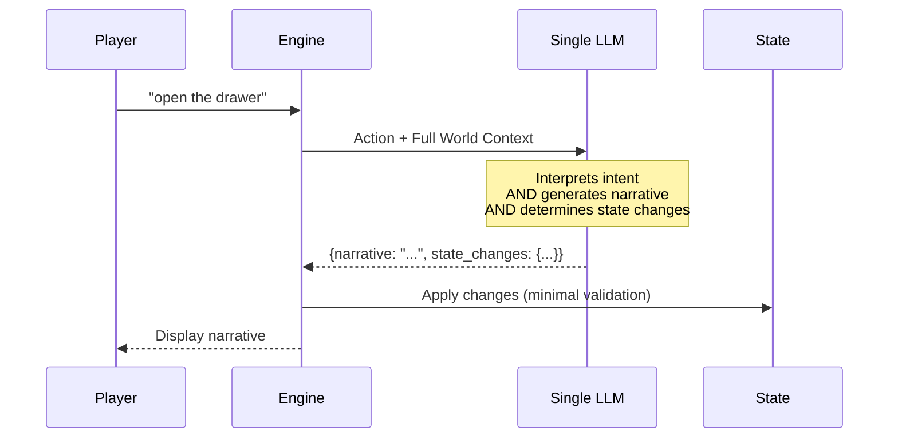
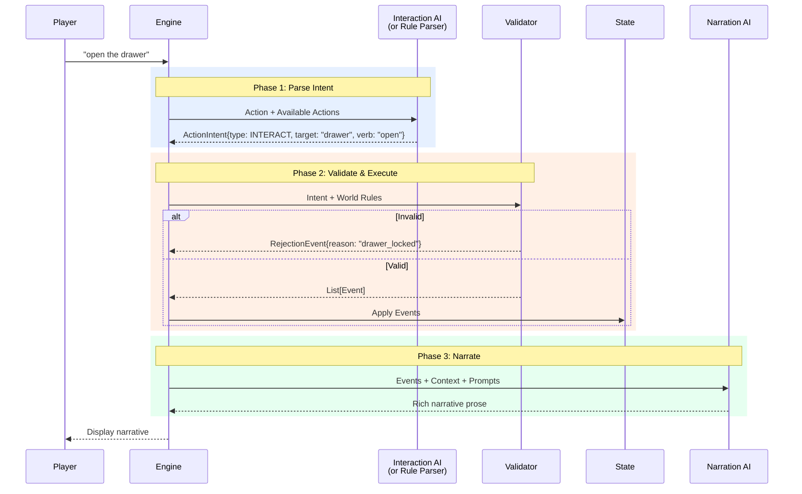
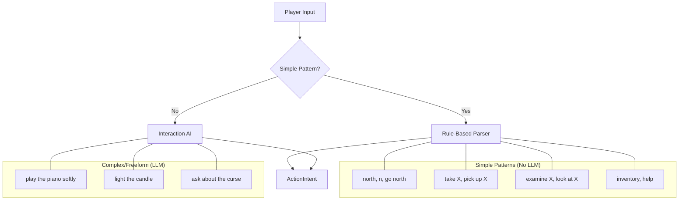
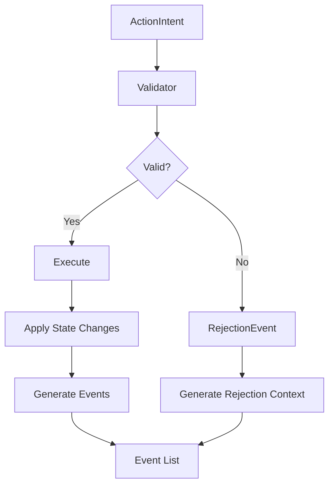
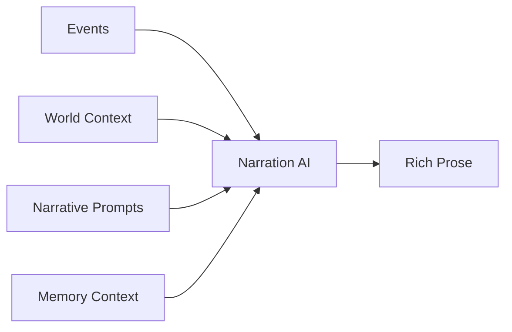
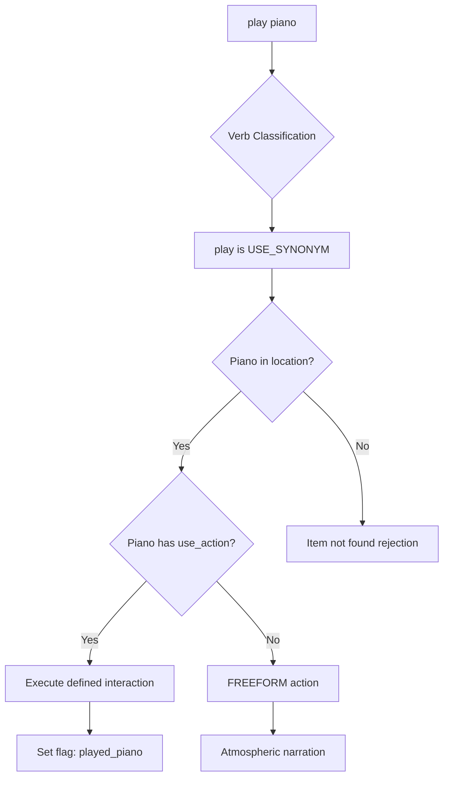
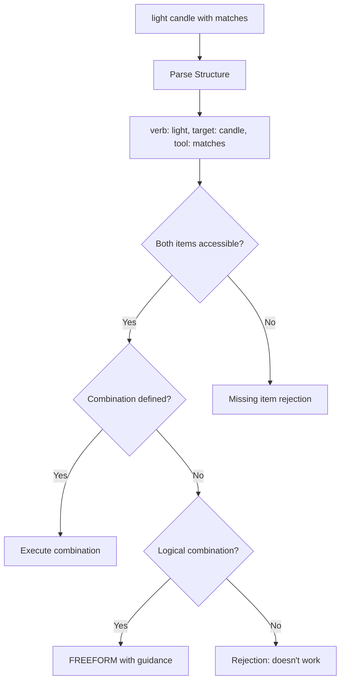
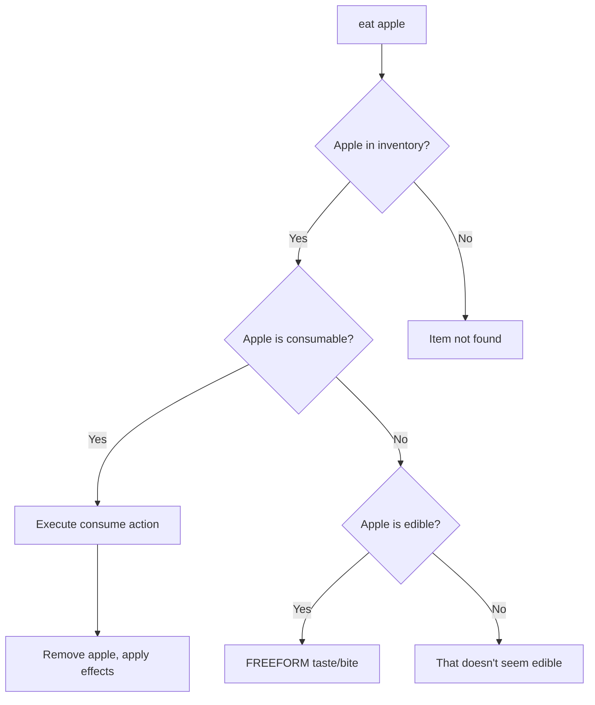
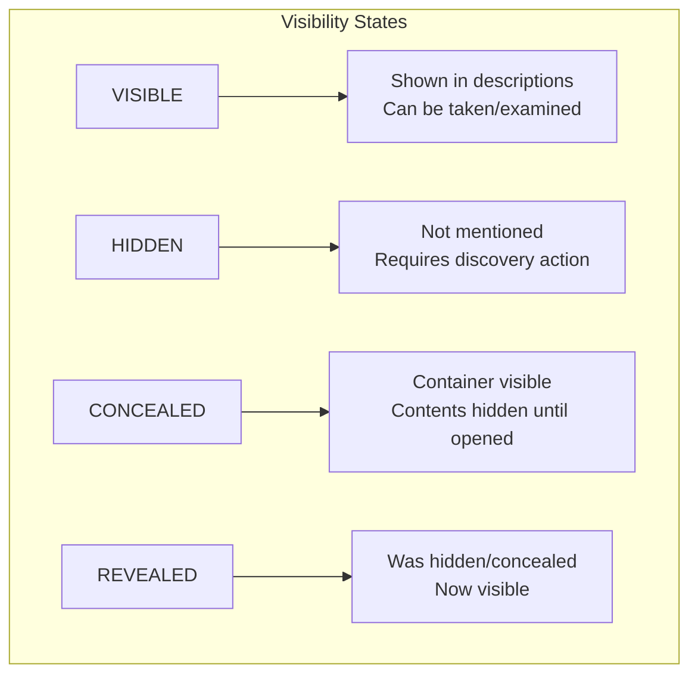

# Two-Phase Game Loop Architecture

A comprehensive specification for separating action parsing from narrative generation, enabling deterministic state management with AI-powered prose.

> **Status**: Design Specification - December 2025  
> **Related**: [Game Mechanics Design](game-mechanics-design.md) | [Vision](../docs/VISION.md) | [Architecture](../docs/ARCHITECTURE.md)  
> **Implementation Branch**: `feature/two-phase-game-loop-claude-opus-4`

---

## Table of Contents

1. [Executive Summary](#executive-summary)
2. [Current vs. Proposed Architecture](#current-vs-proposed-architecture)
3. [ActionIntent Taxonomy](#actionintent-taxonomy)
4. [Event System](#event-system)
5. [The Two-Phase Flow](#the-two-phase-flow)
6. [Validation & Rejection Handling](#validation--rejection-handling)
7. [Rich Verb Handling](#rich-verb-handling)
8. [Visibility Model](#visibility-model)
9. [Prompt Specifications](#prompt-specifications)
10. [Implementation Phases](#implementation-phases)
11. [Engine Selection & Coexistence](#engine-selection--coexistence)
12. [Data Models](#data-models)
13. [API Changes](#api-changes)

---

## Executive Summary

### The Problem

The current architecture uses a **single LLM call** that both interprets player actions AND generates narrative. This creates several issues:

1. **State consistency**: The LLM may hallucinate state changes that violate game rules
2. **Validation gaps**: State changes are applied before we can validate them against world constraints
3. **Debugging difficulty**: Hard to distinguish parsing errors from narrative generation issues
4. **Determinism**: Same input can produce different mechanical outcomes

### The Solution

Split the game loop into **two distinct phases**:

1. **Interaction Phase**: Parse player input into a structured `ActionIntent` → validate against world rules → produce `Event` outcomes
2. **Narration Phase**: Generate rich prose based on confirmed events and world context

This separation ensures:
- Game mechanics are deterministic and validatable
- Narrative always reflects the actual game state
- Each component can be tested, debugged, and optimized independently
- Simple actions can bypass LLM entirely (rule-based parsing)

---

## Current vs. Proposed Architecture

### Current Architecture (Single LLM)



**Issues**:
- LLM may invent state changes not defined in the world
- Narrative may describe events that didn't happen
- No opportunity to reject invalid actions before narration

### Proposed Architecture (Two-Phase)



---

## ActionIntent Taxonomy

An `ActionIntent` represents the **parsed interpretation** of what the player is trying to do, before validation.

### Core Intent Types

```python
from enum import Enum
from pydantic import BaseModel

class ActionType(str, Enum):
    """Primary categories of player actions"""
    
    # Movement
    MOVE = "move"              # Navigate between locations
    
    # Object Interaction
    EXAMINE = "examine"        # Look at something closely
    TAKE = "take"              # Pick up an item
    DROP = "drop"              # Put down an item
    USE = "use"                # Use item (standalone or on target)
    OPEN = "open"              # Open container/door
    CLOSE = "close"            # Close container/door
    
    # Communication
    TALK = "talk"              # Speak to NPC
    ASK = "ask"                # Ask NPC about topic
    GIVE = "give"              # Give item to NPC
    SHOW = "show"              # Show item to NPC
    
    # Environment
    LOOK = "look"              # Look around (general)
    LISTEN = "listen"          # Listen for sounds
    SEARCH = "search"          # Search area/container
    
    # Meta
    WAIT = "wait"              # Pass time
    INVENTORY = "inventory"    # Check inventory (built-in)
    HELP = "help"              # Show help (built-in)
    
    # Freeform (requires LLM interpretation)
    FREEFORM = "freeform"      # Complex/ambiguous action
```

### ActionIntent Model

```python
class ActionIntent(BaseModel):
    """Structured representation of player intent"""
    
    type: ActionType
    
    # Target of the action (item_id, npc_id, direction, or description)
    target: str | None = None
    
    # Secondary target (for USE X ON Y, GIVE X TO Y, etc.)
    indirect_target: str | None = None
    
    # Original verb used (for rich narration)
    verb: str | None = None
    
    # Original player input (for context)
    raw_input: str
    
    # Confidence score (0.0-1.0) when AI-parsed
    confidence: float = 1.0
    
    # Alternative interpretations (for disambiguation)
    alternatives: list["ActionIntent"] = []
```

### Examples

| Player Input | Parsed ActionIntent |
|--------------|---------------------|
| "north" | `ActionIntent(type=MOVE, target="north", verb="go")` |
| "examine the painting" | `ActionIntent(type=EXAMINE, target="painting", verb="examine")` |
| "pick up the key" | `ActionIntent(type=TAKE, target="key", verb="pick up")` |
| "use key on door" | `ActionIntent(type=USE, target="key", indirect_target="door", verb="use")` |
| "talk to Jenkins" | `ActionIntent(type=TALK, target="butler_jenkins", verb="talk")` |
| "ask Jenkins about the family" | `ActionIntent(type=ASK, target="butler_jenkins", indirect_target="family", verb="ask")` |
| "play piano" | `ActionIntent(type=FREEFORM, target="piano", verb="play", raw_input="play piano")` |
| "light candle with matches" | `ActionIntent(type=USE, target="matches", indirect_target="candle", verb="light")` |

---

## Event System

Events represent **what happened** as a result of a validated action. They are the source of truth for state changes.

### Event Types

```python
class EventType(str, Enum):
    """Types of events that can occur"""
    
    # Movement Events
    LOCATION_CHANGED = "location_changed"
    LOCATION_BLOCKED = "location_blocked"
    
    # Item Events
    ITEM_TAKEN = "item_taken"
    ITEM_DROPPED = "item_dropped"
    ITEM_USED = "item_used"
    ITEM_REVEALED = "item_revealed"
    ITEM_CONSUMED = "item_consumed"
    
    # Container Events
    CONTAINER_OPENED = "container_opened"
    CONTAINER_CLOSED = "container_closed"
    CONTAINER_LOCKED = "container_locked"
    
    # Discovery Events
    DETAIL_EXAMINED = "detail_examined"
    SECRET_DISCOVERED = "secret_discovered"
    EXIT_REVEALED = "exit_revealed"
    
    # NPC Events
    NPC_GREETED = "npc_greeted"
    NPC_CONVERSATION = "npc_conversation"
    NPC_ITEM_GIVEN = "npc_item_given"
    NPC_ITEM_RECEIVED = "npc_item_received"
    NPC_TRUST_CHANGED = "npc_trust_changed"
    
    # Game Flow Events
    FLAG_SET = "flag_set"
    INTERACTION_TRIGGERED = "interaction_triggered"
    PUZZLE_PROGRESSED = "puzzle_progressed"
    VICTORY_ACHIEVED = "victory_achieved"
    
    # Meta Events
    ACTION_REJECTED = "action_rejected"
    NOTHING_HAPPENED = "nothing_happened"
    FREEFORM_ACTION = "freeform_action"
```

### Event Model

```python
class Event(BaseModel):
    """Represents something that happened in the game world"""
    
    type: EventType
    
    # What was involved
    subject: str | None = None      # Primary entity (item_id, npc_id, location_id)
    target: str | None = None       # Secondary entity
    
    # State changes to apply
    state_changes: StateChanges = StateChanges()
    
    # Context for narration
    context: dict = {}
    
    # Was this the primary outcome or a side effect?
    primary: bool = True


class RejectionEvent(Event):
    """Special event for rejected/failed actions"""
    
    type: EventType = EventType.ACTION_REJECTED
    
    # Why the action was rejected
    rejection_reason: str
    rejection_code: str  # Machine-readable: "door_locked", "too_heavy", etc.
    
    # What would have happened if successful (for hints)
    would_have: str | None = None
```

### Example Event Flows

#### Successful Movement

```python
# Player: "go north"
intent = ActionIntent(type=MOVE, target="north", verb="go")

# Validation passes - door is unlocked
events = [
    Event(
        type=EventType.LOCATION_CHANGED,
        subject="entrance_hall",
        target="library",
        state_changes=StateChanges(location="library"),
        context={
            "direction": "north",
            "first_visit": True,
            "new_location_name": "The Library"
        }
    )
]
```

#### Failed Movement (Locked Door)

```python
# Player: "go down"
intent = ActionIntent(type=MOVE, target="down", verb="go")

# Validation fails - basement door is locked
events = [
    RejectionEvent(
        rejection_reason="The heavy iron door to the basement is firmly locked.",
        rejection_code="exit_locked",
        subject="basement_door",
        context={
            "requires_key": "iron_key",
            "lock_description": "A heavy iron padlock secures the door."
        },
        would_have="Access the basement"
    )
]
```

#### Item Pickup with Side Effects

```python
# Player: "take the iron key"
intent = ActionIntent(type=TAKE, target="iron_key", verb="take")

# Validation passes - key exists and is reachable
events = [
    Event(
        type=EventType.ITEM_TAKEN,
        subject="iron_key",
        state_changes=StateChanges(inventory=InventoryChange(add=["iron_key"])),
        context={
            "item_name": "Heavy Iron Key",
            "take_description": "The key pulses with unnatural cold as you grasp it."
        },
        primary=True
    ),
    Event(
        type=EventType.FLAG_SET,
        state_changes=StateChanges(flags={"found_iron_key": True}),
        primary=False
    )
]
```

---

## The Two-Phase Flow

### Phase 1: Parse Intent



#### Rule-Based Parser (Fast Path)

For common patterns, parse without LLM:

```python
class RuleBasedParser:
    """Parse common actions without LLM"""
    
    DIRECTION_PATTERNS = {
        r'^(go\s+)?(north|n)$': ('north', 'go'),
        r'^(go\s+)?(south|s)$': ('south', 'go'),
        r'^(go\s+)?(east|e)$': ('east', 'go'),
        r'^(go\s+)?(west|w)$': ('west', 'go'),
        r'^(go\s+)?(up|u)$': ('up', 'go'),
        r'^(go\s+)?(down|d)$': ('down', 'go'),
        r'^(go\s+)?back$': ('back', 'go'),
        r'^leave$': ('back', 'leave'),
        r'^exit$': ('back', 'exit'),
    }
    
    EXAMINE_PATTERNS = [
        r'^(examine|look at|inspect|study|check)\s+(?:the\s+)?(.+)$',
        r'^x\s+(.+)$',  # Shorthand
    ]
    
    TAKE_PATTERNS = [
        r'^(take|get|pick up|grab)\s+(?:the\s+)?(.+)$',
    ]
    
    def parse(self, raw_input: str, context: ParserContext) -> ActionIntent | None:
        """
        Try to parse input with rules. Returns None if LLM needed.
        """
        normalized = raw_input.lower().strip()
        
        # Check movement
        for pattern, (direction, verb) in self.DIRECTION_PATTERNS.items():
            if re.match(pattern, normalized):
                return ActionIntent(
                    type=ActionType.MOVE,
                    target=direction,
                    verb=verb,
                    raw_input=raw_input,
                    confidence=1.0
                )
        
        # Check examine
        for pattern in self.EXAMINE_PATTERNS:
            match = re.match(pattern, normalized)
            if match:
                target = match.group(2) if len(match.groups()) > 1 else match.group(1)
                resolved = context.resolve_target(target)
                return ActionIntent(
                    type=ActionType.EXAMINE,
                    target=resolved,
                    verb="examine",
                    raw_input=raw_input,
                    confidence=0.9 if resolved else 0.5
                )
        
        # ... more patterns ...
        
        return None  # Needs LLM interpretation
```

#### Interaction AI (Complex Path)

For ambiguous or freeform input, use LLM:

```python
class InteractionAI:
    """LLM-powered action parser for complex inputs"""
    
    async def parse(self, raw_input: str, context: ParserContext) -> ActionIntent:
        """Parse complex player input into structured intent"""
        
        prompt = self._build_parser_prompt(raw_input, context)
        response = await get_completion(prompt, response_format="json")
        
        return self._parse_response(response, raw_input)
```

### Phase 2: Validate & Execute



#### Validation Rules

```python
class ActionValidator:
    """Validates actions against world rules"""
    
    def validate_move(self, intent: ActionIntent, state: GameState, world: WorldData) -> ValidationResult:
        """Validate movement action"""
        location = world.get_location(state.current_location)
        
        # Resolve direction
        direction = self._resolve_direction(intent.target, state)
        if not direction:
            return ValidationResult(
                valid=False,
                rejection_code="invalid_direction",
                rejection_reason="You can't go that way."
            )
        
        # Check exit exists
        if direction not in location.exits:
            return ValidationResult(
                valid=False,
                rejection_code="no_exit",
                rejection_reason=f"There's no exit to the {direction}."
            )
        
        destination_id = location.exits[direction]
        destination = world.get_location(destination_id)
        
        # Check exit requirements (locked, blocked, etc.)
        exit_info = location.exit_details.get(direction)
        if exit_info:
            if exit_info.locked:
                return ValidationResult(
                    valid=False,
                    rejection_code="exit_locked",
                    rejection_reason=exit_info.locked_description or "The way is locked.",
                    context={"requires_key": exit_info.requires_key}
                )
            if exit_info.blocked:
                return ValidationResult(
                    valid=False,
                    rejection_code="exit_blocked",
                    rejection_reason=exit_info.blocked_reason or "The way is blocked."
                )
        
        # Check destination requirements
        if destination.requires:
            if destination.requires.flag and not state.flags.get(destination.requires.flag):
                return ValidationResult(
                    valid=False,
                    rejection_code="location_requires_flag",
                    rejection_reason="You haven't discovered how to access this area yet."
                )
            if destination.requires.item and destination.requires.item not in state.inventory:
                return ValidationResult(
                    valid=False,
                    rejection_code="location_requires_item",
                    rejection_reason="You need something to access this area."
                )
        
        return ValidationResult(valid=True, destination=destination_id)
    
    def validate_take(self, intent: ActionIntent, state: GameState, world: WorldData) -> ValidationResult:
        """Validate take action"""
        item = world.get_item(intent.target)
        location = world.get_location(state.current_location)
        
        # Item exists?
        if not item:
            return ValidationResult(
                valid=False,
                rejection_code="item_not_found",
                rejection_reason=f"You don't see any {intent.target} here."
            )
        
        # Item at this location?
        item_location = self._get_item_location(intent.target, state, world)
        if item_location != state.current_location and intent.target not in state.inventory:
            return ValidationResult(
                valid=False,
                rejection_code="item_not_here",
                rejection_reason=f"There's no {item.name} here."
            )
        
        # Already have it?
        if intent.target in state.inventory:
            return ValidationResult(
                valid=False,
                rejection_code="already_have",
                rejection_reason=f"You already have the {item.name}."
            )
        
        # Item visible? (not hidden or hidden condition met)
        if item.hidden:
            if item.find_condition:
                required_flag = item.find_condition.get("requires_flag")
                if required_flag and not state.flags.get(required_flag):
                    return ValidationResult(
                        valid=False,
                        rejection_code="item_hidden",
                        rejection_reason=f"You don't see any {item.name}."
                    )
        
        # Item portable?
        if not item.portable:
            return ValidationResult(
                valid=False,
                rejection_code="not_portable",
                rejection_reason=item.not_portable_reason or f"You can't take the {item.name}."
            )
        
        # Item too heavy? (future feature)
        # Item in locked container? (future feature)
        
        return ValidationResult(valid=True)
```

### Phase 3: Narrate



The Narration AI takes confirmed events and generates immersive prose.

---

## Validation & Rejection Handling

### Rejection Categories

| Code | Category | Example | Narration Approach |
|------|----------|---------|-------------------|
| `exit_locked` | Access | Door is locked | Describe the lock, hint at key |
| `exit_blocked` | Access | Rubble blocks path | Describe the obstacle |
| `item_hidden` | Visibility | Key is in drawer | "You don't see that here" |
| `item_not_here` | Location | Item at other location | "There's no X here" |
| `not_portable` | Physical | Can't lift piano | Describe weight/attachment |
| `too_heavy` | Physical | Boulder too heavy | "It's far too heavy" |
| `item_fragile` | Physical | Glass would break | "It's too delicate" |
| `npc_hostile` | Social | NPC won't talk | Describe hostility |
| `npc_busy` | Social | NPC occupied | Describe activity |
| `missing_tool` | Requirements | Need lockpick | "You need something for that" |
| `missing_item` | Requirements | Need key | "The lock needs a key" |
| `critical_item` | Safety | Can't destroy quest item | Gentle deflection |
| `action_meaningless` | Logic | "Eat the door" | Humorous deflection |

### Rejection Narration

Rejections should feel natural, not like error messages:

```python
# BAD: System message
"Error: Cannot take item. Door is locked."

# GOOD: In-world narrative
"You tug at the basement door, but the heavy iron padlock holds fast. 
The lock is old but sturdy—you'll need the right key."

# GOOD: Subtle hint
"Your fingers brush the desk drawer's brass handle. It rattles but 
doesn't open. Something inside clinks faintly."
```

---

## Rich Verb Handling

### The Challenge

Players use creative, varied language:

- "play piano" (creative action)
- "light candle with matches" (item combination)
- "jump around" (physical action)
- "eat apple" (consumable use)
- "pet the cat" (NPC interaction)
- "yell for help" (environmental)

### The Solution: Verb Classification

```python
class VerbClassifier:
    """Classify verbs into action categories"""
    
    # Verbs that map to standard ActionTypes
    VERB_MAPPINGS = {
        # EXAMINE verbs
        ("look", "examine", "inspect", "study", "check", "observe", "view", 
         "read", "scrutinize", "peer"): ActionType.EXAMINE,
        
        # TAKE verbs
        ("take", "get", "grab", "pick", "collect", "acquire", "pocket"): ActionType.TAKE,
        
        # USE verbs (may need secondary target)
        ("use", "apply", "activate", "operate", "employ"): ActionType.USE,
        
        # OPEN verbs
        ("open", "unlock", "unfasten", "unseal"): ActionType.OPEN,
        
        # TALK verbs
        ("talk", "speak", "chat", "converse", "greet"): ActionType.TALK,
        
        # ASK verbs
        ("ask", "inquire", "question", "query"): ActionType.ASK,
    }
    
    # Verbs that become USE with implied target
    USE_SYNONYMS = {
        "light": ("matches", "lighter", "candle"),  # "light X" → USE matches ON X
        "cut": ("knife", "scissors", "blade"),
        "unlock": ("key",),
        "play": None,  # "play piano" → USE piano (interact with)
        "eat": None,   # "eat apple" → USE apple (consume)
        "drink": None,
        "wear": None,
        "ring": None,  # "ring bell" → USE bell
    }
    
    # Verbs that are physical expressions (may trigger freeform)
    PHYSICAL_VERBS = {
        "jump", "run", "climb", "swim", "dance", "wave", "bow", "kneel",
        "sit", "stand", "lie", "crawl", "stretch", "yawn"
    }
    
    # Verbs that are vocal/social
    VOCAL_VERBS = {
        "shout", "yell", "whisper", "sing", "hum", "call", "scream", "laugh", "cry"
    }
```

### Handling "play piano"



**World Definition:**
```yaml
# items.yaml
grand_piano:
  name: "Grand Piano"
  portable: false
  examine: "A magnificent grand piano, dusty but intact."
  location: sitting_room
  
  use_actions:
    play:
      triggers: ["play piano", "play the piano", "use piano"]
      requires_flag: null  # No requirement
      sets_flag: played_piano
      description: "Your fingers find the keys..."
      narrative_prompt: |
        The player plays the piano. The sound should feel:
        - Melancholy and haunting
        - Slightly out of tune
        - Triggering a memory or response in the manor
```

**If no use_action defined:**
The system generates a freeform atmospheric response:

```python
# FREEFORM handling
Event(
    type=EventType.FREEFORM_ACTION,
    subject="grand_piano",
    context={
        "verb": "play",
        "item_name": "grand piano",
        "narration_guidance": "Describe playing the piano atmospherically. No game state changes."
    }
)
```

### Handling "light candle with matches"



**World Definition for combinations:**
```yaml
# items.yaml
unlit_candle:
  name: "Unlit Candle"
  portable: true
  examine: "A tall white candle, unlit."
  
  combinations:
    - with_item: matches
      verb_triggers: ["light", "ignite", "use matches on"]
      produces: lit_candle
      consumes_other: false  # Matches not consumed
      narrative: "The match flares, and the candle catches the flame."
      sets_flag: has_light
```

### Handling "jump around"

Physical expression verbs that don't affect game state:

```python
# Recognized as FREEFORM physical action
Event(
    type=EventType.FREEFORM_ACTION,
    context={
        "verb": "jump",
        "narration_guidance": """
            Generate brief, flavorful narration of the player jumping around.
            Consider the location atmosphere. No state changes.
            Keep it short (1-2 sentences).
        """
    }
)
```

The Narration AI generates something like:
> "You bounce on your heels a few times. The floorboards creak ominously beneath you."

### Handling "eat apple"



**World Definition:**
```yaml
# items.yaml
apple:
  name: "Red Apple"
  portable: true
  categories: [consumable, edible]
  
  use_actions:
    eat:
      triggers: ["eat apple", "bite apple", "consume apple"]
      consumes_item: true
      narrative: "You bite into the apple. It's crisp and refreshing."
      effects:
        - type: remove_item
          item: apple
```

---

## Visibility Model

### The Problem

Items can be hidden in containers, behind objects, or revealed through interactions. How do we handle:

1. **Drawer with hidden key**: Player can't see key until they open drawer
2. **Narrative consistency**: First description shouldn't mention hidden items
3. **Progressive discovery**: State changes make items visible

### The Solution: Layered Visibility



### Container Model

```yaml
# items.yaml
desk:
  name: "Old Writing Desk"
  portable: false
  examine: "A heavy oak desk with brass handles on its single drawer."
  location: study
  
  container:
    type: drawer
    initially_open: false
    locked: false
    
    contents:
      - item_id: brass_key
        visibility: concealed  # Visible when drawer opened
      - item_id: old_letter
        visibility: concealed
    
    open_action:
      triggers: ["open drawer", "open desk drawer", "pull drawer"]
      sets_flag: desk_drawer_opened
      reveals_items: [brass_key, old_letter]
      narrative: "The drawer slides open with a creak, revealing its contents."

brass_key:
  name: "Small Brass Key"
  portable: true
  examine: "A small brass key, tarnished with age."
  initial_location: desk  # Contained within desk
  visibility: concealed   # Hidden until drawer opened
  visibility_condition:
    requires_flag: desk_drawer_opened
```

### Visibility Resolution

```python
class VisibilityResolver:
    """Determines what items are visible to the player"""
    
    def get_visible_items(self, location_id: str, state: GameState, world: WorldData) -> list[VisibleItem]:
        """Get all items visible at a location"""
        location = world.get_location(location_id)
        visible = []
        
        for item_id in location.items:
            item = world.get_item(item_id)
            
            # Skip items already in inventory
            if item_id in state.inventory:
                continue
            
            # Check visibility
            vis_state = self._resolve_visibility(item, state)
            
            if vis_state in (Visibility.VISIBLE, Visibility.REVEALED):
                visible.append(VisibleItem(
                    item_id=item_id,
                    item=item,
                    visibility=vis_state,
                    placement=location.item_placements.get(item_id),
                    is_new=(vis_state == Visibility.REVEALED and not state.has_seen(item_id))
                ))
        
        return visible
    
    def _resolve_visibility(self, item: Item, state: GameState) -> Visibility:
        """Resolve current visibility state of an item"""
        
        # Explicitly visible
        if not item.hidden and not item.visibility == "concealed":
            return Visibility.VISIBLE
        
        # Check visibility condition
        if item.visibility_condition:
            if item.visibility_condition.requires_flag:
                if state.flags.get(item.visibility_condition.requires_flag):
                    return Visibility.REVEALED
                else:
                    return Visibility.CONCEALED if item.visibility == "concealed" else Visibility.HIDDEN
        
        # Default to item's declared visibility
        return Visibility(item.visibility) if item.visibility else Visibility.VISIBLE
```

### Prompt Flow Example: The Drawer Scenario

#### Turn 1: Player enters study (key hidden)

**System Prompt Includes:**
```
Location: study (The Study)

Items at this location:
- Old Writing Desk (desk): A heavy oak desk dominates the corner.
- Dusty Book (dusty_book): Lies open on the desk.

[Note: brass_key exists but is NOT listed because desk_drawer_opened is false]
```

**Narration:**
> "The study is cramped but cozy. An old writing desk dominates one corner, its single drawer shut tight. A dusty book lies open on the desk's surface, as if someone left mid-sentence."

**Key point:** The key is not mentioned because it's concealed.

#### Turn 2: Player opens the drawer

**Action:** `"open the drawer"`

**Parsed Intent:** `ActionIntent(type=OPEN, target="desk_drawer")`

**Validation:** ✅ Drawer exists, not locked

**Events Generated:**
```python
[
    Event(
        type=EventType.CONTAINER_OPENED,
        subject="desk",
        state_changes=StateChanges(flags={"desk_drawer_opened": True}),
        context={
            "container_type": "drawer",
            "revealed_items": ["brass_key", "old_letter"]
        }
    ),
    Event(
        type=EventType.ITEM_REVEALED,
        subject="brass_key",
        context={
            "reveal_method": "container_opened",
            "item_name": "Small Brass Key"
        }
    ),
    Event(
        type=EventType.ITEM_REVEALED,
        subject="old_letter",
        context={
            "reveal_method": "container_opened",
            "item_name": "Yellowed Letter"
        }
    )
]
```

**Narration Prompt Includes:**
```
Events to narrate:
1. CONTAINER_OPENED: Player opened the desk drawer
2. ITEM_REVEALED: brass_key (Small Brass Key) is now visible
3. ITEM_REVEALED: old_letter (Yellowed Letter) is now visible

Narrative guidance: Describe the drawer opening and the discovery of the 
items inside. This should feel like a discovery moment.
```

**Generated Narration:**
> "The drawer slides open with a reluctant creak. Inside, nestled in a bed of dust, you find a small brass key and a yellowed letter, its wax seal long since broken. Both had been forgotten here for years."

#### Turn 3: Player can now take the key

**System Prompt Now Includes:**
```
Items at this location:
- Old Writing Desk (desk): A heavy oak desk dominates the corner.
- Dusty Book (dusty_book): Lies open on the desk.
- Small Brass Key (brass_key): In the open desk drawer. [NEWLY REVEALED]
- Yellowed Letter (old_letter): In the open desk drawer. [NEWLY REVEALED]
```

---

## Prompt Specifications

### Interaction AI Prompt Template

```python
INTERACTION_PARSER_SYSTEM = """You are an action parser for a text adventure game.

Your job is to interpret player input and identify the intended action.

## Output Format
Respond with JSON only:
{
    "intent_type": "<action_type>",
    "target": "<target_id or description>",
    "indirect_target": "<secondary_target if applicable>",
    "verb": "<the verb used>",
    "confidence": <0.0-1.0>,
    "reasoning": "<brief explanation>"
}

## Action Types
- MOVE: Navigation (go north, enter library, leave)
- EXAMINE: Look closely (examine painting, look at letter)
- TAKE: Pick up item (take key, grab book)
- DROP: Put down item (drop key, leave book)
- USE: Use item (use key, light candle with matches)
- OPEN: Open container/door (open drawer, unlock door)
- CLOSE: Close something (close door, shut drawer)
- TALK: Start conversation (talk to Jenkins, greet butler)
- ASK: Ask about topic (ask Jenkins about the family)
- GIVE: Give item (give key to Jenkins)
- SHOW: Show item (show letter to Jenkins)
- LOOK: General look around (look, look around)
- SEARCH: Search area (search room, search desk)
- WAIT: Pass time (wait, rest)
- FREEFORM: Other actions (play piano, sing song, dance)

## Current Context
Location: {current_location} ({location_name})

Available exits: {available_exits}

Items here:
{items_at_location}

NPCs present:
{npcs_present}

Player inventory:
{inventory}

## Guidelines
1. Match targets to actual item_ids/npc_ids when possible
2. If target is ambiguous, use the description and set lower confidence
3. For "use X on Y", target is the tool, indirect_target is what it's used on
4. For movement synonyms like "leave", "exit", "go back", infer direction
5. Set confidence based on how certain you are of the interpretation
"""

INTERACTION_PARSER_USER = """Player input: "{player_input}"

Parse this action and identify the intent."""
```

### Narration AI Prompt Template

```python
NARRATOR_SYSTEM = """You are a narrative AI for a text adventure game called {world_name}.

## Your Role
Generate immersive, atmospheric prose based on confirmed game events.
You do NOT determine what happens - that has already been decided.
You bring those events to life through vivid description.

## World Context
Theme: {theme}
Tone: {tone}
Hero: {hero_name}

Current Location: {location_name}
Atmosphere: {location_atmosphere}

## Narrative Style
{narrative_style_guidance}

## Player's Narrative Memory
Recent events:
{recent_context}

NPC relationships:
{npc_relationships}

Already discovered:
{discoveries}

## Guidelines
1. Write in second person ("You see...", "You feel...")
2. Match the world's tone and atmosphere
3. For rejections, make them feel natural, not like error messages
4. Reference recent events for continuity
5. Don't reveal information the player shouldn't know yet
6. Keep responses to 2-4 paragraphs unless an epic moment
7. End with sensory details that ground the player in the scene
"""

NARRATOR_USER = """## Events to Narrate
{events_description}

## Narration Guidance
{narration_guidance}

Generate the narrative for these events."""
```

### Event-Specific Narration Guidance

```python
def build_narration_guidance(events: list[Event], world: WorldData) -> str:
    """Build narration guidance based on events"""
    
    guidance_parts = []
    
    for event in events:
        if event.type == EventType.LOCATION_CHANGED:
            loc = world.get_location(event.target)
            guidance_parts.append(f"""
LOCATION_CHANGED: Player moved to {loc.name}
- First visit: {event.context.get('first_visit', False)}
- Describe the new location's atmosphere
- Mention visible exits naturally
- If first visit, make it a discovery moment
- If revisit, acknowledge familiarity
""")
        
        elif event.type == EventType.ACTION_REJECTED:
            guidance_parts.append(f"""
ACTION_REJECTED: Player's action was blocked
- Rejection reason: {event.rejection_reason}
- Make this feel natural, not like an error
- Optional subtle hint about what might work
- Don't break immersion with system language
""")
        
        elif event.type == EventType.ITEM_REVEALED:
            item = world.get_item(event.subject)
            guidance_parts.append(f"""
ITEM_REVEALED: {item.name} is now visible
- This is a discovery moment
- Describe the item appearing/being found
- Build appropriate anticipation
- Found description: {item.found_description or 'N/A'}
""")
        
        elif event.type == EventType.NPC_CONVERSATION:
            npc = world.get_npc(event.subject)
            guidance_parts.append(f"""
NPC_CONVERSATION: Dialogue with {npc.name}
- NPC personality: {npc.personality_summary}
- Current trust level: {event.context.get('trust_level', 0)}
- Topic: {event.context.get('topic', 'general')}
- Generate dialogue in character voice
- Use speech patterns: {npc.speech_patterns}
""")
        
        elif event.type == EventType.FREEFORM_ACTION:
            guidance_parts.append(f"""
FREEFORM_ACTION: {event.context.get('verb', 'action')} on {event.subject or 'environment'}
- This is flavor/atmosphere, not mechanical
- Keep brief (1-2 sentences)
- Match location mood
- No game state changes resulted
""")
    
    return "\n---\n".join(guidance_parts)
```

---

## Implementation Phases

### Phase 0: Foundation (Pre-requisite)
**Branch:** `feature/two-phase-game-loop-claude-opus-4`

- [ ] Create new models: `ActionIntent`, `Event`, `ValidationResult`
- [ ] Create `EngineVersion` enum for engine selection
- [ ] Add engine selection to `GameState` model
- [ ] Update API to support engine selection at game start

### Phase 1: Simple Movement
**Goal:** Movement-only two-phase loop without LLM parsing

```python
# Simple direction mapping - no LLM needed
"north" -> ActionIntent(type=MOVE, target="north")
"n" -> ActionIntent(type=MOVE, target="north")
"go east" -> ActionIntent(type=MOVE, target="east")
"leave" -> ActionIntent(type=MOVE, target="back")
"exit" -> ActionIntent(type=MOVE, target="back")
"go back" -> ActionIntent(type=MOVE, target="back")
```

**Tasks:**
- [ ] Implement `RuleBasedParser` for movement patterns
- [ ] Implement `MovementValidator` 
- [ ] Generate `LOCATION_CHANGED` and `LOCATION_BLOCKED` events
- [ ] Create basic `NarrationAI` for location descriptions
- [ ] Wire up two-phase flow for movement only
- [ ] Fall back to classic engine for non-movement actions

### Phase 2: Examination & Taking
**Goal:** Add examine and take without LLM parsing

```python
"examine key" -> ActionIntent(type=EXAMINE, target="key")
"look at painting" -> ActionIntent(type=EXAMINE, target="painting")
"take book" -> ActionIntent(type=TAKE, target="book")
"get the map" -> ActionIntent(type=TAKE, target="map")
```

**Tasks:**
- [ ] Extend `RuleBasedParser` for examine/take patterns
- [ ] Implement `ExamineValidator` and `TakeValidator`
- [ ] Generate `DETAIL_EXAMINED`, `ITEM_TAKEN` events
- [ ] Handle visibility resolution for hidden items
- [ ] Wire rejection events for locked containers, hidden items

### Phase 3: Interaction AI for Complex Actions
**Goal:** Add LLM-based parsing for freeform inputs

**Tasks:**
- [ ] Implement `InteractionAI` with parser prompt
- [ ] Handle "use X on Y" parsing
- [ ] Handle NPC communication parsing  
- [ ] Handle freeform/creative actions
- [ ] Integrate with validation pipeline

### Phase 4: Full Narration AI
**Goal:** Rich, context-aware narration

**Tasks:**
- [ ] Implement full `NarrationAI` with style guidance
- [ ] Event-specific narration templates
- [ ] NPC dialogue generation
- [ ] Discovery moment narration
- [ ] Rejection narration (natural, in-world)

### Phase 5: Container & Visibility System
**Goal:** Full drawer/container mechanics

**Tasks:**
- [ ] Implement container model in world schema
- [ ] Add OPEN/CLOSE validation
- [ ] Implement visibility state machine
- [ ] Generate CONTAINER_OPENED, ITEM_REVEALED events
- [ ] Update prompts to respect visibility

### Phase 6: Polish & Comparison
**Goal:** Feature parity and quality comparison

**Tasks:**
- [ ] Implement all remaining action types
- [ ] A/B testing framework for engine comparison
- [ ] Performance optimization (parallel calls where possible)
- [ ] Edge case handling
- [ ] Documentation and examples

---

## Engine Selection & Coexistence

### Engine Versions

```python
class EngineVersion(str, Enum):
    """Available game engine versions"""
    
    CLASSIC = "classic"      # Current single-LLM architecture
    TWO_PHASE = "two_phase"  # New separated architecture
```

### API Changes

**Start Game Request:**
```python
class StartGameRequest(BaseModel):
    world_id: str
    engine: EngineVersion = EngineVersion.CLASSIC  # Default to classic
    debug: bool = False
```

**Game State:**
```python
class GameState(BaseModel):
    # ... existing fields ...
    engine_version: EngineVersion = EngineVersion.CLASSIC
```

### Engine Factory

```python
class EngineFactory:
    """Factory for creating game engines"""
    
    @staticmethod
    def create_processor(
        state_manager: GameStateManager,
        engine_version: EngineVersion,
        debug: bool = False
    ) -> ActionProcessor:
        """Create the appropriate action processor"""
        
        if engine_version == EngineVersion.CLASSIC:
            return ClassicActionProcessor(state_manager, debug=debug)
        
        elif engine_version == EngineVersion.TWO_PHASE:
            return TwoPhaseActionProcessor(state_manager, debug=debug)
        
        raise ValueError(f"Unknown engine version: {engine_version}")
```

### Two-Phase Action Processor

```python
class TwoPhaseActionProcessor:
    """Two-phase game loop processor"""
    
    def __init__(self, state_manager: GameStateManager, debug: bool = False):
        self.state_manager = state_manager
        self.debug = debug
        
        # Phase 1: Parsing
        self.rule_parser = RuleBasedParser(state_manager)
        self.interaction_ai = InteractionAI(state_manager, debug=debug)
        
        # Phase 2: Validation
        self.validator = ActionValidator(state_manager)
        
        # Phase 3: Narration
        self.narrator = NarrationAI(state_manager, debug=debug)
    
    async def process(self, action: str) -> ActionResponse:
        """Process action through two-phase pipeline"""
        
        # Phase 1: Parse Intent
        intent = self.rule_parser.parse(action)
        if intent is None:
            intent = await self.interaction_ai.parse(action)
        
        # Phase 2: Validate & Execute
        validation = self.validator.validate(intent)
        
        if validation.valid:
            events = self.validator.execute(intent)
            self._apply_events(events)
        else:
            events = [validation.to_rejection_event()]
        
        # Phase 3: Narrate
        narrative = await self.narrator.narrate(events, intent)
        
        return ActionResponse(
            narrative=narrative,
            state=self.state_manager.get_state(),
            # ... rest of response
        )
```

---

## Data Models

### New Models File: `models/intent.py`

```python
"""
Action intent and event models for two-phase game loop
"""

from enum import Enum
from pydantic import BaseModel, Field


class ActionType(str, Enum):
    MOVE = "move"
    EXAMINE = "examine"
    TAKE = "take"
    DROP = "drop"
    USE = "use"
    OPEN = "open"
    CLOSE = "close"
    TALK = "talk"
    ASK = "ask"
    GIVE = "give"
    SHOW = "show"
    LOOK = "look"
    LISTEN = "listen"
    SEARCH = "search"
    WAIT = "wait"
    INVENTORY = "inventory"
    HELP = "help"
    FREEFORM = "freeform"


class EventType(str, Enum):
    LOCATION_CHANGED = "location_changed"
    LOCATION_BLOCKED = "location_blocked"
    ITEM_TAKEN = "item_taken"
    ITEM_DROPPED = "item_dropped"
    ITEM_USED = "item_used"
    ITEM_REVEALED = "item_revealed"
    ITEM_CONSUMED = "item_consumed"
    CONTAINER_OPENED = "container_opened"
    CONTAINER_CLOSED = "container_closed"
    CONTAINER_LOCKED = "container_locked"
    DETAIL_EXAMINED = "detail_examined"
    SECRET_DISCOVERED = "secret_discovered"
    EXIT_REVEALED = "exit_revealed"
    NPC_GREETED = "npc_greeted"
    NPC_CONVERSATION = "npc_conversation"
    NPC_ITEM_GIVEN = "npc_item_given"
    NPC_ITEM_RECEIVED = "npc_item_received"
    NPC_TRUST_CHANGED = "npc_trust_changed"
    FLAG_SET = "flag_set"
    INTERACTION_TRIGGERED = "interaction_triggered"
    PUZZLE_PROGRESSED = "puzzle_progressed"
    VICTORY_ACHIEVED = "victory_achieved"
    ACTION_REJECTED = "action_rejected"
    NOTHING_HAPPENED = "nothing_happened"
    FREEFORM_ACTION = "freeform_action"


class ActionIntent(BaseModel):
    """Structured representation of player intent"""
    type: ActionType
    target: str | None = None
    indirect_target: str | None = None
    verb: str | None = None
    raw_input: str
    confidence: float = 1.0
    alternatives: list["ActionIntent"] = Field(default_factory=list)


class Event(BaseModel):
    """Represents something that happened in the game world"""
    type: EventType
    subject: str | None = None
    target: str | None = None
    state_changes: "StateChanges" = Field(default_factory=lambda: StateChanges())
    context: dict = Field(default_factory=dict)
    primary: bool = True


class RejectionEvent(Event):
    """Special event for rejected/failed actions"""
    type: EventType = EventType.ACTION_REJECTED
    rejection_reason: str = ""
    rejection_code: str = ""
    would_have: str | None = None


class ValidationResult(BaseModel):
    """Result of validating an action"""
    valid: bool
    rejection_code: str | None = None
    rejection_reason: str | None = None
    context: dict = Field(default_factory=dict)
    
    def to_rejection_event(self) -> RejectionEvent:
        return RejectionEvent(
            rejection_reason=self.rejection_reason or "That didn't work.",
            rejection_code=self.rejection_code or "unknown",
            context=self.context
        )


class EngineVersion(str, Enum):
    """Available game engine versions"""
    CLASSIC = "classic"
    TWO_PHASE = "two_phase"


# Update forward references
ActionIntent.model_rebuild()
```

---

## API Changes

### Updated Endpoints

**POST /api/game/start**

```python
class StartGameRequest(BaseModel):
    world_id: str
    engine: EngineVersion = EngineVersion.CLASSIC
    debug: bool = False

class StartGameResponse(BaseModel):
    session_id: str
    narrative: str
    state: GameState
    engine_version: EngineVersion  # Confirm which engine is running
```

**POST /api/game/action**

No changes to request/response format, but internal processing differs by engine.

**GET /api/game/engines**

New endpoint to list available engines:

```python
@router.get("/engines")
async def list_engines():
    return {
        "engines": [
            {
                "id": "classic",
                "name": "Classic Engine",
                "description": "Single LLM call for action processing and narration"
            },
            {
                "id": "two_phase", 
                "name": "Two-Phase Engine",
                "description": "Separated action parsing, validation, and narration"
            }
        ],
        "default": "classic"
    }
```

---

## Summary

This specification defines a **two-phase game loop architecture** that:

1. **Separates concerns**: Action parsing → Validation → Narration
2. **Improves reliability**: State changes are validated before narration
3. **Enables optimization**: Simple actions bypass LLM entirely
4. **Maintains flexibility**: Rich verb handling and freeform actions supported
5. **Supports progressive disclosure**: Visibility model for containers and hidden items
6. **Allows comparison**: Both engines coexist for A/B testing

### Key Design Decisions

| Decision | Rationale |
|----------|-----------|
| **Rule-based parser first** | Fast path for common actions; saves LLM calls |
| **Event-based state changes** | Clear audit trail; easy to debug and test |
| **Rejection as Event type** | Uniform handling; rejections get rich narration too |
| **Visibility state machine** | Enables container puzzles; consistent progressive disclosure |
| **Engine coexistence** | Safe migration path; enables quality comparison |

### Success Criteria

1. **Movement Phase 1**: Two-phase movement feels identical to classic engine
2. **Full Parity**: All classic engine behaviors replicated
3. **Improved Reliability**: Zero hallucinated state changes
4. **Performance**: Average latency ≤ 1.5x classic engine
5. **Player Experience**: Blind testers cannot distinguish engines

---

*Document Version: 1.0*  
*Created: December 2025*  
*Author: Claude Opus 4*
