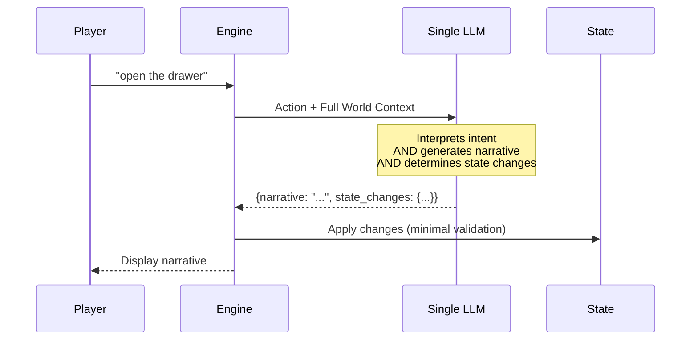
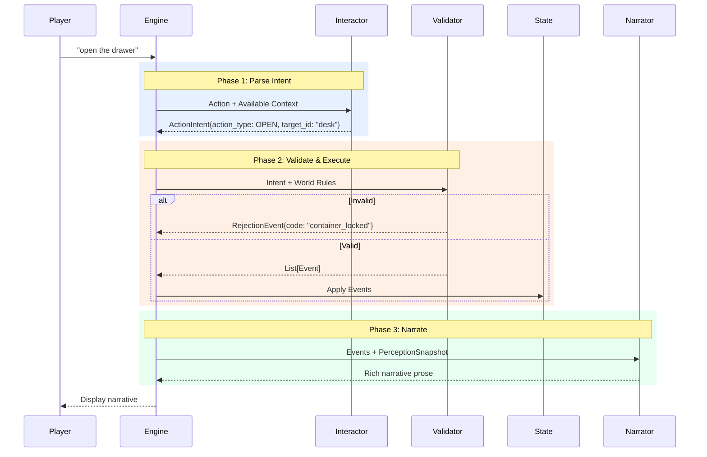
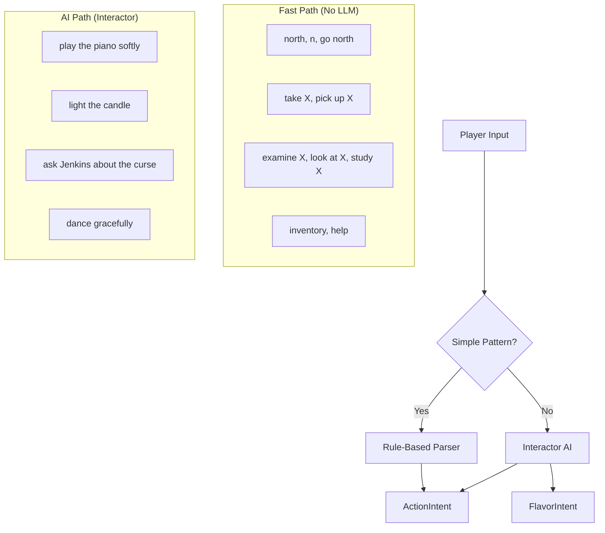
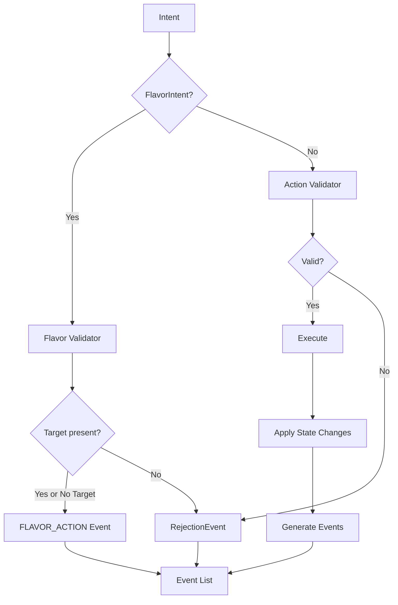
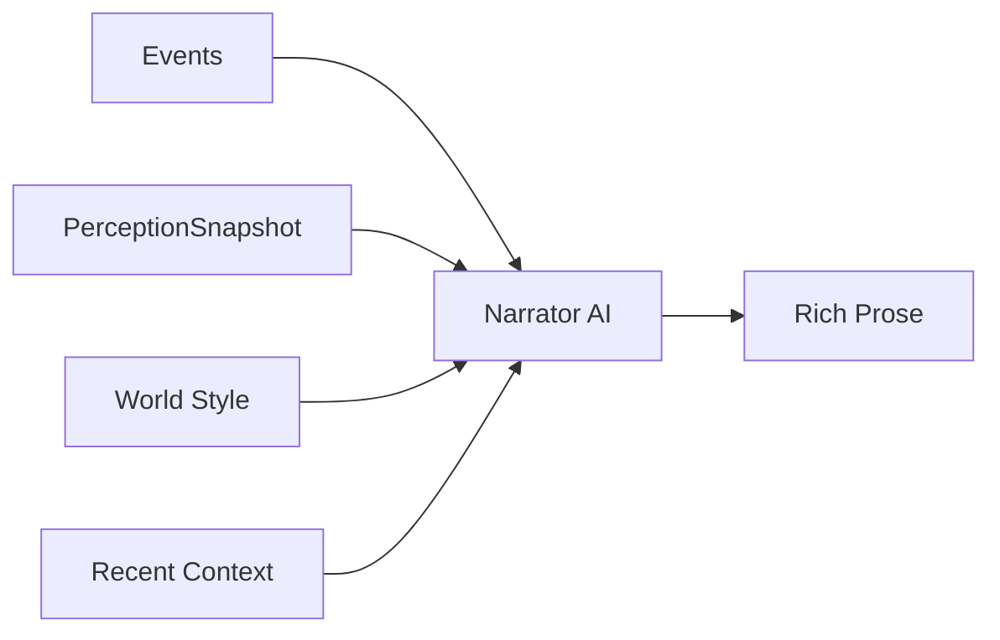
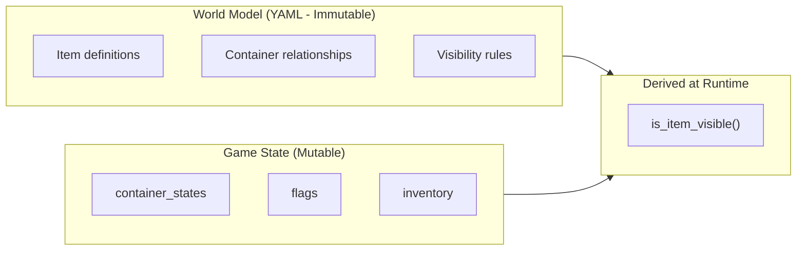

# Two-Phase Game Loop Architecture

A comprehensive specification for separating action parsing from narrative generation, enabling deterministic state management with AI-powered prose.

> **Status**: Authoritative Specification — December 2025
> **Related**: [Game Mechanics Design](../ideas/game-mechanics-design.md) | [Vision](../docs/VISION.md) | [Architecture](../docs/ARCHITECTURE.md)
> **Supersedes**: Four exploratory documents now archived in `ideas/archive/`

---

## Table of Contents

1. [Executive Summary](#executive-summary)
2. [Current vs Proposed Architecture](#current-vs-proposed-architecture)
3. [Core Data Models](#core-data-models)
4. [The Two-Phase Flow](#the-two-phase-flow)
5. [Validation & Rejection Handling](#validation-rejection-handling)
6. [Rich Verb Handling](#rich-verb-handling)
7. [Visibility & Discovery Model](#visibility-discovery-model)
8. [Prompt Specifications](#prompt-specifications)
9. [Implementation Phases](#implementation-phases)
10. [Engine Coexistence](#engine-coexistence)
11. [API Changes](#api-changes)

---

## Executive Summary

### The Problem

The current GAIME architecture uses a **single LLM call** that interprets player input, determines state changes, AND generates narrative. This creates several issues:

1. **State inconsistency**: LLM may hallucinate state changes that violate world rules
2. **Validation gaps**: State changes are applied before we can validate them
3. **Debugging difficulty**: Hard to distinguish parsing errors from narrative issues
4. **Limited mechanics**: Difficulty enforcing strict rules (locks, puzzles) when LLM has full creative freedom
5. **Determinism**: Same input can produce different mechanical outcomes

### The Solution

Split the game loop into **two distinct phases**:

1. **Interaction Phase**: Parse player input → structured `ActionIntent` → validate against world rules → produce `Event` outcomes
2. **Narration Phase**: Generate rich prose based on confirmed events and world context

This separation ensures:
- Game mechanics are **deterministic and validatable**
- Narrative **always reflects actual game state**
- Each component can be **tested, debugged, and optimized independently**
- Simple actions can **bypass LLM entirely** (rule-based parsing)

### AI Personas

The architecture introduces two AI personas:

| Persona | Role | Focus |
|---------|------|-------|
| **Interactor** | Parse player input into structured intents | Mechanical understanding, no creativity |
| **Narrator** | Generate prose from confirmed events | Creative expression, no mechanics |

### Alignment with Vision

This architecture supports the [Vision](../docs/VISION.md) principles:
- **"Short story you played through"**: Maintains narrative focus while adding mechanical reliability
- **"No unwinnable states"**: Validation layer prevents game-breaking actions
- **"Guided freedom"**: Allows natural input while enforcing world rules
- **"Curated worlds"**: Enables more sophisticated puzzle mechanics

---

## Current vs Proposed Architecture

### Current Architecture (Single LLM)



**Issues:**
- LLM may invent state changes not defined in the world
- Narrative may describe events that didn't happen
- No opportunity to reject invalid actions before narration

### Proposed Architecture (Two-Phase)



---

## Core Data Models

### ActionIntent

An `ActionIntent` represents the **parsed interpretation** of what the player is trying to do, before validation.

```python
from enum import Enum
from pydantic import BaseModel, Field


class ActionType(str, Enum):
    """Primary categories of player actions"""

    # Movement & Observation
    MOVE = "move"              # Navigate between locations
    BROWSE = "browse"          # Survey surroundings ("look", "look around", "l")

    # Object Interaction
    EXAMINE = "examine"        # Look at something closely (includes "look at X")
    TAKE = "take"              # Pick up an item
    DROP = "drop"              # Put down an item
    USE = "use"                # Use item (standalone or on target)
    OPEN = "open"              # Open container/door
    CLOSE = "close"            # Close container/door

    # Communication
    TALK = "talk"              # Speak to NPC
    ASK = "ask"                # Ask NPC about topic
    GIVE = "give"              # Give item to NPC
    SHOW = "show"              # Show item to NPC

    # Environment
    LISTEN = "listen"          # Listen for sounds
    SEARCH = "search"          # Search area/container

    # Meta
    WAIT = "wait"              # Pass time
    INVENTORY = "inventory"    # Check inventory
    HELP = "help"              # Show help

    # Note: "look at X" is EXAMINE. "look around" / "look" is BROWSE.


class ActionIntent(BaseModel):
    """Structured representation of player intent.

    All entity references use the `_id` suffix to indicate resolved IDs
    from the world model. The Interactor is responsible for resolving
    player descriptions ("the shiny key") to entity IDs ("brass_key").
    """

    type: Literal["action_intent"] = "action_intent"
    action_type: ActionType

    # Original player input
    raw_input: str

    # Original verb used (for rich narration)
    verb: str

    # Primary target (resolved entity ID: item_id, npc_id, detail_id, or direction)
    target_id: str

    # Action-specific secondary fields (all resolved IDs, mutually exclusive):
    instrument_id: str | None = None   # USE: "use INSTRUMENT on target"
    topic_id: str | None = None        # ASK: resolved conversation topic
    recipient_id: str | None = None    # GIVE/SHOW: "give item to RECIPIENT"

    # Confidence score (0.0-1.0) when AI-parsed
    confidence: float = 1.0

    # Alternative interpretations (for disambiguation)
    alternatives: list["ActionIntent"] = Field(default_factory=list)


class FlavorIntent(BaseModel):
    """Actions that add atmosphere but don't change game state.

    FlavorIntent is used for:
    - Physical expressions: "jump around", "dance", "sing", "wave"
    - Improvised dialogue: "ask Jenkins about football" (undefined topic)

    References may be unresolved (raw descriptions) or resolved IDs.
    FlavorIntents still undergo lightweight validation for target presence.
    """

    type: Literal["flavor_intent"] = "flavor_intent"
    verb: str
    raw_input: str

    # Optional context (may be entity ID or raw description)
    target: str | None = None          # Entity reference or description
    topic: str | None = None           # Unresolved dialogue topic
    manner: str | None = None          # Adverbial modifier ("dance GRACEFULLY")
```

### ActionIntent Examples

| Player Input | Parsed Intent |
|--------------|---------------|
| "north" | `ActionIntent(action_type=MOVE, target_id="north", verb="go")` |
| "look around" | `ActionIntent(action_type=BROWSE, target_id="", verb="look")` |
| "l" | `ActionIntent(action_type=BROWSE, target_id="", verb="look")` |
| "examine the painting" | `ActionIntent(action_type=EXAMINE, target_id="family_portrait", verb="examine")` |
| "look at the desk" | `ActionIntent(action_type=EXAMINE, target_id="writing_desk", verb="look at")` |
| "pick up the key" | `ActionIntent(action_type=TAKE, target_id="brass_key", verb="pick up")` |
| "use key on door" | `ActionIntent(action_type=USE, target_id="front_door", instrument_id="brass_key", verb="use")` |
| "light candle with matches" | `ActionIntent(action_type=USE, target_id="candle", instrument_id="matches", verb="light")` |
| "talk to Jenkins" | `ActionIntent(action_type=TALK, target_id="butler_jenkins", verb="talk")` |
| "ask Jenkins about the curse" | `ActionIntent(action_type=ASK, target_id="butler_jenkins", topic_id="family_curse", verb="ask")` |
| "give apple to Jenkins" | `ActionIntent(action_type=GIVE, target_id="red_apple", recipient_id="butler_jenkins", verb="give")` |
| "ask Jenkins about football" | `FlavorIntent(verb="ask", target="butler_jenkins", topic="football")` |
| "jump around" | `FlavorIntent(verb="jump", manner="around")` |
| "dance gracefully" | `FlavorIntent(verb="dance", manner="gracefully")` |
| "wave at the painting" | `FlavorIntent(verb="wave", target="the painting")` |

**Naming Convention**: Fields with `_id` suffix contain resolved entity IDs from the world model. Fields without `_id` may contain raw player descriptions.

**Defined vs Improvised Topics**: When a player asks an NPC about a topic, the Interactor checks if it matches a defined topic in the NPC's knowledge. If matched, it outputs `ActionIntent` with `topic_id`. If not matched, it outputs `FlavorIntent` with `topic` for AI improvisation.

### Event System

Events represent **what happened** as a result of a validated action. They are the source of truth for state changes.

```python
class EventType(str, Enum):
    """Types of events that can occur"""

    # Movement & Observation
    LOCATION_CHANGED = "location_changed"
    SCENE_BROWSED = "scene_browsed"    # Player surveyed the location

    # Items
    ITEM_TAKEN = "item_taken"
    ITEM_DROPPED = "item_dropped"
    ITEM_USED = "item_used"
    ITEM_REVEALED = "item_revealed"
    ITEM_CONSUMED = "item_consumed"

    # Containers
    CONTAINER_OPENED = "container_opened"
    CONTAINER_CLOSED = "container_closed"

    # Discovery
    DETAIL_EXAMINED = "detail_examined"
    SECRET_DISCOVERED = "secret_discovered"
    EXIT_REVEALED = "exit_revealed"

    # NPCs
    NPC_GREETED = "npc_greeted"
    NPC_CONVERSATION = "npc_conversation"
    NPC_ITEM_GIVEN = "npc_item_given"
    NPC_ITEM_RECEIVED = "npc_item_received"

    # Game State
    FLAG_SET = "flag_set"
    INTERACTION_TRIGGERED = "interaction_triggered"
    VICTORY_ACHIEVED = "victory_achieved"

    # Meta
    ACTION_REJECTED = "action_rejected"
    NOTHING_HAPPENED = "nothing_happened"
    FLAVOR_ACTION = "flavor_action"


class Event(BaseModel):
    """Represents something that happened in the game world"""

    type: EventType

    # What was involved
    subject: str | None = None      # Primary entity (item_id, npc_id, location_id)
    target: str | None = None       # Secondary entity

    # State changes to apply
    state_changes: dict = Field(default_factory=dict)

    # Context for narration
    context: dict = Field(default_factory=dict)

    # Was this the primary outcome or a side effect?
    primary: bool = True


class RejectionEvent(Event):
    """Event for rejected/failed actions with in-world explanation."""

    type: EventType = EventType.ACTION_REJECTED

    # Machine-readable rejection code
    rejection_code: str

    # Human-readable reason (seed for Narrator)
    rejection_reason: str

    # What would have happened if successful (for hints)
    would_have: str | None = None
```

### Rejection Codes

A comprehensive set of rejection codes for validation failures:

| Code | Category | Description |
|------|----------|-------------|
| `NO_EXIT` | Movement | Direction not available |
| `EXIT_NOT_VISIBLE` | Movement | Exit exists but undiscovered |
| `EXIT_LOCKED` | Movement | Exit is locked |
| `EXIT_BLOCKED` | Movement | Exit blocked (rubble, fire, etc.) |
| `PRECONDITION_FAILED` | Requirements | Missing flag/item/light/etc. |
| `ITEM_NOT_VISIBLE` | Items | Can't interact with hidden item |
| `ITEM_NOT_HERE` | Items | Item at different location |
| `ITEM_NOT_PORTABLE` | Items | Fixed in place |
| `ITEM_TOO_HEAVY` | Items | Portable but too heavy |
| `ALREADY_HAVE` | Items | Item already in inventory |
| `CONTAINER_LOCKED` | Containers | Container is locked |
| `CONTAINER_ALREADY_OPEN` | Containers | Already open |
| `CONTAINER_ALREADY_CLOSED` | Containers | Already closed |
| `NPC_NOT_PRESENT` | NPCs | NPC not at this location |
| `NPC_HOSTILE` | NPCs | NPC won't interact |
| `NPC_BUSY` | NPCs | NPC is occupied |
| `TOOL_INSUFFICIENT` | Combinations | Tool not suitable |
| `AMBIGUOUS_TARGET` | Parsing | Multiple matches for target |
| `ALREADY_DONE` | Logic | One-time interaction already used |
| `SAFETY_GUARDRAIL` | Safety | Would create unwinnable state |

### PerceptionSnapshot

The `PerceptionSnapshot` defines exactly what information the Narrator is allowed to see. This prevents spoilers and ensures hidden items are never mentioned.

```python
class VisibleEntity(BaseModel):
    """An entity visible to the player"""
    id: str
    name: str
    description: str | None = None
    is_new: bool = False  # Just revealed this turn


class PerceptionSnapshot(BaseModel):
    """What the Narrator is allowed to know about the current state.

    CRITICAL: Hidden items must NEVER appear in this snapshot.
    """

    # Current location
    location_id: str
    location_name: str
    location_atmosphere: str | None = None

    # Visible entities (filtered by visibility rules)
    visible_items: list[VisibleEntity] = Field(default_factory=list)
    visible_details: list[VisibleEntity] = Field(default_factory=list)
    visible_exits: list[dict] = Field(default_factory=list)  # {direction, destination_name, description}
    visible_npcs: list[VisibleEntity] = Field(default_factory=list)

    # Player state
    inventory: list[VisibleEntity] = Field(default_factory=list)

    # Contextual hints (spoiler-safe)
    affordances: dict = Field(default_factory=dict)
    # Example: {"openable_containers": ["desk_drawer"], "usable_tools": ["matches"]}

    # Known facts from flags/discoveries (not spoilers)
    known_facts: list[str] = Field(default_factory=list)
```

**Anti-Spoiler Rule**: If an item has `hidden=true` or is inside a closed container, it must NOT appear in `visible_items`. The PerceptionSnapshot is the single source of truth for what the Narrator can mention.

---

## The Two-Phase Flow

### Phase 1: Parse Intent



**Note**: "look around" or bare "look" is treated as re-narration of the current location (not a separate ActionType). "look at X" is parsed as EXAMINE.

#### Rule-Based Parser (Fast Path)

For common patterns, parse without LLM:

```python
class RuleBasedParser:
    """Parse common actions without LLM"""

    DIRECTION_PATTERNS = {
        r'^(go\s+)?(north|n)$': ('north', 'go'),
        r'^(go\s+)?(south|s)$': ('south', 'go'),
        r'^(go\s+)?(east|e)$': ('east', 'go'),
        r'^(go\s+)?(west|w)$': ('west', 'go'),
        r'^(go\s+)?(up|u)$': ('up', 'go'),
        r'^(go\s+)?(down|d)$': ('down', 'go'),
        r'^(go\s+)?back$': ('back', 'go'),
        r'^leave$': ('back', 'leave'),
        r'^exit$': ('back', 'exit'),
    }

    EXAMINE_PATTERNS = [
        r'^(examine|look at|inspect|study|check)\s+(?:the\s+)?(.+)$',
        r'^x\s+(.+)$',  # Shorthand
    ]

    TAKE_PATTERNS = [
        r'^(take|get|grab|pick up)\s+(?:the\s+)?(.+)$',
    ]

    def __init__(self, world: WorldData):
        self.world = world

    def parse(self, raw_input: str, state: GameState) -> ActionIntent | None:
        """Try rule-based parsing. Returns None if LLM needed."""
        normalized = raw_input.lower().strip()

        # Check movement
        for pattern, (direction, verb) in self.DIRECTION_PATTERNS.items():
            if re.match(pattern, normalized):
                return ActionIntent(
                    action_type=ActionType.MOVE,
                    target_id=direction,
                    verb=verb,
                    raw_input=raw_input,
                    confidence=1.0
                )

        # Check examine patterns
        for pattern in self.EXAMINE_PATTERNS:
            match = re.match(pattern, normalized)
            if match:
                target_text = match.group(2) if len(match.groups()) > 1 else match.group(1)
                resolved_id = self._resolve_target(target_text, state)
                if resolved_id:
                    return ActionIntent(
                        action_type=ActionType.EXAMINE,
                        target_id=resolved_id,
                        verb="examine",
                        raw_input=raw_input,
                        confidence=0.95
                    )
                # Could not resolve - fall through to Interactor AI

        # ... more patterns ...

        return None  # Needs Interactor AI

    def _resolve_target(self, target_text: str, state: GameState) -> str | None:
        """Try to resolve target text to entity ID"""
        location = self.world.get_location(state.current_location)
        resolver = VisibilityResolver(self.world, state)

        # Check visible items
        for item in self.world.get_items_at_location(location.id):
            if resolver.is_item_visible(item.id):
                if self._matches(target_text, item):
                    return item.id

        # Check details
        for detail_id, detail in location.details.items():
            if self._matches(target_text, detail):
                return detail_id

        # Check NPCs
        for npc in self.world.get_npcs_at_location(location.id):
            if self._matches(target_text, npc):
                return npc.id

        return None

    def _matches(self, text: str, entity) -> bool:
        """Check if text matches entity name or aliases"""
        text = text.lower()
        if text == entity.id.lower() or text == entity.name.lower():
            return True
        return any(text == alias.lower() for alias in getattr(entity, 'aliases', []))
```

#### Interactor AI (Complex Path)

For ambiguous or freeform input, use LLM-powered Interactor:

```python
class InteractorAI:
    """LLM-powered action parser for complex inputs"""

    async def parse(self, raw_input: str, context: ParserContext) -> ActionIntent | FlavorIntent:
        """Parse complex player input into structured intent"""

        prompt = self._build_interactor_prompt(raw_input, context)
        response = await get_completion(prompt, response_format="json")

        return self._parse_response(response, raw_input)
```

### Phase 2: Validate & Execute



#### FlavorIntent Validation

FlavorIntents undergo lightweight validation to ensure targets are present:

```python
class FlavorValidator:
    """Lightweight validation for flavor actions"""

    def validate(self, intent: FlavorIntent, state: GameState, world: WorldData) -> ValidationResult:
        # If no target, always valid (pure atmosphere)
        if not intent.target:
            return ValidationResult(valid=True)

        # Try to resolve target to an entity
        entity = self._resolve_target(intent.target, state, world)

        if entity:
            return ValidationResult(valid=True, context={"resolved_target": entity.id})

        # Target specified but not found
        return ValidationResult(
            valid=False,
            rejection_code="TARGET_NOT_PRESENT",
            rejection_reason=f"You don't see '{intent.target}' here."
        )

    def _resolve_target(self, target: str, state: GameState, world: WorldData) -> Entity | None:
        """Try to find target among visible entities"""
        location = world.get_location(state.current_location)

        # Check NPCs
        for npc in world.get_npcs_at_location(location.id):
            if target.lower() in [npc.id, npc.name.lower()] + [a.lower() for a in npc.aliases]:
                return npc

        # Check visible items
        resolver = VisibilityResolver(world, state)
        for item in world.get_items_at_location(location.id):
            if resolver.is_item_visible(item.id):
                if target.lower() in [item.id, item.name.lower()] + [a.lower() for a in item.aliases]:
                    return item

        # Check details
        for detail_id, detail in location.details.items():
            if target.lower() in [detail_id, detail.name.lower()] + [a.lower() for a in detail.aliases]:
                return detail

        return None
```

This ensures "wave at Jenkins" fails if Jenkins isn't present, while "dance gracefully" always succeeds.

#### Validation Rules

```python
class ActionValidator:
    """Validates actions against world rules"""

    def __init__(self, world: WorldData):
        self.world = world

    def validate_move(self, intent: ActionIntent, state: GameState) -> ValidationResult:
        """Validate movement action"""
        location = self.world.get_location(state.current_location)
        direction = intent.target_id

        # Check exit exists
        if direction not in location.exits:
            return ValidationResult(
                valid=False,
                rejection_code="NO_EXIT",
                rejection_reason=f"There's no way to go {direction} from here."
            )

        destination_id = location.exits[direction]
        exit_info = location.exit_details.get(direction)

        # Check if locked
        if exit_info and exit_info.locked:
            return ValidationResult(
                valid=False,
                rejection_code="EXIT_LOCKED",
                rejection_reason=exit_info.locked_description or "The way is locked.",
                context={"requires_key": exit_info.requires_key}
            )

        # Check if blocked
        if exit_info and exit_info.blocked:
            return ValidationResult(
                valid=False,
                rejection_code="EXIT_BLOCKED",
                rejection_reason=exit_info.blocked_reason or "The way is blocked."
            )

        return ValidationResult(valid=True, context={"destination": destination_id})

    def validate_take(self, intent: ActionIntent, state: GameState) -> ValidationResult:
        """Validate take action"""
        item = self.world.get_item(intent.target_id)

        if not item:
            return ValidationResult(
                valid=False,
                rejection_code="ITEM_NOT_VISIBLE",
                rejection_reason=f"You don't see any '{intent.target_id}' here."
            )

        if intent.target_id in state.inventory:
            return ValidationResult(
                valid=False,
                rejection_code="ALREADY_HAVE",
                rejection_reason=f"You already have the {item.name}."
            )

        if not item.portable:
            return ValidationResult(
                valid=False,
                rejection_code="ITEM_NOT_PORTABLE",
                rejection_reason=item.not_portable_reason or f"You can't take the {item.name}."
            )

        # Check visibility using resolver
        resolver = VisibilityResolver(self.world, state)
        if not resolver.is_item_visible(intent.target_id):
            return ValidationResult(
                valid=False,
                rejection_code="ITEM_NOT_VISIBLE",
                rejection_reason=f"You don't see any '{intent.target_id}'."
            )

        return ValidationResult(valid=True)
```

### Phase 3: Narrate

The Narrator AI receives confirmed events and the PerceptionSnapshot to generate prose.



---

## Validation & Rejection Handling

### Rejection Narration Philosophy

Rejections should feel natural, not like error messages:

```python
# ❌ BAD: System message
"Error: Cannot move north. Door is locked."

# ✅ GOOD: In-world narrative
"You try the handle, but the heavy oak door is locked tight. It won't budge."

# ✅ GOOD: With subtle hint
"Your fingers brush the desk drawer's brass handle. It rattles but
doesn't open. Something inside clinks faintly."
```

### Rejection Flow

```python
# Player: "go north" (locked door)
intent = ActionIntent(action_type=MOVE, target_id="north", verb="go")

# Validation fails
rejection = RejectionEvent(
    rejection_code="EXIT_LOCKED",
    rejection_reason="The heavy iron door to the basement is firmly locked.",
    subject="basement_door",
    context={
        "requires_key": "iron_key",
        "lock_description": "A heavy iron padlock secures the door."
    },
    would_have="Access the basement"
)

# Narrator receives rejection event + PerceptionSnapshot
# Generates: "You push against the basement door, but it doesn't budge.
# A heavy iron padlock—old but sturdy—secures it firmly shut."
```

---

## Rich Verb Handling

### The Challenge

Players use creative, varied language:
- "play piano" (creative action)
- "light candle with matches" (item combination)
- "jump around" (physical expression)
- "eat apple" (consumable use)
- "ask about football" (improvised dialogue)

### The Solution: Interactor AI Interpretation

The Interactor AI handles verb interpretation directly, without a hardcoded VerbClassifier. Given the world context (available items, NPCs, defined interactions), the Interactor:

1. **Resolves targets** to entity IDs from the world model
2. **Maps verbs** to ActionTypes (e.g., "light" → USE with instrument)
3. **Identifies FlavorIntents** for atmospheric actions or improvised dialogue

This approach is more flexible than hardcoded verb mappings and can adapt to world-specific vocabulary.

### FlavorIntent Handling

When the Interactor identifies a FlavorIntent, it undergoes lightweight validation (target presence check) before going to the Narrator:

```python
# Player: "dance around the room"
flavor = FlavorIntent(
    verb="dance",
    manner="around",
    raw_input="dance around the room"
)

# Lightweight validation: no target, so skip
# Goes to Narrator with event
event = Event(
    type=EventType.FLAVOR_ACTION,
    context={
        "verb": "dance",
        "manner": "around",
        "narration_hint": "Player is dancing. Keep it brief (1-2 sentences). Match location atmosphere."
    }
)

# Narrator generates:
# "You twirl between the dusty bookshelves, your footsteps echoing in the empty library."
```

### Defined Interactions vs FlavorIntent

**Rule of thumb:**
- If an action should **change state** → define a world interaction (produces mechanical events)
- If it's just atmosphere → allow as `FlavorIntent` (no state change)

```yaml
# World definition for mechanical "play piano"
grand_piano:
  name: "Grand Piano"
  portable: false
  location: sitting_room

  use_actions:
    play:
      triggers: ["play piano", "play the piano"]
      sets_flag: played_piano
      narrative_prompt: |
        The player plays the piano. Make it:
        - Melancholy and haunting
        - Slightly out of tune
```

If no `use_action` is defined, "play piano" becomes a FlavorIntent and gets atmospheric narration without setting any flags.

### Conversation Topic Resolution

When processing ASK actions, the Interactor checks the NPC's defined topics:

```yaml
# npcs.yaml
butler_jenkins:
  name: "Jenkins"
  aliases: ["the butler", "Mr. Jenkins"]

  topics:
    family_curse:
      triggers: ["the curse", "family curse", "the old curse"]
      knowledge: "The curse began in 1823 when..."
      sets_flag: learned_about_curse

    manor_secrets:
      triggers: ["secrets", "hidden rooms"]
      knowledge: "There are passages behind the walls..."
```

- **Defined topic match** → `ActionIntent(action_type=ASK, target_id="butler_jenkins", topic_id="family_curse")`
- **No topic match** → `FlavorIntent(verb="ask", target="butler_jenkins", topic="football")`

The Validator confirms NPC presence; the Narrator uses defined knowledge or improvises within character.

---

## Visibility & Discovery Model

### The Problem

Items can be hidden in containers, behind objects, or revealed through interactions. We need to ensure:
1. Hidden items never leak into narration
2. Discovery moments feel earned
3. State changes make items visible

### Key Design Decision: Derived Visibility

**Visibility is derived at runtime, not stored.**

The world model defines visibility *rules* (initial state, reveal conditions). The game state tracks *what happened* (container states, flags). Visibility is computed by applying rules to current state.



**Benefits:**
- Single source of truth for visibility rules (world model)
- No sync issues between stored visibility and container state
- Supports complex conditions without storing every outcome

### Visibility States

Items have an `initial_visibility` that determines how they start:

| State | Description | When Visible |
|-------|-------------|--------------|
| `VISIBLE` | Obviously present | Always |
| `CONCEALED` | Inside a closed container | When container is open |
| `HIDDEN` | Secret, requires discovery | When reveal_condition is met |

### World Model: Visibility Rules

```python
class ItemVisibility(str, Enum):
    """How an item starts"""
    VISIBLE = "visible"      # Always visible (default)
    CONCEALED = "concealed"  # In a closed container
    HIDDEN = "hidden"        # Secret, needs discovery

class RevealCondition(BaseModel):
    """When a hidden item becomes visible"""
    requires_flag: str | None = None           # Flag must be set
    requires_container_open: str | None = None # Container must be open

class ItemDefinition(BaseModel):
    """From items.yaml - IMMUTABLE during gameplay"""
    id: str
    name: str
    portable: bool = True
    initial_visibility: ItemVisibility = ItemVisibility.VISIBLE
    container_id: str | None = None            # If inside a container
    reveal_condition: RevealCondition | None = None
    found_description: str | None = None       # For discovery narration
```

### Game State: What Happened

```python
class GameState(BaseModel):
    """What changes during play - NO stored visibility"""
    current_location: str
    inventory: list[str] = []                    # Item IDs player has
    flags: set[str] = set()                      # Triggered conditions
    container_states: dict[str, bool] = {}       # container_id -> is_open
    visited_locations: set[str] = set()          # For first-visit detection

    # NOT stored: item visibility (derived from above)
```

### VisibilityResolver: Computing Visibility

```python
class VisibilityResolver:
    """Determines what the player can see RIGHT NOW"""

    def __init__(self, world: WorldData, state: GameState):
        self.world = world
        self.state = state

    def is_item_visible(self, item_id: str) -> bool:
        """Can the player see this item?"""
        item = self.world.get_item(item_id)
        if not item:
            return False

        # Item in inventory is always "visible" (accessible)
        if item_id in self.state.inventory:
            return True

        # Item must be at player's location
        if item.location != self.state.current_location:
            return False

        # Check visibility based on initial state
        match item.initial_visibility:
            case ItemVisibility.VISIBLE:
                return True

            case ItemVisibility.CONCEALED:
                # Must be in an open container
                if not item.container_id:
                    return True  # Misconfigured, default visible
                return self._is_container_open(item.container_id)

            case ItemVisibility.HIDDEN:
                # Must meet reveal condition
                if not item.reveal_condition:
                    return False  # Stays hidden without condition
                return self._check_reveal_condition(item.reveal_condition)

    def _is_container_open(self, container_id: str) -> bool:
        """Check if container is currently open"""
        container = self.world.get_item(container_id)
        initially_open = container.initially_open if container else False
        return self.state.container_states.get(container_id, initially_open)

    def _check_reveal_condition(self, condition: RevealCondition) -> bool:
        """Check if reveal condition is satisfied"""
        if condition.requires_flag:
            if condition.requires_flag not in self.state.flags:
                return False

        if condition.requires_container_open:
            if not self._is_container_open(condition.requires_container_open):
                return False

        return True
```

### Container Model Example

```yaml
# items.yaml
desk:
  name: "Old Writing Desk"
  portable: false
  examine: "A heavy oak desk with brass handles on its single drawer."
  location: study

  container:
    initially_open: false
    locked: false
    contents: [brass_key, old_letter]

brass_key:
  name: "Small Brass Key"
  portable: true
  location: study
  container_id: desk                    # Inside the desk
  initial_visibility: concealed         # Hidden until container opens
  found_description: "A small brass key, tarnished with age, lies in the drawer."

# For non-container secrets:
secret_key:
  name: "Hidden Key"
  portable: true
  location: study
  initial_visibility: hidden
  reveal_condition:
    requires_flag: examined_painting
  found_description: "A key falls from behind the portrait."
```

**Note**: Container items derive visibility from container state. Hidden items use flag-based reveal conditions. These are complementary, not redundant.

### Details / Scenery Elements

Locations can define examinable scenery that isn't a portable item:

```yaml
# locations.yaml
entrance_hall:
  name: "Entrance Hall"
  atmosphere: "A grand hall with portraits lining the walls..."

  details:
    family_portrait:
      name: "Family Portrait"
      aliases: ["painting", "portrait", "the painting"]
      examine: "Stern faces stare down at you. One frame seems slightly askew."
      interactions:
        adjust:
          triggers: ["adjust portrait", "move painting", "straighten frame"]
          sets_flag: examined_painting
          narrative: "As you adjust the frame, something clinks behind it."

    chandelier:
      name: "Crystal Chandelier"
      aliases: ["chandelier", "light fixture"]
      examine: "Dust-covered crystals catch what little light filters through."
```

Details are referenced by ID in ActionIntent (`target_id="family_portrait"`), just like items and NPCs.

### Visibility in PerceptionSnapshot

The PerceptionSnapshot **only includes visible entities** (items, details, NPCs):

```python
# BEFORE opening drawer
snapshot = PerceptionSnapshot(
    location_id="study",
    location_name="The Study",
    visible_items=[],  # brass_key NOT here
    visible_details=[
        VisibleEntity(id="desk", name="Old Writing Desk", description="...drawer appears closed...")
    ],
    affordances={"openable_containers": ["desk"]}
)

# AFTER opening drawer
snapshot = PerceptionSnapshot(
    location_id="study",
    location_name="The Study",
    visible_items=[
        VisibleEntity(id="brass_key", name="Small Brass Key", is_new=True),
        VisibleEntity(id="old_letter", name="Yellowed Letter", is_new=True)
    ],
    visible_details=[
        VisibleEntity(id="desk", name="Old Writing Desk", description="...drawer stands open...")
    ]
)
```

### The Drawer Scenario Walkthrough

#### Turn 1: Player enters study

**Events**: `[LOCATION_CHANGED]`

**PerceptionSnapshot**: Desk visible, key NOT visible (concealed in closed container)

**Visibility Check**:
```python
resolver.is_item_visible("brass_key")  # → False
# - initial_visibility: CONCEALED
# - container_id: "desk"
# - container_states.get("desk", False) → False (closed)
```

**Narration**: "The study is cramped but cozy. An old writing desk dominates one corner, its single drawer shut tight."

*Key is NOT mentioned because VisibilityResolver returns False.*

#### Turn 2: Player opens drawer

**Intent**: `ActionIntent(action_type=OPEN, target_id="desk")`

**Validation**: ✅ Desk is a container, not locked

**State Change**: `container_states["desk"] = True`

**Events**:
```python
[
    Event(type=CONTAINER_OPENED, subject="desk"),
    Event(type=ITEM_REVEALED, subject="brass_key", context={"is_new": True}),
    Event(type=ITEM_REVEALED, subject="old_letter", context={"is_new": True})
]
```

**Visibility Check**:
```python
resolver.is_item_visible("brass_key")  # → True
# - initial_visibility: CONCEALED
# - container_id: "desk"
# - container_states.get("desk", False) → True (now open)
```

**PerceptionSnapshot**: Key and letter now in `visible_items` with `is_new=True`

**Narration**: "The drawer slides open with a reluctant creak. Inside, nestled in a bed of dust, you find a small brass key and a yellowed letter."

#### Turn 3: Player takes key

**Intent**: `ActionIntent(action_type=TAKE, target_id="brass_key")`

**Validation**: ✅ Key is visible (derived) and portable

**State Change**: `inventory.append("brass_key")`

**Events**: `[Event(type=ITEM_TAKEN, subject="brass_key")]`

**Narration**: "You pick up the brass key. It's cold and heavier than it looks."

---

## Prompt Specifications

### Interactor Prompt

```python
INTERACTOR_SYSTEM = """You are the Interactor for a text adventure game.

Your job is to interpret player input and identify the intended action.
You do NOT generate narrative - only structured action data.

## Output Format

Respond with JSON only. Choose ONE of these formats:

### For mechanical actions (state-changing):
{
    "type": "action_intent",
    "action_type": "<MOVE|EXAMINE|TAKE|DROP|USE|OPEN|CLOSE|TALK|ASK|GIVE|SHOW|SEARCH|WAIT>",
    "target_id": "<resolved entity ID>",
    "instrument_id": "<for USE: the tool being used>",
    "topic_id": "<for ASK: resolved topic ID if defined>",
    "recipient_id": "<for GIVE/SHOW: who receives>",
    "verb": "<the verb used>",
    "confidence": <0.0-1.0>,
    "reasoning": "<brief explanation>"
}

### For flavor/atmospheric actions (no state change):
{
    "type": "flavor_intent",
    "verb": "<the verb>",
    "target": "<entity reference or description>",
    "topic": "<for ASK: unresolved topic string>",
    "manner": "<adverbial modifier>",
    "reasoning": "<brief explanation>"
}

## Naming Convention

Fields ending in `_id` must contain resolved entity IDs from the context below.
Fields without `_id` may contain raw player descriptions.

## Current Context

Location: {location_id} ({location_name})

Available exits: {available_exits}

Items here (format: id - "Name" - aliases):
{items_at_location}

Details here (format: id - "Name" - aliases):
{details_at_location}

NPCs present (format: id - "Name" - aliases):
{npcs_present}

NPC conversation topics (format: npc_id.topic_id - triggers):
{npc_topics}

Player inventory:
{inventory}

## Guidelines

1. ALWAYS resolve targets to entity IDs from the context above
2. For "use X on Y": target_id is the destination, instrument_id is the tool
3. For ASK with a defined topic: use action_intent with topic_id
4. For ASK with undefined topic: use flavor_intent with topic
5. Use flavor_intent for: jump, dance, wave, sing, laugh, etc.
6. If ambiguous, use lower confidence
7. Never invent entities not listed in context

## Examples

Input: "examine the painting"
Output: {"type": "action_intent", "action_type": "EXAMINE", "target_id": "family_portrait", "verb": "examine", "confidence": 1.0, "reasoning": "Examining the family portrait detail"}

Input: "use key on door"
Output: {"type": "action_intent", "action_type": "USE", "target_id": "front_door", "instrument_id": "brass_key", "verb": "use", "confidence": 0.95, "reasoning": "Using brass key on front door"}

Input: "ask Jenkins about the curse"
Output: {"type": "action_intent", "action_type": "ASK", "target_id": "butler_jenkins", "topic_id": "family_curse", "verb": "ask", "confidence": 1.0, "reasoning": "Asking about family_curse - a defined topic"}

Input: "ask Jenkins about football"
Output: {"type": "flavor_intent", "verb": "ask", "target": "butler_jenkins", "topic": "football", "reasoning": "No defined topic for football - improvised dialogue"}

Input: "dance gracefully"
Output: {"type": "flavor_intent", "verb": "dance", "manner": "gracefully", "reasoning": "Atmospheric action, no state change"}
"""

INTERACTOR_USER = """Player input: "{player_input}"

Parse this action."""
```

### Narrator Prompt

```python
NARRATOR_SYSTEM = """You are the Narrator for {world_name}, a text adventure game.

## Your Role

Generate immersive, atmospheric prose based on confirmed game events.
You do NOT determine what happens - that has already been decided.
You bring those events to life through vivid description.

## World Context

Theme: {theme}
Tone: {tone}
Player: {hero_name}

## Narrative Style

{narrative_style_guidance}

## Guidelines

1. Write in second person ("You see...", "You feel...")
2. Match the world's tone and atmosphere
3. For rejections, make them feel natural, not like error messages
4. Reference recent events for continuity
5. NEVER mention items not in the visible items list
6. When items have is_new=True, emphasize the discovery
7. Keep responses to 2-4 paragraphs unless a major moment
8. End with sensory details that ground the player
"""

NARRATOR_USER = """## Current Location

{location_name}
Atmosphere: {location_atmosphere}

## Events to Narrate

{events_description}

## Visible Items

{visible_items}

## Player Inventory

{inventory}

## Recent Context

{recent_narrative_context}

Generate the narrative for these events."""
```

### Event-Specific Guidance

```python
def build_event_guidance(events: list[Event], world: WorldData) -> str:
    """Build specific guidance for each event type"""

    guidance = []

    for event in events:
        if event.type == EventType.LOCATION_CHANGED:
            loc = world.get_location(event.context.get("destination"))
            first_visit = event.context.get("first_visit", False)
            guidance.append(f"""
LOCATION_CHANGED: Player moved to {loc.name}
- {"First visit - make it a discovery moment" if first_visit else "Revisit - acknowledge familiarity"}
- Describe the atmosphere: {loc.atmosphere}
- Mention visible exits naturally
""")

        elif event.type == EventType.ACTION_REJECTED:
            guidance.append(f"""
ACTION_REJECTED: Player's action was blocked
- Code: {event.rejection_code}
- Reason: {event.rejection_reason}
- Make this feel natural, NOT like an error message
- Optionally hint at what might work
""")

        elif event.type == EventType.ITEM_REVEALED:
            item = world.get_item(event.subject)
            guidance.append(f"""
ITEM_REVEALED: {item.name} is now visible
- This is a discovery moment - build anticipation
- Found description: {item.found_description or 'N/A'}
- Make it feel earned
""")

        elif event.type == EventType.FLAVOR_ACTION:
            guidance.append(f"""
FLAVOR_ACTION: Atmospheric action (no state change)
- Verb: {event.context.get('verb')}
- Keep it brief (1-2 sentences)
- Match location mood
- This is just flavor - no mechanics
""")

    return "\n---\n".join(guidance)
```

---

## Implementation Phases

### Phase 0: Foundation ✅

**Goal**: Create data models and engine selection infrastructure

- [x] Create `engine/two_phase/models/intent.py` with `ActionIntent`, `FlavorIntent`, `ActionType`
- [x] Create `engine/two_phase/models/event.py` with `Event`, `RejectionEvent`, `EventType`
- [x] Create `engine/two_phase/models/perception.py` with `PerceptionSnapshot`, `VisibleEntity`
- [x] Add `EngineVersion` enum (`CLASSIC`, `TWO_PHASE`) in `api/engine.py`
- [x] Add engine selection to session metadata (out-of-band from GameState)
- [x] Update API to support engine selection at game start
- [x] Add `GET /api/game/engines` endpoint
- [x] Add frontend engine selector in Advanced Options

### Phase 1: Simple Movement ✅

**Goal**: Movement-only two-phase loop without Interactor AI

- [x] Implement `RuleBasedParser` for direction patterns
- [x] Implement `MovementValidator`
- [x] Generate `LOCATION_CHANGED` events
- [x] Create basic Narrator prompt for location descriptions
- [x] Wire up two-phase flow for movement only
- [x] Return "command not understood" for non-movement actions (no fallback to classic)

**Implementation Notes** (completed):
- Complete engine separation: `TwoPhaseGameState` and `TwoPhaseStateManager` are independent from classic engine
- Engines share only world data loading (same YAML schema)
- Unsupported actions return a simple message without LLM call
- Opening narrative uses NarratorAI with `LOCATION_CHANGED` event (is_opening=True)

### Phase 2: Examination & Taking ✅

**Goal**: Add examine and take with InteractorAI for entity resolution

- [x] Implement `InteractorAI` with LLM-based entity resolution
- [x] Add `action_hint` and `target_id` fields to `FlavorIntent` for partial parsing
- [x] Implement `ExamineValidator` for items, details, and inventory
- [x] Implement `TakeValidator` with visibility and portability checks
- [x] Add `ITEM_EXAMINED` event type
- [x] Add Narrator handlers for `ITEM_EXAMINED`, `DETAIL_EXAMINED`, `ITEM_TAKEN`, `FLAVOR_ACTION`
- [x] Wire `TwoPhaseProcessor` to use Interactor and new validators
- [x] Unit tests for validators and Interactor

**Implementation Notes** (completed):
- InteractorAI receives PerceptionSnapshot and resolves player descriptions to entity IDs
- FlavorIntent with `action_hint` enables graduated parsing (verb known, target not found)
- Movement uses fast-path rule-based parser, everything else goes to InteractorAI
- Narrator generates contextual descriptions for flavor actions (examine ceiling, dance, etc.)

**Deferred to later phases**:
- Location interactions that set flags (e.g., "examine portrait" → `sets_flag: examined_painting`) → Phase 3
- Container mechanics (open drawer → reveal items) → Phase 5
- INVENTORY meta command → Phase 6

### Phase 3: Interactions & USE Actions

**Goal**: Add world interactions, item use, and NPC dialogue

- [ ] Implement location/detail interactions with flag setting
- [ ] Handle "use X on Y" parsing in InteractorAI
- [ ] Add USE action validation with `use_actions` lookup
- [ ] Handle NPC communication parsing (TALK, ASK)
- [ ] Implement dialogue topic resolution (defined vs improvised)
- [ ] Generate `INTERACTION_TRIGGERED`, `FLAG_SET` events

### Phase 4: Full Narrator

**Goal**: Rich, context-aware narration

- [ ] Event-specific narration templates
- [ ] NPC dialogue generation with personality
- [ ] Discovery moment narration
- [ ] Rejection narration (natural, in-world)

### Phase 5: Containers & Visibility

**Goal**: Full drawer/container mechanics

- [ ] Implement container model in world schema
- [ ] Add OPEN/CLOSE validation
- [ ] Implement visibility state machine
- [ ] Generate `CONTAINER_OPENED`, `ITEM_REVEALED` events
- [ ] Update PerceptionSnapshot building to respect visibility

### Phase 6: Polish & Comparison

**Goal**: Feature parity and quality comparison

- [ ] Implement INVENTORY meta action
- [ ] Implement remaining action types (GIVE, SHOW, DROP, etc.)
- [ ] A/B testing framework for engine comparison
- [ ] Performance optimization
- [ ] Edge case handling
- [ ] Documentation updates

---

## Engine Coexistence

### Engine Versions

```python
class EngineVersion(str, Enum):
    """Available game engine versions"""

    CLASSIC = "classic"      # Current single-LLM architecture
    TWO_PHASE = "two_phase"  # New separated architecture
```

### Engine Factory

```python
class EngineFactory:
    """Factory for creating game engines"""

    @staticmethod
    def create_processor(
        state_manager: GameStateManager,
        engine_version: EngineVersion,
        debug: bool = False
    ) -> ActionProcessor:
        """Create the appropriate action processor"""

        if engine_version == EngineVersion.CLASSIC:
            return ClassicActionProcessor(state_manager, debug=debug)

        elif engine_version == EngineVersion.TWO_PHASE:
            return TwoPhaseActionProcessor(state_manager, debug=debug)

        raise ValueError(f"Unknown engine version: {engine_version}")
```

### Two-Phase Action Processor

```python
class TwoPhaseActionProcessor:
    """Two-phase game loop processor"""

    def __init__(self, state_manager: GameStateManager, debug: bool = False):
        self.state_manager = state_manager
        self.debug = debug

        world = state_manager.get_world()

        # Phase 1: Parsing
        self.rule_parser = RuleBasedParser(world)
        self.interactor = InteractorAI(world, debug=debug)

        # Phase 2: Validation
        self.action_validator = ActionValidator(world)
        self.flavor_validator = FlavorValidator(world)

        # Phase 3: Narration
        self.narrator = NarratorAI(world, debug=debug)

    async def process(self, action: str) -> ActionResponse:
        """Process action through two-phase pipeline"""

        state = self.state_manager.get_state()
        world = self.state_manager.get_world()

        # Phase 1: Parse Intent
        intent = self.rule_parser.parse(action, state)
        if intent is None:
            intent = await self.interactor.parse(action, state)

        # Phase 2: Validate & Execute
        if isinstance(intent, FlavorIntent):
            # Lightweight validation for flavor actions
            validation = self.flavor_validator.validate(intent, state)
            if validation.valid:
                events = [Event(
                    type=EventType.FLAVOR_ACTION,
                    context={
                        "verb": intent.verb,
                        "target": intent.target,
                        "topic": intent.topic,
                        "manner": intent.manner
                    }
                )]
            else:
                events = [validation.to_rejection_event()]
        else:
            # Full validation for action intents
            validation = self.action_validator.validate(intent, state)

            if validation.valid:
                events = self.action_validator.execute(intent, state)
                self._apply_events(events, state)
            else:
                events = [validation.to_rejection_event()]

        # Build perception snapshot (uses VisibilityResolver)
        resolver = VisibilityResolver(world, state)
        snapshot = self._build_perception_snapshot(state, world, resolver, events)

        # Phase 3: Narrate
        narrative = await self.narrator.narrate(events, snapshot)

        return ActionResponse(
            narrative=narrative,
            state=state,
            events=[e.model_dump() for e in events]
        )
```

---

## API Changes

### Updated Start Game Endpoint

**POST /api/game/start**

```python
class StartGameRequest(BaseModel):
    world_id: str
    engine: EngineVersion = EngineVersion.CLASSIC  # Default to classic
    debug: bool = False

class StartGameResponse(BaseModel):
    session_id: str
    narrative: str
    state: GameState
    engine_version: EngineVersion  # Confirm which engine
```

### New Engines Endpoint

**GET /api/game/engines**

```python
@router.get("/engines")
async def list_engines():
    return {
        "engines": [
            {
                "id": "classic",
                "name": "Classic Engine",
                "description": "Single LLM call for action processing and narration"
            },
            {
                "id": "two_phase",
                "name": "Two-Phase Engine",
                "description": "Separated parsing (Interactor) and narration (Narrator)"
            }
        ],
        "default": "classic"
    }
```

### GameState Updates

```python
class GameState(BaseModel):
    # ... existing fields ...

    engine_version: EngineVersion = EngineVersion.CLASSIC

    # New fields for two-phase engine
    container_states: dict[str, bool] = Field(default_factory=dict)  # container_id -> is_open
    visited_locations: set[str] = Field(default_factory=set)         # For first-visit detection

    # Note: Item visibility is DERIVED from container_states + flags, not stored directly.
    # See VisibilityResolver in "Visibility & Discovery Model" section.
```

---

## Summary

This specification defines a **two-phase game loop architecture** that:

1. **Separates concerns**: Interactor (parsing) → Validator → Narrator
2. **Improves reliability**: State changes are validated before narration
3. **Enables optimization**: Simple actions bypass LLM entirely
4. **Maintains flexibility**: Rich verb handling and FlavorIntent for atmosphere
5. **Supports discovery**: Derived visibility model for containers and hidden items
6. **Allows comparison**: Both engines coexist for A/B testing

### Key Design Decisions

| Decision | Choice | Rationale |
|----------|--------|-----------|
| AI Personas | Interactor + Narrator | Clear, memorable names |
| Failure handling | `RejectionEvent` with codes | Uniform event-based approach |
| No-op actions | `FlavorIntent` | Explicit separation from mechanics |
| Player-visible state | `PerceptionSnapshot` | Prevents spoilers in narration |
| Parsing strategy | Rule-based first, AI fallback | Fast path for common actions |
| Entity references | `_id` suffix convention | Clear distinction: resolved vs raw |
| Visibility | Derived from state, not stored | Single source of truth, no sync issues |
| Conversation topics | Defined → ActionIntent, else FlavorIntent | Mechanical vs improvisational dialogue |
| LOOK vs EXAMINE | Merged into EXAMINE | "look around" is re-narration, "look at X" is EXAMINE |
| Verb handling | Interactor AI interprets | No hardcoded VerbClassifier; flexible adaptation |

### Success Criteria

1. **Movement Phase 1**: Two-phase movement feels identical to classic engine
2. **Full Parity**: All classic engine behaviors replicated
3. **Improved Reliability**: Zero hallucinated state changes
4. **Performance**: Average latency ≤ 1.5x classic engine
5. **Player Experience**: Blind testers cannot distinguish engines

---

*Document Version: 1.1*
*Created: December 2025*
*Last Updated: December 2025*
*Status: Authoritative Specification*
*Supersedes: four exploratory documents in `ideas/archive/`*

### Version 1.1 Changes

- Merged LOOK into EXAMINE; "look around" treated as re-narration
- Removed VerbClassifier in favor of Interactor AI interpretation
- Added `_id` suffix convention for resolved entity references
- Added conversation topic resolution (defined vs improvised)
- Rewrote visibility model as derived (not stored) using VisibilityResolver
- Added Details/Scenery support in locations.yaml
- Added FlavorIntent lightweight validation for target presence
- Updated all examples with new field names
