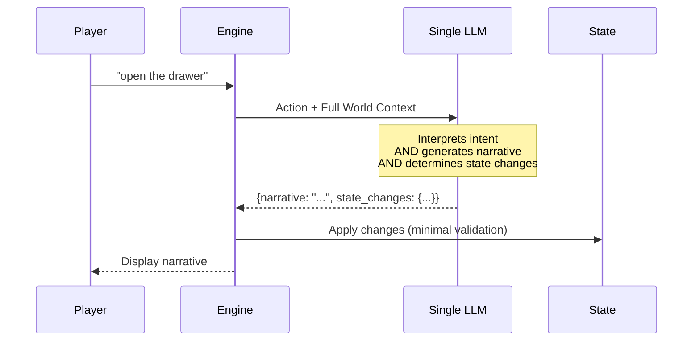
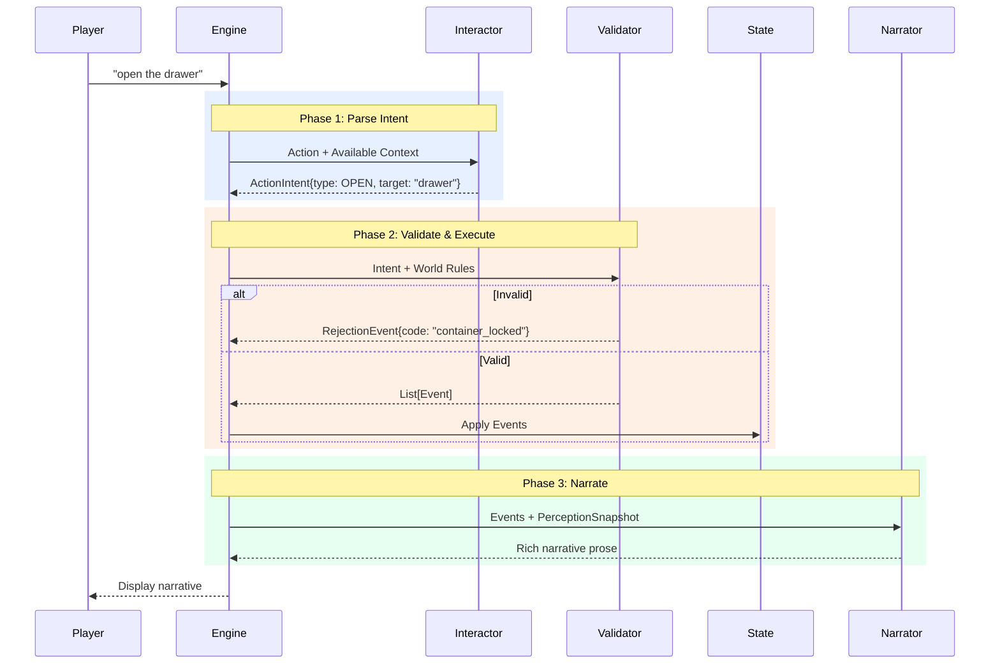
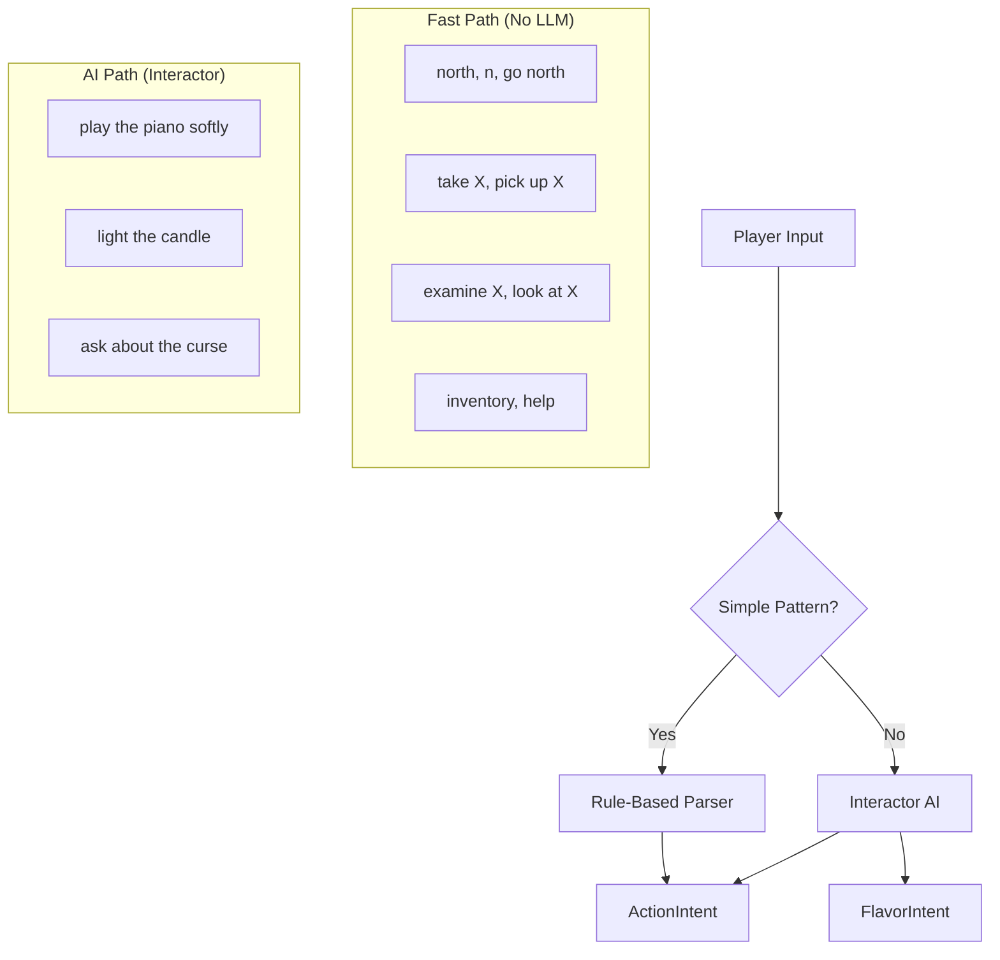
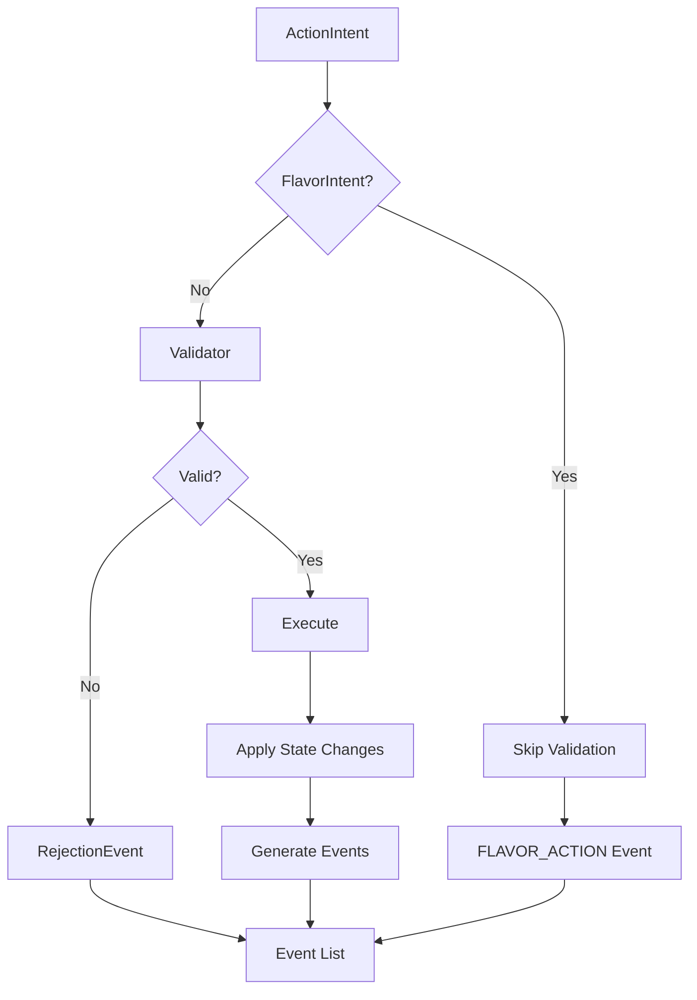
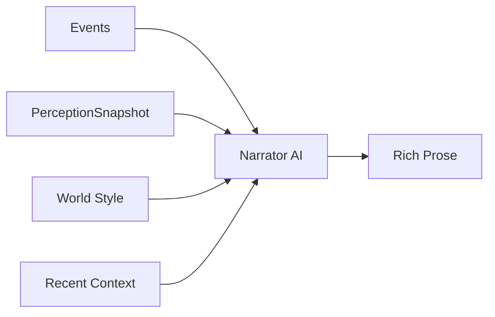
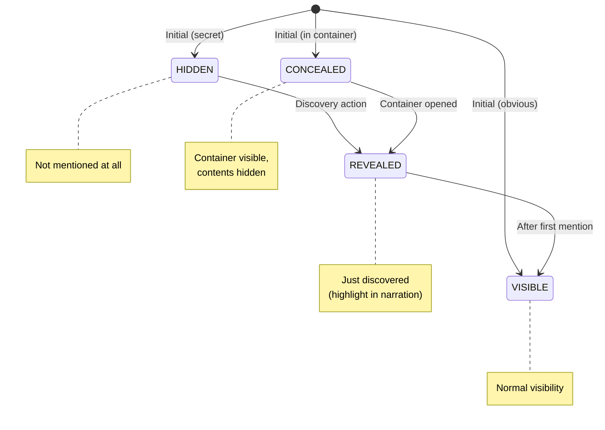

# Two-Phase Game Loop Architecture

A comprehensive specification for separating action parsing from narrative generation, enabling deterministic state management with AI-powered prose.

> **Status**: Authoritative Specification — December 2025  
> **Related**: [Game Mechanics Design](../ideas/game-mechanics-design.md) | [Vision](../docs/VISION.md) | [Architecture](../docs/ARCHITECTURE.md)  
> **Supersedes**: Four exploratory documents now archived in `ideas/archive/`

---

## Table of Contents

1. [Executive Summary](#executive-summary)
2. [Current vs Proposed Architecture](#current-vs-proposed-architecture)
3. [Core Data Models](#core-data-models)
4. [The Two-Phase Flow](#the-two-phase-flow)
5. [Validation & Rejection Handling](#validation-rejection-handling)
6. [Rich Verb Handling](#rich-verb-handling)
7. [Visibility & Discovery Model](#visibility-discovery-model)
8. [Prompt Specifications](#prompt-specifications)
9. [Implementation Phases](#implementation-phases)
10. [Engine Coexistence](#engine-coexistence)
11. [API Changes](#api-changes)

---

## Executive Summary

### The Problem

The current GAIME architecture uses a **single LLM call** that interprets player input, determines state changes, AND generates narrative. This creates several issues:

1. **State inconsistency**: LLM may hallucinate state changes that violate world rules
2. **Validation gaps**: State changes are applied before we can validate them
3. **Debugging difficulty**: Hard to distinguish parsing errors from narrative issues
4. **Limited mechanics**: Difficulty enforcing strict rules (locks, puzzles) when LLM has full creative freedom
5. **Determinism**: Same input can produce different mechanical outcomes

### The Solution

Split the game loop into **two distinct phases**:

1. **Interaction Phase**: Parse player input → structured `ActionIntent` → validate against world rules → produce `Event` outcomes
2. **Narration Phase**: Generate rich prose based on confirmed events and world context

This separation ensures:
- Game mechanics are **deterministic and validatable**
- Narrative **always reflects actual game state**
- Each component can be **tested, debugged, and optimized independently**
- Simple actions can **bypass LLM entirely** (rule-based parsing)

### AI Personas

The architecture introduces two AI personas:

| Persona | Role | Focus |
|---------|------|-------|
| **Interactor** | Parse player input into structured intents | Mechanical understanding, no creativity |
| **Narrator** | Generate prose from confirmed events | Creative expression, no mechanics |

### Alignment with Vision

This architecture supports the [Vision](../docs/VISION.md) principles:
- **"Short story you played through"**: Maintains narrative focus while adding mechanical reliability
- **"No unwinnable states"**: Validation layer prevents game-breaking actions
- **"Guided freedom"**: Allows natural input while enforcing world rules
- **"Curated worlds"**: Enables more sophisticated puzzle mechanics

---

## Current vs Proposed Architecture

### Current Architecture (Single LLM)



**Issues:**
- LLM may invent state changes not defined in the world
- Narrative may describe events that didn't happen
- No opportunity to reject invalid actions before narration

### Proposed Architecture (Two-Phase)



---

## Core Data Models

### ActionIntent

An `ActionIntent` represents the **parsed interpretation** of what the player is trying to do, before validation.

```python
from enum import Enum
from pydantic import BaseModel, Field


class ActionType(str, Enum):
    """Primary categories of player actions"""
    
    # Movement
    MOVE = "move"              # Navigate between locations
    
    # Object Interaction
    EXAMINE = "examine"        # Look at something closely
    TAKE = "take"              # Pick up an item
    DROP = "drop"              # Put down an item
    USE = "use"                # Use item (standalone or on target)
    OPEN = "open"              # Open container/door
    CLOSE = "close"            # Close container/door
    
    # Communication
    TALK = "talk"              # Speak to NPC
    ASK = "ask"                # Ask NPC about topic
    GIVE = "give"              # Give item to NPC
    SHOW = "show"              # Show item to NPC
    
    # Environment
    LOOK = "look"              # Look around (general)
    LISTEN = "listen"          # Listen for sounds
    SEARCH = "search"          # Search area/container
    
    # Meta
    WAIT = "wait"              # Pass time
    INVENTORY = "inventory"    # Check inventory
    HELP = "help"              # Show help


class ActionIntent(BaseModel):
    """Structured representation of player intent"""
    
    type: ActionType
    
    # Target of the action (item_id, npc_id, direction, or description)
    target: str | None = None
    
    # Secondary target (for USE X ON Y, GIVE X TO Y, etc.)
    indirect_target: str | None = None
    
    # Original verb used (for rich narration)
    verb: str | None = None
    
    # Original player input
    raw_input: str
    
    # Confidence score (0.0-1.0) when AI-parsed
    confidence: float = 1.0
    
    # Alternative interpretations (for disambiguation)
    alternatives: list["ActionIntent"] = Field(default_factory=list)


class FlavorIntent(BaseModel):
    """Actions that add atmosphere but don't change game state.
    
    Examples: "jump around", "dance", "sing", "wave"
    
    These bypass validation entirely and go straight to narration.
    """
    
    verb: str
    direct_object: str | None = None
    prepositional_object: str | None = None
    raw_input: str
    
    # Guidance for the Narrator
    narration_hint: str | None = None
```

### ActionIntent Examples

| Player Input | Parsed Intent |
|--------------|---------------|
| "north" | `ActionIntent(type=MOVE, target="north", verb="go")` |
| "examine the painting" | `ActionIntent(type=EXAMINE, target="painting", verb="examine")` |
| "pick up the key" | `ActionIntent(type=TAKE, target="key", verb="pick up")` |
| "use key on door" | `ActionIntent(type=USE, target="key", indirect_target="door", verb="use")` |
| "light candle with matches" | `ActionIntent(type=USE, target="matches", indirect_target="candle", verb="light")` |
| "talk to Jenkins" | `ActionIntent(type=TALK, target="butler_jenkins", verb="talk")` |
| "ask Jenkins about the family" | `ActionIntent(type=ASK, target="butler_jenkins", indirect_target="family", verb="ask")` |
| "jump around" | `FlavorIntent(verb="jump", raw_input="jump around")` |
| "dance" | `FlavorIntent(verb="dance", raw_input="dance")` |

### Event System

Events represent **what happened** as a result of a validated action. They are the source of truth for state changes.

```python
class EventType(str, Enum):
    """Types of events that can occur"""
    
    # Movement
    LOCATION_CHANGED = "location_changed"
    
    # Items
    ITEM_TAKEN = "item_taken"
    ITEM_DROPPED = "item_dropped"
    ITEM_USED = "item_used"
    ITEM_REVEALED = "item_revealed"
    ITEM_CONSUMED = "item_consumed"
    
    # Containers
    CONTAINER_OPENED = "container_opened"
    CONTAINER_CLOSED = "container_closed"
    
    # Discovery
    DETAIL_EXAMINED = "detail_examined"
    SECRET_DISCOVERED = "secret_discovered"
    EXIT_REVEALED = "exit_revealed"
    
    # NPCs
    NPC_GREETED = "npc_greeted"
    NPC_CONVERSATION = "npc_conversation"
    NPC_ITEM_GIVEN = "npc_item_given"
    NPC_ITEM_RECEIVED = "npc_item_received"
    
    # Game State
    FLAG_SET = "flag_set"
    INTERACTION_TRIGGERED = "interaction_triggered"
    VICTORY_ACHIEVED = "victory_achieved"
    
    # Meta
    ACTION_REJECTED = "action_rejected"
    NOTHING_HAPPENED = "nothing_happened"
    FLAVOR_ACTION = "flavor_action"


class Event(BaseModel):
    """Represents something that happened in the game world"""
    
    type: EventType
    
    # What was involved
    subject: str | None = None      # Primary entity (item_id, npc_id, location_id)
    target: str | None = None       # Secondary entity
    
    # State changes to apply
    state_changes: dict = Field(default_factory=dict)
    
    # Context for narration
    context: dict = Field(default_factory=dict)
    
    # Was this the primary outcome or a side effect?
    primary: bool = True


class RejectionEvent(Event):
    """Event for rejected/failed actions with in-world explanation."""
    
    type: EventType = EventType.ACTION_REJECTED
    
    # Machine-readable rejection code
    rejection_code: str
    
    # Human-readable reason (seed for Narrator)
    rejection_reason: str
    
    # What would have happened if successful (for hints)
    would_have: str | None = None
```

### Rejection Codes

A comprehensive set of rejection codes for validation failures:

| Code | Category | Description |
|------|----------|-------------|
| `NO_EXIT` | Movement | Direction not available |
| `EXIT_NOT_VISIBLE` | Movement | Exit exists but undiscovered |
| `EXIT_LOCKED` | Movement | Exit is locked |
| `EXIT_BLOCKED` | Movement | Exit blocked (rubble, fire, etc.) |
| `PRECONDITION_FAILED` | Requirements | Missing flag/item/light/etc. |
| `ITEM_NOT_VISIBLE` | Items | Can't interact with hidden item |
| `ITEM_NOT_HERE` | Items | Item at different location |
| `ITEM_NOT_PORTABLE` | Items | Fixed in place |
| `ITEM_TOO_HEAVY` | Items | Portable but too heavy |
| `ALREADY_HAVE` | Items | Item already in inventory |
| `CONTAINER_LOCKED` | Containers | Container is locked |
| `CONTAINER_ALREADY_OPEN` | Containers | Already open |
| `CONTAINER_ALREADY_CLOSED` | Containers | Already closed |
| `NPC_NOT_PRESENT` | NPCs | NPC not at this location |
| `NPC_HOSTILE` | NPCs | NPC won't interact |
| `NPC_BUSY` | NPCs | NPC is occupied |
| `TOOL_INSUFFICIENT` | Combinations | Tool not suitable |
| `AMBIGUOUS_TARGET` | Parsing | Multiple matches for target |
| `ALREADY_DONE` | Logic | One-time interaction already used |
| `SAFETY_GUARDRAIL` | Safety | Would create unwinnable state |

### PerceptionSnapshot

The `PerceptionSnapshot` defines exactly what information the Narrator is allowed to see. This prevents spoilers and ensures hidden items are never mentioned.

```python
class VisibleEntity(BaseModel):
    """An entity visible to the player"""
    id: str
    name: str
    description: str | None = None
    is_new: bool = False  # Just revealed this turn


class PerceptionSnapshot(BaseModel):
    """What the Narrator is allowed to know about the current state.
    
    CRITICAL: Hidden items must NEVER appear in this snapshot.
    """
    
    # Current location
    location_id: str
    location_name: str
    location_atmosphere: str | None = None
    
    # Visible entities (filtered by visibility rules)
    visible_items: list[VisibleEntity] = Field(default_factory=list)
    visible_details: list[VisibleEntity] = Field(default_factory=list)
    visible_exits: list[dict] = Field(default_factory=list)  # {direction, destination_name, description}
    visible_npcs: list[VisibleEntity] = Field(default_factory=list)
    
    # Player state
    inventory: list[VisibleEntity] = Field(default_factory=list)
    
    # Contextual hints (spoiler-safe)
    affordances: dict = Field(default_factory=dict)
    # Example: {"openable_containers": ["desk_drawer"], "usable_tools": ["matches"]}
    
    # Known facts from flags/discoveries (not spoilers)
    known_facts: list[str] = Field(default_factory=list)
```

**Anti-Spoiler Rule**: If an item has `hidden=true` or is inside a closed container, it must NOT appear in `visible_items`. The PerceptionSnapshot is the single source of truth for what the Narrator can mention.

---

## The Two-Phase Flow

### Phase 1: Parse Intent



#### Rule-Based Parser (Fast Path)

For common patterns, parse without LLM:

```python
class RuleBasedParser:
    """Parse common actions without LLM"""
    
    DIRECTION_PATTERNS = {
        r'^(go\s+)?(north|n)$': ('north', 'go'),
        r'^(go\s+)?(south|s)$': ('south', 'go'),
        r'^(go\s+)?(east|e)$': ('east', 'go'),
        r'^(go\s+)?(west|w)$': ('west', 'go'),
        r'^(go\s+)?(up|u)$': ('up', 'go'),
        r'^(go\s+)?(down|d)$': ('down', 'go'),
        r'^(go\s+)?back$': ('back', 'go'),
        r'^leave$': ('back', 'leave'),
        r'^exit$': ('back', 'exit'),
    }
    
    EXAMINE_PATTERNS = [
        r'^(examine|look at|inspect|study|check)\s+(?:the\s+)?(.+)$',
        r'^x\s+(.+)$',  # Shorthand
    ]
    
    TAKE_PATTERNS = [
        r'^(take|get|grab|pick up)\s+(?:the\s+)?(.+)$',
    ]
    
    def parse(self, raw_input: str, context: ParserContext) -> ActionIntent | FlavorIntent | None:
        """Try rule-based parsing. Returns None if LLM needed."""
        normalized = raw_input.lower().strip()
        
        # Check movement
        for pattern, (direction, verb) in self.DIRECTION_PATTERNS.items():
            if re.match(pattern, normalized):
                return ActionIntent(
                    type=ActionType.MOVE,
                    target=direction,
                    verb=verb,
                    raw_input=raw_input,
                    confidence=1.0
                )
        
        # Check examine patterns
        for pattern in self.EXAMINE_PATTERNS:
            match = re.match(pattern, normalized)
            if match:
                target = match.group(2) if len(match.groups()) > 1 else match.group(1)
                resolved = context.resolve_target(target)
                return ActionIntent(
                    type=ActionType.EXAMINE,
                    target=resolved or target,
                    verb="examine",
                    raw_input=raw_input,
                    confidence=0.9 if resolved else 0.5
                )
        
        # ... more patterns ...
        
        return None  # Needs Interactor AI
```

#### Interactor AI (Complex Path)

For ambiguous or freeform input, use LLM-powered Interactor:

```python
class InteractorAI:
    """LLM-powered action parser for complex inputs"""
    
    async def parse(self, raw_input: str, context: ParserContext) -> ActionIntent | FlavorIntent:
        """Parse complex player input into structured intent"""
        
        prompt = self._build_interactor_prompt(raw_input, context)
        response = await get_completion(prompt, response_format="json")
        
        return self._parse_response(response, raw_input)
```

### Phase 2: Validate & Execute



#### Validation Rules

```python
class ActionValidator:
    """Validates actions against world rules"""
    
    def validate_move(self, intent: ActionIntent, state: GameState, world: WorldData) -> ValidationResult:
        """Validate movement action"""
        location = world.get_location(state.current_location)
        direction = intent.target
        
        # Check exit exists
        if direction not in location.exits:
            return ValidationResult(
                valid=False,
                rejection_code="NO_EXIT",
                rejection_reason=f"There's no way to go {direction} from here."
            )
        
        destination_id = location.exits[direction]
        exit_info = location.exit_details.get(direction)
        
        # Check if locked
        if exit_info and exit_info.locked:
            return ValidationResult(
                valid=False,
                rejection_code="EXIT_LOCKED",
                rejection_reason=exit_info.locked_description or "The way is locked.",
                context={"requires_key": exit_info.requires_key}
            )
        
        # Check if blocked
        if exit_info and exit_info.blocked:
            return ValidationResult(
                valid=False,
                rejection_code="EXIT_BLOCKED",
                rejection_reason=exit_info.blocked_reason or "The way is blocked."
            )
        
        return ValidationResult(valid=True, context={"destination": destination_id})
    
    def validate_take(self, intent: ActionIntent, state: GameState, world: WorldData) -> ValidationResult:
        """Validate take action"""
        item = world.get_item(intent.target)
        
        if not item:
            return ValidationResult(
                valid=False,
                rejection_code="ITEM_NOT_VISIBLE",
                rejection_reason=f"You don't see any {intent.target} here."
            )
        
        if intent.target in state.inventory:
            return ValidationResult(
                valid=False,
                rejection_code="ALREADY_HAVE",
                rejection_reason=f"You already have the {item.name}."
            )
        
        if not item.portable:
            return ValidationResult(
                valid=False,
                rejection_code="ITEM_NOT_PORTABLE",
                rejection_reason=item.not_portable_reason or f"You can't take the {item.name}."
            )
        
        # Check visibility
        if not self._is_item_visible(intent.target, state, world):
            return ValidationResult(
                valid=False,
                rejection_code="ITEM_NOT_VISIBLE",
                rejection_reason=f"You don't see any {intent.target}."
            )
        
        return ValidationResult(valid=True)
```

### Phase 3: Narrate

The Narrator AI receives confirmed events and the PerceptionSnapshot to generate prose.



---

## Validation & Rejection Handling

### Rejection Narration Philosophy

Rejections should feel natural, not like error messages:

```python
# ❌ BAD: System message
"Error: Cannot move north. Door is locked."

# ✅ GOOD: In-world narrative
"You try the handle, but the heavy oak door is locked tight. It won't budge."

# ✅ GOOD: With subtle hint
"Your fingers brush the desk drawer's brass handle. It rattles but 
doesn't open. Something inside clinks faintly."
```

### Rejection Flow

```python
# Player: "go north" (locked door)
intent = ActionIntent(type=MOVE, target="north", verb="go")

# Validation fails
rejection = RejectionEvent(
    rejection_code="EXIT_LOCKED",
    rejection_reason="The heavy iron door to the basement is firmly locked.",
    subject="basement_door",
    context={
        "requires_key": "iron_key",
        "lock_description": "A heavy iron padlock secures the door."
    },
    would_have="Access the basement"
)

# Narrator receives rejection event + PerceptionSnapshot
# Generates: "You push against the basement door, but it doesn't budge. 
# A heavy iron padlock—old but sturdy—secures it firmly shut."
```

---

## Rich Verb Handling

### The Challenge

Players use creative, varied language:
- "play piano" (creative action)
- "light candle with matches" (item combination)
- "jump around" (physical expression)
- "eat apple" (consumable use)
- "pet the cat" (NPC interaction)

### The Solution: Verb Classification

```python
class VerbClassifier:
    """Classify verbs into action categories or flavor"""
    
    # Verbs that map to ActionTypes
    MECHANICAL_VERBS = {
        ("look", "examine", "inspect", "study", "check", "observe"): ActionType.EXAMINE,
        ("take", "get", "grab", "pick", "collect", "pocket"): ActionType.TAKE,
        ("use", "apply", "activate", "operate"): ActionType.USE,
        ("open", "unlock", "unfasten"): ActionType.OPEN,
        ("talk", "speak", "chat", "greet"): ActionType.TALK,
        ("ask", "inquire", "question"): ActionType.ASK,
    }
    
    # Verbs that become USE with implied mechanics
    USE_SYNONYMS = {
        "light": "matches",   # "light X" → USE matches ON X
        "cut": "knife",
        "unlock": "key",
        "play": None,         # "play piano" → USE piano
        "eat": None,          # "eat apple" → USE apple (consume)
        "drink": None,
        "ring": None,         # "ring bell" → USE bell
    }
    
    # Verbs that are purely atmospheric (FlavorIntent)
    FLAVOR_VERBS = {
        "jump", "dance", "wave", "bow", "kneel", "sit", "stand",
        "stretch", "yawn", "shout", "yell", "whisper", "sing",
        "hum", "laugh", "cry", "sigh", "smile", "frown"
    }
```

### FlavorIntent Handling

When the Interactor identifies a FlavorIntent, it bypasses validation entirely:

```python
# Player: "dance around the room"
flavor = FlavorIntent(
    verb="dance",
    prepositional_object="room",
    raw_input="dance around the room"
)

# Goes directly to Narrator with guidance
event = Event(
    type=EventType.FLAVOR_ACTION,
    context={
        "verb": "dance",
        "narration_hint": "Player is dancing. Keep it brief (1-2 sentences). Match location atmosphere. No state changes."
    }
)

# Narrator generates:
# "You twirl between the dusty bookshelves, your footsteps echoing in the empty library."
```

### Defined Interactions vs FlavorIntent

**Rule of thumb:**
- If an action should **change state** → define a world interaction (produces mechanical events)
- If it's just atmosphere → allow as `FlavorIntent` (no state change)

```yaml
# World definition for mechanical "play piano"
grand_piano:
  name: "Grand Piano"
  portable: false
  location: sitting_room
  
  use_actions:
    play:
      triggers: ["play piano", "play the piano"]
      sets_flag: played_piano
      narrative_prompt: |
        The player plays the piano. Make it:
        - Melancholy and haunting
        - Slightly out of tune
```

If no `use_action` is defined, "play piano" becomes a FlavorIntent and gets atmospheric narration without setting any flags.

---

## Visibility & Discovery Model

### The Problem

Items can be hidden in containers, behind objects, or revealed through interactions. We need to ensure:
1. Hidden items never leak into narration
2. Discovery moments feel earned
3. State changes make items visible

### Visibility States



### Container Model Example

```yaml
# items.yaml
desk:
  name: "Old Writing Desk"
  portable: false
  examine: "A heavy oak desk with brass handles on its single drawer."
  location: study
  
  container:
    type: drawer
    initially_open: false
    locked: false
    
    contents:
      - item_id: brass_key
        visibility: concealed
      - item_id: old_letter
        visibility: concealed
    
    open_action:
      triggers: ["open drawer", "open desk drawer"]
      sets_flag: desk_drawer_opened
      reveals_items: [brass_key, old_letter]

brass_key:
  name: "Small Brass Key"
  portable: true
  initial_location: desk
  visibility: concealed
  visibility_condition:
    requires_flag: desk_drawer_opened
  found_description: "A small brass key, tarnished with age, lies in the drawer."
```

### Visibility in PerceptionSnapshot

The PerceptionSnapshot **only includes visible items**:

```python
# BEFORE opening drawer
snapshot = PerceptionSnapshot(
    location_id="study",
    location_name="The Study",
    visible_items=[],  # brass_key NOT here
    visible_details=[
        VisibleEntity(id="desk", name="Old Writing Desk", description="...drawer appears closed...")
    ],
    affordances={"openable_containers": ["desk_drawer"]}
)

# AFTER opening drawer
snapshot = PerceptionSnapshot(
    location_id="study",
    location_name="The Study",
    visible_items=[
        VisibleEntity(id="brass_key", name="Small Brass Key", is_new=True),
        VisibleEntity(id="old_letter", name="Yellowed Letter", is_new=True)
    ],
    visible_details=[
        VisibleEntity(id="desk", name="Old Writing Desk", description="...drawer stands open...")
    ]
)
```

### The Drawer Scenario Walkthrough

#### Turn 1: Player enters study

**Events**: `[LOCATION_CHANGED]`

**PerceptionSnapshot**: Desk visible, key NOT visible

**Narration**: "The study is cramped but cozy. An old writing desk dominates one corner, its single drawer shut tight."

*Key is NOT mentioned because it's not in the snapshot.*

#### Turn 2: Player opens drawer

**Intent**: `ActionIntent(type=OPEN, target="desk_drawer")`

**Validation**: ✅ Drawer exists, not locked

**Events**:
```python
[
    Event(type=CONTAINER_OPENED, subject="desk_drawer"),
    Event(type=ITEM_REVEALED, subject="brass_key", context={"is_new": True}),
    Event(type=ITEM_REVEALED, subject="old_letter", context={"is_new": True})
]
```

**PerceptionSnapshot**: Key and letter now in `visible_items` with `is_new=True`

**Narration**: "The drawer slides open with a reluctant creak. Inside, nestled in a bed of dust, you find a small brass key and a yellowed letter."

#### Turn 3: Player takes key

**Intent**: `ActionIntent(type=TAKE, target="brass_key")`

**Validation**: ✅ Key is visible and portable

**Events**: `[Event(type=ITEM_TAKEN, subject="brass_key")]`

**Narration**: "You pick up the brass key. It's cold and heavier than it looks."

---

## Prompt Specifications

### Interactor Prompt

```python
INTERACTOR_SYSTEM = """You are the Interactor for a text adventure game.

Your job is to interpret player input and identify the intended action.
You do NOT generate narrative - only structured action data.

## Output Format

Respond with JSON only. Choose ONE of these formats:

### For mechanical actions:
{
    "type": "action_intent",
    "action_type": "<MOVE|EXAMINE|TAKE|DROP|USE|OPEN|CLOSE|TALK|ASK|GIVE|SHOW|LOOK|SEARCH|WAIT>",
    "target": "<target_id or description>",
    "indirect_target": "<secondary target if applicable>",
    "verb": "<the verb used>",
    "confidence": <0.0-1.0>,
    "reasoning": "<brief explanation>"
}

### For flavor/atmospheric actions (no state change):
{
    "type": "flavor_intent",
    "verb": "<the verb>",
    "direct_object": "<what they're doing it to>",
    "prepositional_object": "<additional context>",
    "reasoning": "<brief explanation>"
}

## Current Context

Location: {location_id} ({location_name})

Available exits: {available_exits}

Items here:
{items_at_location}

NPCs present:
{npcs_present}

Player inventory:
{inventory}

Known interactions:
{available_interactions}

## Guidelines

1. Match targets to actual entity IDs when possible
2. For "use X on Y": target is the tool, indirect_target is what it's used on
3. Use flavor_intent for actions like: jump, dance, wave, sing, laugh, etc.
4. If ambiguous, use lower confidence and include alternatives
5. Never invent entities not listed in context
"""

INTERACTOR_USER = """Player input: "{player_input}"

Parse this action."""
```

### Narrator Prompt

```python
NARRATOR_SYSTEM = """You are the Narrator for {world_name}, a text adventure game.

## Your Role

Generate immersive, atmospheric prose based on confirmed game events.
You do NOT determine what happens - that has already been decided.
You bring those events to life through vivid description.

## World Context

Theme: {theme}
Tone: {tone}
Player: {hero_name}

## Narrative Style

{narrative_style_guidance}

## Guidelines

1. Write in second person ("You see...", "You feel...")
2. Match the world's tone and atmosphere
3. For rejections, make them feel natural, not like error messages
4. Reference recent events for continuity
5. NEVER mention items not in the visible items list
6. When items have is_new=True, emphasize the discovery
7. Keep responses to 2-4 paragraphs unless a major moment
8. End with sensory details that ground the player
"""

NARRATOR_USER = """## Current Location

{location_name}
Atmosphere: {location_atmosphere}

## Events to Narrate

{events_description}

## Visible Items

{visible_items}

## Player Inventory

{inventory}

## Recent Context

{recent_narrative_context}

Generate the narrative for these events."""
```

### Event-Specific Guidance

```python
def build_event_guidance(events: list[Event], world: WorldData) -> str:
    """Build specific guidance for each event type"""
    
    guidance = []
    
    for event in events:
        if event.type == EventType.LOCATION_CHANGED:
            loc = world.get_location(event.context.get("destination"))
            first_visit = event.context.get("first_visit", False)
            guidance.append(f"""
LOCATION_CHANGED: Player moved to {loc.name}
- {"First visit - make it a discovery moment" if first_visit else "Revisit - acknowledge familiarity"}
- Describe the atmosphere: {loc.atmosphere}
- Mention visible exits naturally
""")
        
        elif event.type == EventType.ACTION_REJECTED:
            guidance.append(f"""
ACTION_REJECTED: Player's action was blocked
- Code: {event.rejection_code}
- Reason: {event.rejection_reason}
- Make this feel natural, NOT like an error message
- Optionally hint at what might work
""")
        
        elif event.type == EventType.ITEM_REVEALED:
            item = world.get_item(event.subject)
            guidance.append(f"""
ITEM_REVEALED: {item.name} is now visible
- This is a discovery moment - build anticipation
- Found description: {item.found_description or 'N/A'}
- Make it feel earned
""")
        
        elif event.type == EventType.FLAVOR_ACTION:
            guidance.append(f"""
FLAVOR_ACTION: Atmospheric action (no state change)
- Verb: {event.context.get('verb')}
- Keep it brief (1-2 sentences)
- Match location mood
- This is just flavor - no mechanics
""")
    
    return "\n---\n".join(guidance)
```

---

## Implementation Phases

### Phase 0: Foundation

**Goal**: Create data models and engine selection infrastructure

- [ ] Create `models/intent.py` with `ActionIntent`, `FlavorIntent`, `ActionType`
- [ ] Create `models/event.py` with `Event`, `RejectionEvent`, `EventType`
- [ ] Create `models/perception.py` with `PerceptionSnapshot`, `VisibleEntity`
- [ ] Add `EngineVersion` enum (`CLASSIC`, `TWO_PHASE`)
- [ ] Add engine selection to `GameState` model
- [ ] Update API to support engine selection at game start

### Phase 1: Simple Movement

**Goal**: Movement-only two-phase loop without Interactor AI

- [ ] Implement `RuleBasedParser` for direction patterns
- [ ] Implement `MovementValidator`
- [ ] Generate `LOCATION_CHANGED` events
- [ ] Create basic Narrator prompt for location descriptions
- [ ] Wire up two-phase flow for movement only
- [ ] Fall back to classic engine for non-movement actions

### Phase 2: Examination & Taking

**Goal**: Add examine and take with rule-based parsing

- [ ] Extend `RuleBasedParser` for examine/take patterns
- [ ] Implement `ExamineValidator` and `TakeValidator`
- [ ] Generate `DETAIL_EXAMINED`, `ITEM_TAKEN` events
- [ ] Handle visibility resolution for hidden items
- [ ] Wire rejection events for locked containers, hidden items

### Phase 3: Interactor AI

**Goal**: Add LLM-based parsing for freeform inputs

- [ ] Implement `InteractorAI` with parser prompt
- [ ] Handle "use X on Y" parsing
- [ ] Handle NPC communication parsing
- [ ] Implement `FlavorIntent` detection
- [ ] Integrate with validation pipeline

### Phase 4: Full Narrator

**Goal**: Rich, context-aware narration

- [ ] Implement full Narrator with style guidance
- [ ] Event-specific narration templates
- [ ] NPC dialogue generation
- [ ] Discovery moment narration
- [ ] Rejection narration (natural, in-world)

### Phase 5: Containers & Visibility

**Goal**: Full drawer/container mechanics

- [ ] Implement container model in world schema
- [ ] Add OPEN/CLOSE validation
- [ ] Implement visibility state machine
- [ ] Generate `CONTAINER_OPENED`, `ITEM_REVEALED` events
- [ ] Update PerceptionSnapshot building to respect visibility

### Phase 6: Polish & Comparison

**Goal**: Feature parity and quality comparison

- [ ] Implement remaining action types (GIVE, SHOW, etc.)
- [ ] A/B testing framework for engine comparison
- [ ] Performance optimization
- [ ] Edge case handling
- [ ] Documentation updates

---

## Engine Coexistence

### Engine Versions

```python
class EngineVersion(str, Enum):
    """Available game engine versions"""
    
    CLASSIC = "classic"      # Current single-LLM architecture
    TWO_PHASE = "two_phase"  # New separated architecture
```

### Engine Factory

```python
class EngineFactory:
    """Factory for creating game engines"""
    
    @staticmethod
    def create_processor(
        state_manager: GameStateManager,
        engine_version: EngineVersion,
        debug: bool = False
    ) -> ActionProcessor:
        """Create the appropriate action processor"""
        
        if engine_version == EngineVersion.CLASSIC:
            return ClassicActionProcessor(state_manager, debug=debug)
        
        elif engine_version == EngineVersion.TWO_PHASE:
            return TwoPhaseActionProcessor(state_manager, debug=debug)
        
        raise ValueError(f"Unknown engine version: {engine_version}")
```

### Two-Phase Action Processor

```python
class TwoPhaseActionProcessor:
    """Two-phase game loop processor"""
    
    def __init__(self, state_manager: GameStateManager, debug: bool = False):
        self.state_manager = state_manager
        self.debug = debug
        
        # Phase 1: Parsing
        self.rule_parser = RuleBasedParser(state_manager)
        self.interactor = InteractorAI(state_manager, debug=debug)
        
        # Phase 2: Validation
        self.validator = ActionValidator(state_manager)
        
        # Phase 3: Narration
        self.narrator = NarratorAI(state_manager, debug=debug)
    
    async def process(self, action: str) -> ActionResponse:
        """Process action through two-phase pipeline"""
        
        state = self.state_manager.get_state()
        world = self.state_manager.get_world()
        
        # Phase 1: Parse Intent
        intent = self.rule_parser.parse(action, state)
        if intent is None:
            intent = await self.interactor.parse(action, state)
        
        # Handle FlavorIntent (skip validation)
        if isinstance(intent, FlavorIntent):
            events = [Event(
                type=EventType.FLAVOR_ACTION,
                context={"verb": intent.verb, "raw_input": intent.raw_input}
            )]
        else:
            # Phase 2: Validate & Execute
            validation = self.validator.validate(intent, state, world)
            
            if validation.valid:
                events = self.validator.execute(intent, state, world)
                self._apply_events(events, state)
            else:
                events = [validation.to_rejection_event()]
        
        # Build perception snapshot (respects visibility)
        snapshot = self._build_perception_snapshot(state, world, events)
        
        # Phase 3: Narrate
        narrative = await self.narrator.narrate(events, snapshot, world)
        
        return ActionResponse(
            narrative=narrative,
            state=state,
            events=[e.model_dump() for e in events]
        )
```

---

## API Changes

### Updated Start Game Endpoint

**POST /api/game/start**

```python
class StartGameRequest(BaseModel):
    world_id: str
    engine: EngineVersion = EngineVersion.CLASSIC  # Default to classic
    debug: bool = False

class StartGameResponse(BaseModel):
    session_id: str
    narrative: str
    state: GameState
    engine_version: EngineVersion  # Confirm which engine
```

### New Engines Endpoint

**GET /api/game/engines**

```python
@router.get("/engines")
async def list_engines():
    return {
        "engines": [
            {
                "id": "classic",
                "name": "Classic Engine",
                "description": "Single LLM call for action processing and narration"
            },
            {
                "id": "two_phase",
                "name": "Two-Phase Engine",
                "description": "Separated parsing (Interactor) and narration (Narrator)"
            }
        ],
        "default": "classic"
    }
```

### GameState Updates

```python
class GameState(BaseModel):
    # ... existing fields ...
    
    engine_version: EngineVersion = EngineVersion.CLASSIC
    
    # New fields for visibility tracking
    container_states: dict[str, bool] = Field(default_factory=dict)  # container_id -> is_open
    revealed_items: set[str] = Field(default_factory=set)  # Items that have been revealed
```

---

## Summary

This specification defines a **two-phase game loop architecture** that:

1. **Separates concerns**: Interactor (parsing) → Validator → Narrator
2. **Improves reliability**: State changes are validated before narration
3. **Enables optimization**: Simple actions bypass LLM entirely
4. **Maintains flexibility**: Rich verb handling and FlavorIntent for atmosphere
5. **Supports discovery**: Visibility model for containers and hidden items
6. **Allows comparison**: Both engines coexist for A/B testing

### Key Design Decisions

| Decision | Choice | Rationale |
|----------|--------|-----------|
| AI Personas | Interactor + Narrator | Clear, memorable names |
| Failure handling | `RejectionEvent` with codes | Uniform event-based approach |
| No-op actions | `FlavorIntent` | Explicit separation from mechanics |
| Player-visible state | `PerceptionSnapshot` | Prevents spoilers in narration |
| Parsing strategy | Rule-based first, AI fallback | Fast path for common actions |

### Success Criteria

1. **Movement Phase 1**: Two-phase movement feels identical to classic engine
2. **Full Parity**: All classic engine behaviors replicated
3. **Improved Reliability**: Zero hallucinated state changes
4. **Performance**: Average latency ≤ 1.5x classic engine
5. **Player Experience**: Blind testers cannot distinguish engines

---

*Document Version: 1.0*  
*Created: December 2025*  
*Status: Authoritative Specification*  
*Supersedes: four exploratory documents in `ideas/archive/`*

