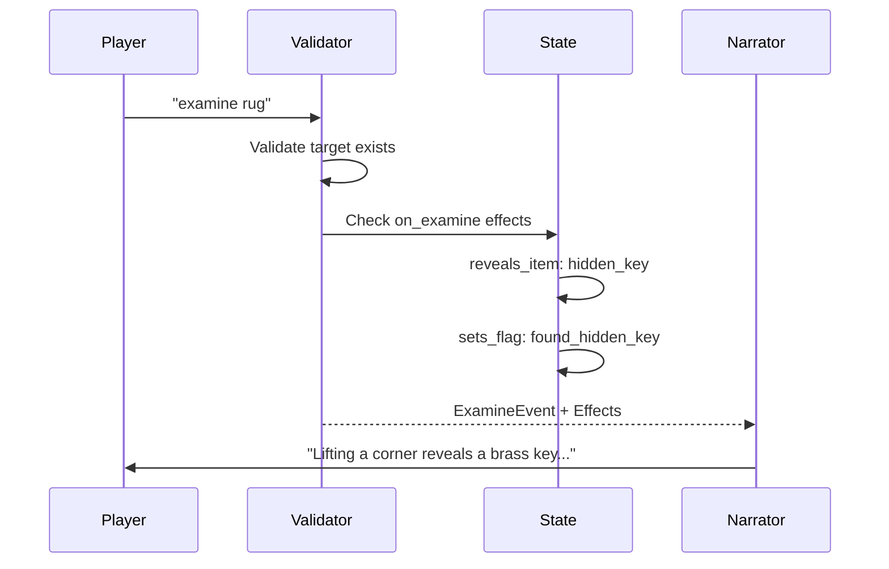

# Visibility & Examination System Specification

A comprehensive specification for unified visibility semantics, visual descriptions, examination mechanics, and destination visibility for exits.

> **Status**: Phase 3.5 Complete — January 2026
> **Related**: [Two-Phase Game Loop](./two-phase-game-loop-spec.md) | [Game Mechanics Design](../ideas/game-mechanics-design.md) | [Vision](../docs/VISION.md)

---

## Table of Contents

1. [Executive Summary](#executive-summary)
2. [Unified Visibility Model](#unified-visibility-model)
3. [Current State Analysis](#current-state-analysis)
4. [VisibleObject Abstraction](#visibleobject-abstraction)
5. [Enhanced Exit Model](#enhanced-exit-model)
6. [Enhanced Details Model](#enhanced-details-model)
7. [Examination Mechanics](#examination-mechanics)
8. [PerceptionSnapshot Updates](#perceptionsnapshot-updates)
9. [Narrator Integration](#narrator-integration)
10. [World Schema Changes](#world-schema-changes)
11. [Image Generation Improvements](#image-generation-improvements)
12. [World Builder Updates](#world-builder-updates)
13. [Migration Strategy](#migration-strategy)
14. [Deprecations](#deprecations)
15. [Implementation Phases](#implementation-phases)

---

## Executive Summary

### The Problem

The current visibility and description model has several inconsistencies:

1. **Inconsistent field names**: Items use `found_description`/`examine`, NPCs use `appearance`, exits have no visual description
2. **Exits lack visual descriptions**: Workaround of using `location.details[direction]` is fragile and not documented
3. **Details are unstructured**: Simple `dict[str, str]` with no support for examination triggers or two-layer descriptions
4. **No destination visibility control**: Exits always reveal their destination, breaking immersion in unfamiliar environments
5. **Image generation uses generic mappings**: "north" always becomes "a doorway visible ahead" regardless of world setting

### The Solution

1. **Unified VisibleObject semantics**: Common `scene_description` and `examine_description` fields across entity types
2. **Enhanced Exit model**: Structured exits with visual descriptions and destination visibility control
3. **Enhanced Details model**: Structured details with examination triggers and two-layer descriptions
4. **Examination mechanics**: Consistent examine action across all entity types (except NPCs)
5. **World Builder integration**: Generate visual descriptions during world authoring

### Key Principle: Authored Content

Visual descriptions are **authored content** generated during world building, not at runtime. The World Builder creates descriptions based on world theme/tone/atmosphere. Image generation and narration simply use these authored descriptions.

```
World Building Phase              Runtime Phase
─────────────────────────        ────────────────────────
World Builder generates          Engine uses authored
visual descriptions based  →     descriptions for narration
on theme/tone/atmosphere         and image generation

Content: WHAT to show            Style: HOW to render it
"heavy oak door bound            (MPA preset controls
with iron bands"                 artistic rendering style)
```

### Alignment with Vision

| Vision Principle | How This Helps |
|-----------------|----------------|
| "Short story you played through" | Rich visual descriptions enhance immersion |
| "Fair puzzles" | Exit destination visibility prevents frustrating guesswork |
| "Guided freedom" | Examination reveals depth without info-dumping |
| "Curated worlds" | World Builder generates consistent descriptions |

---

## Unified Visibility Model

> **Added in Phase 3.5** — This section documents the unified visibility pattern that applies to all VisibleObject types.

### Core Principle: Location-Bound Visibility

Visibility is a property of **placement**, not the entity definition. An item's visibility depends on WHERE it's placed, not WHAT it is. The same key could be visible on a table in one room but hidden in a drawer in another.

```
┌─────────────────────────────────────────────────────────────┐
│  ENTITY DEFINITION (items.yaml, npcs.yaml)                  │
│  ─────────────────────────────────────────                  │
│  WHAT the entity IS - inherent properties                   │
│  • name, description, portable, use_actions                 │
│  • personality, dialogue_rules, knowledge                   │
│  • NOT: hidden, find_condition, location                    │
└─────────────────────────────────────────────────────────────┘

┌─────────────────────────────────────────────────────────────┐
│  PLACEMENT (locations.yaml)                                 │
│  ──────────────────────────                                 │
│  WHERE the entity is + HOW VISIBLE                          │
│  • placement: "lies on the table"                           │
│  • hidden: true/false                                       │
│  • find_condition: {requires_flag: "..."}                   │
└─────────────────────────────────────────────────────────────┘
```

### Unified Visibility Fields

All four entity types use **identical** visibility fields:

| Field | Type | Default | Purpose |
|-------|------|---------|---------|
| `hidden` | `bool` | `false` | Entity not visible until revealed |
| `find_condition` | `dict` | `None` | Condition to reveal (e.g., `{requires_flag: "searched_drawer"}`) |

### Visibility by Entity Type

| Entity | Where Visibility Is Defined | Example |
|--------|---------------------------|---------|
| **Item** | `location.item_placements[item_id]` | Key hidden under rug |
| **NPC** | `location.npc_placements[npc_id]` | Spy hiding behind curtain |
| **Exit** | `location.exits[direction]` | Secret passage behind bookcase |
| **Detail** | `location.details[detail_id]` | Hidden message on wall |

### Presence vs Visibility (Important Distinction)

For NPCs, there are **two separate concepts**:

| Concept | Field | Controls |
|---------|-------|----------|
| **Presence** | `appears_when` | Is the NPC at this location? |
| **Visibility** | `hidden` + `find_condition` | Can the player SEE the NPC? |

An NPC can be:
- **Present AND visible**: Normal case (butler standing in hall)
- **Present but hidden**: NPC is here but concealed (spy behind curtain)
- **Not present**: NPC is elsewhere or `appears_when` not satisfied

### Visibility Resolution Flow

```
┌─────────────────────────────────────────────────────────────┐
│  STEP 1: PRESENCE CHECK                                     │
│  ──────────────────────                                     │
│  Items: Is item_id in location.item_placements keys?        │
│  NPCs: Does appears_when pass AND is NPC at this location?  │
│  Exits: Is exit defined in location.exits?                  │
│  Details: Is detail defined in location.details?            │
└─────────────────────────────────────────────────────────────┘
                              │ Present
                              ▼
┌─────────────────────────────────────────────────────────────┐
│  STEP 2: VISIBILITY CHECK (UNIFIED)                         │
│  ──────────────────────────────────                         │
│  For all entity types:                                      │
│  - If hidden == false → VISIBLE                             │
│  - If hidden == true:                                       │
│    - If find_condition.requires_flag is SET → VISIBLE       │
│    - Otherwise → HIDDEN                                     │
└─────────────────────────────────────────────────────────────┘
                              │ Visible
                              ▼
┌─────────────────────────────────────────────────────────────┐
│  INCLUDED IN PerceptionSnapshot                             │
│  → Narrator can describe it                                 │
│  → Image generation can include it                          │
└─────────────────────────────────────────────────────────────┘
```

### Schema Changes for Unified Visibility

**Remove redundant lists** — The `items` and `npcs` lists in Location are redundant. The keys of `item_placements` and `npc_placements` define which entities are present.

**Before (Current):**
```yaml
nursery:
  items:                          # ← REDUNDANT
    - thornwood_amulet
  item_placements:
    thornwood_amulet: "glints beneath a loose floorboard"
```

**After (Proposed):**
```yaml
nursery:
  item_placements:
    thornwood_amulet:
      placement: "glints beneath a loose floorboard"
      hidden: true
      find_condition:
        requires_flag: examined_drawings
```

### Placement Models

```python
class ItemPlacement(BaseModel):
    """Item placement with visibility control"""
    placement: str                      # How item appears in scene
    hidden: bool = False                # Not visible until revealed
    find_condition: dict | None = None  # e.g., {requires_flag: "searched_drawer"}


class NPCPlacement(BaseModel):
    """NPC placement with visibility control"""
    placement: str                      # Where NPC is positioned
    hidden: bool = False                # Not visible until revealed
    find_condition: dict | None = None  # e.g., {requires_flag: "pulled_curtain"}
```

**String shorthand** — For simple placements (visible, no conditions), a plain string is allowed:

```yaml
item_placements:
  # Simple string = visible, just placement text
  old_letter: "lies crumpled on the dusty side table"

  # Structured = placement with visibility control
  hidden_key:
    placement: "hidden under the rug"
    hidden: true
    find_condition:
      requires_flag: lifted_rug
```

### Exit and Detail Visibility

Exits and Details also support the unified visibility fields:

```python
class ExitDefinition(BaseModel):
    # ... existing fields ...
    hidden: bool = False                # NEW: Exit not visible until revealed
    find_condition: dict | None = None  # NEW: Condition to reveal exit


class DetailDefinition(BaseModel):
    # ... existing fields ...
    hidden: bool = False                # NEW: Detail not visible until revealed
    find_condition: dict | None = None  # NEW: Condition to reveal detail
```

### Example: Hidden Exit (Secret Passage)

```yaml
library:
  exits:
    south:
      destination: entrance_hall
      scene_description: "The archway back to the entrance hall"
      destination_known: true

    secret:
      destination: secret_passage
      scene_description: "A narrow passage behind the bookcase"
      hidden: true
      find_condition:
        requires_flag: found_secret_lever
```

### Example: Hidden NPC

```yaml
# npcs.yaml - just definition
spy:
  name: "The Spy"
  role: "Enemy agent"
  appearance: "A figure in dark clothing"

# locations.yaml - placement with visibility
library:
  npc_placements:
    spy:
      placement: "lurking behind the heavy curtain"
      hidden: true
      find_condition:
        requires_flag: searched_curtain
```

---

## Current State Analysis

### Entity Description Fields

| Entity | Scene Description | Examine Description | Visibility Control | Notes |
|--------|-------------------|---------------------|-------------------|-------|
| **Item** | `found_description` | `examine` | `hidden` + `find_condition` | ✅ Works, needs rename |
| **NPC** | `appearance` | ❌ (by design) | `appears_when` | ✅ Works as-is |
| **Detail** | `details[key]` | ❌ None | Always visible | ❌ Needs structure |
| **Exit** | `details[direction]` (workaround) | ❌ None | Always visible | ❌ Needs promotion |

### Current Code Analysis

**Items** (`models/world.py`):
```python
class Item(BaseModel):
    found_description: str = ""  # How item appears in scene
    examine: str = ""            # Detailed examination text
    hidden: bool = False         # Visibility control
    find_condition: dict | None = None  # Reveal trigger
```

**NPCs** (`models/world.py`):
```python
class NPC(BaseModel):
    appearance: str = ""         # Physical description (scene)
    appears_when: list[AppearanceCondition] = []  # Visibility control
```

**Locations** (`models/world.py`):
```python
class Location(BaseModel):
    exits: dict[str, str] = {}   # direction -> destination_id (no descriptions!)
    details: dict[str, str] = {} # key -> description (unstructured)
```

**VisibilityResolver** (`visibility.py`):
```python
# Exit descriptions use workaround:
description = location.details.get(direction)  # Fragile!

# Details skip directions to avoid conflict:
if detail_id in ("north", "south", "east", "west", "up", "down"):
    continue  # Skip - these are exit descriptions
```

### Gaps Identified

1. **No structured exit model**: Exits are just `str -> str` mappings
2. **No exit visual descriptions**: Must abuse `details` dict with direction keys
3. **No destination visibility**: All exits reveal their target location
4. **No detail examination**: Details are static strings, no 2nd layer
5. **No examination triggers**: Details can't reveal items or set flags
6. **Inconsistent field naming**: `found_description` vs `appearance` vs nothing

---

## VisibleObject Abstraction

### Common Fields

All visible entities share these semantic fields:

| Field | Purpose | Used For |
|-------|---------|----------|
| `scene_description` | How entity appears in the scene | Browse/entry narration, image generation |
| `examine_description` | Detailed view on explicit examination | Examine action response (optional) |

### Per-Entity Implementation

Rather than create a literal `VisibleObject` base class (which would complicate YAML authoring), we use **consistent field naming conventions** across entities:

```python
# Conceptual interface (not actual code):
class VisibleObjectFields:
    """Common fields for all visible entities"""
    scene_description: str      # Required for image gen and narration
    examine_description: str | None  # Optional 2nd layer
```

### Field Mapping by Entity Type

| Entity | Scene Description Field | Examine Description Field |
|--------|------------------------|---------------------------|
| **Item** | `scene_description` (was `found_description`) | `examine_description` (was `examine`) |
| **NPC** | `appearance` (unchanged) | ❌ N/A - NPCs are talked to, not examined |
| **Detail** | `scene_description` (was just the value) | `examine_description` (new) |
| **Exit** | `scene_description` (new) | `examine_description` (new) |

### Why Not a Literal Base Class?

1. **YAML ergonomics**: Authors shouldn't need to understand inheritance
2. **Entity-specific needs**: NPCs have `appearance` for consistency with existing worlds
3. **Validation complexity**: Different entities have different required fields
4. **Migration cost**: Would require rewriting all existing worlds

Instead, we use **duck typing** and consistent naming conventions that the VisibilityResolver understands.

---

## Enhanced Exit Model

### Current State

```yaml
# locations.yaml - Current (flat)
entrance_hall:
  exits:
    north: library        # Just destination ID, no description
    east: dining_room
  details:
    north: "An ornate archway leads into shadows"  # Workaround!
```

### Proposed State

```yaml
# locations.yaml - Proposed (structured, inline)
entrance_hall:
  exits:
    north:
      destination: library
      scene_description: "An ornate stone archway, its keystone carved with intertwined vines"
      examine_description: "The archway is centuries old. Faded letters are carved into the stone: 'SCIENTIA'"
      destination_known: true  # Character recognizes this from backstory

    east:
      destination: dining_room
      scene_description: "A heavy oak door with iron bands and a tarnished brass handle"
      destination_known: false  # Closed door in unfamiliar mansion
      reveal_destination_on_flag: found_floor_plan  # Optional: examining floor plan reveals it
      # Note: Will auto-reveal once player visits dining_room
```

### Exit Schema Definition

```python
class ExitDefinition(BaseModel):
    """Structured exit with visual descriptions and destination visibility"""

    # Core
    destination: str  # Location ID

    # Visual Descriptions (for narration and image generation)
    scene_description: str = ""  # How exit appears in scene
    examine_description: str | None = None  # Detailed view on examination

    # Destination Visibility (initial state)
    destination_known: bool = True  # Whether player initially knows the destination

    # Dynamic reveal triggers (optional)
    reveal_destination_on_flag: str | None = None  # Reveal when this flag is set
    reveal_destination_on_examine: bool = False  # Reveal when player examines the exit

    # Note: Visiting the destination ALWAYS reveals it (automatic, not configurable)

    # Accessibility (existing concepts, enhanced)
    locked: bool = False
    requires_key: str | None = None
    blocked: bool = False
    blocked_reason: str | None = None
```

### Destination Visibility Logic

The destination of an exit can be known or unknown to the player.

**Initial State** (`destination_known`):

Set by the world author based on narrative logic:
- `true` if: character knows the place (backstory), visible signage, open doorway with line of sight
- `false` if: unfamiliar building, closed door, mystery/suspense desired

**Automatic Reveal** (always happens):

Once the player visits a location, all exits leading TO that location become known. This is automatic engine behavior, not configurable.

**Dynamic Reveal Triggers** (optional):

| Trigger | Use Case |
|---------|----------|
| `reveal_destination_on_flag: "found_map"` | Examining a map reveals building layout |
| `reveal_destination_on_flag: "talked_to_guide"` | NPC tells player about the location |
| `reveal_destination_on_examine: true` | Looking closely at the door reveals where it leads |

### Destination Visibility Examples

| Scenario | Config | Narration |
|----------|--------|-----------|
| Character lives here | `destination_known: true` | "The door leads to your bedroom" |
| Closed door, unfamiliar | `destination_known: false` | "A heavy oak door to the north" |
| After visiting | (automatic) | "The door leads back to the library" |
| Has visible sign | `destination_known: true` | "A door marked 'LIBRARY'" |
| Revealed by map | `reveal_destination_on_flag: "read_map"` | Initially unknown, then revealed |

### No Backward Compatibility

The v2 schema is a **breaking change**. All worlds must be migrated before use.

```python
class Location(BaseModel):
    # Exits must be ExitDefinition - no legacy string format
    exits: dict[str, ExitDefinition] = Field(default_factory=dict)

    # Details must be DetailDefinition - no legacy string format
    details: dict[str, DetailDefinition] = Field(default_factory=dict)
```

See [Migration Strategy](#migration-strategy) for the LLM-assisted migration workflow.

### Exit State Storage

Destination knowledge is tracked in game state (mutable), while initial visibility is defined in world model (immutable):

```python
class TwoPhaseGameState(BaseModel):
    # ... existing fields ...

    # Locations the player has visited (used for auto-reveal)
    visited_locations: set[str] = Field(default_factory=set)

    # Exits where destination was dynamically revealed (via flags or examine)
    revealed_exits: dict[str, set[str]] = Field(default_factory=dict)
    # Maps location_id -> set of directions where destination was revealed
    # Example: {"entrance_hall": {"east"}}  # east revealed by finding floor plan
```

**Resolution Logic:**

An exit's destination is known if ANY of these are true:
1. `exit.destination_known == True` (world author set it)
2. `exit.destination in state.visited_locations` (player visited it)
3. `direction in state.revealed_exits.get(location_id, set())` (dynamically revealed)

---

## Enhanced Details Model

### Current State

```yaml
# locations.yaml - Current (flat)
entrance_hall:
  details:
    chandelier: "A dusty crystal chandelier hangs from the ceiling"
    portraits: "Five portraits of stern-faced ancestors line the walls"
    rug: "A faded Persian rug covers most of the floor"
```

### Proposed State

```yaml
# locations.yaml - Proposed (structured, inline)
entrance_hall:
  details:
    chandelier:
      name: "Crystal Chandelier"
      scene_description: "A dusty crystal chandelier hangs from the ceiling, its crystals dimmed by years of neglect"
      examine_description: "Upon closer inspection, you notice one crystal is loose. Behind it, something glints."

    portraits:
      name: "Family Portraits"
      scene_description: "Five portraits of stern-faced ancestors line the walls"
      examine_description: "The youngest portrait has been violently slashed across the face"
      on_examine:
        sets_flag: examined_portraits
        narrative_hint: "The violence of the slash disturbs you deeply"

    rug:
      name: "Persian Rug"
      scene_description: "A faded Persian rug covers most of the floor"
      examine_description: "Lifting a corner of the rug reveals a brass key hidden beneath"
      on_examine:
        reveals_item: hidden_key
        sets_flag: found_hidden_key
        narrative_hint: "You found something hidden under the rug!"
```

### Detail Schema Definition

```python
class DetailDefinition(BaseModel):
    """Structured detail with examination support"""

    # Identity
    name: str  # Display name (derived from key if not provided)

    # Visual Descriptions
    scene_description: str  # How it appears in the scene (required)
    examine_description: str | None = None  # Detailed view on examination

    # Examination Triggers (optional)
    on_examine: ExaminationEffect | None = None


class ExaminationEffect(BaseModel):
    """Effects triggered when examining a detail"""
    sets_flag: str | None = None
    reveals_item: str | None = None  # Item ID to make visible
    reveals_exit: str | None = None  # Exit direction to reveal
    narrative_hint: str | None = None  # Hint for narrator
```

---

## Examination Mechanics

### Examinable Entity Types

| Entity Type | Examinable? | Examination Result |
|-------------|-------------|-------------------|
| Item | ✅ Yes | `examine_description` or enhanced `scene_description` |
| Detail | ✅ Yes | `examine_description` or enhanced `scene_description` |
| Exit | ✅ Yes | `examine_description` or enhanced `scene_description` |
| NPC | ❌ No | "Examine NPC" is awkward - use TALK instead |

### Two-Layer Description Model

Every examinable entity has two potential description layers:

1. **Scene Description** (`scene_description`): Shown during browse/entry narration
2. **Examine Description** (`examine_description`): Revealed on explicit examination

```
┌─────────────────────────────────────────────────────────────┐
│  BROWSE / FIRST ENTRY                                       │
│  ─────────────────────                                      │
│  Uses: scene_description for all visible entities           │
│  Shows: What player can see at a glance                     │
│                                                              │
│  "A dusty crystal chandelier hangs from the ceiling.        │
│   A heavy oak door leads north."                            │
└─────────────────────────────────────────────────────────────┘
                              │
                              ▼ Player: "examine chandelier"
┌─────────────────────────────────────────────────────────────┐
│  EXAMINE ACTION                                              │
│  ──────────────                                              │
│  Uses: examine_description (if present)                      │
│  Fallback: Narrator expands on scene_description             │
│                                                              │
│  "Upon closer inspection, you notice one crystal is loose.   │
│   Behind it, something glints..."                            │
└─────────────────────────────────────────────────────────────┘
```

### Examination Events

Examining an entity can trigger game events:

```yaml
rug:
  scene_description: "A faded Persian rug covers most of the floor"
  examine_description: "Lifting a corner reveals a brass key hidden beneath"
  on_examine:
    reveals_item: hidden_key        # Makes hidden_key visible
    sets_flag: found_hidden_key     # Sets a flag
    narrative_hint: "The key looks old but well-preserved"
```

**Event Flow:**



### Examine Validator Updates

```python
class ExamineValidator:
    """Validates examine actions and processes effects"""

    def validate(
        self,
        intent: ActionIntent,
        state: GameState,
        world: WorldData,
    ) -> ValidationResult:
        target_id = intent.target_id

        # Check if target is examinable
        if self._is_npc(target_id, world):
            return ValidationResult(
                valid=False,
                code=RejectionCode.INVALID_TARGET,
                reason="You can't examine a person. Try talking to them instead.",
            )

        # Find the target entity
        entity = self._find_examinable_entity(target_id, state, world)
        if not entity:
            return ValidationResult(
                valid=False,
                code=RejectionCode.TARGET_NOT_FOUND,
                reason=f"You don't see any {target_id} here.",
            )

        # Process examination effects
        effects = self._process_examine_effects(entity, state, world)

        return ValidationResult(
            valid=True,
            events=[ExamineEvent(
                target_id=target_id,
                target_type=entity.type,
                examine_description=entity.examine_description,
                effects=effects,
            )],
        )
```

---

## PerceptionSnapshot Updates

### Enhanced VisibleExit

```python
class VisibleExit(BaseModel):
    """An exit visible to the player - enhanced with destination visibility"""

    direction: str
    destination_name: str  # Display name of destination
    destination_known: bool = True  # NEW: Whether player knows the destination

    scene_description: str | None = None  # NEW: Renamed from description

    # Accessibility indicators
    is_locked: bool = False
    is_blocked: bool = False
    blocked_reason: str | None = None
```

### Enhanced VisibleEntity

```python
class VisibleEntity(BaseModel):
    """An entity visible to the player - enhanced with scene description"""

    id: str
    name: str
    entity_type: str = "item"  # NEW: "item", "detail", "exit"

    scene_description: str | None = None  # NEW: Renamed from description

    is_new: bool = False  # Just revealed this turn
```

### Updated PerceptionSnapshot

```python
class PerceptionSnapshot(BaseModel):
    """What the Narrator is allowed to know about the current state"""

    # Current location
    location_id: str
    location_name: str
    location_atmosphere: str | None = None

    # Visible entities (filtered by visibility rules)
    visible_items: list[VisibleEntity] = Field(default_factory=list)
    visible_details: list[VisibleEntity] = Field(default_factory=list)
    visible_exits: list[VisibleExit] = Field(default_factory=list)
    visible_npcs: list[VisibleEntity] = Field(default_factory=list)

    # Player state
    inventory: list[VisibleEntity] = Field(default_factory=list)

    # Contextual hints
    affordances: dict[str, list[str]] = Field(default_factory=dict)
    known_facts: list[str] = Field(default_factory=list)

    # Visit state
    first_visit: bool = False
```

---

## Narrator Integration

### Handling Unknown Destinations

When `destination_known=False`, the Narrator must describe the exit without revealing where it leads:

**Prompt Template Update:**

```
## Exit Descriptions

For each visible exit:
- If destination_known is TRUE: "The [description] leads to [destination_name]"
- If destination_known is FALSE: "There is a [description] to the [direction]"

Examples:
- Known: "An ornate archway to the north leads into the Library"
- Unknown: "A heavy oak door bars passage to the north"
- Unknown with hint: "A door marked 'PRIVATE' stands to the east"
```

### Examination Narration

When processing an EXAMINE event:

```
## Examination Response

If examine_description is provided:
  Use it as the basis for your narration, expanding with atmosphere.

If examine_description is empty:
  Expand naturally on the scene_description, adding sensory details
  appropriate to the world's theme and tone.

If the examination triggers effects:
  Incorporate the narrative_hint into your response.
  If an item is revealed, describe its discovery dramatically.
  If a flag is set, reflect any world state change.
```

### Event Narration Integration

```python
class ExamineEvent(BaseModel):
    """Event produced by examining an entity"""
    target_id: str
    target_type: str  # "item", "detail", "exit"
    examine_description: str | None = None

    # Effects that occurred
    revealed_items: list[str] = Field(default_factory=list)
    flags_set: list[str] = Field(default_factory=list)
    narrative_hint: str | None = None
```

---

## World Schema Changes

> **Updated in Phase 3.5** — This section now reflects the unified visibility model with location-bound visibility.

### Location Schema (V3 - Unified Visibility)

```python
class Location(BaseModel):
    """Location/room definition from locations.yaml (V3 schema)"""

    name: str
    atmosphere: str = ""

    # Enhanced exits with visual descriptions and visibility control
    exits: dict[str, ExitDefinition] = Field(default_factory=dict)

    # Enhanced details with examination support and visibility control
    details: dict[str, DetailDefinition] = Field(default_factory=dict)

    # REMOVED: items list - use item_placements keys instead
    # items: list[str] = Field(default_factory=list)  ← DEPRECATED

    # REMOVED: npcs list - use npc_placements keys instead
    # npcs: list[str] = Field(default_factory=list)   ← DEPRECATED

    # Item placements with visibility control (V3 - structured)
    item_placements: dict[str, ItemPlacement | str] = Field(default_factory=dict)

    # NPC placements with visibility control (V3 - structured)
    npc_placements: dict[str, NPCPlacement | str] = Field(default_factory=dict)

    # Other fields unchanged
    interactions: dict[str, InteractionEffect] = Field(default_factory=dict)
    requires: LocationRequirement | None = None
```

### ItemPlacement Model (NEW)

```python
class ItemPlacement(BaseModel):
    """Item placement with visibility control (V3)"""

    placement: str                      # How item appears in scene
    hidden: bool = False                # Not visible until revealed
    find_condition: dict | None = None  # e.g., {requires_flag: "searched_drawer"}
```

Items at a location are defined by the **keys of `item_placements`**, not a separate list.

### NPCPlacement Model (NEW)

```python
class NPCPlacement(BaseModel):
    """NPC placement with visibility control (V3)"""

    placement: str                      # Where NPC is positioned
    hidden: bool = False                # Not visible until revealed
    find_condition: dict | None = None  # e.g., {requires_flag: "pulled_curtain"}
```

NPCs at a location are defined by the **keys of `npc_placements`**, not a separate list.

### Item Schema (V3 - Entity Definition Only)

```python
class Item(BaseModel):
    """Item definition from items.yaml (V3 schema)

    Note: Visibility fields (hidden, find_condition, location) have moved
    to ItemPlacement in locations.yaml. Items.yaml now only defines
    WHAT the item IS, not WHERE it is or HOW VISIBLE.
    """

    name: str
    portable: bool = True

    # Visual descriptions
    scene_description: str = ""   # How item appears in scene
    examine_description: str = "" # Detailed examination text

    # Inherent properties only
    take_description: str = ""
    unlocks: str | None = None
    properties: ItemProperty = Field(default_factory=ItemProperty)
    use_actions: dict[str, ItemUseAction] = Field(default_factory=dict)
    clues: list[ItemClue] = Field(default_factory=list)

    # REMOVED - moved to ItemPlacement in locations.yaml:
    # location: str | None = None      ← DEPRECATED
    # hidden: bool = False             ← DEPRECATED
    # find_condition: dict | None      ← DEPRECATED
```

### Complete Exit Definition (V3)

```python
class ExitDefinition(BaseModel):
    """Structured exit definition with visibility control (V3)"""
    destination: str
    scene_description: str = ""
    examine_description: str | None = None

    # Destination visibility (where it leads)
    destination_known: bool = True  # Initial state (set by author)
    reveal_destination_on_flag: str | None = None  # Dynamic reveal trigger
    reveal_destination_on_examine: bool = False  # Reveal when examined
    # Note: Visiting destination always reveals it (automatic)

    # Exit visibility (whether exit is shown at all) - NEW in V3
    hidden: bool = False                # Exit not visible until revealed
    find_condition: dict | None = None  # Condition to reveal exit

    # Accessibility
    locked: bool = False
    requires_key: str | None = None
    blocked: bool = False
    blocked_reason: str | None = None
```

### Complete Detail Definition (V3)

```python
class ExaminationEffect(BaseModel):
    """Effects triggered by examination"""
    sets_flag: str | None = None
    reveals_item: str | None = None
    reveals_exit: str | None = None
    narrative_hint: str | None = None


class DetailDefinition(BaseModel):
    """Structured detail definition with visibility control (V3)"""
    name: str
    scene_description: str
    examine_description: str | None = None
    on_examine: ExaminationEffect | None = None

    # Detail visibility - NEW in V3
    hidden: bool = False                # Detail not visible until revealed
    find_condition: dict | None = None  # Condition to reveal detail
```

---

## Image Generation Improvements

### Current Problems

The current image generation (`gaime_builder/core/image_generator.py`, lines 109-152) uses generic direction-to-description mappings:

```python
# Current (problematic)
direction_mappings = {
    "north": "a doorway or passage visible ahead in the distance",
    "south": "an opening or exit behind, perhaps suggested by light or shadows",
    # ...
}
```

**Issues:**
- "north" always becomes "a doorway visible ahead" regardless of world setting
- No distinction between a heavy oak door, glass automatic door, forest path, etc.
- Produces visually inconsistent or weird results

### Correct Order of Operations

```
┌─────────────────────────────────────────────────────────────┐
│  WORLD BUILDING PHASE                                        │
│  ────────────────────                                        │
│  World Builder generates scene_description for exits based   │
│  on world theme, tone, and atmosphere.                       │
│                                                              │
│  Gothic-horror → "heavy oak door bound with iron bands"      │
│  Cyberpunk → "sliding metal door with flickering neon trim"  │
│  Fantasy → "moss-covered archway of ancient stones"          │
│                                                              │
│  These are AUTHORED CONTENT stored in YAML.                  │
└─────────────────────────────────────────────────────────────┘
                              │
                              ▼
┌─────────────────────────────────────────────────────────────┐
│  IMAGE GENERATION PHASE                                      │
│  ──────────────────────                                      │
│  Image Generator uses authored descriptions directly.        │
│  MPA style preset controls ARTISTIC STYLE only.              │
│                                                              │
│  scene_description + MPA preset = final image                │
│  "heavy oak door" + "watercolor" = watercolor oak door       │
│  "heavy oak door" + "pixel-art" = pixel art oak door         │
└─────────────────────────────────────────────────────────────┘
```

### Enhanced ExitInfo Dataclass

```python
@dataclass
class ExitInfo:
    """Exit information for image generation"""
    direction: str
    destination_name: str
    scene_description: str = ""  # From world model (authored)
    is_secret: bool = False
    requires_key: bool = False
```

### Updated `_build_exits_description` Logic

```python
def _build_exits_description(exits: list[ExitInfo]) -> str:
    """Build exit descriptions for image prompt using authored content."""
    if not exits:
        return ""

    exit_descriptions = []
    secret_hints = []

    for exit in exits:
        if exit.is_secret:
            # Secret exits use subtle environmental hints (unchanged)
            secret_hints.append(_get_secret_hint(exit.direction))
        elif exit.scene_description:
            # USE AUTHORED DESCRIPTION (the normal case)
            desc = exit.scene_description
            if exit.requires_key:
                desc += ", secured with a heavy lock"
            exit_descriptions.append(desc)
        else:
            # MINIMAL FALLBACK for missing descriptions
            fallback = f"a passage leading {exit.direction}"
            if exit.requires_key:
                fallback += ", with a visible lock"
            exit_descriptions.append(fallback)

    parts = []
    if exit_descriptions:
        parts.append("Visible pathways: " + "; ".join(exit_descriptions))
    if secret_hints:
        parts.append("Subtle environmental details: " + "; ".join(secret_hints))

    return "\n".join(parts)
```

### Location Data Flow

```python
def _get_exits_for_image(location: Location, world: WorldData) -> list[ExitInfo]:
    """Extract exit info from enhanced location model."""
    exits = []
    for direction, exit_def in location.exits.items():
        if isinstance(exit_def, str):
            # Legacy format
            exits.append(ExitInfo(
                direction=direction,
                destination_name=world.get_location(exit_def).name if world.get_location(exit_def) else exit_def,
                scene_description="",  # No description in legacy format
            ))
        else:
            # Enhanced format
            dest = world.get_location(exit_def.destination)
            exits.append(ExitInfo(
                direction=direction,
                destination_name=dest.name if dest else exit_def.destination,
                scene_description=exit_def.scene_description,
                is_secret=exit_def.blocked and "secret" in (exit_def.blocked_reason or "").lower(),
                requires_key=exit_def.requires_key is not None,
            ))
    return exits
```

---

## World Builder Updates

### Visual Description Generation

The World Builder is responsible for generating `scene_description` for all visible objects during world authoring.

#### Exit Description Prompts

Add to world builder prompts:

```
## Exit Descriptions

For each exit, generate a scene_description that:
1. Describes the PHYSICAL APPEARANCE of the passage (door, archway, corridor, path)
2. Matches the world's theme and atmosphere
3. Uses sensory details (materials, lighting, condition)
4. Is 10-20 words

Examples by theme:
- Gothic Horror: "A heavy oak door, its iron bands rusted, stands in the shadows"
- Cyberpunk: "A sliding metal door with a biometric scanner, neon status lights blinking"
- Fantasy Forest: "A moss-covered stone archway, vines hanging like a curtain"
- Modern Office: "A frosted glass door labeled 'Conference Room B'"
- Haunted House: "A creaky wooden door, paint peeling, with a tarnished brass knob"
```

#### Detail Description Prompts

```
## Detail Descriptions

For each detail (scenery element), generate:

1. scene_description (required):
   - How the detail appears at a glance
   - 10-20 words
   - Matches world atmosphere

2. examine_description (optional):
   - Revealed on closer inspection
   - Can include hidden information
   - Can set up puzzle hints

Examples:
- Chandelier:
  scene: "A dusty crystal chandelier hangs from the ceiling"
  examine: "One crystal is loose. Behind it, something glints in the light."

- Bookshelf:
  scene: "Floor-to-ceiling bookshelves line the walls"
  examine: "One book is slightly out of alignment. It doesn't seem to budge."
```

#### Destination Visibility Hints

```
## Exit Destination Visibility

Determine if the player character would logically know where each exit leads:

Set destination_known: TRUE if:
- Character is familiar with the location (backstory)
- There's a visible sign or label
- It's an open doorway with clear line of sight
- The destination is obvious (front door leads outside)

Set destination_known: FALSE if:
- Character is in an unfamiliar building
- The exit is a closed door with no signage
- The destination isn't visible or obvious
- Mystery/suspense is narratively appropriate
```

### Visibility-Aware Generation (V3)

> **Added in Phase 3.5** — The World Builder should generate hidden entities when narratively appropriate.

#### Location Generation: Use `item_placements` / `npc_placements`

The World Builder must generate locations using the V3 schema:
- Use `item_placements` dict (not `items` list) to place items
- Use `npc_placements` dict (not `npcs` list) to place NPCs
- For each placement, decide if it should be hidden

#### Prompt Guidance for Hidden Items

```
## Item Visibility

When placing items, consider whether they should be:
- Visible: Item is in plain sight (default)
- Hidden: Item requires discovery through examination or puzzle-solving

For hidden items, generate:
- placement: where the item physically is (even if hidden)
- hidden: true
- find_condition: {requires_flag: "<action_that_reveals_it>"}

Also generate the corresponding interaction that sets the reveal flag.

Examples:
- Key hidden under a rug → requires "examined_rug" flag
- Letter in a secret drawer → requires "opened_secret_drawer" flag
- Artifact behind loose brick → requires "found_loose_brick" flag
```

#### Prompt Guidance for Hidden Exits

```
## Exit Visibility

When creating exits, consider whether they should be:
- Visible: Exit is obvious (door, archway, stairs) - default
- Hidden: Exit is concealed and requires discovery (secret passage)

For hidden exits (secret passages, concealed doors), generate:
- Full ExitDefinition with scene_description
- hidden: true
- find_condition: {requires_flag: "<discovery_action>"}

Also generate the corresponding interaction that sets the flag.

Examples:
- Bookshelf passage → requires "pulled_lever" flag
- Trapdoor under carpet → requires "moved_carpet" flag
- Hidden cave entrance → requires "cleared_vines" flag
```

#### Prompt Guidance for Hidden Details

```
## Detail Visibility

When creating scenery details, consider whether they should be:
- Visible: Detail is noticeable in the scene (default)
- Hidden: Detail is only revealed through examination or action

For hidden details (secret clues, concealed writing), generate:
- DetailDefinition with scene_description (for when revealed)
- hidden: true
- find_condition: {requires_flag: "<reveal_action>"}

Examples:
- Hidden message on wall → requires "used_magnifying_glass" flag
- Secret compartment → requires "pressed_hidden_switch" flag
- Concealed mechanism → requires "removed_painting" flag
```

#### Prompt Guidance for Hidden NPCs

```
## NPC Visibility

When placing NPCs, consider whether they should be:
- Visible: NPC is present and observable (default)
- Hidden: NPC is present but concealed (lurking, hiding)

For hidden NPCs, generate:
- npc_placements with placement describing WHERE they're hiding
- hidden: true
- find_condition: {requires_flag: "<reveal_action>"}

Examples:
- Spy behind curtain → requires "searched_curtain" flag
- Monster in shadows → requires "shone_light" flag
- Thief under bed → requires "checked_under_bed" flag
```

#### Coordinating Visibility with Interactions

When generating hidden entities, ensure the corresponding interaction exists:

```yaml
# The interaction that reveals the hidden item
interactions:
  examine_rug:
    triggers:
      - "examine rug"
      - "look under rug"
      - "lift rug"
    sets_flag: examined_rug
    narrative_hint: "You lift the corner of the rug and find something hidden beneath."

# The hidden item revealed by the interaction
item_placements:
  brass_key:
    placement: "tucked under the corner of the rug"
    hidden: true
    find_condition:
      requires_flag: examined_rug
```

---

## Migration Strategy

### Approach: Migration-First with Clean Break

We're doing a **clean break** - no backward compatibility. This simplifies the codebase (no union types, no deprecation logic). All existing worlds will be migrated to the new schema.

**Critical Ordering**: Migrate all worlds BEFORE changing engine code. This means:
1. Define new models (Phase 1) but don't integrate into WorldLoader yet
2. Migrate all YAML files to new format (Phase 2)
3. Then update engine code to use new models (Phase 3)

This ordering eliminates the need for any backward compatibility logic.

**Why LLM-Assisted Migration?**

A simple script can handle syntactical changes:
- Rename `found_description` → `scene_description`
- Rename `examine` → `examine_description`
- Move `details[direction]` into `exits[direction].scene_description`

But the new schema requires **content that doesn't exist**:
- Exit `scene_description` when there was no direction-based detail
- Appropriate `destination_known` based on narrative context
- Structured `DetailDefinition` from plain strings

This requires understanding the world's theme, tone, and atmosphere - an LLM task.

### Migration Workflow: Cursor Agent

Use a Cursor Agent to migrate each world interactively:

```
┌─────────────────────────────────────────────────────────────┐
│  CURSOR AGENT MIGRATION WORKFLOW                            │
│                                                              │
│  1. Agent reads world.yaml (theme, tone, premise)           │
│  2. Agent reads locations.yaml, items.yaml                  │
│  3. For each location:                                       │
│     - Generate scene_description for exits without one       │
│     - Determine destination_known based on context           │
│     - Convert details to DetailDefinition format             │
│  4. For items: rename fields                                 │
│  5. Human reviews changes before committing                  │
│                                                              │
│  Benefits:                                                   │
│  - Contextually appropriate descriptions                     │
│  - Narrative-aware destination_known decisions               │
│  - Human oversight for quality                               │
│  - One-time effort per world                                 │
└─────────────────────────────────────────────────────────────┘
```

### Agent Migration Prompt

When migrating a world, the agent should follow this workflow:

```markdown
## World Migration Task

I need to migrate this world from v1 to v2 schema.

### Step 1: Understand the World
Read world.yaml and understand:
- Theme: {theme}
- Tone: {tone}
- Premise: {premise}

### Step 2: Migrate Items (Syntactical)
For each item in items.yaml:
- Rename `found_description` → `scene_description`
- Rename `examine` → `examine_description`

### Step 3: Migrate Locations (Content Generation)
For each location in locations.yaml:

**Exits:**
For each exit (direction -> destination_id):
1. Check if details[direction] exists → use as scene_description
2. If no detail exists → GENERATE scene_description based on:
   - World theme/tone
   - Location atmosphere
   - Destination name
   - Type of passage (door, archway, corridor, path)
3. Determine destination_known:
   - TRUE if: familiar location (backstory), visible signage, open passage
   - FALSE if: closed door in unfamiliar place, mystery desired
4. Remove direction from details dict

**Details:**
For each detail (key -> description):
- Skip if key is a direction (already handled)
- Convert to DetailDefinition:
  - name: derive from key
  - scene_description: use existing description
  - examine_description: null (or generate if appropriate)
  - on_examine: null (unless puzzle logic suggests otherwise)

### Step 4: Review
Present changes for human review before saving.
```

### Generated Content Guidelines

When generating exit `scene_description`:

| World Theme | Example Descriptions |
|-------------|---------------------|
| Gothic Horror | "A heavy oak door, its iron bands rusted and cold" |
| Cyberpunk | "A sliding metal door with a flickering biometric panel" |
| Fantasy Forest | "A moss-covered archway framed by ancient oaks" |
| Modern Office | "A frosted glass door labeled in sans-serif" |
| High School | "A beige classroom door with a small wire-mesh window" |

When determining `destination_known`:

| Scenario | destination_known | Reasoning |
|----------|-------------------|-----------|
| Character's home | `true` | Backstory familiarity |
| Open archway | `true` | Line of sight |
| Labeled door | `true` | Visible signage |
| Unfamiliar mansion | `false` | Mystery/discovery |
| Dungeon crawl | `false` | Exploration tension |

### Post-Migration Validation

After migration, validate the new schema:

```python
def validate_world_v2(world: WorldData) -> list[ValidationError]:
    """Validate world against v2 schema - strict, no legacy support."""
    errors = []

    for loc_id, loc in world.locations.items():
        # Exits must be ExitDefinition (no strings)
        for direction, exit_def in loc.exits.items():
            if not isinstance(exit_def, ExitDefinition):
                errors.append(f"{loc_id}: exit '{direction}' must be ExitDefinition")
            elif not exit_def.scene_description:
                errors.append(f"{loc_id}: exit '{direction}' missing scene_description")

        # Details must be DetailDefinition (no strings)
        for key, detail in loc.details.items():
            if not isinstance(detail, DetailDefinition):
                errors.append(f"{loc_id}: detail '{key}' must be DetailDefinition")

        # No direction keys in details (should be in exits)
        for key in loc.details:
            if key in ("north", "south", "east", "west", "up", "down"):
                errors.append(f"{loc_id}: '{key}' should be in exits, not details")

    # Items must use new field names
    for item_id, item in world.items.items():
        if hasattr(item, 'found_description'):
            errors.append(f"{item_id}: use 'scene_description' not 'found_description'")
        if hasattr(item, 'examine') and not hasattr(item, 'examine_description'):
            errors.append(f"{item_id}: use 'examine_description' not 'examine'")

    return errors
```

### Migration Order

Migrate worlds in this order (simplest first):

1. **Test world** (`backend/tests/fixtures/test_world/`) - Verify migration works
2. **Simple worlds** (few locations, no complex puzzles)
3. **Complex worlds** (many locations, puzzle chains)

### Rollback Strategy

Before migrating each world:
1. Commit current state to git
2. Create a `v1-backup` tag
3. Migrate and validate
4. If issues: `git checkout v1-backup`

### V3 Migration: Hidden Items (4 total)

These items currently define visibility in `items.yaml` but should move to `item_placements` in `locations.yaml`:

| World | Item | Current Location | Migration Action |
|-------|------|------------------|------------------|
| cursed-manor | `thornwood_amulet` | items.yaml:158 | Move `hidden`/`find_condition` to nursery.item_placements |
| uss-enterprise-d | `replacement_isolinear_chip` | items.yaml:99 | Move to appropriate location.item_placements |
| uss-enterprise-d | `phase_inverter` | items.yaml:120 | Move to appropriate location.item_placements |
| hazel_city_1885 | `whiskey_bottle` | items.yaml:52 | Move to appropriate location.item_placements |

### V3 Migration: Hidden Exits (9 total)

These worlds use the `reveals_exit` + `Location.requires` workaround. Convert to proper hidden exits:

| World | Location | Exit | Flag | Current Workaround |
|-------|----------|------|------|-------------------|
| cursed-manor | library | secret_passage | `found_secret_passage` | `interaction.reveals_exit` + `Location.requires` |
| booty-bay-ballad | town_square | smugglers_cove_entrance | `statue_unlocked` | `interaction.reveals_exit` |
| booty-bay-ballad | crows_nest | zipline | `zipline_active` | `interaction.reveals_exit` |
| islay-mist-mystery | malt_barn | managers_office | `lift_repaired` | `interaction.reveals_exit` |
| islay-mist-mystery | malt_barn | smugglers_cove | `cove_open` | `interaction.reveals_exit` |
| automaton-isle | lighthouse_tower | shipwreck_beach | (determine from interaction) | `interaction.reveals_exit` |
| automaton-isle | overgrown_path | hidden_hollow | `tree_opened` | `interaction.reveals_exit` |
| automaton-isle | clockwork_plaza | memory_archive | (determine from interaction) | `interaction.reveals_exit` |
| automaton-isle | boiler_room | observatory_cliffs | `drawbridge_lowered` | `interaction.reveals_exit` |

**Migration for each hidden exit:**

1. Add the exit to `location.exits` with `hidden: true` and appropriate `find_condition`
2. Keep the interaction that sets the flag
3. Remove the `reveals_exit` field from the interaction
4. Remove the `Location.requires` from the destination (if only used for exit gating)

**Example migration (cursed-manor library):**

Before:
```yaml
library:
  exits:
    south:
      destination: entrance_hall
      # ... no exit to secret_passage
  interactions:
    pull_red_book:
      reveals_exit: secret_passage      # ← Workaround
      sets_flag: found_secret_passage

secret_passage:
  requires:
    flag: found_secret_passage          # ← Workaround
```

After:
```yaml
library:
  exits:
    south:
      destination: entrance_hall
    secret:
      destination: secret_passage
      scene_description: "A narrow passage behind the bookcase"
      hidden: true                      # ← Proper hidden exit
      find_condition:
        requires_flag: found_secret_passage
  interactions:
    pull_red_book:
      # reveals_exit removed
      sets_flag: found_secret_passage

secret_passage:
  # requires removed (exit gating replaces location gating)
```

### V3 Migration: Remove Redundant Lists

For all worlds, remove the `items` and `npcs` lists from locations:

```yaml
# Before
library:
  items:
    - dusty_tome
    - reading_glasses
  item_placements:
    dusty_tome: "lies open on the desk"
    reading_glasses: "rest beside the book"

# After
library:
  item_placements:
    dusty_tome: "lies open on the desk"
    reading_glasses: "rest beside the book"
```

---

## Deprecations

The following fields and patterns are deprecated in V3:

### Deprecated Item Fields

| Field | Replacement | Reason |
|-------|-------------|--------|
| `Item.hidden` | `ItemPlacement.hidden` | Visibility is location-bound |
| `Item.find_condition` | `ItemPlacement.find_condition` | Visibility is location-bound |
| `Item.location` | `location.item_placements` keys | Redundant with placements |

### Deprecated Location Fields

| Field | Replacement | Reason |
|-------|-------------|--------|
| `Location.items` | `item_placements` keys | Redundant |
| `Location.npcs` | `npc_placements` keys | Redundant |

### Deprecated Interaction Fields

| Field | Replacement | Reason |
|-------|-------------|--------|
| `InteractionEffect.reveals_exit` | Hidden exit with `find_condition` | Cleaner data model |

### Deprecated Patterns

| Pattern | Replacement | Reason |
|---------|-------------|--------|
| `Location.requires.flag` for exit gating | Exit `hidden` + `find_condition` | Gate exit, not destination |
| Direction keys in `details` | Exit `scene_description` | Exits have their own descriptions |

---

## Implementation Phases

> **Strategy**: Migration-first approach. We migrate all worlds to the new schema BEFORE changing engine code. This eliminates the need for backward compatibility logic, union types, or deprecation warnings.

### Phase 1: Schema Definition (Day 1) ✅

**Goal**: Define new Pydantic models without integrating into engine yet

- [x] Add `ExitDefinition` model to `models/world.py`
- [x] Add `DetailDefinition` model to `models/world.py`
- [x] Add `ExaminationEffect` model to `models/world.py`
- [x] Update `Item` model with new field names (add aliases for migration validation)
- [x] Create standalone validation script to test YAML against new models

**Tests**: Validation script passes on migrated YAML ✅

**Note**: Models are defined but NOT yet used by WorldLoader or engine. This allows us to validate migrated YAML before committing to the schema change.

**Implementation Notes** (January 2026):
- New models added to `backend/app/models/world.py`
- Item model uses `AliasChoices` to accept both old (`found_description`, `examine`) and new (`scene_description`, `examine_description`) field names
- Validation script created at `scripts/validate_v2_schema.py` - run with `--world <name>` or `--all`

### Phase 2: World Migration (Day 1-2) ✅

**Goal**: Migrate all worlds to new schema format

- [x] Migrate `backend/tests/fixtures/test_world/` first (validates approach)
- [x] Migrate each world in `worlds/` using Cursor Agent assistance
- [x] Validate all migrated worlds with schema validation script
- [x] Git commit migrated worlds

**Deliverable**: All YAML files use new structured format ✅

**Migration Checklist per World**:
1. Convert `exits: {direction: destination_id}` → `exits: {direction: ExitDefinition}`
2. Generate `scene_description` for each exit based on world theme
3. Determine `destination_known` based on narrative context
4. Convert `details: {key: string}` → `details: {key: DetailDefinition}`
5. Rename Item fields: `found_description` → `scene_description`, `examine` → `examine_description`

**Implementation Notes** (January 2026):
- All 10 worlds migrated: test_world (fixture), whistlewood_fable, hazel_city_1885, automaton-isle, islay-mist-mystery, detention_survival_high, echoes_of_subjugation, booty-bay-ballad, cursed-manor, uss-enterprise-d
- Exit `scene_description` generated to match each world's theme/tone
- `destination_known` set based on narrative context (familiar places = true, mystery/exploration = false)
- All 256 pytest tests passing
- Validation: 0 errors, 2 warnings (automaton-isle has intentional direction-named details for scenery)

### Phase 3: Code Integration (Day 2-3) ✅

**Goal**: Replace old models and update all consumers (clean swap, no unions)

- [x] Replace `Location.exits: dict[str, str]` with `dict[str, ExitDefinition]`
- [x] Replace `Location.details: dict[str, str]` with `dict[str, DetailDefinition]`
- [x] Remove Item field aliases (now only new names exist: `scene_description`, `examine_description`)
- [x] Update `WorldLoader._load_locations_yaml()` to parse structured exits/details
- [x] Update `WorldLoader._load_items_yaml()` to use new field names
- [x] Update `VisibilityResolver._get_visible_exits()` to use `scene_description`
- [x] Update `VisibilityResolver._get_visible_details()` to use `DetailDefinition`
- [x] Update `MovementValidator` to extract destination from `ExitDefinition`
- [x] Update debug snapshot models in `perception.py`
- [x] Add `destination_known` to `VisibleExit` output
- [x] Add `revealed_exits` to game state (for Phase 4 flag/examine reveals)
- [x] Implement `on_visit` auto-reveal for destination visibility
- [x] Run full test suite, fix any breakage (256 tests passing)
- [x] Clean up classic engine artifacts (deleted empty `engine/classic/` and `llm/classic/` directories)
- [x] Update frontend TypeScript types in `client.ts`

**Tests**: All existing tests pass with new schema ✅

**Implementation Notes** (January 2026):
- World models updated: `Location.exits` now `dict[str, ExitDefinition]`, `Location.details` now `dict[str, DetailDefinition]`
- Item fields renamed: `found_description` → `scene_description`, `examine` → `examine_description`
- WorldLoader updated to parse V2 schema including `on_examine` effects for details
- VisibilityResolver updated for new models, including `destination_known` resolution via author config + visited_locations
- MovementValidator now checks `ExitDefinition.locked`, `blocked`, and extracts destination properly
- ExamineValidator updated for `DetailDefinition` and new Item field names
- Perception models updated: `VisibleExit.destination_known`, `LocationItemDebug.scene_description`, `LocationExitDebug.scene_description`
- Game state updated: added `revealed_exits: dict[str, set[str]]` for future Phase 4 flag/examine reveals
- Destination reveal logic: Only `on_visit` auto-reveal implemented in Phase 3; `reveal_destination_on_flag` and `reveal_destination_on_examine` triggers deferred to Phase 4

### Phase 3.5: Unified Visibility Model (V3 Schema) ✅

**Goal**: Implement location-bound visibility for all entity types

#### Phase 3.5a: Schema Updates ✅

- [x] Add `ItemPlacement` model to `models/world.py`
- [x] Add `NPCPlacement` model to `models/world.py`
- [x] Add `hidden` + `find_condition` fields to `ExitDefinition`
- [x] Add `hidden` + `find_condition` fields to `DetailDefinition`
- [x] Update `Location` model: change `item_placements` type to `dict[str, ItemPlacement]`
- [x] Update `Location` model: change `npc_placements` type to `dict[str, NPCPlacement]`
- [x] Remove `hidden`, `find_condition`, `location` from `Item` model
- [x] Remove `items` and `npcs` lists from `Location` model
- [x] Remove `reveals_exit` from `InteractionEffect` model

**Tests**: Schema updated, models defined ✅

#### Phase 3.5b: World Migration (V3) ✅

- [x] Migrate hidden items (4 total):
  - [x] cursed-manor: `thornwood_amulet` → nursery.item_placements
  - [x] uss-enterprise-d: `replacement_isolinear_chip` → location.item_placements
  - [x] uss-enterprise-d: `phase_inverter` → location.item_placements
  - [x] hazel_city_1885: `whiskey_bottle` → location.item_placements
- [x] Migrate hidden exits (9 total):
  - [x] cursed-manor: library → secret_passage
  - [x] booty-bay-ballad: town_square → smugglers_cove_entrance
  - [x] booty-bay-ballad: crows_nest → zipline
  - [x] islay-mist-mystery: malt_barn → managers_office
  - [x] islay-mist-mystery: malt_barn → smugglers_cove
  - [x] automaton-isle: lighthouse_tower → shipwreck_beach
  - [x] automaton-isle: overgrown_path → hidden_hollow
  - [x] automaton-isle: clockwork_plaza → memory_archive
  - [x] automaton-isle: boiler_room → observatory_cliffs
- [x] Remove redundant `items` and `npcs` lists from all locations
- [x] Remove `reveals_exit` from interactions (replaced by hidden exits)
- [x] Migrate test fixture to V3 schema
- [x] Validate all migrated worlds

**Tests**: All worlds load and pass validation ✅

**Implementation Notes** (January 2026):
- All 9 game worlds + test fixture migrated to V3 schema
- `item_placements` now use structured `ItemPlacement` objects with `placement`, `hidden`, `find_condition`
- `npc_placements` now use structured `NPCPlacement` objects
- Hidden items moved from `Item.hidden`/`Item.find_condition` to `ItemPlacement.hidden`/`ItemPlacement.find_condition`
- Hidden exits implemented via `ExitDefinition.hidden`/`ExitDefinition.find_condition` (replaces `reveals_exit` pattern)
- Removed `Item.location` field - location now determined by presence in `item_placements`

#### Phase 3.5c: Engine Integration ✅

- [x] Update `WorldLoader._load_locations_yaml()` to parse `ItemPlacement` and `NPCPlacement`
- [x] Update `VisibilityResolver._get_visible_items()` to check placement visibility
- [x] Update `VisibilityResolver._get_visible_exits()` to filter hidden exits
- [x] Update `VisibilityResolver._get_visible_details()` to filter hidden details
- [x] Update `VisibilityResolver._get_npcs_debug()` for placement visibility
- [x] Add helper method `_check_entity_visibility(hidden, find_condition, flags)`
- [x] Update debug snapshot methods for new visibility fields
- [x] Update `TakeValidator` to use `item_placements` for visibility
- [x] Update `ExamineValidator` to use `item_placements` and `npc_placements`
- [x] Update `analyze_item_visibility()` signature to accept `ItemPlacement`
- [x] Update test fixtures in `conftest.py` for V3 schema
- [x] Add V3-specific tests for hidden exits, details, and NPCs
- [x] Run full test suite

**Tests**: All 263 tests pass with V3 schema ✅

**Implementation Notes** (January 2026):
- `_check_entity_visibility()` is a module-level helper in `visibility.py` providing unified visibility logic
- Visibility rules: `hidden=False` → visible; `hidden=True` + no condition → hidden; `hidden=True` + condition met → "revealed"
- `is_item_visible()` now checks `ItemPlacement` in current location
- Added 7 new V3-specific tests covering hidden exits, details, and NPCs with flag conditions
- Validators updated to use V3 schema: `item_placements`/`npc_placements` instead of `items`/`npcs` lists

### Phase 4: Examination Mechanics (Week 2) ✅ COMPLETED

**Goal**: Examination triggers effects (including visibility reveals)

- [x] Implement `reveal_destination_on_flag` destination reveal logic (check flag state in VisibilityResolver)
- [x] Implement `reveal_destination_on_examine` destination reveal logic (examining exit reveals destination)
- [x] Update ExamineValidator to handle new entity types (exits, details with on_examine)
- [x] Implement `on_examine` effect processing for details (sets_flag, reveals_exit_destination)
- [x] Add examination support for exits
- [x] Create EXIT_EXAMINED event type with effect tracking
- [x] Update `revealed_exits` in game state when flag/examine reveals destination
- [x] Add `on_examine: ExaminationEffect` to Item model
- [x] Rename `reveal_on_flag` → `reveal_destination_on_flag` for clarity
- [x] Rename `reveal_on_examine` → `reveal_destination_on_examine` for clarity
- [x] Remove `reveals_item` from ExaminationEffect (use hidden+find_condition pattern)
- [x] Fix booty-bay: add hidden+find_condition to items that should be hidden
- [x] Fix booty-bay: change reveals_item to gives_item for NPC handovers
- [x] Migrate cursed-manor examine interactions to on_examine
- [x] Migrate booty-bay examine interactions to on_examine
- [x] Update WorldValidator to recognize on_examine.sets_flag

**Tests**: Unit tests for ExamineValidator, ExamineHandler, and destination reveal mechanics

**Implementation Notes** (January 2026):
- Removed `reveals_item` pattern - confusing and redundant with hidden+find_condition
- Correct pattern: examine sets flag → flag triggers find_condition → item becomes visible
- ExamineHandler.checks_victory = True since on_examine may set flags that trigger victory
- Added `_check_destination_known()` helper to VisibilityResolver for unified destination visibility logic

### Phase 5: Narrator Integration (Week 2-3)

**Goal**: Narrator uses enhanced descriptions and respects visibility

- [ ] Update narrator prompts for destination visibility
- [ ] Add examination event narration
- [ ] Handle unknown destination prose generation
- [ ] Add `narrative_hint` to narration context
- [ ] Ensure hidden entities are not mentioned in narration

**Tests**: E2E tests with real LLM

### Phase 6: Image Generation (Week 3)

**Goal**: Image generator uses authored descriptions and respects visibility

- [ ] Update `ExitInfo` dataclass with `scene_description` and `hidden` flag
- [ ] Modify `_build_exits_description` to use authored content
- [ ] Update `_get_exits_for_image` to extract from V3 schema
- [ ] Filter out hidden exits from image generation
- [ ] Add minimal fallback for missing descriptions

**Tests**: Unit tests for image prompt generation

### Phase 7: World Builder Updates (Week 3-4)

**Goal**: World Builder generates V3 schema with visibility-aware content

- [ ] Update location generation prompts to use `item_placements` (not `items` list)
- [ ] Update location generation prompts to use `npc_placements` (not `npcs` list)
- [ ] Add prompt guidance for generating hidden items
- [ ] Add prompt guidance for generating hidden exits (secret passages)
- [ ] Add prompt guidance for generating hidden details (secret clues)
- [ ] Add prompt guidance for generating hidden NPCs (lurking enemies)
- [ ] Generate appropriate `find_condition` flags based on puzzle design
- [ ] Ensure interactions that reveal hidden things set the correct flags
- [ ] Update schema reference documentation for V3

**Tests**: Manual testing with world generation

### Phase 8: Documentation (Week 4)

**Goal**: Update all documentation to reflect V3 schema

- [ ] Update `docs/WORLD_AUTHORING.md` with V3 exit/detail/placement format
- [ ] Update `docs/WORLD_AUTHORING.md` with unified visibility model
- [ ] Update `docs/ARCHITECTURE.md` with new models
- [ ] Update `docs/DEBUG_SNAPSHOT.md` with new fields
- [ ] Update `planning/index.md`
- [ ] Document deprecated fields and migration path

**Tests**: Review docs for accuracy

---

## Appendix: Example World After Migration

```yaml
# locations.yaml (V3 schema - unified visibility)
entrance_hall:
  name: "Entrance Hall"
  atmosphere: |
    Grand but decayed. Dust motes dance in shafts of pale light.

  exits:
    north:
      destination: library
      scene_description: "An ornate stone archway, its keystone carved with intertwined vines"
      examine_description: "The archway is centuries old. Faded Latin is carved into the stone."
      destination_known: true  # Open archway - can see into library

    east:
      destination: dining_room
      scene_description: "A heavy oak door with iron bands and a tarnished brass handle"
      destination_known: false  # Closed door in unfamiliar mansion
      reveal_destination_on_flag: found_floor_plan  # Examining floor plan reveals destination
      # Auto-reveals once player visits dining_room

    secret:
      destination: hidden_study
      scene_description: "Behind the bookcase, a narrow passage"
      destination_known: true  # Once revealed, destination is obvious
      hidden: true  # V3: Exit is hidden until revealed
      find_condition:  # V3: Condition to reveal exit
        requires_flag: found_secret_lever

  details:
    chandelier:
      name: "Crystal Chandelier"
      scene_description: "A dusty crystal chandelier hangs from the ceiling"
      examine_description: "One crystal is loose. Behind it, something glints."
      on_examine:
        reveals_item: small_key
        sets_flag: found_chandelier_key
        narrative_hint: "A small key was hidden behind the loose crystal!"

    portraits:
      name: "Family Portraits"
      scene_description: "Five stern-faced ancestors stare from gilded frames"
      examine_description: "The youngest portrait has been violently slashed"
      on_examine:
        sets_flag: examined_portraits

    hidden_message:
      name: "Faded Writing"
      scene_description: "Faint words scratched into the wallpaper"
      hidden: true  # V3: Detail hidden until revealed
      find_condition:
        requires_flag: used_magnifying_glass

  # V3: No items list - use item_placements keys instead
  # items: [old_letter, candlestick]  ← REMOVED

  # V3: item_placements defines which items are here AND their visibility
  item_placements:
    old_letter: "rests on the marble-topped table"  # Simple string = visible
    candlestick: "sits in a brass holder by the door"  # Simple string = visible
    small_key:  # V3: Structured placement with visibility
      placement: "hidden behind a loose crystal in the chandelier"
      hidden: true
      find_condition:
        requires_flag: found_chandelier_key

  # V3: npc_placements can also have visibility control
  npc_placements:
    lurking_shadow:
      placement: "concealed in the dark corner behind the staircase"
      hidden: true
      find_condition:
        requires_flag: shone_lantern_in_corner

  interactions:
    pull_lever:
      triggers:
        - "pull lever"
        - "use lever"
      sets_flag: found_secret_lever
      narrative_hint: "The lever clicks. You hear stone grinding somewhere..."
```

```yaml
# items.yaml (V3 schema - entity definition only)
old_letter:
  name: "Yellowed Letter"
  portable: true
  scene_description: "A folded letter, its edges yellowed with age"
  examine_description: |
    The handwriting is elegant but hurried. It reads:
    "My dearest, the key is where light meets dark. Trust no one."
  # V3: No hidden/find_condition/location here - that's in item_placements

candlestick:
  name: "Brass Candlestick"
  portable: true
  scene_description: "A heavy brass candlestick, its candle long burnt out"
  examine_description: "Solid brass, surprisingly heavy. Could serve as a weapon."

small_key:
  name: "Small Brass Key"
  portable: true
  scene_description: "A small brass key, tarnished but intact"
  examine_description: "It looks like it would fit a jewelry box or small drawer"
  # V3: Visibility moved to locations.yaml item_placements
  # hidden: true                        ← REMOVED
  # find_condition:                     ← REMOVED
  #   requires_flag: found_chandelier_key
```

```yaml
# npcs.yaml (V3 schema - entity definition only)
lurking_shadow:
  name: "Lurking Shadow"
  role: "Unknown threat"
  appearance: "A dark figure, barely distinguishable from the shadows"
  # V3: Visibility is in locations.yaml npc_placements, not here
```
