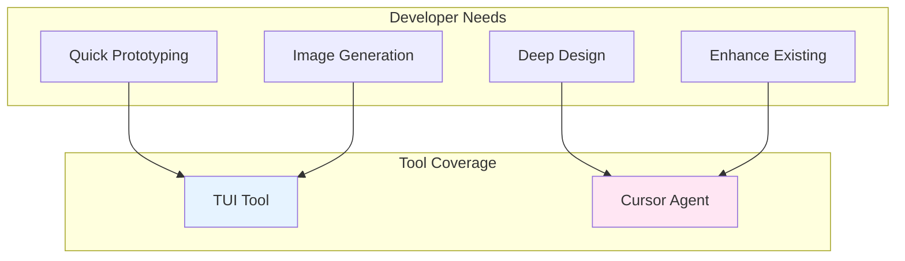
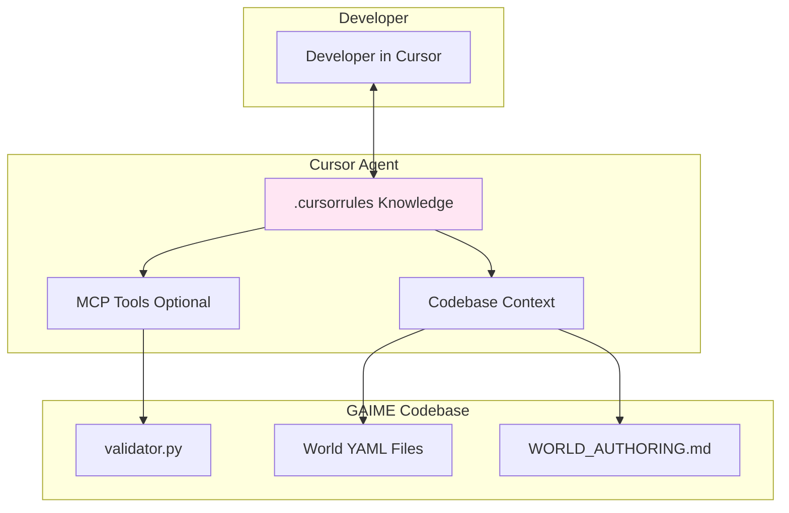
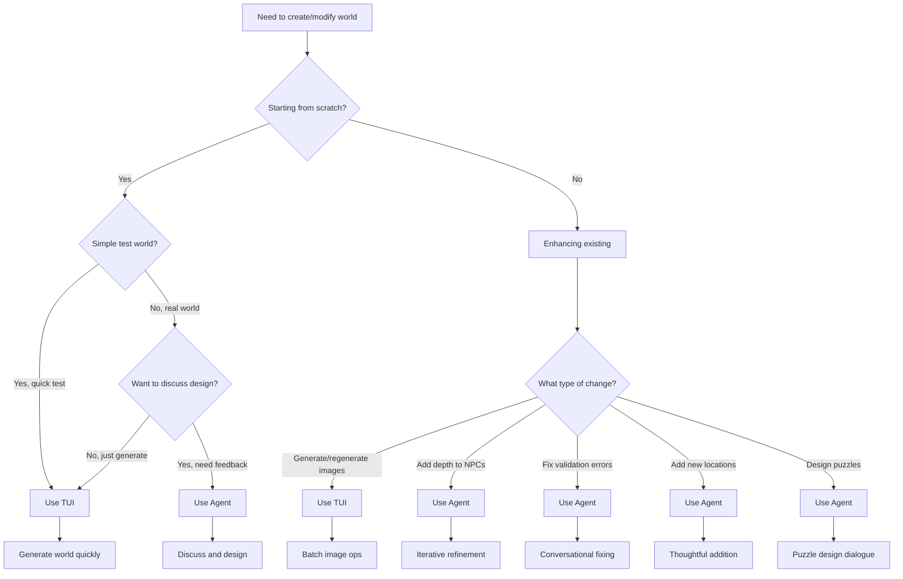

# World Builder Strategy: Dual-Tool Approach

**Status**: Planning Document  
**Created**: December 2025  
**Related**: [World Builder Agent Refactor](../ideas/world-builder-agent-refactor.md) | [TUI Plan](../.cursor/plans/buil_25f78b41.plan.md)

---

## Executive Summary

GAIME will have **two complementary world-building tools**, each optimized for different workflows:

1. **TUI (Terminal UI)** - Quick world creation, batch operations, image management
2. **Cursor Agent** - Deep design, iterative refinement, conversational world building

This document outlines the strategy, use cases, and implementation approach for both tools.

---

## The Two-Tool Philosophy



### TUI: The "Quick Create" Tool

**Best for:**
- Rapid world generation from prompts
- Batch image generation
- Visual progress feedback
- Quick iteration on world structure

**Typical workflow:**
```
1. Launch TUI
2. Fill in description and parameters
3. Generate world (2-3 minutes)
4. Generate images (5-10 minutes)
5. Done - start editing YAML manually if needed
```

**Analogy:** Like a form-based scaffold generator

---

### Cursor Agent: The "Deep Design" Tool

**Best for:**
- Iterative world refinement through conversation
- Adding depth to existing worlds
- Design discussions and exploration
- Fixing validation errors conversationally

**Typical workflow:**
```
1. Chat with agent: "I want a noir detective story"
2. Agent asks clarifying questions
3. Discuss protagonist, setting, tone, victory condition
4. Agent creates world file-by-file with your input
5. Review each file, request changes
6. Agent enhances NPCs, adds puzzles, improves atmosphere
7. Result: deeply crafted world
```

**Analogy:** Like pair programming with a world design expert

---

## Use Case Comparison

| Scenario | TUI | Agent | Why? |
|----------|-----|-------|------|
| **"Generate a quick test world"** | ✅ Best | ❌ Overkill | TUI is faster for simple generation |
| **"Create images for all locations"** | ✅ Best | ⚠️ Possible | TUI has progress bars, batch controls |
| **"Make the butler NPC more interesting"** | ❌ Manual | ✅ Best | Agent can discuss personality, add depth |
| **"Add a puzzle connecting three items"** | ❌ Manual | ✅ Best | Agent understands relationships, validates |
| **"Fix validation errors in my world"** | ❌ Manual | ✅ Best | Agent explains errors, suggests fixes |
| **"I have an idea, help me flesh it out"** | ❌ No dialogue | ✅ Best | Agent asks questions, explores ideas |
| **"Regenerate all images"** | ✅ Best | ❌ Awkward | TUI has proper controls and progress |
| **"Add atmospheric details to locations"** | ❌ Tedious | ✅ Best | Agent can rewrite with sensory richness |

---

## Cursor Agent: Detailed Design

### Agent Architecture



### Agent Capabilities

The agent is a specialized world-building expert with:

**Knowledge:**
- Complete YAML schema
- Best practices from `WORLD_AUTHORING.md`
- Examples from existing worlds
- Common pitfalls and how to avoid them

**Abilities:**
- Ask clarifying questions before creating
- Create/modify YAML files
- Run validator and explain errors
- Suggest improvements based on vision
- Reference other worlds for inspiration

**Constraints:**
- Never generates full world in one shot (asks questions first)
- Always validates before saying "done"
- Explains reasoning for suggestions
- Preserves author's intent while improving quality

### Implementation: Rules-Based Agent

The agent will be defined in `.cursorrules` with world-building expertise:

```markdown
# .cursorrules (excerpt)

## World Builder Agent Mode

When the developer asks to create or enhance a GAIME world, you are a world-building expert.

### Your Approach

1. **Understand before creating**: Ask questions to understand the vision
2. **Incremental creation**: Build world file-by-file, getting feedback
3. **Validate always**: Run `python -m app.engine.validator <world-id>` after changes
4. **Reference schema**: Use docs/WORLD_AUTHORING.md as the source of truth
5. **Learn from examples**: Check existing worlds in worlds/ for patterns

### Question Framework

When creating a NEW world:

1. **Core Concept**
   - "What's the setting and time period?"
   - "Who is the player? What's their role?"
   - "What event triggers the adventure to begin NOW?"
   - "How does the player win?"

2. **Tone & Style**
   - "What's the tone? (horror, adventure, mystery, comedy, etc.)"
   - "Any specific inspirations or references?"
   - "Should this be serious or lighthearted?"

3. **Scope**
   - "How many locations feel right? (Small: 4-6, Medium: 7-10, Large: 11+)"
   - "Linear path or more open exploration?"

4. **Key Characters**
   - "Who are the most important NPCs?"
   - "What do they know? What are they hiding?"

### File Creation Order

1. `world.yaml` - Establish foundation
2. `locations.yaml` - Define space (get feedback on structure)
3. `npcs.yaml` - Create characters (discuss personalities)
4. `items.yaml` - Add objects and puzzles

After each file, STOP and ask: "Does this match your vision? Any changes?"

### Enhancement Mode

When enhancing an EXISTING world:

1. Read all YAML files to understand current state
2. Ask: "What would you like to improve or add?"
3. Propose specific changes before making them
4. Validate after changes

### Critical Rules

**Required Fields:**
- Every item MUST have `found_description`
- Every exit MUST have details for each direction
- `starting_situation` MUST explain why player can act NOW
- NPCs with location knowledge MUST use actual location IDs

**Validation:**
After creating or modifying files, run:
```bash
python -m app.engine.validator <world-id>
```

Fix all errors before considering work complete.

### Example Dialogues

[Include full conversation examples here]
```

---

## Agent Example Workflows

### Workflow 1: Creating a New World

```
Developer: "I want to create a world about a 1920s speakeasy during Prohibition"

Agent: "Great concept! A few questions to shape this:

1. **Protagonist**: Who is the player?
   - A detective investigating corruption?
   - A bootlegger trying to survive?
   - A jazz musician caught in gang politics?
   - Something else?

2. **Starting situation**: What triggers the adventure?
   - A murder in the speakeasy?
   - A missing person?
   - A debt to a crime boss?
   - The police are coming?

3. **Victory condition**: How does it end?
   - Solve the mystery and survive?
   - Escape the city?
   - Take over the speakeasy business?
   - Expose corruption?

4. **Tone**: How should it feel?
   - Hard-boiled noir (dark, serious)?
   - Campy fun (lighter, stylized)?
   - Somewhere in between?

5. **Scope**: How many locations?
   - Intimate (4-6): Just the speakeasy and key spots?
   - Medium (7-10): Speakeasy plus surrounding neighborhood?
   - Expansive (11+): Across the city?"

Developer: "Detective investigating a singer's disappearance. Hard-boiled noir. 
           Let's do 8 locations - speakeasy plus some neighborhood spots."

Agent: "Perfect. Let me start with world.yaml:

```yaml
name: "Midnight at the Blue Note"
theme: "1920s Prohibition-era noir mystery"
tone: "Hard-boiled detective story; cynical but with glimmers of hope"
premise: |
  The Blue Note speakeasy. Smoke, jazz, and secrets. Last night, 
  Violet Crane—the best singer in Chicago—walked out mid-set and 
  vanished. Her gangster boyfriend wants answers. The police want 
  an excuse to raid the place. And you, a down-on-your-luck private 
  eye, just took the case because rent is due.

starting_situation: |
  You've been hired to find Violet. The club owner, Mickey Donovan, 
  gave you until tomorrow night before he calls in "favors" you don't 
  want to think about. The speakeasy is still open, pretending nothing 
  happened. You have access to the club and a few leads: Violet's 
  dressing room, the bartender who saw her leave, and a cryptic note 
  found in the trash.

victory:
  location: warehouse_district
  flag: discovered_truth
  narrative: |
    You've uncovered what really happened to Violet. Now you can 
    expose the truth—or keep it buried for the right price.
```

Does this capture the vibe? Any changes before I move to locations?"

Developer: "Love it. Let's continue."

Agent: "Great! For locations.yaml, I'm thinking:

**Core Locations:**
- blue_note_main_floor (the speakeasy itself)
- violets_dressing_room (where she was last seen)
- back_alley (loading entrance, where suppliers come)
- basement_storage (speakeasy secrets)

**Neighborhood:**
- jazz_district_street (outside the club)
- pawn_shop (where Violet pawned something?)
- apartment_building (someone's residence)
- warehouse_district (climax location)

Should I proceed with these 8, or would you like to adjust?"

[Conversation continues, building world iteratively]
```

---

### Workflow 2: Enhancing an Existing World

```
Developer: "I have the cursed-manor world but the ghost NPCs feel flat. 
           Can you make them more compelling?"

Agent: "Let me read the current NPC definitions..."

[Reads npcs.yaml]

"I see you have:
- ghost_child (basic traits, no backstory)
- ghost_mother (brief personality)
- Edmund's ghost (antagonist, but little depth)

Let's start with ghost_child. Currently it's just:

```yaml
ghost_child:
  name: "A Child's Ghost"
  appearance: "Translucent, sad, young"
  personality: [innocent, scared, lonely]
```

Here's what's missing that would make them compelling:

1. **Identity**: Who were they? What was their name?
2. **Backstory**: How did they die? Why are they trapped?
3. **Communication**: Can't speak, but how do they communicate?
4. **Motivation**: What do they want from the player?
5. **Connection to victory**: How do they relate to breaking the curse?

Shall we develop this together? Tell me about how the child died 
and I'll build a rich character definition."

Developer: "The child's name was Emily. She died trying to save her 
           siblings when their father Edmund performed the ritual. 
           She communicates by manipulating candle flames."

Agent: "That's powerful—and it ties beautifully into the mansion's 
candlelight aesthetic. Let me rebuild ghost_child:

```yaml
ghost_child:
  # Identity
  name: "Emily Thornwood"
  full_name: "Emily Rose Thornwood"
  age_at_death: 9
  role: "Eldest child; trying to protect siblings; trapped by grief and guilt"
  
  # Appearance
  appearance:
    summary: |
      A translucent figure of a young girl in a Victorian nightgown. 
      Her form flickers like candlelight—sometimes solid, sometimes 
      barely visible. Burn marks are faintly visible on her hands.
    
    distinguishing_features:
      - "Nightgown singed at the hem"
      - "Burn scars on her small hands"
      - "Ribbon in her hair, half-burned away"
      - "Eyes that reflect candle flames even when no candle is near"
  
  # Personality & Backstory
  backstory:
    life: |
      Emily was the eldest of three Thornwood children. She loved her 
      siblings fiercely and felt responsible for them. On the night 
      of the ritual, she sensed something was wrong and tried to get 
      her brother and sister out of the ritual chamber.
    
    death: |
      When the ritual went catastrophically wrong, fire erupted. Emily 
      managed to push her siblings toward a window, but the flames 
      overtook her. She died from burns and smoke, knowing she'd failed 
      to save them all.
    
    why_trapped: |
      Emily's spirit remains because she believes her siblings are still 
      in danger. She doesn't understand they're also ghosts. She thinks 
      if she can warn someone—anyone—they might save her family.
  
  personality:
    traits: [protective, brave, desperate, innocent, traumatized]
    emotional_state: "Perpetual panic mixed with hope. Every living 
                      person is a chance to finally save her family."
    
    quirks:
      - Appears most often near candles and fireplaces
      - Becomes more visible when the player shows kindness
      - Vanishes if someone threatens fire/flames
      - Tries to lead player toward important locations
  
  # Communication (CRITICAL - she can't speak)
  communication:
    methods:
      candle_manipulation: |
        Emily can make candles flicker, flare up, or go out. This is 
        her primary way of saying "yes" (flare), "no" (dim), or showing 
        distress (rapid flickering).
      
      cold_spots: |
        Where she stands, the air turns frigid. Players can follow 
        cold trails.
      
      object_arrangement: |
        She moves small objects—a ribbon, a toy, a letter—to point 
        toward important things.
      
      writing_in_ash: |
        In desperate moments, she'll write simple words in fireplace 
        ash or dusty surfaces. Usually just names: "Thomas" "Catherine" 
        "Father" "Help"
    
    interpretation_rules:
      - "NPCs cannot understand her. Only the player can."
      - "She gets frustrated when not understood, candles flare wildly"
      - "Building trust makes her manifestation stronger, clearer"
  
  # Knowledge (what she knows that can help)
  knowledge:
    facts:
      - "Where her siblings' bodies/spirits are"
      - "What her father was trying to achieve"
      - "The location of the grimoire (she saw it)"
      - "The ritual chamber's layout"
    
    reveals_when:
      - "Player shows they want to help: points to nursery (brother)"
      - "Player brings up the ritual: writes 'FATHER' in ash angrily"
      - "Player has all three artifacts: leads to ritual chamber"
  
  # Victory Connection
  victory_role: |
    Emily is key to breaking the curse. The player must:
    1. Find all three children's spirits
    2. Gather the ritual artifacts
    3. Let Emily lead them to the ritual chamber
    4. Use the artifacts to free the children
    
    When freed, Emily finally understands her siblings are safe. The 
    three spirits ascend together.
  
  # Appearance Conditions & Location
  location: nursery  # Default location
  appears_when:
    - {type: always_visible}  # Unlike mother, Emily appears to everyone
  
  roaming:
    locations: [nursery, hallway, ritual_chamber, anywhere_with_candles]
    behavior: |
      Emily follows candles. If the player carries a lit candle, she 
      may follow them from room to room. She'll avoid the library 
      (where father spent time) and the master_bedroom (bad memories).
  
  # Interactions
  interactions:
    approach_with_candle:
      triggers: ["approach emily", "show candle to emily"]
      requires: {item: lit_candle}
      narrative_prompt: |
        Emily's ghost becomes more solid, drawn to the candle's flame. 
        She reaches out as if to warm her burned hands, then looks at 
        you with desperate, hopeful eyes.
      effects:
        - npc_trust: {ghost_child: +1}
    
    speak_siblings_names:
      triggers: ["ask about Thomas", "ask about Catherine", "mention siblings"]
      narrative_prompt: |
        At the sound of her siblings' names, Emily's form flickers 
        intensely. She writes in the dust: "SAVE THEM PLEASE"
      effects:
        - set_flag: emily_wants_siblings_freed
        - discover: quest:free_all_spirits
```

This gives Emily:
- A tragic, specific backstory
- Unique communication methods tied to game mechanics (candles)
- Clear motivation that drives player actions
- Strong connection to the victory condition
- Behavioral rules that create emergent storytelling

Want me to do the same for ghost_mother and Edmund's ghost?"
```

---

### Workflow 3: Puzzle Design Assistance

```
Developer: "I want to add a multi-step puzzle to unlock the ritual chamber. 
           Something with the three artifacts."

Agent: "Great! Let's design this together. First, a few questions:

1. **Artifacts**: What are they and where are they found?
2. **Relationship**: How do they connect to each other?
3. **Unlock mechanism**: What must the player DO with them?
4. **Hints**: How does the player learn about this puzzle?
5. **Failure states**: Can the player mess this up?

Also, I see you already have:
- `thornwood_amulet` in items.yaml (nursery)
- `ancient_dagger` mentioned in one location
- `grimoire` mentioned in Edmund's knowledge

Should I work with these three?"

Developer: "Yes, those three. The grimoire tells you that the amulet 
           and dagger must be placed together in the ritual chamber."

Agent: "Perfect. Here's a structured puzzle design:

**Puzzle: The Three Artifact Ritual**

Phase 1: Discover the artifacts exist
- Player finds grimoire (has diagram showing three artifacts)
- Grimoire describes their purpose: breaking the curse

Phase 2: Find the artifacts
- Amulet: Hidden in nursery (Emily's)
- Dagger: Hidden in basement (Mother tried to destroy it)
- Grimoire: In ritual chamber (never moved)

Phase 3: Understand the solution
- Grimoire has a page with pedestals drawn
- Jenkins (if trusted) confirms: "Place them together"
- Emily can lead player to ritual chamber

Phase 4: Execute the ritual
- Player enters ritual chamber
- Three pedestals wait
- Place all three artifacts
- Trigger curse-breaking event

Let me create this formally. I'll update:
1. items.yaml - ensure artifacts are defined with puzzle connections
2. locations.yaml - add pedestals to ritual chamber
3. Create puzzles.yaml (new file) with explicit puzzle definition
4. Add hints throughout world

Should I proceed?"

[Agent continues, creating puzzle step-by-step with validation]
```

---

## Agent vs TUI: Decision Tree



---

## Implementation Timeline

### Phase 1: TUI (Now) - 1-2 weeks
- Build TUI with Textual
- World creation from prompts
- Image generation and management
- Replaces web UI

### Phase 2: Agent Rules (Next) - 1 week
- Create `.cursorrules` with world-building expertise
- Document question frameworks
- Add example dialogues
- Test with pilot world creation

### Phase 3: Agent Refinement (Ongoing) - Iterative
- Gather feedback from world creation sessions
- Refine agent prompts and approaches
- Add more examples and patterns
- Build knowledge base of common scenarios

### Phase 4: Optional MCP Tools (Future) - If needed
- If agent needs programmatic validation
- If agent needs world listing/inspection
- If agent needs to run image generation
- Only if rules-based approach isn't sufficient

---

## Success Metrics

**TUI Success:**
- ✅ Can generate a working world in <5 minutes
- ✅ Can generate all images in <10 minutes
- ✅ Provides better feedback than web UI
- ✅ Developers prefer it to web UI

**Agent Success:**
- ✅ Creates higher quality worlds than TUI alone
- ✅ Asks insightful questions that improve design
- ✅ Catches mistakes and suggests improvements
- ✅ Makes enhancement workflows feel natural
- ✅ Developers enjoy the conversational process

**Combined Success:**
- ✅ TUI used for quick generation and images
- ✅ Agent used for real world development
- ✅ Worlds created with agent are more complete
- ✅ Developer workflow feels seamless

---

## Open Questions

1. **Image generation in agent**: Should agent be able to trigger TUI for images, or always manual?
   
2. **Agent memory**: Should agent remember previous conversations about a world?

3. **Templates**: Should we provide "starter templates" (noir detective, sci-fi ship, haunted house) that agent customizes?

4. **Playtesting**: Could agent help playtest worlds by simulating player actions?

5. **Multi-file atomicity**: If agent creates 4 YAML files and one fails validation, what happens?

---

## Conclusion

The dual-tool approach gives developers flexibility:

- **TUI** for speed and batch operations
- **Agent** for quality and depth

Together, they cover the entire world-building workflow from quick prototyping to polished, production-ready adventures.

Next steps:
1. Implement TUI (immediate value)
2. Create agent rules (high-value, low-effort)
3. Gather feedback and iterate
4. Deprecate web UI when both tools are stable

